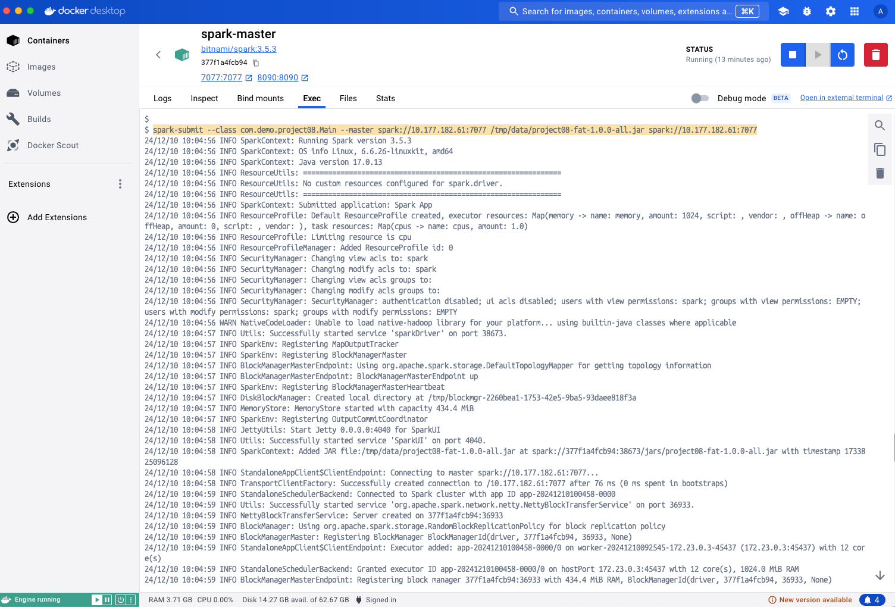
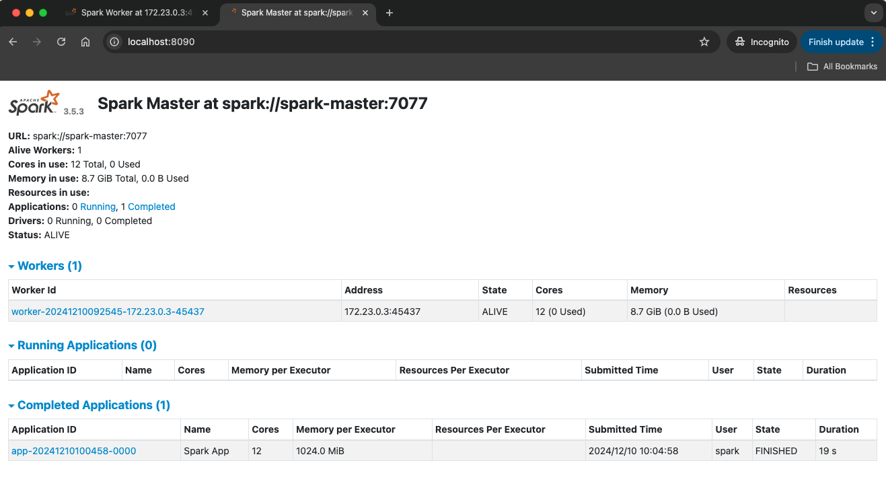
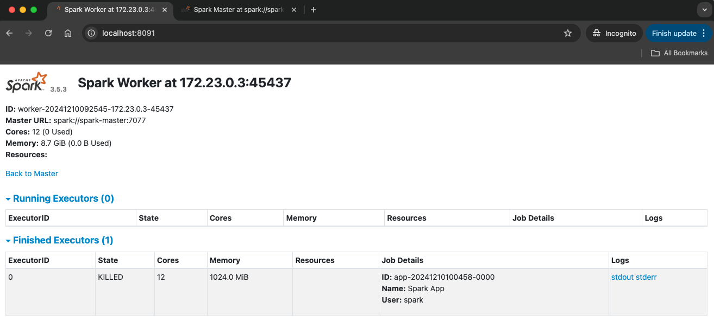

Apache Spark is an open-source analytics engine & cluster-compute framework that processes large-scale data.

Spark supports in-memory caching and optimized query execution for fast analytics. It has built-in modules for machine learning, graph processing, streaming, and SQL

Github: [https://github.com/gitorko/project08](https://github.com/gitorko/project08)

## Apache Spark

Spark applications run as independent sets of processes on a cluster. Spark uses RDD (Resilient Distributed Datasets) to store shared data.

| Apache Spark                                                                     | Apache Kafka                                                                               |
|:---------------------------------------------------------------------------------|:-------------------------------------------------------------------------------------------|
| Analyze large datasets that cant fit on single machine (big data)                | Process large events as they happen and stores them distributed manner                     |
| Processing data task runs on many nodes                                          | Processing data task is delegated to clients/consumers                                     |
| Provides machine learning libraries (MLlib), graph processing and SQL querying   | No machine learning libraries/ Graph processing / SQL querying provided                    |
| Batch and stream processing, ETL jobs, and complex analytics                     | Real-time data streaming, building data pipelines, and handling event-driven architectures |
| Not suited for event or message handling (producer-consumer)                     | Integrating disparate systems for message passing and event storage (producer-consumer)    |
| Spark can be complex to set up and tune, especially in a distributed environment | Kafka is relatively easier to set up for streaming and messaging                           |

### Code



### Setup



## References

[https://spark.apache.org/](https://spark.apache.org/)
