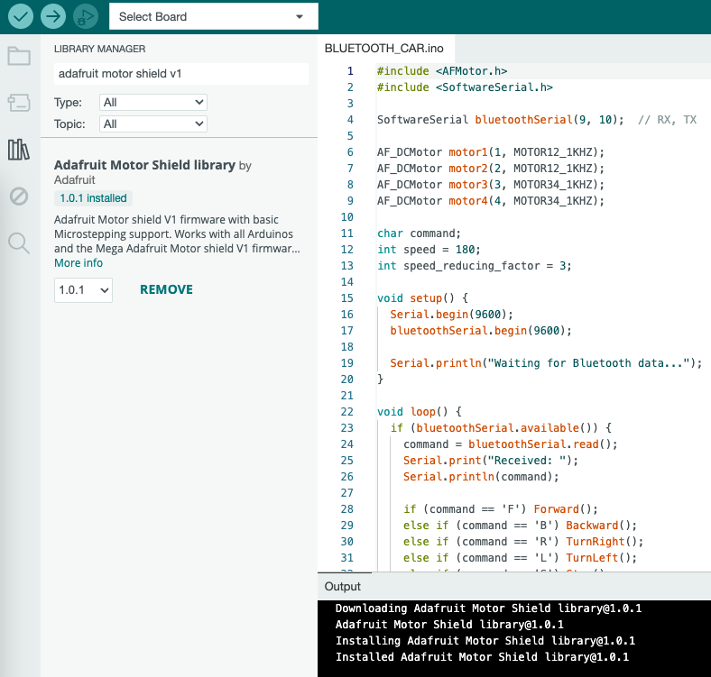
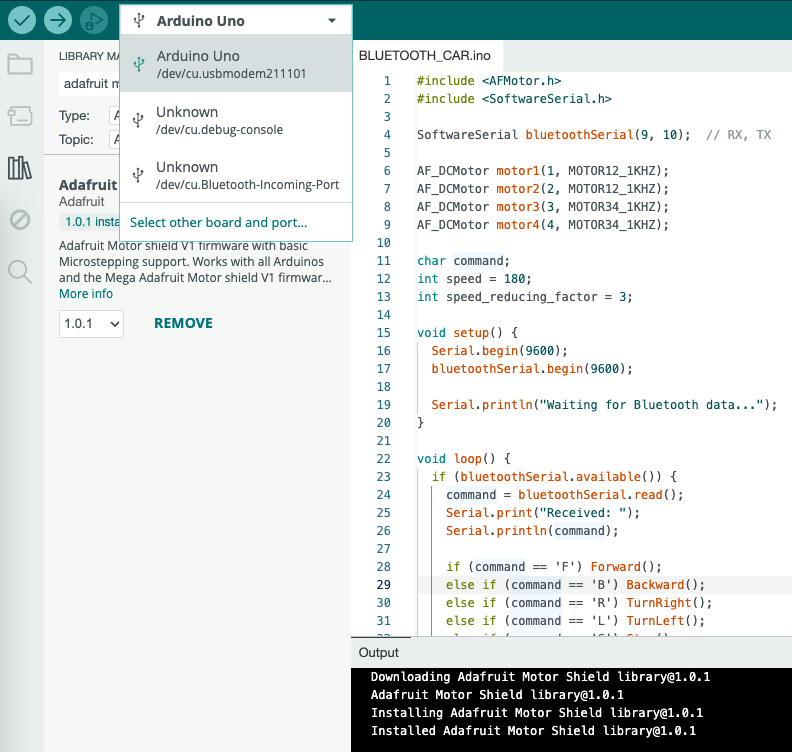
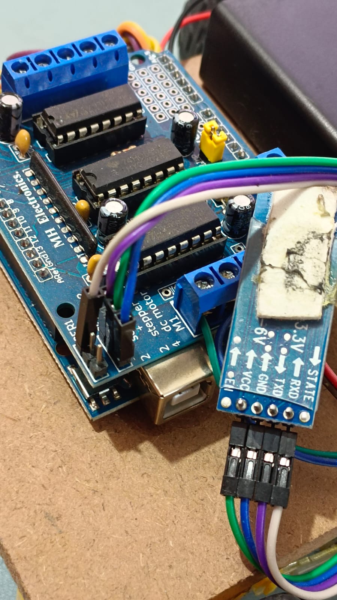
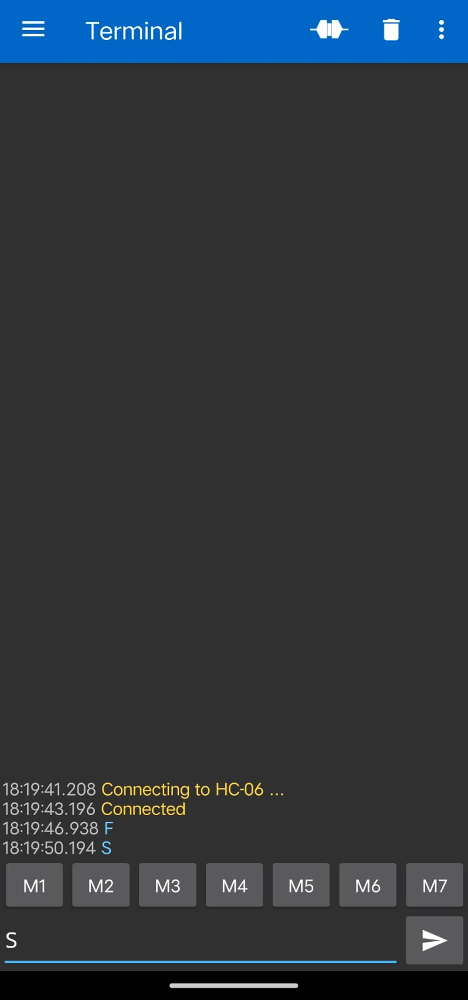
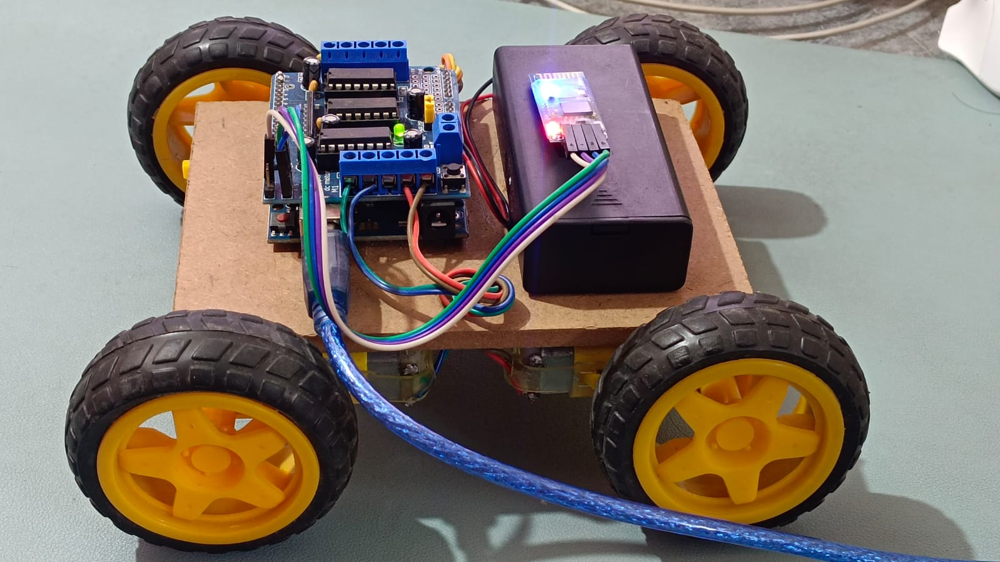
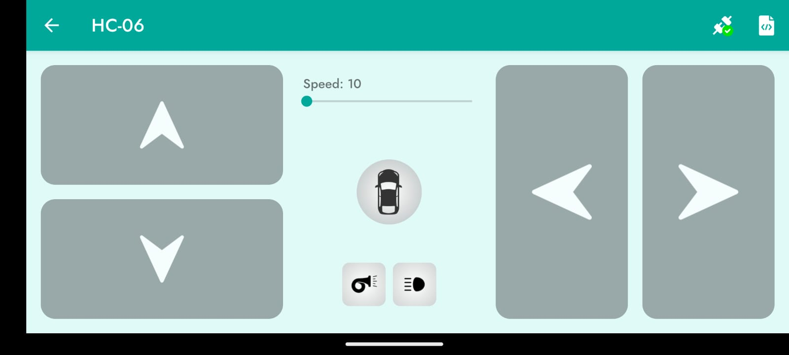

Arduino projects

## Bluetooth Car

**Item required**

1. Arduino Uno
2. L293D Motor Driver
3. Motor & Wheels
4. Bluetooth Module HS-06
5. Lithium Battery
6. Battery Holder

Install Arduino IDE & install the "Adafruit Motor Shield v1" library

Install "Serial Bluetooth Terminal" android/ios app, connect to bluetooth and send text 'F' & 'S'

Install Arduino Bluetooth Controller on the phone and control the car

[https://play.google.com/store/apps/details?id=com.giristudio.hc05.bluetooth.arduino.control](https://play.google.com/store/apps/details?id=com.giristudio.hc05.bluetooth.arduino.control)



### Reference

[https://www.youtube.com/watch?v=Pqs-3GgWW3s](https://www.youtube.com/watch?v=Pqs-3GgWW3s)