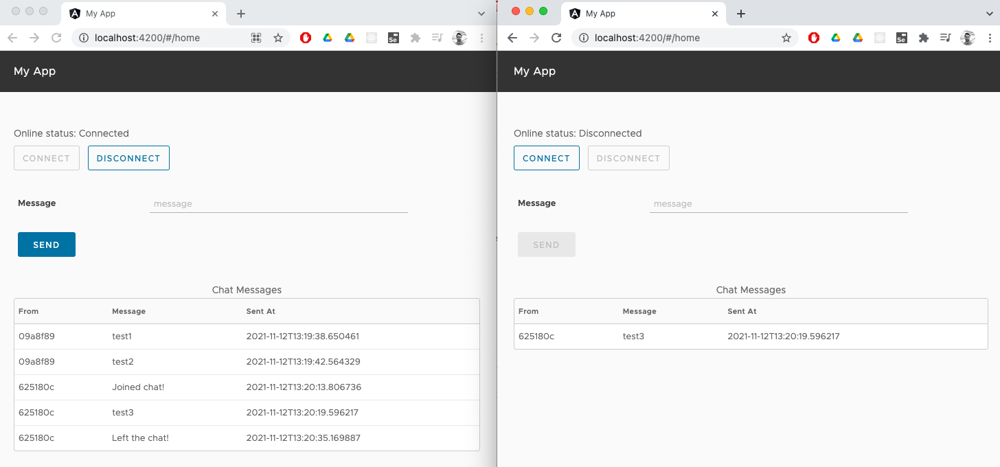
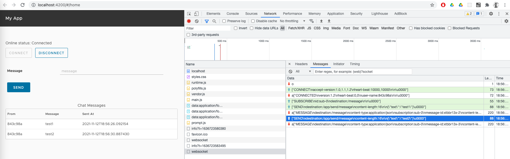

Chat Server developed with Spring Boot, Websocket and Angular (Clarity) frontend.

Github: [https://github.com/gitorko/project92](https://github.com/gitorko/project92)

## Quick Overview

To deploy the application in a single command, clone the project, make sure no conflicting docker containers or ports are running and then run

```bash
git clone https://github.com/gitorko/project92
cd project92
docker-compose -f docker/docker-compose.yml up 
```

## Requirements

Realtime data fetch from server via bidirectional communication is one of the key requirements for a chat server. To fetch information from the server continuously we can use the following approaches.

1. Short-Polling - Client continuously asks the server for new data.
2. Long-Polling - Client continuously asks the server for new data, but server waits for a few seconds and if data becomes available by then it will return the data.
3. Websocket - HTTP connection is upgraded to bidirectional connection.
4. Server Sent Events - HTTP connection is kept open by the server and data is pushed to client continuously over it.

| Websocket                 | Server Sent Event          | Long-Poll                  |
|:--------------------------|:---------------------------|:---------------------------|
| Full-duplex,Bidirectional | Half-duplex,Unidirectional | Half-duplex,Unidirectional |
| Server Push & Client Send | Server Push                | Client Pull                |
| Text + Binary             | Text                       | Text + Binary              |
| 1024 connections          | 6-8 parallel per domain    | Based on threads available |

1. Connect will open the websocket connection & disconnect should terminate the session.
2. Two users should be able to send and receive messages.

## Design




## Code

You can enable plain websockets via @EnableWebSocket however in the example below we are using STOMP over WebSocket protocol by using @EnableWebSocketMessageBroker. STOMP is a subprotocol operating on top of the lower-level WebSocket. Here we create an in-memory message broker for sending and receiving messages.
Instead of the annotation @SendTo, you can also use SimpMessagingTemplate which you can autowire inside your controller.






## Setup



## References

[https://spring.io/guides/gs/messaging-stomp-websocket/](https://spring.io/guides/gs/messaging-stomp-websocket/)

[https://linuxhint.com/websockets-http-2-sse-compared/](https://linuxhint.com/websockets-http-2-sse-compared/)

[https://www.toptal.com/java/stomp-spring-boot-websocket](https://www.toptal.com/java/stomp-spring-boot-websocket)
