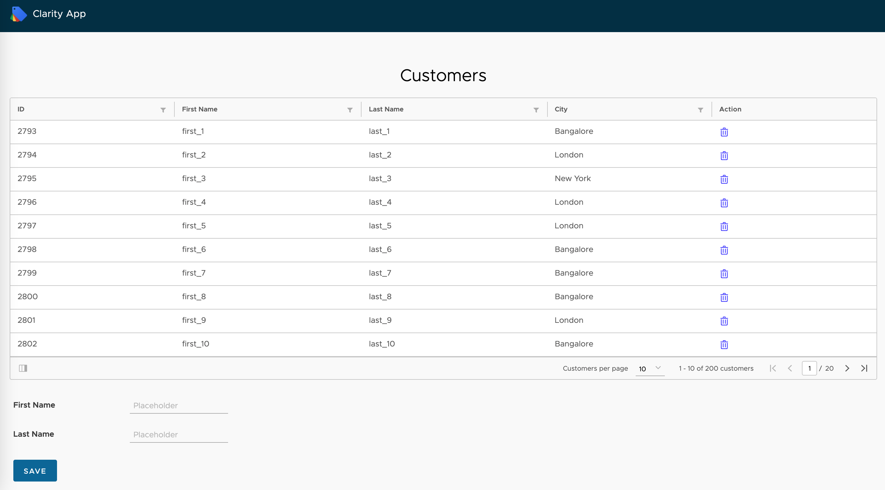

Clarity provides Server-Driven DataGrid. Using Query DSL we will fetch page by page data and render it in clarity server-driven data grid

Github: [https://github.com/gitorko/project86](https://github.com/gitorko/project86)

## Quick Overview

To deploy the application in a single command, clone the project, make sure no conflicting docker containers or ports are running and then run

```bash
git clone https://github.com/gitorko/project86
cd project86
docker-compose -f docker/docker-compose.yml up 
```

Open [http://localhost:8080/](http://localhost:8080/)

## Server-Driven DataGrid

When dealing with large amounts of data or heavy processing, a DataGrid often has to access the currently displayed data only, requesting only the necessary pieces of data from the server.

## Design



## Code











The debounceTime added to debounce the events so that rest api doesn't get called for every keystroke.



## Setup



## References

[https://clarity.design/](https://clarity.design/)

[https://clarity.design/angular-components/datagrid/#server-driven-datagrid](https://clarity.design/angular-components/datagrid/#server-driven-datagrid)
