Java Design Patterns - Creational, Structural & Behavioral design patterns.

Github: [https://github.com/gitorko/project62](https://github.com/gitorko/project62)

## Creational Design Patterns

Provides way to create objects while hiding the creation logic.

### 1. Singleton Pattern

Singleton pattern ensures that only one instance of the class exists in the java virtual machine.

A singleton class has these common features
- private constructor to restrict creation of instance by other classes.
- private static variable of the same class.
- public static method to get instance of class.

We will first look at eager loaded singleton. This is costly as object is created at time of class loading,also no scope for exception handling if instantiation fails.



This can be modified to static block singleton which provides room for handling exception.



The next step is to use lazy initialization singleton as creating singleton at class loading time and not using it will be costly.



However this is not thread safe as in multithread environment 2 threads can get 2 different instances of the object. So lets make this thread safe. Notice we introduced synchronized keyword on the getInstance method.



The above program is thread safe but reduces performance as each thread waits to enter the synchronized block. We now fix that by introducing double check locking. Notice that we removed the synchronized keyword on the getInstance method and moved it inside the method. We now perform 2 if checks on the instance.



Using reflection all previous singleton implementation can be broken



To safeguard against reflection we will throw RuntimeException in the constructor. We will introduce the volatile keyword to make it even more thread safe.

How volatile works in java?
The volatile keyword in Java is used as an indicator to Java compiler and Thread that do not cache value of this variable and always read it from main memory. Java volatile keyword also guarantees visibility and ordering, write to any volatile variable happens before any read into the volatile variable. It also prevents compiler or JVM from the reordering of code.

If we do not make the instance variable volatile than the Thread which is creating instance of Singleton is not able to communicate to the other thread, that the instance has been created until it comes out of the Singleton block, so if Thread A is creating Singleton instance and just after creation lost the CPU, all other thread will not be able to see value of instance as not null and they will believe its still null. By adding volatile java will not read the variable into thread context local memory and instead read it from the main memory each time.

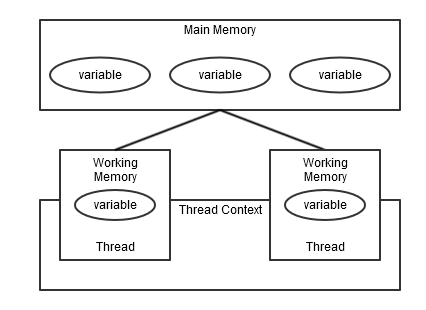



To defend against reflection you can also use Enum based singleton, The disadvantage is you cant do lazy loading, you cant extend the singleton.



There is another approach of writing a singleton called Bill Pugh Singleton implementation which uses static inner helper class instead of using synchronized keyword.



In a distributed systems a singleton needs to be serialized and restored from store later and care must be taken to ensure that new instance is not created and the same instance that was serialized is restored. Notice the method readResolve if this method is removed then the singleton design breaks during de-serialization.



A singleton example within java sdk is the Runtime class for garbage collection.



Why not use a static class instead of writing a singleton class?
Because static class doesnt guarantee thread safety.

Can i have parameters in a singleton?
A singleton constructor cant take parameters that violates the rule of singleton. If there are parameters then it classifies as a factory pattern.

If singleton is unique instance per JVM instance how does it work in a tomcat server which can have 2 instances of same web application deployed on it. Since the applications still run on single JVM will they share the singleton?
In this case both web applications will get their own instance of singleton because of class loader visibility.Tomcat uses individual class loaders for webapps. However if both application request a JRE or Tomcat singleton eg: Runtime then both get the same singleton.


### 2. Factory Pattern

Factory design pattern is used when we have a super class with multiple sub-classes and based on input, we need to return one of the sub-class. The main method doesnt know the details of instantiating a object its deferred to the factory subclass. Factory calls the new operator.



### 3. Abstract Factory Pattern

Abstract factory pattern is similar to Factory pattern and it’s factory of factories. In factory pattern we used switch statement to decide which object to return in abstract factory we remove the if-else/switch block and have a factory class for each sub-class.



### 4. Builder Pattern

Builder pattern is used to build a complex object with lot of attributes. It becomes difficult to pass the correct type in correct order to a constructor when there are many attributes. If some of the attributes are optional then there is overhead of having to pass null each time to the constructor or having to write multiple constructors(telescoping). Notice that in the example below builder pattern returns <b>immutable object</b> hence no setter methods exist. Notice the <b>static inner class</b> you can write an external class as well if you choose not to modify an existing class. Notice the private constructor of the Dog class as the only way to create an instance is via Builder. The name of dog and breed are the only mandatory fields this defines a contract that a dog object atleast needs these 2 attributes.



Output:

```bash
Dog(name=rocky, breed=German Sheperd, color=Grey, age=6, weight=40.5)
Dog(name=rocky, breed=German Sheperd, color=null, age=0, weight=0.0)
```

Using lombok @Builder annotation you can reduce the code further



Output:

```bash
Dog(name=Rocky, breed=German Sheperd, color=null, age=0, weight=30.0)
```

An example in the java SDK is the StringBuilder class.

### 5. Prototype Pattern

Prototype pattern is used when the object creation is expensive. Instead of creating a new object you can copy the original object using clone and then modify it according to your needs. Prototype design pattern mandates that the object which you are copying should provide the copying feature, it should not be done by any other class. Decision to use shallow or deep copy of the object attributes is a design decision a shallow copy just copies immediate property and deep copy copies all object references as well. Notice we dont use new to create prototype objects after the first instance is created. Prototype avoid subclassing.



Output:

```bash
dataSet1 size: 100
dataSet2 size: 100
dataSet1 size: 100
dataSet2 size: 101
```

You can also create a registry to stored newly created objects when there are different types of objects and lookup against the registry when you want to clone objects.

## Structural Design Patterns

Deal with class and object composition. Provide different ways to create a class structure, using inheritance and composition to create a large object from small objects

### 1. Adapter Pattern

Adapter pattern is used when two unrelated interfaces need to work together. There is a AlienCraft which has different type of fire & scan api that takes additional parameter compared to the human readable ship interface. However by writing the adapter we map the appropriate functions for fire and scan. 




Output:

```bash
Scanning enemy in sector NORTH
Firing weapon at sector NORTH
```

UML Diagram Adapter design pattern.

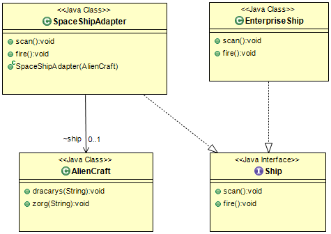

### 2. Composite Pattern

Composite pattern is used when we have to represent a part-whole hierarchy.A group of objects should behave in a similar way,tree like structure. Here we have a playlist which can contain songs or other playlist and those playlist can have songs of their own.

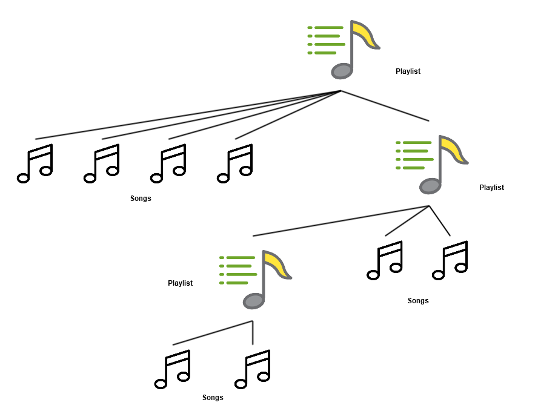



Output:

```bash
Playlist Name: myplaylist
Playlist Name: playlist_1
Song: Song1
Song: Song2
Playlist Name: playlist_3
Song: Song3
Playlist Name: playlist_2
```

### 3. Proxy Pattern

Proxy pattern is used when we want to provide controlled access of a functionality. A real world example would be when a lawyer restricts the questions police would ask a mob boss. You can add only one proxy per class.

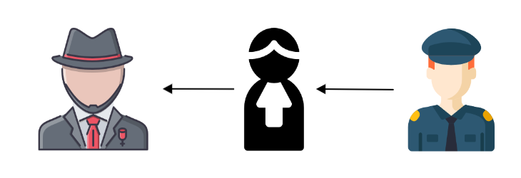



Output:

```bash
Cant run rm
Running : dir
```

A much more generic way to doing this using default java class InvocationHandler is shown below.



### 4. Flyweight Pattern

Flyweight pattern is used when we need to create a lot of Objects of a class eg 100,000 objects. Reduce cost of storage for large objects by sharing. When we share objects we need to determine what is intrinsic and extrinsic attributes. Here beeType is an intrinsic state and will be shared by all bees. The (x,y) coordinates are the extrinsic properties which will vary for each object. Notice that a factory pattern is also seen in the flyweight example below.

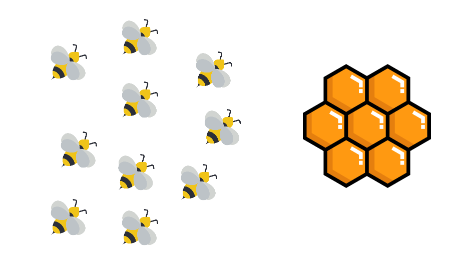



Output:

```bash
...
...
WORKER_LEADER, Depositing honey at (9,50) quadrant!
ATTACKER, Depositing honey at (75,68) quadrant!
WORKER_LEADER, Depositing honey at (25,78) quadrant!
Total Bee objects created:4
```

Now lets look at how the bad design would have looked, Here we end up creating large number of objects there by wasting memory. In the solution above we have moved out the extrinsic properties from the Bee class so that we can share the objects.

<span style="color:red;font-size: large;font-weight: bold;">Bad Design Alert!</span>



Output:

```bash
...
...
WORKER_LEADER, Depositing honey at (77,41) quadrant!
ATTACKER_LEADER, Depositing honey at (54,35) quadrant!
WORKER, Depositing honey at (7,17) quadrant!
Total Bee objects created:100000
```

### 5. Facade Pattern

Facade pattern is used to give unified interface to a set of interfaces in a subsystem.



Output:

```bash
Generating report in oracle
Generating report in mysql

```

### 6. Bridge Pattern

Bridge Pattern is used to decouple the interfaces from implementation. Prefer Composition over inheritance. There are interface hierarchies in both interfaces as well a implementations.

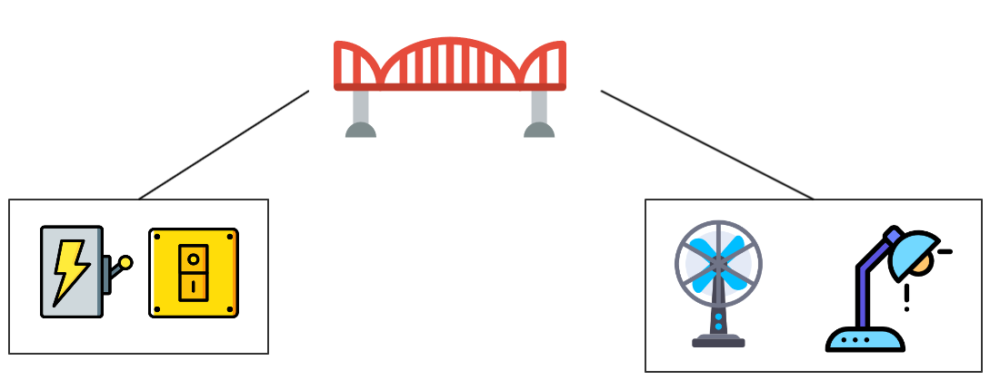

By decoupling the switch & electric device from each other each can vary independently. You can add new switches, you can add new electric devices independently without increasing complexity.



Output:

```bash
Pulled Switch, Now turning on :Light!
----------------
Pressed Switch, Now turning on :Fan!
```

UML of Bridge Pattern. There is a bridge between Switch class and ElectricDevice class.

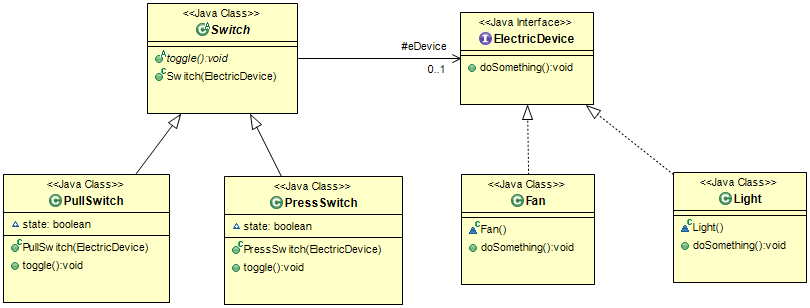

<span style="color:red;font-size: large;font-weight: bold;">Bad Design Alert!</span>

Lets look at how a problematic code looks like and its eligibility for bridge pattern. In the below code trying to add a new Electric Device + Switch combination is a pain which is solved by the bridge pattern mentioned above.



Output:

```bash
Pulled Switch, Now turning on fan
Pressed Switch, Now turning on light
```

UML Diagram of problematic code, you can see that heirarchy exists.

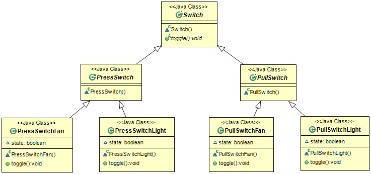

### 7. Decorator Pattern

Decorator design pattern is used to add the functionality by wrapping another class around the core class without modifying the core class. Disadvantage of decorator pattern is that it uses a lot of similar kind of objects.




Output:

```bash
Pizza: Thick Crust Pizza
Cost: 10
Pizza: Thick Crust Pizza + Cheese
Cost: 12
Pizza: Thick Crust Pizza + Cheese + Cheese
Cost: 14
```

UML of Decorator Pattern

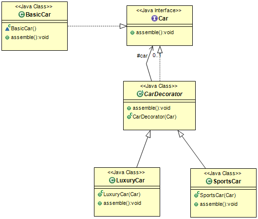

## Behavioral Design Patterns

Behavioral patterns help design classes with better interaction between objects and provide lose coupling.

### 1. Template Pattern

Template Pattern used to create a method stub and deferring some of the steps of implementation to the subclasses. Template method defines the steps to execute an algorithm and it can provide default implementation that might be common for all or some of the subclasses.

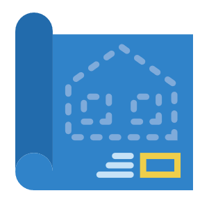



Output:

```bash
Building foundation with cement,iron rodsand sand
Building Pillars with Wood coating
Building Wooden Walls
Building Glass Windows
House is built.
-------------------------
Building foundation with cement,iron rodsand sand
Building Pillars with glass coating
Building Glass Walls
Building Glass Windows
House is built.

```

### 2. Mediator Pattern

Mediator pattern is used to provide a centralized communication medium between different objects.



Output:

```bash
Raj: Sending Message=Hi All
Jacob: Received Message:Hi All
Henry: Received Message:Hi All
Stan: Received Message:Hi All
```

### 3. Chain of Responsibility Pattern

Chain of responsibility pattern is used when a request from client is passed to a chain of objects to process them.

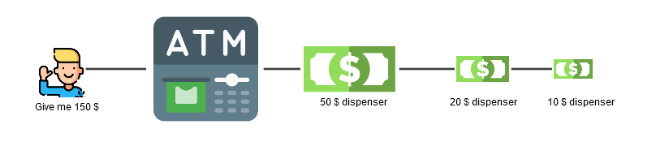



Output:

```bash
Dispensing 10 50$ note
Dispensing 1 20$ note
Dispensing 1 10$ note
```

### 4. Observer Pattern

Observer design pattern is used when we want to get notified about state changes of a object. An Observer watches the Subject here and any changes on Subject are notified to the Observer.

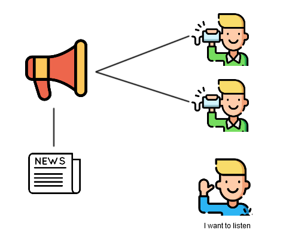


 
Output:

```bash
Apple Stock Price: APPL: 162.33
Google Stock Price: GOOGL: 1031.22
```

### 5. Strategy Pattern

Strategy pattern is used when we have multiple algorithm for a specific task and client decides the actual implementation to be used at runtime. This is also known as Policy Pattern.

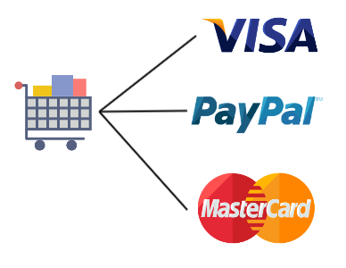



Output:

```bash
Paid by creditcard: 10
Paid by paypall: 10
```

### 6. Command Pattern

Command pattern is used when request is wrapped and passed to invoker which then inturn invokes the encapsulated command. Here Command is our command interface, Stock class is our request. BuyStock and SellStock implementing Order interface which does the actual command processing.



Output:

```bash
Stock [ Name: GOOGL, Quantity: 10 ] bought
Stock [ Name: IBM, Quantity: 20 ] sold
```

### 7. State Pattern

State pattern is used when object changes its behaviour based on internal state. You avoid writing the conditional if-else logic to determine the type of action to be taken based on state of object. Notice that GameContext also implements State along with StartState,StopState classes.



Output:

```bash
Roll the dice!
Game Over!
```

### 8. Visitor Pattern

Visitor pattern is used to add methods to different types of classes without altering those classes. Here we have moved the tax calculation outside each item.



Output:

```bash
Price of liquor: 15.6
Price of grocery: 13.2
```

### 9. Interpreter Pattern

Interpreter pattern provides a way to evaluate language grammar or expression.



Output:

```bash
11110
1e
```

### 10. Iterator Pattern

Iterator pattern is used to provide standard way to traverse through group of objects. In the example below we provide 2 types of iterators over the fruit collection, we could have let the user write his own iterator but if there are many clients using the iterator then it would be difficult to maintain. Notice that FruitIterator is private and inner class, this hides the implementation details from the client. Logic of iteration is internal to the collection.



Output:

```bash
Fruit(type=Banana, color=Green)
Fruit(type=Apple, color=Green)
Fruit(type=Cherry, color=Red)
Fruit(type=Apple, color=Red)
Fruit(type=Banana, color=Yellow)
-------------------------------
Fruit(type=Apple, color=Green)
Fruit(type=Apple, color=Red)
Fruit(type=Banana, color=Green)
Fruit(type=Banana, color=Yellow)
Fruit(type=Cherry, color=Red)
```

### 11. Memento Pattern

Memento pattern is used to restore state of an object to a previous state.

Memento pattern involves three classes.
- Originator: The core class which holds a state. This state will need to be reverted to previous states. Think of this as your text editor text data.
- Memento: The class has all the same attributes as Originator class and is used to hold values that will be restored back to the Originator class. Think of this as a temporary variable. Each time you click on save a memento is created and added to the list so that it can be reverted later.
- CareTaker - This class takes ownership of creating and restoring memento.

In the example below you can create a Originator object and change its state many times, only when you call the CareTaker.save method a memento gets created so that an undo operation later on can revert to that state. The list mementoList is private so only caretaker has access to the memento objects ensuring integrity of data. 
Take special care if the attribute is immutable in the undoState method.



Output:

```bash
Current State: State #4
Current State: State #3
Current State: State #2
Current State: State #2

```

## Differences

### 1. Difference between bridge pattern and adapter pattern
Bridge pattern is built upfront you break things at design time to make changes so that functionality can be added without tight coupling, adapter pattern works after code is already designed like legacy code.

### 2. Difference between mediator pattern and observer pattern
In observer, many objects are interested in the state change of one object. They are not interested in each other. So the relation is one to many. In mediator, many objects are interested to communicate many other objects. Here the relation is many to many.


### 3. Difference between chain of responsibility and command pattern
In chain of responsibility pattern, the request is passed to potential receivers, whereas the command pattern uses a command object that encapsulates a request.

### 4. Difference between adapter pattern and decorator pattern
Adapter pattern only adapts functionality, decorator adds more functionality.

### 5. Difference between adapter pattern and facade pattern
Adapter pattern just links two incompatible interfaces. A facade is used when one wants an easier or simpler interface to work with.
