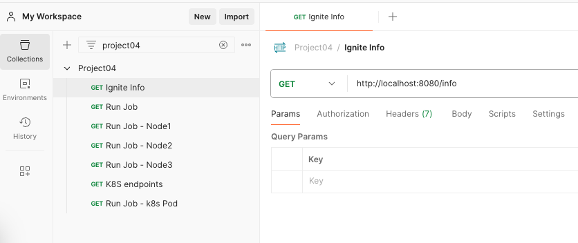

Spring boot application with distributed locking using apache ignite

Github: [https://github.com/gitorko/project04](https://github.com/gitorko/project04)

## Apache Ignite

Apache Ignite is a distributed database. It supports distributed locking mechanism.

### Code







### Postman

Import the postman collection to postman

[Postman Collection](https://raw.githubusercontent.com/gitorko/project04/main/postman/Project04.postman_collection.json)

### Setup



## References

[https://ignite.apache.org/](https://ignite.apache.org/)