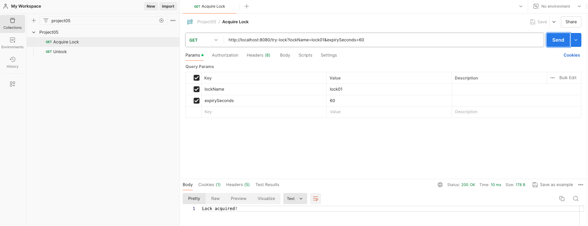

Spring boot application with distributed locking using postgres

Github: [https://github.com/gitorko/project05](https://github.com/gitorko/project05)

## Distributed Locking

When there are many service running and need to acquire a lock to run a critical region of the code there is contention.

1. Use **OptimisticLocking** to avoid 2 threads from acquiring the same lock
2. Use **UNIQUE** constraint to ensure same lock is present only once in the db.
3. Even if the server crashes/dies the locks should be auto released and not held forever or should not require manual intervention for cleanup.
4. Use virtual threads cleanup locks after duration is completed.
5. Only the node/server that acquired the lock can release the lock.

### Code









### Postman

Import the postman collection to postman

[Postman Collection](https://raw.githubusercontent.com/gitorko/project05/main/postman/Project05.postman_collection.json)

### Setup



## References

[https://ignite.apache.org/](https://ignite.apache.org/)