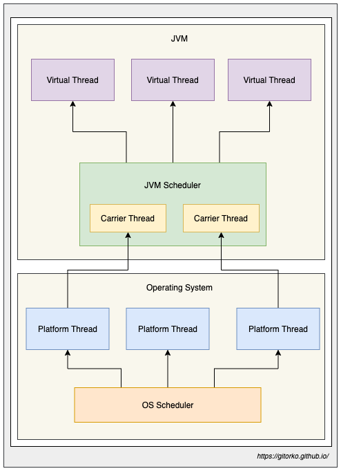
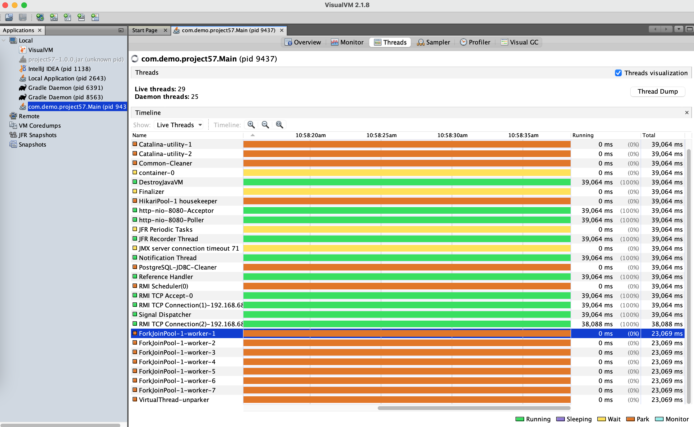

We will look at some of the best practices to be used during development of a distributed system. 

A distributed system should always assume that things will fail and should be designed with **fault tolerance** (ability to deal with faults) & **resiliency** (ability to recover) in mind.

Github: [https://github.com/gitorko/project57](https://github.com/gitorko/project57)

## Distributed System


### Blocking calls

{}
Your service is not responding as there are some requests that are taking very long to complete. 
They are waiting on IO operations. What do you do?
{}

Invoke this rest api that takes 60 secs to complete the job.

```bash
curl --location 'http://localhost:8080/api/blocking-job/60'
```


Determine if CPU intensive or IO intensive task and delegate the execution to a thread pool so that the core tomcat threads are free to serve requests. The default tomcat threads are 200 and any blocking that happens will affect the whole service.

There 2 types of protocol a tomcat server can be configured for

1. **BIO (Blocking IO)** - The threads are not free till the response is sent back. (one thread per connection)
2. **NIO (Non-Blocking IO)** - The threads are free to serve other requests while the incoming request is waiting for IO to complete. (more connections than threads)

Invoke this rest api that takes 60 secs to complete the job but delegates the job to another thread.

```bash
curl --location 'http://localhost:8080/api/async-job/60'
```


1. **Spring Reactor**  - Reactor is a non-blocking reactive programming model with back-pressure support, which supports NIO (non-blocking IO)
2. **Virtual Threads** - Light-weight threads that were introduced in JDK21 

By enabling virtual threads in spring you can achieve higher throughput, If your code calls a blocking I/O operation in a virtual thread, the runtime suspends the virtual thread until it can be resumed later.
The hardware is utilized to an almost optimal level, resulting in high levels of concurrency and, therefore, high throughput.

**Pitfalls to avoid in Virtual Threads**

1. Exceptions - Stack traces are separate, and any Exception thrown in a virtual thread only includes its own stack frames.
2. Thread-local - Reduce usage as each thread will end up creating its own thread local unlike before.
3. Synchronized blocks/methods - Virtual thread gets BLOCKED because of synchronized method (or block), it will not relinquish its control over the underlying OS thread, use ReentrantLock.
4. Thread pools - Avoid thread pool to limit resource access, eg: A thread pool of size 10 can create more than 10 concurrent threads due to virtual threads hence use semaphore if you want to limit conncurrent requests based on pool size.

```bash
Runnable fn = () -> {
  // your code
};

Thread thread = new Thread(fn).start();

Thread thread = Thread.ofPlatform().start(runnable);
                      
Thread thread = Thread.ofVirtual(fn).start();

var executorService = Executors.newVirtualThreadPerTaskExecutor();
executorService.submit(() -> {
  // your code
});
```




```bash
spring.threads.virtual.enabled=true
```

Since the number of virtual threads created can be unlimited to ensure max concurrent requests use

```bash
spring:
  task:
    execution:
      simple:
        concurrency-limit: 10
    scheduling:
      simple:
        concurrency-limit: 10
```



### Denial-of-Service (DOS) Attacks

{}
Your server is receiving a lot of bad TCP connections. 
A bad downstream client is making bad tcp connections that doesn't do anything, valid users are getting **Denial-of-Service**. What do you do?
{}

Create 10 telnet connections that connect to the tomcat server and then invoke the rest api to getTime which will not return anything as it will wait till the TCP connection is free.

```bash
for ((i=1;i<=10;i++));
do
  echo $i
  telnet 127.0.0.1 8080 &
done
```

```bash
curl --location 'http://localhost:8080/api/time'
```

The connection timeout means - If the client is not sending data after establishing the TCP handshake for 'N' seconds then close the connection. 
The default timeout is 2 minutes

```bash
server.tomcat.connection-timeout=500
```

{}
Many developers will assume that this connection timeout actually closes the connection when a long-running task takes more than 'N' seconds. 
This is not true.
It only closes connection if the client doesn't send anything for 'N' seconds.
{}

### Time Limiter

{}
A new team member has updated an API and introduced a bug and the function is very slow or never returns a response. 
System users are complaining of a slow system?
{}

Always prefer **fail-fast** instead of a slow system **fail-later**. 
By failing fast the downstream consumers of your service can use **circuit breaker** pattern to handle the outages gracefully instead of dealing with a slow api.

If a function takes too long to complete it will block the tomcat thread which will further degrade the system performance. Use Resilience4j `@TimeLimiter` to explicitly timeout long running jobs, this way runaway functions cant impact your entire system.

Invoke this rest api that takes 10 secs to complete the job but timeout happens in 5 sec.

```bash
curl --location 'http://localhost:8080/api/timeout-job/10'
```

You will see the error related to timeout

```
java.util.concurrent.TimeoutException: TimeLimiter 'project57-tl' recorded a timeout exception.
	at io.github.resilience4j.timelimiter.TimeLimiter.createdTimeoutExceptionWithName(TimeLimiter.java:225) ~[resilience4j-timelimiter-2.2.0.jar:2.2.0]
	at io.github.resilience4j.timelimiter.internal.TimeLimiterImpl$Timeout.lambda$of$0(TimeLimiterImpl.java:185) ~[resilience4j-timelimiter-2.2.0.jar:2.2.0]
	at java.base/java.util.concurrent.Executors$RunnableAdapter.call(Executors.java:572) ~[na:na]
	at java.base/java.util.concurrent.FutureTask.run(FutureTask.java:317) ~[na:na]
	at java.base/java.util.concurrent.ScheduledThreadPoolExecutor$ScheduledFutureTask.run(ScheduledThreadPoolExecutor.java:304) ~[na:na]
	at java.base/java.util.concurrent.ThreadPoolExecutor.runWorker(ThreadPoolExecutor.java:1144) ~[na:na]
	at java.base/java.util.concurrent.ThreadPoolExecutor$Worker.run(ThreadPoolExecutor.java:642) ~[na:na]
	at java.base/java.lang.Thread.run(Thread.java:1583) ~[na:na]
```

Spring also provides `spring.mvc.async.request-timeout` that ensures REST APIs can timeout after the configurable amount of time.

{}
Always assume the functions/api will take forever and may never complete, design system accordingly by fencing the methods.
{}

### Request Thread Pool & Connections

{}
During peak traffic users are reporting slow connection / timeout when connecting to your server? How many concurrent requests can your server handle?
{}

The number of tomcat threads determine how many thread can handle the incoming requests. By default, this number is 200.

```yaml
# Applies for BIO
server:
  tomcat:
    threads:
      max: 10
    max-connections: 10
```

Max number of connections the server can accept and process, for BIO (Blocking IO) tomcat the `server.tomcat.threads.max` is equal to `server.tomcat.max-connections`
You cant have more connections than the threads.

For NIO tomcat, the number of threads can be less and the max-connections can be more. Since the threads not blocked while waiting for IO to complete then can open up more connections and server other requests.

```yaml
# Applies only for NIO
server:
  tomcat:
    threads:
      max: 10
    max-connections: 1000
```

**Throughput** (requests served per second) of a single server depends on following

1. Number of tomcat threads 
2. Server hardware (CPU, Memory, SSD, Network Bandwidth) 
3. Type of task (IO intensive vs CPU intensive)

If you have 200 threads (BIO) and all request response on average take 1 second (latency) to complete then your server can handle 200 requests per second.
When there are IO intensive tasks which cause threads to wait and context switching takes place, throughput calculation becomes tricky and needs to be approximated.

{}
Benchmark the system on a varied load to arrive at the peek throughput the system can handle.
{}

### Keep-Alive

{}
Network admin calls you to tell that many TCP connections are being created to the same clients. What do you do?
{}

TCP connections take time to be established, `keep-alive` keeps the connection alive for some more time incase the client want to send more data again in the new future. 

```yaml
server:
  tomcat:
    max-keep-alive-requests: 10
    keep-alive-timeout: 10
```

1. `max-keep-alive-requests` - Max number of HTTP requests that can be pipelined before connection is closed.
2. `keep-alive-timeout` - Keeps the TCP connection for sometime to avoid doing a handshake again if request from same client is sent.

### Rest Client Connection Timeout

{}
You are invoking rest calls to an external service which has degraded and has become very slow there by causing your service to slow down. What do you do?
{}

If the server makes external calls ensure to set the read and connection timeout on the rest client.
If you dont set this then your server which is a client will wait forever to get the response.

```bash
# If unable to connect the external server then give up after 5 seconds.
setConnectTimeout(5_000);
# If unable to read data from external api call then give up after 5 seconds.
setReadTimeout(5_000);
```

Invoke this rest api that takes 10 secs as the external api is slow to complete the job but timeout happens in 5 sec.

```bash
curl --location 'http://localhost:8080/api/external-api-job/10'
```

You will see below error when timeouts are set

```
2024-06-21T16:01:06.880+05:30 ERROR 25437 --- [nio-8080-exec-5] o.a.c.c.C.[.[.[/].[dispatcherServlet]    : Servlet.service() for servlet [dispatcherServlet] in context with path [] threw exception [Request processing failed: org.springframework.web.client.ResourceAccessException: I/O error on GET request for "http://jsonplaceholder.typicode.com/users/1": Read timed out] with root cause
java.net.SocketTimeoutException: Read timed out
	at java.base/sun.nio.ch.NioSocketImpl.timedRead(NioSocketImpl.java:278) ~[na:na]
	at java.base/sun.nio.ch.NioSocketImpl.implRead(NioSocketImpl.java:304) ~[na:na]
	at java.base/sun.nio.ch.NioSocketImpl.read(NioSocketImpl.java:346) ~[na:na]
```

If you are using WebClient then use Mono.timeout() or Flux.timeout() methods

{}
Always assume that all external API calls never return and design accordingly.
{}

### Database Connection Pool

{}
You are noticing database connection timeout. What do you do?
{}

Use a connection pool if you are interacting with database as it will prevent the connection from getting open & closed which is a costly operation. The connection in the pool will be reused.

Spring boot provides Hikari connection pool. If there are run away SQL connections then service can quickly run out of connection in the pool and slow down the entire system.

```yaml
spring:
  datasource:
    hikari:
      maximumPoolSize: 5
      connectionTimeout: 1000
      idleTimeout: 60
      maxLifetime: 180
```

By setting the connectionTimeout we ensure that when the connection pool is full then we timeout after 1 second instead of waiting forever to get a new connection.

Fail-Fast is always preferred than slowing down the entire service.

Invoke this rest api that creates 10 new threads that request for DB connection while the pool only has 5.

```bash
curl --location 'http://localhost:8080/api/async-db-job/10'
```

You will see the below error

```
Caused by: org.hibernate.exception.JDBCConnectionException: Unable to acquire JDBC Connection [HikariPool-1 - Connection is not available, request timed out after 1001ms (total=5, active=5, idle=0, waiting=0)] [n/a]
	at org.hibernate.exception.internal.SQLExceptionTypeDelegate.convert(SQLExceptionTypeDelegate.java:51) ~[hibernate-core-6.5.2.Final.jar:6.5.2.Final]
	at org.hibernate.exception.internal.StandardSQLExceptionConverter.convert(StandardSQLExceptionConverter.java:58) ~[hibernate-core-6.5.2.Final.jar:6.5.2.Final]
	at org.hibernate.engine.jdbc.spi.SqlExceptionHelper.convert(SqlExceptionHelper.java:108) ~[hibernate-core-6.5.2.Final.jar:6.5.2.Final]
	at org.hibernate.engine.jdbc.spi.SqlExceptionHelper.convert(SqlExceptionHelper.java:94) ~[hibernate-core-6.5.2.Final.jar:6.5.2.Final]
	at org.hibernate.resource.jdbc.internal.LogicalConnectionManagedImpl.acquireConnectionIfNeeded(LogicalConnectionManagedImpl.java:116) ~[hibernate-core-6.5.2.Final.jar:6.5.2.Final]
	at org.hibernate.resource.jdbc.internal.LogicalConnectionManagedImpl.getPhysicalConnection(LogicalConnectionManagedImpl.java:143) ~[hibernate-core-6.5.2.Final.jar:6.5.2.Final]
	at org.hibernate.resource.jdbc.internal.LogicalConnectionManagedImpl.getConnectionForTransactionManagement(LogicalConnectionManagedImpl.java:273) ~[hibernate-core-6.5.2.Final.jar:6.5.2.Final]
	at org.hibernate.resource.jdbc.internal.LogicalConnectionManagedImpl.begin(LogicalConnectionManagedImpl.java:281) ~[hibernate-core-6.5.2.Final.jar:6.5.2.Final]
	at org.hibernate.resource.transaction.backend.jdbc.internal.JdbcResourceLocalTransactionCoordinatorImpl$TransactionDriverControlImpl.begin(JdbcResourceLocalTransactionCoordinatorImpl.java:232) ~[hibernate-core-6.5.2.Final.jar:6.5.2.Final]
	at org.hibernate.engine.transaction.internal.TransactionImpl.begin(TransactionImpl.java:83) ~[hibernate-core-6.5.2.Final.jar:6.5.2.Final]
	at org.springframework.orm.jpa.vendor.HibernateJpaDialect.beginTransaction(HibernateJpaDialect.java:176) ~[spring-orm-6.1.8.jar:6.1.8]
	at org.springframework.orm.jpa.JpaTransactionManager.doBegin(JpaTransactionManager.java:420) ~[spring-orm-6.1.8.jar:6.1.8]
	... 12 common frames omitted
Caused by: java.sql.SQLTransientConnectionException: HikariPool-1 - Connection is not available, request timed out after 1001ms (total=5, active=5, idle=0, waiting=0)
	at com.zaxxer.hikari.pool.HikariPool.createTimeoutException(HikariPool.java:686) ~[HikariCP-5.1.0.jar:na]
	at com.zaxxer.hikari.pool.HikariPool.getConnection(HikariPool.java:179) ~[HikariCP-5.1.0.jar:na]
	at com.zaxxer.hikari.pool.HikariPool.getConnection(HikariPool.java:144) ~[HikariCP-5.1.0.jar:na]
```

The configuration `spring.hikari.connectionTimeout` applies for new async thread pool. 
However, the tomcat thread pool will always wait in blocking state to get a connection from the pool.

Invoke this rest api that runs 10 long-running db query job but will not timeout and wait in blocking state.

```bash
ab -n 10 -c 10 http://localhost:8080/api/db-long-query-job/5
```

JPA also enables first level cache by default inside a transactions/session. After transaction is done the entity is garbage collected. 
For cache across sessions use second level cache.

{}
Always assume that you will run out of database connections due to a bad api and set connection timeout for both the connection pool and thread pool to prevent them from waiting forever to get connections.
{}

### Long-Running Database Query

{}
DBA call you up and informs you that there is a long-running query in your service. What do you do?
{}

Long-running queries often slow down the entire system.
To test this we explicitly slow down a query with pg_sleep function.

We set timeout on the transaction `@Transactional(timeout = 5)` to ensure that long-running query doesn't impact the entire system, after 5 seconds if the query doesn't return result an exception is thrown.

Fail-Fast is always preferred than slowing down the entire service.

```
2024-06-21T16:24:08.130+05:30  WARN 27713 --- [nio-8080-exec-2] o.h.engine.jdbc.spi.SqlExceptionHelper   : SQL Error: 0, SQLState: 57014
2024-06-21T16:24:08.130+05:30 ERROR 27713 --- [nio-8080-exec-2] o.h.engine.jdbc.spi.SqlExceptionHelper   : ERROR: canceling statement due to user request
2024-06-21T16:24:08.138+05:30 ERROR 27713 --- [nio-8080-exec-2] o.a.c.c.C.[.[.[/].[dispatcherServlet]    : Servlet.service() for servlet [dispatcherServlet] in context with path [] threw exception [Request processing failed: org.springframework.dao.QueryTimeoutException: JDBC exception executing SQL [select count(*), pg_sleep(?) IS NULL from customer] [ERROR: canceling statement due to user request] [n/a]; SQL [n/a]] with root cause

org.postgresql.util.PSQLException: ERROR: canceling statement due to user request
	at org.postgresql.core.v3.QueryExecutorImpl.receiveErrorResponse(QueryExecutorImpl.java:2725) ~[postgresql-42.7.3.jar:42.7.3]
	at org.postgresql.core.v3.QueryExecutorImpl.processResults(QueryExecutorImpl.java:2412) ~[postgresql-42.7.3.jar:42.7.3]
```

{}
Always assume that all DB calls never return or are long-running and design accordingly.
{}

You can further look at optimizing the query with help of indexes to avoid **full table scan** or introducing caching.

You can enable `show-sql` to view all the db queries however this will print to console without logging framework hence **not recommended**

```yaml
spring:
  jpa:
    show-sql: true
```

To pretty print SQL

```yaml
spring:
  jpa:
    properties:
      hibernate:
        show_sql: true
        format_sql: true
```

To print the SQL in logging framework use

```yaml
logging:
  level:
    root: info
    org.hibernate.SQL: DEBUG
    org.hibernate.type.descriptor.sql.BasicBinder: TRACE
    org.hibernate.orm.jdbc.bind: TRACE
```

### Memory Leak & CPU Spike

{}
You tested your service on your laptop and local kubernetes instance. 
In production the admin informs you that your pods are restarting frequently. What do you do?
{}

Memory leaks are always hard to debug, a badly written method can cause spike in heap memory usage causing lot of GC (garbage collection) which are **stop of the world events**. 

With kubernetes you can define resource limits that kill the pod if tries to use more resources than allocated. 
Limit define the limits for the container, requests define limit for single container as there can be multiple containers in single pod.

```yaml
resources:
    requests:
      cpu: "250m"
      memory: "250Mi"
    limits:
      cpu: "2"
      memory: "500Mi"
```

Invoke this rest api that creates a memory leak in the jvm.

```bash
curl --location 'http://localhost:8080/api/memory-leak-job/999'
```

This causes a memory spike, the pod will be killed (OOMKilled) and a new pod brought up.


{}
For an OutOfMemoryError the pod doesn't necessarily kill the pod unless some health check is configured. Pod will still remain in running state despite the OOM error.
Only the resource limits defined determine when the pod gets killed.
{}

```
Exception in thread "http-nio-8080-exec-1" java.lang.OutOfMemoryError: Java heap space
```

### Response Payload Size

{}
Your rest api returns list of customer records, However as more customers are added in production the size of response becomes bigger & bigger and slows down the request-response times.
{}

```bash
curl --location 'http://localhost:8080/api/customer'
```

Always add **pagination** support and avoid returning all the data in a single response. Data may grow later causing response size to get bigger over a period of time.

```bash
curl --location 'http://localhost:8080/api/customer-page'
```

Enable gzip compression which also reduce the size of response payload. 

```yaml
server:
  compression:
    enabled: true
    # Minimum response when compression will kick in
    min-response-size: 512
    # Mime types that should be compressed
    mime-types: text/xml, text/plain, application/json
```

You can also consider using **GraphQL** so that client can request for only the data it needs

You can also change the protocol to http2 to get more benefits like multiplexing many requests over single tcp connection.

```yaml
server:
  http2:
    enabled: true
```

**HTTP caching** -  You can also avoid sending response if the payload hasn't changed since last modified time.
If the response contains `Last-Modified` or `ETag` the client can re-use the previous payload as nothing has changed.

**Last-Modified**
Client will send the last modified `If-Modified-Since` header field and if payload hasnt changed server will return 304 Not Modified

**Etag** 
1. Shallow Hashing - Client sends the previous ETag and server generates the whole payload and then create a ETag and matches if it is same. If yes then return 304 Not Modified.
2. Deep Hashing - Client sends previous Etag and server compares it against the latest ETag it holds in cache. If same then returns 304  Not Modified

{}
Always try to reduce the size of the response payload, send only the data required instead of the whole payload. Use pagination for data records and gzip payload to reduce the size.
{}

If there is an api being called every second then it makes sends to either use **Web Sockets** or **Server Send Events (SSE)** which can stream data and avoid the costly request-response. 

### API versioning & Feature Flag

{}
A new team member has updated an existing API & introduced a new feature that was used by many downstream applications, however a bug got introduced and now all the downstream api are failing.
{}

Always look at versioning your api instead of updating existing api that are used by downstream services. This contains the **blast radius** of any bug.

eg: `/api/v1/customers` being the old api and `/api/v2/customers` being the new api

Use feature flag that can be toggled on/off if any issues arise.

```yaml
management:
  endpoint:
    refresh:
      enabled: true
```

{}
Backward compatibility is very important, specially when services rollback to older versions in distributed systems. Always work with versioned API or feature flag if there are major changes or new features being introduced.
{}

### Bulk Head Pattern

{}
Thread pools are shared, a runway function is occupying the thread pool 100% and not letting other tasks execute. What do you do?
{}

Bulkhead defines maximum number of concurrent calls allowed to be executed in a given timeframe. This prevents failures in a system/API from affecting other systems/APIs


The `@Bulkhead` is the annotation used to enable bulkhead on an API call. This can be applied at the method level or a class level. If applied at the class level, it applies to all public methods.

```yaml
resilience4j:
  bulkhead:
    instances:
      project57-b1:
        max-concurrent-calls: 2
        max-wait-duration: 10ms
```

1. `max-concurrent-calls` - Number of concurrent calls allowed
2. `max-wait-duration` - Wait for 10ms before failing in case of the limit breach

```bash
ab -n 10 -c 10 http://localhost:8080/api/bulk-head-job
```

```
Complete requests:      10
Failed requests:        7
   (Connect: 0, Receive: 0, Length: 7, Exceptions: 0)
Non-2xx responses:      7
```

**Rate Limit vs Bulk Head**

1. rate-limit - Allow this api to run only 10 requests per min.
2. bulk-head - Allow this api to use only 10 threads from the pool per min to run. Rest of threads will be available for other API.

### Rate Limiter

{}
A particular api of your service is overused due to a wrong retry logic in a client which just keeps spamming your server on that single api.
{}

Look at implementing rate limiting. Rate limiting can be implemented at gateway level or at application level. It helps prevent Denial of Service attacks.

For rate limiting implementation at gateway level refer

[http://gitorko.github.io/post/spring-traefik-rate-limit](http://gitorko.github.io/post/spring-traefik-rate-limit)

The `@RateLimiter` is the annotation used to rate-limit an API call and applied at the method or class levels. If applied at the class level, it applies to all public methods

```yaml
resilience4j:
  ratelimiter:
    instances:
      project57-r1:
        limit-for-period: 5
        limit-refresh-period: 1s
        timeout-duration: 0s
```
1. `timeout-duration` - default wait time a thread waits for a permission
2. `limit-refresh-period` - time window to count the requests
3. `limit-for-period` - number of requests or method invocations are allowed in the above limit-refresh-period

```bash
ab -n 10 -c 10 http://localhost:8080/api/rate-limit-job
```

```
Complete requests:      10
Failed requests:        5
```

{}
Always assume that your api will be invoked by clients more than they are intended to be invoked due to wrong retry configuration.
{}

### Retry

{}
One of the downstream service had a minor glitch (restart) and your rest call failed the first time it got a bad response. What do you do?
{}

Rest calls often fail in distributed environment. You need to retry `@Retry` the api with exponential backoff and max attempts to avoid overwhelming the server

```yaml
resilience4j:
  retry:
    instances:
      project57-y1:
        max-attempts: 3
        waitDuration: 10s
        enableExponentialBackoff: true
        exponentialBackoffMultiplier: 2
        retryExceptions:
          - org.springframework.web.client.HttpClientErrorException
        ignoreExceptions:
          - org.springframework.web.client.HttpServerErrorException
```

Invoke this rest api that fails the first 2 times and succeeds on the 3rd attempt.

```bash
curl --location 'http://localhost:8080/api/retry-job'
```

### Circuit Breaker Pattern

The circuit breaker pattern protects a downstream service by restricting the upstream service from calling the downstream service during a partial or complete downtime.

The `@CircuitBreaker` will close the circuit so that downstream client dont keep calling the same api again & again when it is having issues.

```yaml
resilience4j:
  circuitbreaker:
    instances:
      project57-c1:
        failure-rate-threshold: 50
        minimum-number-of-calls: 5
        automatic-transition-from-open-to-half-open-enabled: true
        wait-duration-in-open-state: 5s
        permitted-number-of-calls-in-half-open-state: 3
        sliding-window-size: 10
        sliding-window-type: count_based
```

Invoke the below api to open and close the circuit. If more failures are seen circuit is opened which mean no traffic can flow. 

A CircuitBreaker can be in three states:

1. `CLOSED` – API working fine
2. `OPEN` –  API experiencing issues, all requests to it are short-circuited
3. `HALF_OPEN` – API experiencing issues and some traffic will be allowed periodically to check if server recovered

In half open mode only few requests are allowed to check if service recovered.
In closed state it will send 503 Service Unavailable error.

```bash
curl --location 'http://localhost:8080/api/circuit-breaker-job/true'
```

```bash
curl --location 'http://localhost:8080/api/circuit-breaker-job/false'
```

### Health Check

### Observability & Monitoring

{}
Your customer reaches out each time there is an issue. Is there an active way to monitor your system instead of waiting for customer to report the issue? What do you do?
{}

1. **Monitoring** - ensures the system is healthy. You can monitor CPU usage, memory usage, request rates, and error rates.
2. **Observability** - helps you understand issues and derive insights.

You can use active monitoring setup which will proactively look for issues that happen in your system so that you can address them.

Observability is the ability to observe the internal state of a running system from the outside. Observability has 3 pillars

1. Logging - Logging Correlation IDs - Correlation IDs provide a helpful way to link lines in your log files to spans/traces.
2. Metrics - Custom metrics to monitor time taken, count invocations etc.
3. Distributed Tracing - Micrometer Tracing library is a facade for popular tracer libraries. eg: OpenTelemetry, OpenZipkin Brave

[https://gitorko.github.io/post/spring-observability/](https://gitorko.github.io/post/spring-observability/)

### Exception Handling

{}
You errors are returning 500 Internal Server error, downstream services are not able to determine reason for the error.
{}

Use `@RestController` to return custom error responses. 
If you have generic exception then use `@Order` to determine which exception gets returned first in a nested exception.

To get more details in the error response enable these

```yaml
server:
  error:
    include-binding-errors: always
    include-exception: false
    include-message: always
    include-path: always
    include-stacktrace: never
```

Be aware that if you are using dev tools `org.springframework.boot:spring-boot-devtools` the error response will be detailed by default and will not behave same in production unless the above properties are configured.

### Logging

{}
Kubernetes pods are ephemeral, you dont have access to history logs that are written to console.
{}

1. Enable file logging
2. Enable rolling of log file
3. Enable trace-id in log file
4. Enable GC logging
5. Enable async logging (does come with risk of loosing few log messages)
6. Logs must contain pod name to determine which instance the error occurred on
7. Log file name must contain pod name

File logging

```yaml
logging:
  file:
    name: project57-app-${HOSTNAME}.log
  logback:
    rollingpolicy:
      file-name-pattern: logs/%d{yyyy-MM, aux}/project57-app-${HOSTNAME}.%d{yyyy-MM-dd}.%i.log
      max-file-size: 100MB
      total-size-cap: 10GB
      max-history: 10
  level:
    root: info
```

GC logging

```bash
'-Xlog:gc*=info:file=logs/project57-gc.log:time,uptime,level,tags:filecount=5,filesize=100m',
```

On kubernetes write the log to a persistent volume else you will loose the logs on pod restart.

You can use FluentD or Promtail log brokers that collect and send logs to an Elasticsearch/Loki storage.

### JVM tuning

{}
Users are reporting that once in a while the API response is really long and it returns back to normal response time in a short while. What do you do?
{}

Garbage collection can impact response times as GC is stop of the world event. When major GC happens it pauses all threads which might impact response time for time sensitive api.

Tune your JVM and enable logging and monitoring (actuator + prometheus) on the GC

1. `-Xms, -Xmx` - Places boundaries on the heap size to increase the predictability of garbage collection. The heap size is limited in replica servers so that even Full GCs do not trigger SIP retransmissions. -Xms sets the starting size to prevent pauses caused by heap expansion.
2. `-XX:+UseG1GC` - Use the Garbage First (G1) Collector.
3. `-XX:MaxGCPauseMillis` -  Sets a target for the maximum GC pause time. This is a soft goal, and the JVM will make its best effort to achieve it.
4. `-XX:ParallelGCThreads` - Sets the number of threads used during parallel phases of the garbage collectors. The default value varies with the platform on which the JVM is running.
5. `-XX:ConcGCThreads` - Number of threads concurrent garbage collectors will use. The default value varies with the platform on which the JVM is running.
6. `-XX:InitiatingHeapOccupancyPercent` - Percentage of the (entire) heap occupancy to start a concurrent GC cycle. GCs that trigger a concurrent GC cycle based on the occupancy of the entire heap and not just one of the generations, including G1, use this option. A value of 0 denotes 'do constant GC cycles'. The default value is 45.
7. `-XX:HeapDumpOnOutOfMemoryError` - Will dump the heap to file in case of out of memory error.

```bash
'-server'
'-Xms250m',
'-Xmx500m',
'-XX:+HeapDumpOnOutOfMemoryError'
'-XX:+UseG1GC',
'-XX:MaxGCPauseMillis=200',
'-XX:ParallelGCThreads=20',
'-XX:ConcGCThreads=5',
'-XX:InitiatingHeapOccupancyPercent=70',
'-Xlog:gc*=info:file=project57-gc.log:time,uptime,level,tags:filecount=5,filesize=100m
```


### Server Startup Time

{}
Your notice your server startup time is slow, it takes 10 sec for the server to startup. What do you do?
{}

You can enable lazy initialization, Spring won’t create all beans on startup it will inject no dependencies until that bean is needed

You can check if autoconfigured beans are being set and disable them if not required.

```yaml
logging:
  level:
    org.springframework.boot.autoconfigure: DEBUG
```

Disable JMX beans to save on time

```yaml
spring:
  jmx:
    enabled: false
```

```yaml
spring:
  main:
    lazy-initialization: true
```

**GraalVM** uses Ahead of Time (AOT) Compilation creates a native binary image that doesn't require Java to run.
It will increase startup time and reduce memory footprint.
It optimizes by doing static analysis, removal of unused code, creating fixed classpath, etc.

Since Java 11, there is no pre-bundled JRE provided. As a result, basic Dockerfiles without any optimization can result in large image sizes. To reduce size of docker image

1. Use Minimal Base Images
2. Use Docker Multistage Builds
3. Minimize the Number of Layers
4. Use jlink to build custom JRE
5. Create .dockerignore to leave out readme files.
6. Use jdeps to strip dependencies not used.

### Security

{}
You have ensured that you don't print any customer information in logs, however the heapdump file that was shared in a ticket now exposes passwords to any user without access. What do you do?
{}

Some of the basic security checks

1. No credit card numbers in logs.
2. No passwords in logs.
3. No User personal information in logs.
4. No PII (Personal Identifiable Information) in logs
5. Permissions to production is restricted to few people by Authentication & Authorization.
6. Salt has been added to password before storing it.
7. Url don't have password or secure information in parameter as url get logged.
8. Custom exceptions are thrown to customer and dont expose the backend exception to the end user.
9. Cross site scripting is blocked.
10. SQL injection attacks are blocked.
11. Vulnerability scan are done and libraries updated to use latest fix.
12. Input is always validated
13. API keys / token is used to allow authenticated & authorized use of api
14. Password are stored in encrypted format not in plain text, use Vault
15. Allow listings (white listing) defines IP from which request can originate
16. HTTPS upto gateway and HTTP can be used internally within network 
17. Audit logging trail is present to identify who changed what at what time. Use event sourcing where update events are queued and written to a secondary db/table.
18. Data retention is planned to delete data which is no longer required.

However heap dump file is one area that can leak passwords if the file is shared.

Trigger a password generation request and at the same time take a heap dump. You will see the password in plain text.

```bash
curl --location 'http://localhost:8080/api/job15/60'
```


{}
Heap dump files also need to protected with password similar to production data access.
{}

### Other Failures

Distributed system can fail at various points, other areas of failure that can happen and need to be factored in design are

1. Primary DB failure or data corruption - Active-Active setup vs Active-Passive setup
2. Secondary DB replication failure
3. Queue failures - message loss during restart
4. Network failures
5. External Systems can go down
6. Service nodes can go down so your service must be resilient to this
7. Cache invalidation/eviction (TTL) failure
8. Load Balancer failures
9. Datacenter failure for one region
10. Chaos Monkey testing
11. CDN failure
12. Audit Logging failure
13. Network failure

## Code











## Postman


Import the postman collection to postman

[Postman Collection](https://raw.githubusercontent.com/gitorko/project57/main/postman/Project57.postman_collection.json)

## Setup



## References

[https://resilience4j.readme.io/docs](https://resilience4j.readme.io/docs)

[https://www.fluentd.org/](https://www.fluentd.org/)
