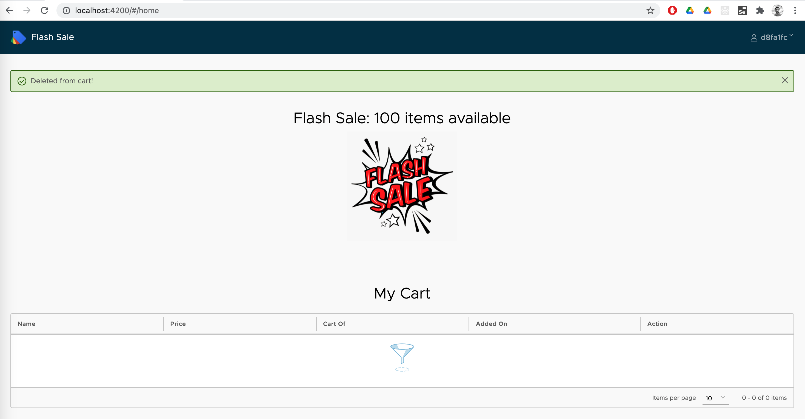

Flash sale system developed with Spring Boot, Spring JPA, RabbitMQ and Angular (Clarity) frontend.

Github: [https://github.com/gitorko/project90](https://github.com/gitorko/project90)

## Quick Overview

To deploy the application in a single command, clone the project, make sure no conflicting docker containers or ports are running and then run

```bash
git clone https://github.com/gitorko/project90
cd project90
docker-compose -f docker/docker-compose.yml up 
```

Open [http://localhost:8080/](http://localhost:8080/)

## Requirements

A flash sale system that supports one item per user and reserving the item in a large scale flash sale.

### Functional Requirements

1. A flash sale system goes live on a particular date & time. Users should not be able to add to cart before that.
2. There will be large number of users requesting to add the item to the cart at the specific moment in time. The items will be limited in stock. 
3. The 'add to cart' action must be honored in the order they were received. The first user to click on add to cart must get the item.
4. As long as there are products each user requesting should get the item in the cart.
5. Once the item is added to the cart rest of the process of checkout is beyond scope of this demo. 
6. A user can get just one item they should not be able to buy more than one item. 
7. User must be able to delete the item from the cart after which it should be available for other users.
8. The authentication can be mocked to randomly assign a user to each browser instance. So each time you open the url in a different browser/tab it is assigned a unique user.
9. User can logout and it will assign a new user.

### Non-Functional Requirements

1. Latency to place the request should be low.
2. System should be highly available & be able to handle burst of request traffic in short duration.
3. System should scale well when number of users increases

## Design

1. We will use a rabbitmq to queue the incoming burst of requests.
2. Each request response time window will be kept as minimal as possible to avoid crashing the system under heavy load.
3. Each user after placing the request to add to cart will be in wait state and query the status of his request. 
4. The backend and frontend bundle into a single uber jar that can be deployed on many servers there by providing ability to horizontally scale.
5. The max limit of requests that can be served by a single instance then depend on the default tomcat thread pool size of 200 and the server configurations.


If the user tries to book the item before sale begin date, it will fail. Add to cart will work only after the sale begins.


If the same user tries to book the item in 2 tabs only one will succeed, one user can buy only 1 item in the sale.


Two users can try to book the item at the same time each will be alloted a different item if its available.


After adding item to cart user can remove the item from cart.




After adding an item the client waits for the action to complete.


## Code







## Setup



## Testing


Click on start button to test multiple requests to add to cart.


The resources of the system are


Tomcat server has default 200 worker threads. Each 'add to cart' request takes average 20 ms for the above resources.
200/0.02 = 10,000 requests can be handled per second.
Reducing this by load factor due to GC and context switching of 0.8 (80%) gives us 10000 x 0.8 = 8000 requests per second.

This setup can be deployed on multi node scenario, as the tokens are fetched from RabbitMQ queue it will scale on a distributed setup.
Further optimization can be done by having region dedicated queue sharding and region specific event processor.

For authenticated sessions DOS (Denial Of Service) attacks are not a concern, if you still need to ensure against DOS attacks you can use a Captcha. 

Once you add more servers to handle the request the bottleneck shifts to RabbitMQ capability to handle load and we can then explore clustering in RabbitMQ. The queue can be made persistent so that events survive a restart.

## References

[https://clarity.design/](https://clarity.design/)

[https://spring.io/projects/spring-boot](https://spring.io/projects/spring-boot)

[https://www.rabbitmq.com/](https://www.rabbitmq.com/)

[https://hackernoon.com/developing-a-flash-sale-system-7481f6ede0a3](https://hackernoon.com/developing-a-flash-sale-system-7481f6ede0a3)
