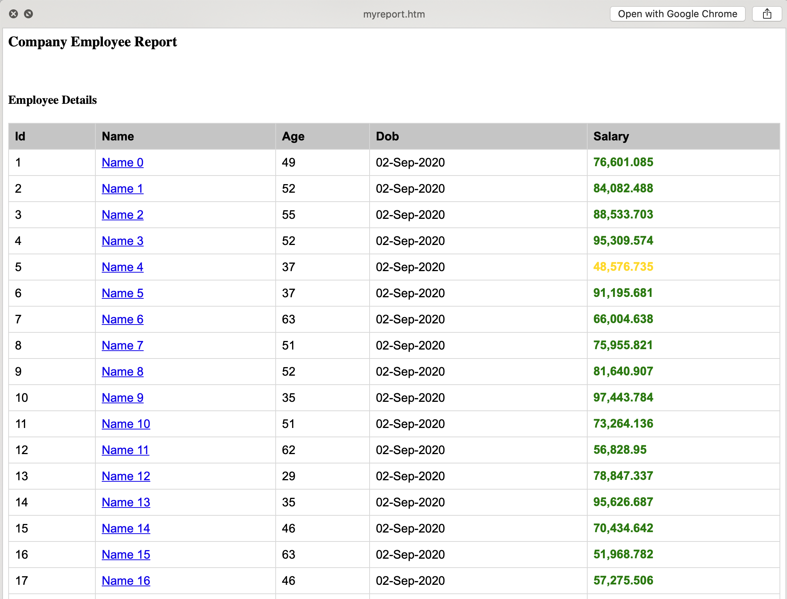

HTML reports generated with freemarker templates

Github: [https://github.com/gitorko/project69](https://github.com/gitorko/project69)

## Freemarker

We will generate a single html file report using freemarker template and provide a rest url to download the report.

## Code





## Setup



## References

[https://freemarker.apache.org/](https://freemarker.apache.org/)
