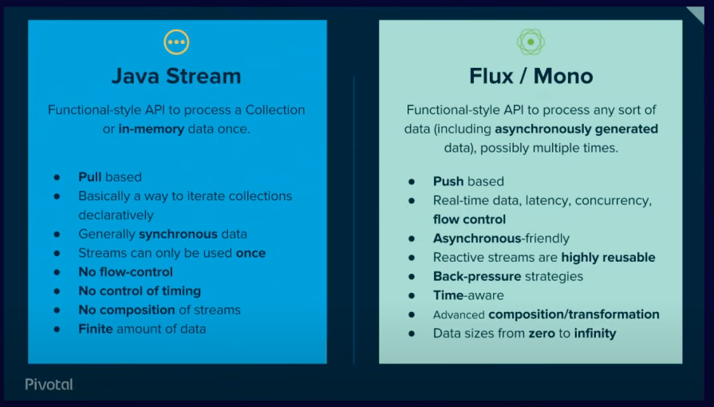

Functional programming basics on how to use java lambda and functional interfaces

Github: [https://github.com/gitorko/project83](https://github.com/gitorko/project83)

## Functional Programming

Methods demonstrating use of functional programming



## References

[Java Lambda](https://docs.oracle.com/javase/tutorial/java/javaOO/lambdaexpressions.html)
