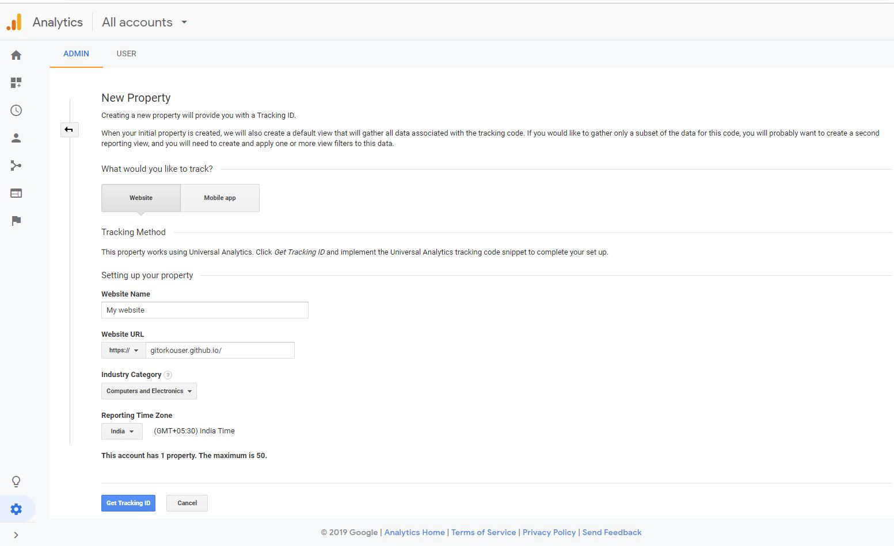

Create a blog in github using Hugo.

## Hugo

You need go installed

```bash
brew install go

$go version
go version go1.14.6 darwin/amd64
```

Install Hugo

```bash
brew install hugo
```

### Create Site

Create the site

```bash
hugo new site myblog
cd myblog
git init .
git add .
git commit -am "Base Commit"
```

### Theme

Add  clarity theme, this will also bring sample templates, that you can delete/modify

```bash
hugo mod init myblog
wget -O - https://github.com/chipzoller/hugo-clarity/archive/master.tar.gz | tar xz && cp -a hugo-clarity-master/exampleSite/* . && rm -rf hugo-clarity-master && rm -f config.toml
git add .
git commit -am "Theme Commit"
```

In the file config/_default/config.toml

Change the theme from 'theme = "hugo-clarity"' to 'theme = ["github.com/chipzoller/hugo-clarity"]'

Start the hugo server locally

```bash
hugo server
```

### Theme update

To update the clarity theme to take any latest changes to themes. Need not be done frequently.

```bash
hugo mod clean
hugo mod get -u github.com/chipzoller/hugo-clarity
```

### Hugo Module update

If you want to update all the hugo modules to use the latest version. Need not be done frequently.

```bash
hugo mod clean
hugo mod get -u ./...
```

### Page Bundles

We will use page bundles feature where the images and post reside in same folder as its easier to manage. To enable this add this to params.toml

```bash
usePageBundles = true
```

### Robots.txt

Enable robots.txt in config.toml for google crawler to skip certain files, be sure to put this at the beginning of the file

```bash
enableRobotsTXT = true
```

If you want you can add additional files by creating a robots.txt file under layouts

```text
User-agent: *

Disallow: /css/
Disallow: /en/
Disallow: /docs/
Disallow: /fonts/
Disallow: /js/
Disallow: /tags/
Disallow: /icons/
Disallow: /images/
Disallow: /showcase/
Disallow: /categories/
Disallow: /search/
```

### Disqus comments

Add disqus username to config.toml to allow comments on the blog

```bash
disqusShortname = "myusername"
```

### Menu Bar

To modify the menu edit the menu.en.toml file

### Folders

If you want additional folder modify the mainSections and add other folder names

```bash
mainSections = ["post"]
```

### Images

Images can be added like 

```text

```

### Table of Contents

To add table of contents add the following in each posts .md file

```text
toc: true
```

### Notices

To post notices use the following code

{{\% notice note "Note Title" \%}}
This will be the content of the note.
{{\% /notice \%}}

### Embed Raw Github file

Create a file called ghcode.html under layouts/shortcodes

```text
{{ $file := .Get 0 }}
{{ with resources.GetRemote $file }}
  {{ with .Err }}
    {{ errorf "%s" . }}
  {{ else }}
    {{ $lang := path.Ext $file | strings.TrimPrefix "." }}
    {{ highlight .Content $lang }}
  {{ end }}
{{ else }}
  {{ errorf "Unable to get remote resource." }}
{{ end }}
```

To use the tag in the post

{{\< ghcode "https://raw.githubusercontent.com/..file.java" \>}

### Embed Raw Markdown file

Create a file called markcode.html under layouts/shortcodes

```text
{{ $file := .Get 0 }}
{{ with resources.GetRemote $file }}
    {{ with .Err }}
        {{ errorf "%s" . }}
    {{ else }}
        {{ .Content | $.Page.RenderString }}
    {{ end }}
{{ else }}
    {{ errorf "Unable to get remote resource." }}
{{ end }}
```

To use the tag in the post

{{\< markcode "https://raw.githubusercontent.com/../file.md" \>}}

### Sitemap

Hugo generates a sitemap.xml that contains tags, categories and other taxonomies. To exclude them from Google search indexing, create a sitemap.xml under layouts.

```text
{{ printf "<?xml version=\"1.0\" encoding=\"utf-8\" standalone=\"yes\"?>" | safeHTML }}
<urlset xmlns="http://www.sitemaps.org/schemas/sitemap/0.9"
        xmlns:xhtml="http://www.w3.org/1999/xhtml">
    {{ $exclude := slice "tags" "categories" }}
    {{ range .Pages }}
    {{ if not (in $exclude .Data.Plural) }}
    <url>
        <loc>{{ .Permalink }}</loc>{{ if not .Lastmod.IsZero }}
        <lastmod>{{ safeHTML ( .Lastmod.Format "2006-01-02T15:04:05-07:00" ) }}</lastmod>{{ end }}{{ with .Sitemap.ChangeFreq }}
        <changefreq>{{ . }}</changefreq>{{ end }}{{ if ge .Sitemap.Priority 0.0 }}
        <priority>{{ .Sitemap.Priority }}</priority>{{ end }}{{ if .IsTranslated }}{{ range .Translations }}
        <xhtml:link
                rel="alternate"
                hreflang="{{ .Language.Lang }}"
                href="{{ .Permalink }}"
        />{{ end }}
        <xhtml:link
                rel="alternate"
                hreflang="{{ .Language.Lang }}"
                href="{{ .Permalink }}"
        />{{ end }}
    </url>
    {{ end }}
    {{ end }}
</urlset>
```

### Start Blog

Run the server

```bash
hugo server
```


### Github

Create a Github repository, It should be of the exact format `<GITHUB-USERNAME>-github.io`

We will create 2 branches in this repository where one branch will store the markdown content and other branch will store the live html site.


Update the base url in config.toml

```bash
baseurl = "https://<GITHUB-USERNAME>.github.io/"
```

### Blog Commit

```bash
git remote add origin https://github.com/<GITHUB-USERNAME>/<GITHUB-USERNAME>.github.io.git
git branch -M blog
git push -u origin blog
```

Now your markdown files will be present on github under the branch `blog`.

### Github Actions

To automatically deploy the site on each commit, first create the github token under the repository 

You need to generate a token if you dont have one already [https://github.com/settings/tokens](https://github.com/settings/tokens)

{}
The token must not be shared with anyone or uploaded in any static file or html.
{}


Create a new workflow action and commit


Use the below yaml

```yaml
name: CI

on:
  push:
    branches:
      - blog
  pull_request:

jobs:
  deploy:
    runs-on: ubuntu-20.04
    steps:
      - uses: actions/checkout@v2
        with:
          submodules: true  # Fetch Hugo themes (true OR recursive)
          fetch-depth: 0    # Fetch all history for .GitInfo and .Lastmod

      - name: Setup Hugo
        uses: peaceiris/actions-hugo@v2
        with:
          hugo-version: 'latest'
          # extended: true

      - name: Build
        run: hugo --minify

      - name: Deploy
        uses: peaceiris/actions-gh-pages@v3
        if: github.ref == 'refs/heads/blog'
        with:
          github_token: ${{ secrets.TOKEN }}
          publish_dir: ./public
```

By default the actions generate the live site in `gh-pages` branch, so goto github pages and change the branch to `gh-pages` and save.


Now when you commit and push and changes to the `blog` branch, github actions automatically builds your site and deploys it.


### Legacy Deploy

If you don't want use github actions to deploy the site then you can generate the site and publish it manually

Add a github submodule for the public folder

```bash
git submodule add -b gh-pages https://github.com/<GITHUB-USERNAME>/<GITHUB-USERNAME>.github.io.git public
```

Generate the site in the public folder

```bash
hugo
```

{}
Add public to .gitignore file so that public folder is not committed to the blog repo.
{}

Commit blog content (Markdown files) to the `blog` branch, double check to make sure public folder and its files are not part of this commit.

```bash
cd <GITHUB-USERNAME>
git status
git add .
git commit -am "blog update"
git push origin blog
```

Commit & push site (HTML files) to the `gh-pages` branch

```bash
cd <GITHUB-USERNAME>/public
git add .
git commit -am "Live HTML"
git push origin gh-pages
```

You should now be seeing the public html files in your <USERNAME>.github.io.git repostiory in the `gh-pages` branch.

Open url [https://<USERNAME>.github.io/](https://<USERNAME>.github.io/) and your blog should be up.

### Google Analytics

Modify the params.toml and add your google analytics tracking id.

```bash
ga_analytics = "<YOUR_VALUE>"
```

This will help you track your website traffic




### Google Search Indexing

Google search will not include your blog. 


To get your site to show up in google search ensure there is a sitemap.xml.

[http://<USERNAME>.github.io/sitemap.xml](http://<USERNAME>.github.io/sitemap.xml)

Login to google search console [https://search.google.com/search-console](https://search.google.com/search-console) and add your blog


Copy the hmtl file to static folder for site verification


It will take an hour for the site to be indexed and show up on search results.

### Markdown

Learn markdown syntax [https://github.com/adam-p/markdown-here/wiki/Markdown-Cheatsheet](https://github.com/adam-p/markdown-here/wiki/Markdown-Cheatsheet)

## References

[https://github.com/chipzoller/hugo-clarity](https://github.com/chipzoller/hugo-clarity)

[https://gohugo.io/](https://gohugo.io/)

[https://gohugo.io/hosting-and-deployment/hosting-on-github/](https://gohugo.io/hosting-and-deployment/hosting-on-github/)
