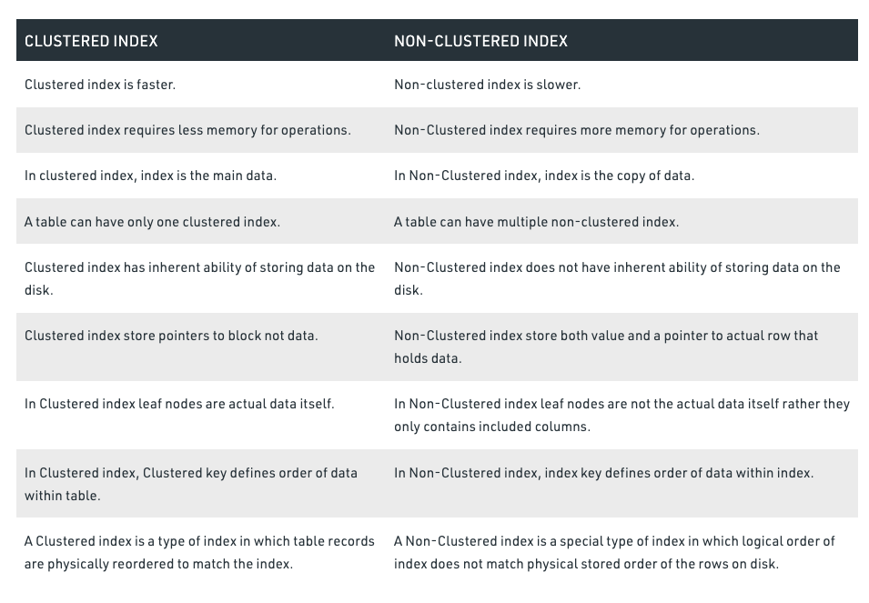
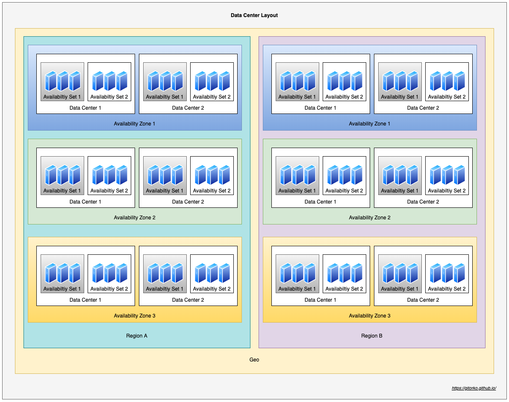
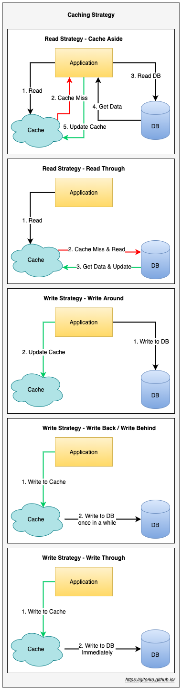
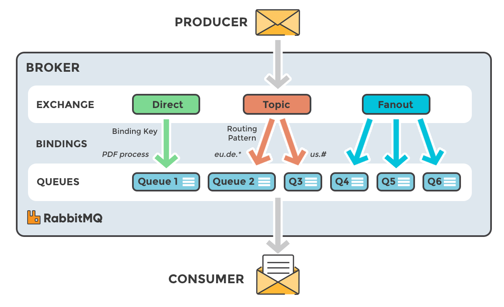
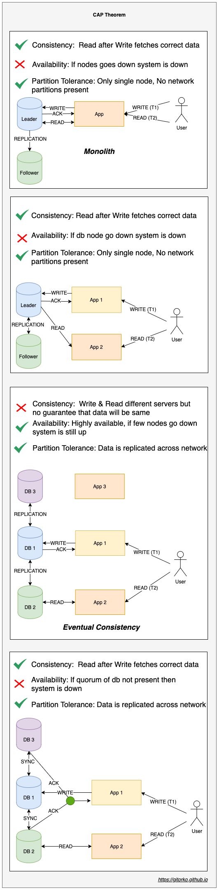
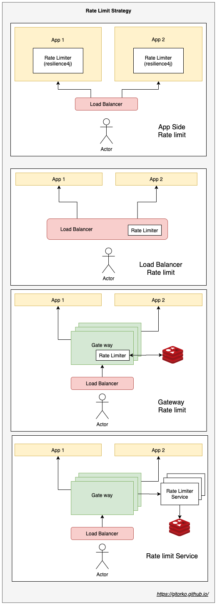

A comprehensive guide for java coding interviews covering areas like algorithms, datastructures, sorting, leetcode problems, concurrency, java fundamentals & system design.

Github: [https://github.com/gitorko/project01](https://github.com/gitorko/project01)

## Preparation

- We will first understand the fundamentals of data structure, so how heap, queue, stacks work and how to implement them from scratch. 
- Then we will look at the various sorting algorithms.
- Then we will move to LeetCode algorithm covering easy, medium & hard problems.
- Then we will move to concurrency problems, how atomic variable work, how locks work etc.
- Then we will cover some SQL and database queries.
- Then we will cover system design aspects. 
- The problems solved here are concise & small making it easy to understand and revise.
- All problems solved here are developed with test driven approach, with various test that can be run locally.
- Each of the solutions follow certain pattern. Eg: if you learn back-tracking solution in one problem the pattern is similar when you solve it in other problem. This is very important when it comes to the learning aspect.
- Some problems will be easy to solve once and never forget, others will take time and will require you to visit them again and again.
- Most problems have a parent problem, Once you solve this parent problem you can solve various subset or variation of this problem. Such problems are grouped as similar in the solutions.

## Approach To Solve

Given a problem here are some questions that should help you figure out the general direction of how to solve it

1. Which data structure can I use? Arrays, LinkedList, HashMap, Heap, Tree, or Trie
2. Do I need to use 2 data structures? eg: LRU
3. How do I break the problem into smaller units, is there a problem within a problem, can i write a decision tree?
4. Does this problem look similar to other problems you have solved?
5. Will sorting make the problem easier to solve?
6. Can I use any algorithmic techniques, like bfs, dfs, two pointer etc.
7. Do any design patterns apply that could make it easier to maintain, like observer pattern?
8. What is the time & space complexity? Best case, worst case time complexity? Average case is usually difficult to derive.


The NeetCode youtube channel is highly recommended, the explanation of the problem & concepts is just awesome!

[NeetCode](https://www.youtube.com/c/NeetCode)

The Tushar Roy - Coding Made Simple is also highly recommended

[Tushar Roy - Coding Made Simple](https://www.youtube.com/channel/UCZLJf_R2sWyUtXSKiKlyvAw)

## Algo Techniques

* Sorting
* Map & Set
* Recursion
* Fast pointer & Slow pointer
* Min-Heap vs Max-Heap (Priority Queue)
* Binary search
* BFS vs DFS
* Two Pointers
* Sliding Window
* Fast pointer vs Slow pointer
* Backtracking
* Matrix
* Prefix sum
* Divide & Conquer
* Memoization / Dynamic programming
* Greedy
* Topological Sort
* Intervals
* Cyclic Sort
* Bitwise XOR / Bit manipulation
* Trie
* Stacks & Queue

## Big-O


```
log(n) < √(n) < n < nlog(n) < n^2 < n^3 < 2^n < n!
```

[Algorithms and Data Structures Cheatsheet](https://algs4.cs.princeton.edu/cheatsheet/)

## Coding

### Sorting

|Id   | Leetcode     | Solution        | Type        |
| --- | ---          | ---             | ---         |
|1|Bubble Sort|[Solution](https://github.com/gitorko/project01/tree/main/src/test/java/com/demo/basics/sorting/_01_BubbleSort.java)|EASY|
|2|Selection sort|[Solution](https://github.com/gitorko/project01/tree/main/src/test/java/com/demo/basics/sorting/_02_SelectionSort.java)|EASY|
|3|Insertion sort|[Solution](https://github.com/gitorko/project01/tree/main/src/test/java/com/demo/basics/sorting/_03_InsertionSort.java)|EASY|
|4|MergeSort|[Solution](https://github.com/gitorko/project01/tree/main/src/test/java/com/demo/basics/sorting/_04_MergeSort.java)|MEDIUM|
|5|[912. Sort an Array](https://leetcode.com/problems/sort-an-array/)|[Solution](https://github.com/gitorko/project01/tree/main/src/test/java/com/demo/basics/sorting/_04_MergeSort.java)|MEDIUM|
|6|QuickSort|[Solution](https://github.com/gitorko/project01/tree/main/src/test/java/com/demo/basics/sorting/_05_QuickSort.java)|MEDIUM|
|7|[912. Sort an Array](https://leetcode.com/problems/sort-an-array/)|[Solution](https://github.com/gitorko/project01/tree/main/src/test/java/com/demo/basics/sorting/_05_QuickSort.java)|MEDIUM|
|8|Shell sort|[Solution](https://github.com/gitorko/project01/tree/main/src/test/java/com/demo/basics/sorting/_06_ShellSort.java)|HARD|
|9|Counting sort|[Solution](https://github.com/gitorko/project01/tree/main/src/test/java/com/demo/basics/sorting/_07_CountingSort.java)|EASY|
|10|Radix sort|[Solution](https://github.com/gitorko/project01/tree/main/src/test/java/com/demo/basics/sorting/_08_RadixSort.java)|MEDIUM|
|11|Bucket sort|[Solution](https://github.com/gitorko/project01/tree/main/src/test/java/com/demo/basics/sorting/_09_BucketSort.java)|EASY|
|12|Heap sort|[Solution](https://github.com/gitorko/project01/tree/main/src/test/java/com/demo/basics/sorting/_10_HeapSort.java)|MEDIUM|
|13|[704. Binary Search](https://leetcode.com/problems/binary-search/)|[Solution](https://github.com/gitorko/project01/tree/main/src/test/java/com/demo/basics/sorting/_11_BinarySearch.java)|EASY|
|14|Employee Search|[Solution](https://github.com/gitorko/project01/tree/main/src/test/java/com/demo/basics/sorting/_12_EmployeeSort.java)|EASY|

### Data Structure

|Id   | Leetcode     | Solution        | Type        |
| --- | ---          | ---             | ---         |
|1|Implement Circular Array|[Solution](https://github.com/gitorko/project01/tree/main/src/test/java/com/demo/basics/datastructure/CircularArray.java)|EASY|
|2|[622. Design Circular Queue](https://leetcode.com/problems/design-circular-queue/)|[Solution](https://github.com/gitorko/project01/tree/main/src/test/java/com/demo/basics/datastructure/CircularQueue.java)|MEDIUM|
|3|Implement ArrayList with array|[Solution](https://github.com/gitorko/project01/tree/main/src/test/java/com/demo/basics/datastructure/CustomArrayList.java)|EASY|
|4|Insert to BST, Delete from BST, Find from BST|[Solution](https://github.com/gitorko/project01/tree/main/src/test/java/com/demo/basics/datastructure/CustomBST.java)|EASY|
|5|Implement Map|[Solution](https://github.com/gitorko/project01/tree/main/src/test/java/com/demo/basics/datastructure/CustomMap.java)|EASY|
|6|Implement Max Heap|[Solution](https://github.com/gitorko/project01/tree/main/src/test/java/com/demo/basics/datastructure/CustomMaxHeap.java)|EASY|
|7|Implement Min Heap|[Solution](https://github.com/gitorko/project01/tree/main/src/test/java/com/demo/basics/datastructure/CustomMinHeap.java)|EASY|
|8|Implement Queue|[Solution](https://github.com/gitorko/project01/tree/main/src/test/java/com/demo/basics/datastructure/CustomQueue.java)|EASY|
|9|Implement Stack|[Solution](https://github.com/gitorko/project01/tree/main/src/test/java/com/demo/basics/datastructure/CustomStack.java)|EASY|
|10|[208. Implement Trie, Prefix Tree](https://leetcode.com/problems/implement-trie-prefix-tree/)|[Solution](https://github.com/gitorko/project01/tree/main/src/test/java/com/demo/basics/datastructure/CustomTrie.java)|EASY|
|11|Implement Doubly Linked List|[Solution](https://github.com/gitorko/project01/tree/main/src/test/java/com/demo/basics/datastructure/DoublyLinkedList.java)|EASY|
|12|[225. Implement Stack using Queues](https://leetcode.com/problems/implement-stack-using-queues/)|[Solution](https://github.com/gitorko/project01/tree/main/src/test/java/com/demo/basics/datastructure/StackUsingQueue.java)|EASY|

### LeetCode - Easy

|Id   | Leetcode     | Solution        | Type        |
| --- | ---          | ---             | ---         |
|1|[67. Add Binary](https://leetcode.com/problems/add-binary/)|[Solution](https://github.com/gitorko/project01/tree/main/src/test/java/com/demo/leetcode/easy/_01_addbinary_67/AddBinary.java)|EASY - Number|
|2|[455. Assign Cookies](https://leetcode.com/problems/assign-cookies)|[Solution](https://github.com/gitorko/project01/tree/main/src/test/java/com/demo/leetcode/easy/_01_assigncookie_455/AssignCookie.java)|EASY - Number|
|3|[121. Best Time to Buy and Sell Stock](https://leetcode.com/problems/best-time-to-buy-and-sell-stock/)|[Solution](https://github.com/gitorko/project01/tree/main/src/test/java/com/demo/leetcode/easy/_01_besttimetobuysell_121/BestTimeBuySell.java)|EASY - Number|
|4|[605. Can Place Flowers](https://leetcode.com/problems/can-place-flowers/)|[Solution](https://github.com/gitorko/project01/tree/main/src/test/java/com/demo/leetcode/easy/_01_canplaceflower_605/CanPlaceFlower.java)|EASY - Number|
|5|[724. Find Pivot Index](https://leetcode.com/problems/find-pivot-index/)|[Solution](https://github.com/gitorko/project01/tree/main/src/test/java/com/demo/leetcode/easy/_01_findpivotindex_724/FindPivotIndex.java)|EASY - Number|
|6|[9. Palindrome Number](https://leetcode.com/problems/palindrome-number/)|[Solution](https://github.com/gitorko/project01/tree/main/src/test/java/com/demo/leetcode/easy/_01_ispalindromenumber_9/isPalindromeNumber.java)|EASY - Number|
|7|[860. Lemonade Change](https://leetcode.com/problems/lemonade-change/)|[Solution](https://github.com/gitorko/project01/tree/main/src/test/java/com/demo/leetcode/easy/_01_lemonadechange_860/LemonadeChange.java)|EASY - Number|
|8|[485. Max Consecutive Ones](https://leetcode.com/problems/max-consecutive-ones/)|[Solution](https://github.com/gitorko/project01/tree/main/src/test/java/com/demo/leetcode/easy/_01_maxone_485/MaxOne.java)|EASY - Number|
|9|[53. Maximum Subarray](https://leetcode.com/problems/maximum-subarray/)|[Solution](https://github.com/gitorko/project01/tree/main/src/test/java/com/demo/leetcode/easy/_01_maxsubarraysum_53/MaxSubarraySum.java)|EASY - Number|
|10|[88. Merge Sorted Array](https://leetcode.com/problems/merge-sorted-array/)|[Solution](https://github.com/gitorko/project01/tree/main/src/test/java/com/demo/leetcode/easy/_01_mergesortedarray_88/MergeSortedArray.java)|EASY - Number|
|11|[1984. Minimum Difference Between Highest and Lowest of K Scores](https://leetcode.com/problems/minimum-difference-between-highest-and-lowest-of-k-scores/)|[Solution](https://github.com/gitorko/project01/tree/main/src/test/java/com/demo/leetcode/easy/_01_mindiffhighlowscore_1984/MinDiffHighLowScore.java)|EASY - Number|
|12|[268. Missing Number](https://leetcode.com/problems/missing-number/)|[Solution](https://github.com/gitorko/project01/tree/main/src/test/java/com/demo/leetcode/easy/_01_missingnumber_268/MissingNumber.java)|EASY - Number|
|13|[283. Move Zeroes](https://leetcode.com/problems/move-zeroes/)|[Solution](https://github.com/gitorko/project01/tree/main/src/test/java/com/demo/leetcode/easy/_01_movezero_283/MoveZero.java)|EASY - Number|
|14|[119. Pascal's Triangle II](https://leetcode.com/problems/pascals-triangle-ii/)|[Solution](https://github.com/gitorko/project01/tree/main/src/test/java/com/demo/leetcode/easy/_01_pascaltriange_119/PascalTriangle2.java)|EASY - Number|
|15|[118. Pascal's Triangle](https://leetcode.com/problems/pascals-triangle/)|[Solution](https://github.com/gitorko/project01/tree/main/src/test/java/com/demo/leetcode/easy/_01_pascaltriangle_118/PascalTriangle.java)|EASY - Number|
|16|[66. Plus One](https://leetcode.com/problems/plus-one/)|[Solution](https://github.com/gitorko/project01/tree/main/src/test/java/com/demo/leetcode/easy/_01_plusone/PlusOne.java)|EASY - Number|
|17|[1299. Replace Elements with Greatest Element on Right Side](https://leetcode.com/problems/replace-elements-with-greatest-element-on-right-side/)|[Solution](https://github.com/gitorko/project01/tree/main/src/test/java/com/demo/leetcode/easy/_01_replaceelementgreatest_1299/ReplaceElementGreatestElement.java)|EASY - Number|
|18|[7. Reverse Integer](https://leetcode.com/problems/reverse-integer/)|[Solution](https://github.com/gitorko/project01/tree/main/src/test/java/com/demo/leetcode/easy/_01_reverseinteger_7/ReverseInteger.java)|EASY - Number|
|19|[136. Single Number](https://leetcode.com/problems/single-number/)|[Solution](https://github.com/gitorko/project01/tree/main/src/test/java/com/demo/leetcode/easy/_01_singlenumber_136/SingleNum.java)|EASY - Number|
|20|[228. Summary Ranges](https://leetcode.com/problems/summary-ranges/)|[Solution](https://github.com/gitorko/project01/tree/main/src/test/java/com/demo/leetcode/easy/_01_summaryrange_228/SummaryRange.java)|EASY - Number|
|21|[263. Ugly Number](https://leetcode.com/problems/ugly-number/)|[Solution](https://github.com/gitorko/project01/tree/main/src/test/java/com/demo/leetcode/easy/_01_uglynumber_263/UglyNumber.java)|EASY - Number|
|22|[242. Valid Anagram](https://leetcode.com/problems/valid-anagram/)|[Solution](https://github.com/gitorko/project01/tree/main/src/test/java/com/demo/leetcode/easy/_02_anagram_242/CheckAnagram.java)|EASY - String|
|23|[389. Find the Difference](https://leetcode.com/problems/find-the-difference/)|[Solution](https://github.com/gitorko/project01/tree/main/src/test/java/com/demo/leetcode/easy/_02_finddifferenceinstring_389/FindDifferenceInString.java)|EASY - String|
|24|[412. Fizz Buzz](https://leetcode.com/problems/fizz-buzz/)|[Solution](https://github.com/gitorko/project01/tree/main/src/test/java/com/demo/leetcode/easy/_02_fizzbuzzjazz_412/FizzBuzzJazz.java)|EASY - String|
|25|[205. Isomorphic Strings](https://leetcode.com/problems/isomorphic-strings/)|[Solution](https://github.com/gitorko/project01/tree/main/src/test/java/com/demo/leetcode/easy/_02_isomorphicstring_205/IsomorphicString.java)|EASY - String|
|26|[392. Is Subsequence](https://leetcode.com/problems/is-subsequence/)|[Solution](https://github.com/gitorko/project01/tree/main/src/test/java/com/demo/leetcode/easy/_02_issubsequence_392/IsSubsequence.java)|EASY - String|
|27|[58. Length of Last Word](https://leetcode.com/problems/length-of-last-word/)|[Solution](https://github.com/gitorko/project01/tree/main/src/test/java/com/demo/leetcode/easy/_02_lengthoflastword_58/LengthOfLastWord.java)|EASY - String|
|28|[14. Longest Common Prefix](https://leetcode.com/problems/longest-common-prefix/)|[Solution](https://github.com/gitorko/project01/tree/main/src/test/java/com/demo/leetcode/easy/_02_longcommonprefix_14/LongestCommonPrefixString.java)|EASY - String|
|29|[1189. Maximum Number of Balloons](https://leetcode.com/problems/maximum-number-of-balloons/)|[Solution](https://github.com/gitorko/project01/tree/main/src/test/java/com/demo/leetcode/easy/_02_maxballoons_1189/MaxBalloons.java)|EASY - String|
|30|[Minimum append to make string palindrome](https://www.geeksforgeeks.org/minimum-number-appends-needed-make-string-palindrome/)|[Solution](https://github.com/gitorko/project01/tree/main/src/test/java/com/demo/leetcode/easy/_02_palindromeadjacentswap/PalindromeMin.java)|EASY - String|
|31|[344. Reverse String](https://leetcode.com/problems/reverse-string/)|[Solution](https://github.com/gitorko/project01/tree/main/src/test/java/com/demo/leetcode/easy/_02_reversestring_344/ReverseString.java)|EASY - String|
|32|[13. Roman to Integer](https://leetcode.com/problems/roman-to-integer/)|[Solution](https://github.com/gitorko/project01/tree/main/src/test/java/com/demo/leetcode/easy/_02_romantointeger_13/RomanToInteger.java)|EASY - String|
|33|[28. Implement strStr](https://leetcode.com/problems/implement-strstr/)|[Solution](https://github.com/gitorko/project01/tree/main/src/test/java/com/demo/leetcode/easy/_02_stringinstring_28/isSubarray.java)|MEDIUM - String|
|34|[929. Unique Email Addresses](https://leetcode.com/problems/unique-email-addresses/)|[Solution](https://github.com/gitorko/project01/tree/main/src/test/java/com/demo/leetcode/easy/_02_uniqueemailaddress_929/UniqueEmailAddress.java)|EASY - String|
|35|[953. Verifying an Alien Dictionary](https://leetcode.com/problems/verifying-an-alien-dictionary/)|[Solution](https://github.com/gitorko/project01/tree/main/src/test/java/com/demo/leetcode/easy/_02_verifyaliendict_953/VerifyAlienDict.java)|EASY - String|
|36|[217. Contains Duplicate](https://leetcode.com/problems/contains-duplicate/)|[Solution](https://github.com/gitorko/project01/tree/main/src/test/java/com/demo/leetcode/easy/_03_containsduplicate_217/ContainsDuplicate.java)|EASY - Map & Set|
|37|[202. Happy Number](https://leetcode.com/problems/happy-number/)|[Solution](https://github.com/gitorko/project01/tree/main/src/test/java/com/demo/leetcode/easy/_03_happynumber_202/HappyNumber.java)|EASY - Map & Set|
|38|[169. Majority Element](https://leetcode.com/problems/majority-element/)|[Solution](https://github.com/gitorko/project01/tree/main/src/test/java/com/demo/leetcode/easy/_03_majorityelement_169/MajorityElement.java)|EASY - Map & Set|
|39|[1. Two Sum](https://leetcode.com/problems/two-sum/)|[Solution](https://github.com/gitorko/project01/tree/main/src/test/java/com/demo/leetcode/easy/_03_twosum1_1/PairSumUnSorted.java)|EASY - Map & Set|
|40|[387. First Unique Character in a String](https://leetcode.com/problems/first-unique-character-in-a-string/)|[Solution](https://github.com/gitorko/project01/tree/main/src/test/java/com/demo/leetcode/easy/_03_uniquechar_387/UniqueChar.java)|EASY - Map & Set|
|41|[290. Word Pattern](https://leetcode.com/problems/word-pattern/)|[Solution](https://github.com/gitorko/project01/tree/main/src/test/java/com/demo/leetcode/easy/_03_wordpattern_290/WordPattern.java)|EASY - Map & Set|
|42|[1636. Sort Array by Increasing Frequency](https://leetcode.com/problems/sort-array-by-increasing-frequency/)|[Solution](https://github.com/gitorko/project01/tree/main/src/test/java/com/demo/leetcode/easy/_04_frequencysort_1636/FrequencySortNum.java)|EASY - Heap|
|43|[703. Kth Largest Element in a Stream](https://leetcode.com/problems/kth-largest-element-in-a-stream/)|[Solution](https://github.com/gitorko/project01/tree/main/src/test/java/com/demo/leetcode/easy/_04_kthlargestinstream_703/KthLargestInStream.java)|EASY - Heap|
|44|[1046. Last Stone Weight](https://leetcode.com/problems/last-stone-weight/)|[Solution](https://github.com/gitorko/project01/tree/main/src/test/java/com/demo/leetcode/easy/_04_laststoneweight_1046/LastStoneWeight.java)|EASY - Heap|
|45|[1005. Maximize Sum Of Array After K Negations](https://leetcode.com/problems/maximize-sum-of-array-after-k-negations/)|[Solution](https://github.com/gitorko/project01/tree/main/src/test/java/com/demo/leetcode/easy/_04_maxsumknegation_1005/MaxSumKNegation.java)|EASY - Heap|
|46|[349. Intersection of Two Arrays](https://leetcode.com/problems/intersection-of-two-arrays/)|[Solution](https://github.com/gitorko/project01/tree/main/src/test/java/com/demo/leetcode/easy/_05_arrayintersection_349/ArrayIntersection.java)|EASY - Sliding window / Two pointer|
|47|[696. Count Binary Substrings](https://leetcode.com/problems/count-binary-substrings/)|[Solution](https://github.com/gitorko/project01/tree/main/src/test/java/com/demo/leetcode/easy/_05_countbinarysubstring_696/BinarySubstring.java)|EASY - Sliding window / Two pointer|
|48|[Factorial](#)|[Solution](https://github.com/gitorko/project01/tree/main/src/test/java/com/demo/leetcode/easy/_05_factorial/Factorial.java)|EASY - Sliding window / Two pointer|
|49|[509. Fibonacci Number](https://leetcode.com/problems/fibonacci-number/)|[Solution](https://github.com/gitorko/project01/tree/main/src/test/java/com/demo/leetcode/easy/_05_fibonacci_509/Fibonacci.java)|EASY - Sliding window / Two pointer|
|50|[125. Valid Palindrome](https://leetcode.com/problems/valid-palindrome/)|[Solution](https://github.com/gitorko/project01/tree/main/src/test/java/com/demo/leetcode/easy/_05_ispalindromestring_125/IsPalindromeString.java)|EASY - Sliding window / Two pointer|
|51|[674. Longest Continuous Increasing Subsequence](https://leetcode.com/problems/longest-continuous-increasing-subsequence/)|[Solution](https://github.com/gitorko/project01/tree/main/src/test/java/com/demo/leetcode/easy/_05_longestcontinuousincreasingsubseq_674/LongContinuousIncreasingSubSeq.java)|EASY - Sliding window / Two pointer|
|52|[26. Remove Duplicates from Sorted Array](https://leetcode.com/problems/remove-duplicates-from-sorted-array/)|[Solution](https://github.com/gitorko/project01/tree/main/src/test/java/com/demo/leetcode/easy/_05_removeduplicatesortedarray_26/RemoveDuplicateSortedArray.java)|EASY - Sliding window / Two pointer|
|53|[27. Remove Element](https://leetcode.com/problems/remove-element/)|[Solution](https://github.com/gitorko/project01/tree/main/src/test/java/com/demo/leetcode/easy/_05_removeelement_27/RemoveElement.java)|EASY - Sliding window / Two pointer|
|54|[977. Squares of a Sorted Array](https://leetcode.com/problems/squares-of-a-sorted-array/)|[Solution](https://github.com/gitorko/project01/tree/main/src/test/java/com/demo/leetcode/easy/_05_squaresofsortedarray_977/SquaresOfSortedArray.java)|EASY - Sliding window / Two pointer|
|55|[680. Valid Palindrome II](https://leetcode.com/problems/valid-palindrome-ii/)|[Solution](https://github.com/gitorko/project01/tree/main/src/test/java/com/demo/leetcode/easy/_05_validpalindrome2_680/ValidPalindrome.java)|EASY - Sliding window / Two pointer|
|56|[463. Island Perimeter](https://leetcode.com/problems/island-perimeter/)|[Solution](https://github.com/gitorko/project01/tree/main/src/test/java/com/demo/leetcode/easy/_06_islandpremeter_463/IslandPerimeter.java)|EASY - Matrix|
|57|Ones in Range|[Solution](https://github.com/gitorko/project01/tree/main/src/test/java/com/demo/leetcode/easy/_08_onesinrange/OnesInRange.java)|EASY - Pre-Sum|
|58|[303. Range Sum Query - Immutable](https://leetcode.com/problems/range-sum-query-immutable/)|[Solution](https://github.com/gitorko/project01/tree/main/src/test/java/com/demo/leetcode/easy/_08_rangesumimmutable_303/RangeSum.java)|EASY - Pre-Sum|
|59|[70. Climbing Stairs](https://leetcode.com/problems/climbing-stairs/)|[Solution](https://github.com/gitorko/project01/tree/main/src/test/java/com/demo/leetcode/easy/_09_climbstairs_70/ClimbStairs.java)|EASY - DP|
|60|[338. Counting Bits](https://leetcode.com/problems/counting-bits/)|[Solution](https://github.com/gitorko/project01/tree/main/src/test/java/com/demo/leetcode/easy/_09_countingbits_338/CountingBits.java)|EASY - DP|
|61|[746. Min Cost Climbing Stairs](https://leetcode.com/problems/min-cost-climbing-stairs/)|[Solution](https://github.com/gitorko/project01/tree/main/src/test/java/com/demo/leetcode/easy/_09_mincostclimbstairs_746/MinCostClimbStairs.java)|EASY - DP|
|62|[203. Remove Linked List Elements](https://leetcode.com/problems/remove-linked-list-elements/)|[Solution](https://github.com/gitorko/project01/tree/main/src/test/java/com/demo/leetcode/easy/_10_deletenodelinklist_203/DeleteNodeLinkedList.java)|EASY - Link List|
|63|[141. Linked List Cycle](https://leetcode.com/problems/linked-list-cycle/)|[Solution](https://github.com/gitorko/project01/tree/main/src/test/java/com/demo/leetcode/easy/_10_detectlooplinklist_141/DetectLoopInLinkList.java)|EASY - Link List|
|64|[142. Linked List Cycle II](https://leetcode.com/problems/linked-list-cycle-ii/)|[Solution](https://github.com/gitorko/project01/tree/main/src/test/java/com/demo/leetcode/easy/_10_detectloopstartlinklist_142/RemoveLoopInLinkList.java)|EASY - Link List|
|65|[160. Intersection of Two Linked Lists](https://leetcode.com/problems/intersection-of-two-linked-lists/)|[Solution](https://github.com/gitorko/project01/tree/main/src/test/java/com/demo/leetcode/easy/_10_intersectionlinklist_160/IntersectionLinkList.java)|EASY - Link List|
|66|[21. Merge Two Sorted Lists](https://leetcode.com/problems/merge-two-sorted-lists/)|[Solution](https://github.com/gitorko/project01/tree/main/src/test/java/com/demo/leetcode/easy/_10_mergesortedlinklist_21/Merge2SortedList.java)|EASY - Link List|
|67|[234. Palindrome Linked List](https://leetcode.com/problems/palindrome-linked-list/)|[Solution](https://github.com/gitorko/project01/tree/main/src/test/java/com/demo/leetcode/easy/_10_palindromelinklist_234/PalindromeLinkList.java)|EASY - Link List|
|68|[83. Remove Duplicates from Sorted List](https://leetcode.com/problems/remove-duplicates-from-sorted-list/)|[Solution](https://github.com/gitorko/project01/tree/main/src/test/java/com/demo/leetcode/easy/_10_removeduplicateslinklist_83/RemoveDuplicatesSortLinkList.java)|EASY - Link List|
|69|[206. Reverse Linked List](https://leetcode.com/problems/reverse-linked-list/)|[Solution](https://github.com/gitorko/project01/tree/main/src/test/java/com/demo/leetcode/easy/_10_reverselinklist_206/ReverseLinkList.java)|EASY - Link List|
|70|[235. Lowest Common Ancestor of a Binary Search Tree](https://leetcode.com/problems/lowest-common-ancestor-of-a-binary-search-tree/)|[Solution](https://github.com/gitorko/project01/tree/main/src/test/java/com/demo/leetcode/easy/_11_bstlca_235/FindLCAinBST.java)|EASY - Binary Tree|
|71|[938. Range Sum of BST](https://leetcode.com/problems/range-sum-of-bst/)|[Solution](https://github.com/gitorko/project01/tree/main/src/test/java/com/demo/leetcode/easy/_11_bstrangesum_938/BstRangeSum.java)|EASY - Binary Tree|
|72|Binary Tree two sum different level|[Solution](https://github.com/gitorko/project01/tree/main/src/test/java/com/demo/leetcode/easy/_11_bt2sum/BinaryTreeTwoSum.java)|EASY - Binary Tree|
|73|Create Binary Tree from Level order|[Solution](https://github.com/gitorko/project01/tree/main/src/test/java/com/demo/leetcode/easy/_11_btcreatelevelorder/BinaryTreeCreateLevelOrder.java)|EASY - Binary Tree|
|74|Get height of binary tree|[Solution](https://github.com/gitorko/project01/tree/main/src/test/java/com/demo/leetcode/easy/_11_btdepth/HeightBT.java)|EASY - Binary Tree|
|75|[104. Maximum Depth of Binary Tree](https://leetcode.com/problems/maximum-depth-of-binary-tree/)|[Solution](https://github.com/gitorko/project01/tree/main/src/test/java/com/demo/leetcode/easy/_11_btdepth/MaxDepthBT.java)|EASY - Binary Tree|
|76|[111. Minimum Depth of Binary Tree](https://leetcode.com/problems/minimum-depth-of-binary-tree/)|[Solution](https://github.com/gitorko/project01/tree/main/src/test/java/com/demo/leetcode/easy/_11_btdepth/MinDepthBT.java)|EASY - Binary Tree|
|77|Get size of binary tree|[Solution](https://github.com/gitorko/project01/tree/main/src/test/java/com/demo/leetcode/easy/_11_btdepth/SizeBT.java)|EASY - Binary Tree|
|78|[543. Diameter of Binary Tree](https://leetcode.com/problems/diameter-of-binary-tree/)|[Solution](https://github.com/gitorko/project01/tree/main/src/test/java/com/demo/leetcode/easy/_11_btdiameter_543/DiameterBT.java)|EASY - Binary Tree|
|79|[226. Invert Binary Tree](https://leetcode.com/problems/invert-binary-tree/)|[Solution](https://github.com/gitorko/project01/tree/main/src/test/java/com/demo/leetcode/easy/_11_btinvert_226/InvertBinaryTree.java)|EASY - Binary Tree|
|80|[617. Merge Two Binary Trees](https://leetcode.com/problems/merge-two-binary-trees/)|[Solution](https://github.com/gitorko/project01/tree/main/src/test/java/com/demo/leetcode/easy/_11_btmerge/MergeBinaryTree.java)|EASY - Binary Tree|
|81|[257. Binary Tree Paths](https://leetcode.com/problems/binary-tree-paths/)|[Solution](https://github.com/gitorko/project01/tree/main/src/test/java/com/demo/leetcode/easy/_11_btpath_257/BinaryTreePath.java)|EASY - Binary Tree|
|82|[112. Path Sum](https://leetcode.com/problems/path-sum/)|[Solution](https://github.com/gitorko/project01/tree/main/src/test/java/com/demo/leetcode/easy/_11_btpathsum1_112/PathSum1BT.java)|EASY - Binary Tree|
|83|[100. Same Tree](https://leetcode.com/problems/same-tree/)|[Solution](https://github.com/gitorko/project01/tree/main/src/test/java/com/demo/leetcode/easy/_11_btsametree_100/SameTree.java)|EASY - Binary Tree|
|84|[671. Second Minimum Node In a Binary Tree](https://leetcode.com/problems/second-minimum-node-in-a-binary-tree/)|[Solution](https://github.com/gitorko/project01/tree/main/src/test/java/com/demo/leetcode/easy/_11_btsecondmin_671/SecondMinBT.java)|EASY - Binary Tree|
|85|[572. Subtree of Another Tree](https://leetcode.com/problems/subtree-of-another-tree/)|[Solution](https://github.com/gitorko/project01/tree/main/src/test/java/com/demo/leetcode/easy/_11_btsubtree_572/CheckSubtree.java)|EASY - Binary Tree|
|86|[404. Sum of Left Leaves](https://leetcode.com/problems/sum-of-left-leaves/)|[Solution](https://github.com/gitorko/project01/tree/main/src/test/java/com/demo/leetcode/easy/_11_btsumofleftleaf/SumOfLeftLeafBT.java)|EASY - Binary Tree|
|87|[144. Binary Tree Preorder Traversal](https://leetcode.com/problems/binary-tree-preorder-traversal/)|[Solution](https://github.com/gitorko/project01/tree/main/src/test/java/com/demo/leetcode/easy/_11_bttraversal/BTTraversal.java)|EASY - Binary Tree|
|88|[145. Binary Tree Postorder Traversal](https://leetcode.com/problems/binary-tree-postorder-traversal/)|[Solution](https://github.com/gitorko/project01/tree/main/src/test/java/com/demo/leetcode/easy/_11_bttraversal/BTTraversal.java)|EASY - Binary Tree|
|89|[94. Binary Tree Inorder Traversal](https://leetcode.com/problems/binary-tree-inorder-traversal/)|[Solution](https://github.com/gitorko/project01/tree/main/src/test/java/com/demo/leetcode/easy/_11_bttraversal/BTTraversal.java)|EASY - Binary Tree|
|90|[102. Binary Tree Level Order Traversal](https://leetcode.com/problems/binary-tree-level-order-traversal/)|[Solution](https://github.com/gitorko/project01/tree/main/src/test/java/com/demo/leetcode/easy/_11_bttraversal/BTTraversal.java)|EASY - Binary Tree|
|91|[144. Binary Tree Preorder Traversal](https://leetcode.com/problems/binary-tree-preorder-traversal/)|[Solution](https://github.com/gitorko/project01/tree/main/src/test/java/com/demo/leetcode/easy/_11_bttraversal/BTTraversalIterative.java)|EASY - Binary Tree|
|92|[145. Binary Tree Postorder Traversal](https://leetcode.com/problems/binary-tree-postorder-traversal/)|[Solution](https://github.com/gitorko/project01/tree/main/src/test/java/com/demo/leetcode/easy/_11_bttraversal/BTTraversalIterative.java)|EASY - Binary Tree|
|93|[94. Binary Tree Inorder Traversal](https://leetcode.com/problems/binary-tree-inorder-traversal/)|[Solution](https://github.com/gitorko/project01/tree/main/src/test/java/com/demo/leetcode/easy/_11_bttraversal/BTTraversalIterative.java)|EASY - Binary Tree|
|94|[107. Binary Tree Level Order Traversal II](https://leetcode.com/problems/binary-tree-level-order-traversal-ii/)|[Solution](https://github.com/gitorko/project01/tree/main/src/test/java/com/demo/leetcode/easy/_11_bttraversalreverse_107/ReverseLevelOrder.java)|EASY - Binary Tree|
|95|[101. Symmetric Tree](https://leetcode.com/problems/symmetric-tree/)|[Solution](https://github.com/gitorko/project01/tree/main/src/test/java/com/demo/leetcode/easy/_11_symmetrictree_101/SymmetricTree.java)|EASY - Binary Tree|
|96|[441. Arranging Coins](https://leetcode.com/problems/arranging-coins/)|[Solution](https://github.com/gitorko/project01/tree/main/src/test/java/com/demo/leetcode/easy/_13_arrangecoins_441/ArrangeCoins.java)|EASY - Binary Search|
|97|[108. Convert Sorted Array to Binary Search Tree](https://leetcode.com/problems/convert-sorted-array-to-binary-search-tree/)|[Solution](https://github.com/gitorko/project01/tree/main/src/test/java/com/demo/leetcode/easy/_13_bstfromarray_108/BinarySearchTreeFromArray.java)|EASY - Binary Search|
|98|[374. Guess Number Higher or Lower](https://leetcode.com/problems/guess-number-higher-or-lower/)|[Solution](https://github.com/gitorko/project01/tree/main/src/test/java/com/demo/leetcode/easy/_13_guessnumber_374/GuessNumber.java)|EASY - Binary Search|
|99|[1539. Kth Missing Positive Number](https://leetcode.com/problems/kth-missing-positive-number/)|[Solution](https://github.com/gitorko/project01/tree/main/src/test/java/com/demo/leetcode/easy/_13_kthmissingpositivenumber_1539/KthMissingPositiveNumber.java)|EASY - Binary Search|
|100|[35. Search Insert Position](https://leetcode.com/problems/search-insert-position/)|[Solution](https://github.com/gitorko/project01/tree/main/src/test/java/com/demo/leetcode/easy/_13_searchinsertposition_35/SearchInsertPosition.java)|EASY - Binary Search|
|101|[367. Valid Perfect Square](https://leetcode.com/problems/valid-perfect-square/)|[Solution](https://github.com/gitorko/project01/tree/main/src/test/java/com/demo/leetcode/easy/_13_validperfectsquare_367/ValidPerfectSquare.java)|EASY - Binary Search|
|102|[844. Backspace String Compare](https://leetcode.com/problems/backspace-string-compare/)|[Solution](https://github.com/gitorko/project01/tree/main/src/test/java/com/demo/leetcode/easy/_15_backspacestring_844/CheckBackSpaceString.java)|EASY - Stack & Monotonic Stack|
|103|[155. Min Stack](https://leetcode.com/problems/min-stack/)|[Solution](https://github.com/gitorko/project01/tree/main/src/test/java/com/demo/leetcode/easy/_15_minstack_155/MinStack.java)|EASY - Stack & Monotonic Stack|
|104|[496. Next Greater Element I](https://leetcode.com/problems/next-greater-element-i/)|[Solution](https://github.com/gitorko/project01/tree/main/src/test/java/com/demo/leetcode/easy/_15_nextgreatestelement_496/NextGreatestElement.java)|EASY - Stack & Monotonic Stack|
|105|Nearest Greater to Right|[Solution](https://github.com/gitorko/project01/tree/main/src/test/java/com/demo/leetcode/easy/_15_nextgreatestelement_496/NextGreatestRight.java)|EASY - Stack & Monotonic Stack|
|106|[20. Valid Parentheses](https://leetcode.com/problems/valid-parentheses/)|[Solution](https://github.com/gitorko/project01/tree/main/src/test/java/com/demo/leetcode/easy/_15_parenthesisvalid_20/ValidParenthesis.java)|EASY - Stack & Monotonic Stack|
|107|[71. Simplify Path](https://leetcode.com/problems/simplify-path/)|[Solution](https://github.com/gitorko/project01/tree/main/src/test/java/com/demo/leetcode/easy/_15_relativepath_71/RelativePath.java)|EASY - Stack & Monotonic Stack|
|108|Sort a stack|[Solution](https://github.com/gitorko/project01/tree/main/src/test/java/com/demo/leetcode/easy/_15_stacksort/StackSort.java)|EASY - Stack & Monotonic Stack|
|109|[733. Flood Fill](https://leetcode.com/problems/flood-fill/)|[Solution](https://github.com/gitorko/project01/tree/main/src/test/java/com/demo/leetcode/easy/_16_floodfill_733/FloodFill.java)|EASY - Graph|
|110|[1260. Shift 2D Grid](https://leetcode.com/problems/shift-2d-grid/)|[Solution](https://github.com/gitorko/project01/tree/main/src/test/java/com/demo/leetcode/easy/_16_shift2dgrid_1260/Shift2DGrid.java)|EASY - Graph|
|111|[1114. Print in Order](https://leetcode.com/problems/print-in-order/)|[Solution](https://github.com/gitorko/project01/tree/main/src/test/java/com/demo/leetcode/easy/_17_printorder_1114/PrintInOrder.java)|EASY - Thread|
|112|[448. Find All Numbers Disappeared in an Array](https://leetcode.com/problems/find-all-numbers-disappeared-in-an-array/)|[Solution](https://github.com/gitorko/project01/tree/main/src/test/java/com/demo/leetcode/easy/_21_findalldisappearednum_448/FindAllDisappearNumber.java)|EASY - Cyclic sort|
|113|[191. Number of 1 Bits](https://leetcode.com/problems/number-of-1-bits/)|[Solution](https://github.com/gitorko/project01/tree/main/src/test/java/com/demo/leetcode/easy/_22_numberof1bits_191/NumberOfOneBits.java)|EASY - Bit Manipulation|
|114|[339. Nested List Weight Sum](https://leetcode.com/problems/nested-list-weight-sum/)|[Solution](https://github.com/gitorko/project01/tree/main/src/test/java/com/demo/leetcode/easy/_25_nestedlistweightsum_551/NestedListWeightSum.java)|EASY - Generic|

### LeetCode - Medium

|Id   | Leetcode     | Solution        | Type        |
| --- | ---          | ---             | ---         |
|1|[665. Non-decreasing Array](https://leetcode.com/problems/non-decreasing-array/)|[Solution](https://github.com/gitorko/project01/tree/main/src/test/java/com/demo/leetcode/medium/_01_arraynondecreasing_665/NonDecreasingArray.java)|MEDIUM - Number|
|2|[1968. Array With Elements Not Equal to Average of Neighbors](https://leetcode.com/problems/array-with-elements-not-equal-to-average-of-neighbors/)|[Solution](https://github.com/gitorko/project01/tree/main/src/test/java/com/demo/leetcode/medium/_01_arraynotavgneighbour_1968/ArrayNotAvgNeighbour.java)|MEDIUM - Number|
|3|[853. Car Fleet](https://leetcode.com/problems/car-fleet/)|[Solution](https://github.com/gitorko/project01/tree/main/src/test/java/com/demo/leetcode/medium/_01_carfleet_853/CarFleet.java)|MEDIUM - Number|
|4|[38. Count and Say](https://leetcode.com/problems/count-and-say/)|[Solution](https://github.com/gitorko/project01/tree/main/src/test/java/com/demo/leetcode/medium/_01_countandsay_38/CountAndSay.java)|MEDIUM - Number|
|5|[1921. Eliminate Maximum Number of Monsters](https://leetcode.com/problems/eliminate-maximum-number-of-monsters/)|[Solution](https://github.com/gitorko/project01/tree/main/src/test/java/com/demo/leetcode/medium/_01_eliminatemonster_1921/EliminateMonster.java)|MEDIUM - Number|
|6|Pair with diff|[Solution](https://github.com/gitorko/project01/tree/main/src/test/java/com/demo/leetcode/medium/_01_findpair_532/FindPair.java)|MEDIUM - Number|
|7|[532. K-diff Pairs in an Array](https://leetcode.com/problems/k-diff-pairs-in-an-array/)|[Solution](https://github.com/gitorko/project01/tree/main/src/test/java/com/demo/leetcode/medium/_01_findpair_532/KDiffPair.java)|MEDIUM - Number|
|8|[18. 4Sum](https://leetcode.com/problems/4sum/)|[Solution](https://github.com/gitorko/project01/tree/main/src/test/java/com/demo/leetcode/medium/_01_foursum_18/FourSum.java)|MEDIUM - Number|
|9|[12. Integer to Roman](https://leetcode.com/problems/integer-to-roman/)|[Solution](https://github.com/gitorko/project01/tree/main/src/test/java/com/demo/leetcode/medium/_01_integertoroman_12/IntegerToRoman.java)|MEDIUM - Number|
|10|[841. Keys and Rooms](https://leetcode.com/problems/keys-and-rooms/)|[Solution](https://github.com/gitorko/project01/tree/main/src/test/java/com/demo/leetcode/medium/_01_keyandroom_841/KeysAndRoom.java)|MEDIUM - Number|
|11|[670. Maximum Swap](https://leetcode.com/problems/maximum-swap/)|[Solution](https://github.com/gitorko/project01/tree/main/src/test/java/com/demo/leetcode/medium/_01_maximumswap_670/MaximumSwap.java)|MEDIUM - Number|
|12|[152. Maximum Product Subarray](https://leetcode.com/problems/maximum-product-subarray/)|[Solution](https://github.com/gitorko/project01/tree/main/src/test/java/com/demo/leetcode/medium/_01_maxsubarrayproduct_152/MaxSubarrayProduct.java)|MEDIUM - Number|
|13|[1899. Merge Triplets to Form Target Triplet](https://leetcode.com/problems/merge-triplets-to-form-target-triplet/)|[Solution](https://github.com/gitorko/project01/tree/main/src/test/java/com/demo/leetcode/medium/_01_mergetriplets_1899/MergeTriplets.java)|MEDIUM - Number|
|14|Smallest Positive Integer|[Solution](https://github.com/gitorko/project01/tree/main/src/test/java/com/demo/leetcode/medium/_01_minpositivesubset/MinPositiveSubset.java)|MEDIUM - Number|
|15|[31. Next Permutation](https://leetcode.com/problems/next-permutation/)|[Solution](https://github.com/gitorko/project01/tree/main/src/test/java/com/demo/leetcode/medium/_01_nextpermutation_31/NextPermutation.java)|MEDIUM - Number|
|16|[2001. Number of Pairs of Interchangeable Rectangles](https://leetcode.com/problems/number-of-pairs-of-interchangeable-rectangles/)|[Solution](https://github.com/gitorko/project01/tree/main/src/test/java/com/demo/leetcode/medium/_01_pairinterchangerectangle_2001/PairInterchangeRectangle.java)|MEDIUM - Number|
|17|[50. Pow x, n](https://leetcode.com/problems/powx-n/)|[Solution](https://github.com/gitorko/project01/tree/main/src/test/java/com/demo/leetcode/medium/_01_power_50/Power.java)|MEDIUM - Number|
|18|[238. Product of Array Except Self](https://leetcode.com/problems/product-of-array-except-self/)|[Solution](https://github.com/gitorko/project01/tree/main/src/test/java/com/demo/leetcode/medium/_01_productofarrayexceptself_238/ProductOfArray.java)|MEDIUM - Number|
|19|[80. Remove Duplicates from Sorted Array II](https://leetcode.com/problems/remove-duplicates-from-sorted-array-ii/)|[Solution](https://github.com/gitorko/project01/tree/main/src/test/java/com/demo/leetcode/medium/_01_removeduplicatessortedarray_80/RemoveDuplicates.java)|MEDIUM - Number|
|20|[402. Remove K Digits](https://leetcode.com/problems/remove-k-digits/)|[Solution](https://github.com/gitorko/project01/tree/main/src/test/java/com/demo/leetcode/medium/_01_removekdigits_402/RemoveKDigits.java)|MEDIUM - Number|
|21|[1041. Robot Bounded In Circle](https://leetcode.com/problems/robot-bounded-in-circle/)|[Solution](https://github.com/gitorko/project01/tree/main/src/test/java/com/demo/leetcode/medium/_01_robotincircle_1041/RobotInCircle.java)|MEDIUM - Number|
|22|Shuffle Array|[Solution](https://github.com/gitorko/project01/tree/main/src/test/java/com/demo/leetcode/medium/_01_shufflearray/ShuffleArray.java)|MEDIUM - Number|
|23|[75. Sort Colors](https://leetcode.com/problems/sort-colors/)|[Solution](https://github.com/gitorko/project01/tree/main/src/test/java/com/demo/leetcode/medium/_01_sortcolors_75/SortColors.java)|MEDIUM - Number|
|24|[280. Wiggle Sort](https://leetcode.com/problems/wiggle-sort/)|[Solution](https://github.com/gitorko/project01/tree/main/src/test/java/com/demo/leetcode/medium/_01_wigglesort_280/WiggleSort.java)|MEDIUM - Number|
|25|Caesar Cipher|[Solution](https://github.com/gitorko/project01/tree/main/src/test/java/com/demo/leetcode/medium/_02_caesarcipher/CaesarCipher.java)|MEDIUM - String|
|26|[165. Compare Version Numbers](https://leetcode.com/problems/compare-version-numbers/)|[Solution](https://github.com/gitorko/project01/tree/main/src/test/java/com/demo/leetcode/medium/_02_compareversionnumber_165/VersionNumber.java)|MEDIUM - String|
|27|[271. Encode and Decode Strings](https://leetcode.com/problems/encode-and-decode-strings/)|[Solution](https://github.com/gitorko/project01/tree/main/src/test/java/com/demo/leetcode/medium/_02_encodedecodestring/EncodeDecodeString.java)|MEDIUM - String|
|28|[395. Longest Substring with At Least K Repeating Characters](https://leetcode.com/problems/longest-substring-with-at-least-k-repeating-characters/)|[Solution](https://github.com/gitorko/project01/tree/main/src/test/java/com/demo/leetcode/medium/_02_longestsubstringkrepeating_395/LargestSubstringKRepeat.java)|MEDIUM - String|
|29|[1963. Minimum Number of Swaps to Make the String Balanced](https://leetcode.com/problems/minimum-number-of-swaps-to-make-the-string-balanced/)|[Solution](https://github.com/gitorko/project01/tree/main/src/test/java/com/demo/leetcode/medium/_02_minswaptobalance_1963/MinSwapToBalance.java)|MEDIUM - String|
|30|[752. Open the Lock](https://leetcode.com/problems/open-the-lock/)|[Solution](https://github.com/gitorko/project01/tree/main/src/test/java/com/demo/leetcode/medium/_02_openlock_752/OpenLock.java)|MEDIUM - String|
|31|[647. Palindromic Substrings](https://leetcode.com/problems/palindromic-substrings/)|[Solution](https://github.com/gitorko/project01/tree/main/src/test/java/com/demo/leetcode/medium/_02_palindromicsubstrings_647/PalindromeSubstr.java)|MEDIUM - String|
|32|[554. Brick Wall](https://leetcode.com/problems/brick-wall/)|[Solution](https://github.com/gitorko/project01/tree/main/src/test/java/com/demo/leetcode/medium/_03_brickwall_554/BrickWall.java)|MEDIUM - Map & Set|
|33|[2013. Detect Squares](https://leetcode.com/problems/detect-squares/)|[Solution](https://github.com/gitorko/project01/tree/main/src/test/java/com/demo/leetcode/medium/_03_detectsquare_2013/DetectSquare.java)|MEDIUM - Map & Set|
|34|[1296. Divide Array in Sets of K Consecutive Numbers](https://leetcode.com/problems/divide-array-in-sets-of-k-consecutive-numbers/)|[Solution](https://github.com/gitorko/project01/tree/main/src/test/java/com/demo/leetcode/medium/_03_dividearraykset_1296/DivideArrayKSet.java)|MEDIUM - Map & Set|
|35|[535. Encode and Decode TinyURL](https://leetcode.com/problems/encode-and-decode-tinyurl/)|[Solution](https://github.com/gitorko/project01/tree/main/src/test/java/com/demo/leetcode/medium/_03_encodedecodetinyurl_535/EncodeDecodeTinyUrl.java)|MEDIUM - Map & Set|
|36|[973. K Closest Points to Origin](https://leetcode.com/problems/k-closest-points-to-origin/)|[Solution](https://github.com/gitorko/project01/tree/main/src/test/java/com/demo/leetcode/medium/_03_findkclosestpointorigin_973/FindKClosestPointToOrigin.java)|MEDIUM - Map & Set|
|37|[49. Group Anagrams](https://leetcode.com/problems/group-anagrams/)|[Solution](https://github.com/gitorko/project01/tree/main/src/test/java/com/demo/leetcode/medium/_03_groupanagrams_49/GroupAnagrams.java)|MEDIUM - Map & Set|
|38|[846. Hand of Straights](https://leetcode.com/problems/hand-of-straights/)|[Solution](https://github.com/gitorko/project01/tree/main/src/test/java/com/demo/leetcode/medium/_03_handofstraights_846/HandOfStraights.java)|MEDIUM - Map & Set|
|39|[380. Insert Delete GetRandom](https://leetcode.com/problems/insert-delete-getrandom-o1/)|[Solution](https://github.com/gitorko/project01/tree/main/src/test/java/com/demo/leetcode/medium/_03_insertdeletegetrandom_380/RandomSet.java)|MEDIUM - Map & Set|
|40|[1930. Unique Length 3 Palindromic Subsequences](https://leetcode.com/problems/unique-length-3-palindromic-subsequences/)|[Solution](https://github.com/gitorko/project01/tree/main/src/test/java/com/demo/leetcode/medium/_03_length3palindrome_1930/Length3PalindromeSubseq.java)|MEDIUM - Map & Set|
|41|[128. Longest Consecutive Sequence](https://leetcode.com/problems/longest-consecutive-sequence/)|[Solution](https://github.com/gitorko/project01/tree/main/src/test/java/com/demo/leetcode/medium/_03_longestconsecutivesequence_128/LongConsecutiveSequence.java)|MEDIUM - Map & Set|
|42|[146. LRU Cache](https://leetcode.com/problems/lru-cache/)|[Solution](https://github.com/gitorko/project01/tree/main/src/test/java/com/demo/leetcode/medium/_03_lrucache_146/LRUCacheConcept.java)|MEDIUM - Map & Set|
|43|[146. LRU Cache](https://leetcode.com/problems/lru-cache/)|[Solution](https://github.com/gitorko/project01/tree/main/src/test/java/com/demo/leetcode/medium/_03_lrucache_146/LRUCacheImpl.java)|MEDIUM - Map & Set|
|44|[187. Repeated DNA Sequences](https://leetcode.com/problems/repeated-dna-sequences/)|[Solution](https://github.com/gitorko/project01/tree/main/src/test/java/com/demo/leetcode/medium/_03_repeateddnaseq_187/RepeatedDnaSeq.java)|MEDIUM - Map & Set|
|45|[621. Task Scheduler](https://leetcode.com/problems/task-scheduler/)|[Solution](https://github.com/gitorko/project01/tree/main/src/test/java/com/demo/leetcode/medium/_03_taskscheduler_621/TaskScheduler.java)|MEDIUM - Map & Set|
|46|[16. 3Sum Closest](https://leetcode.com/problems/3sum-closest/)|[Solution](https://github.com/gitorko/project01/tree/main/src/test/java/com/demo/leetcode/medium/_03_threesumclosest_16/ThreeSumClosest.java)|MEDIUM - Map & Set|
|47|[36. Valid Sudoku](https://leetcode.com/problems/valid-sudoku/)|[Solution](https://github.com/gitorko/project01/tree/main/src/test/java/com/demo/leetcode/medium/_03_validsukoku_36/ValidSudoku.java)|MEDIUM - Map & Set|
|48|[215. Kth Largest Element in an Array](https://leetcode.com/problems/kth-largest-element-in-an-array/)|[Solution](https://github.com/gitorko/project01/tree/main/src/test/java/com/demo/leetcode/medium/_04_arraykthlargest_215_1985/KthLargestArray.java)|MEDIUM - Heap|
|49|[1985. Find the Kth Largest Integer in the Array](https://leetcode.com/problems/find-the-kth-largest-integer-in-the-array/)|[Solution](https://github.com/gitorko/project01/tree/main/src/test/java/com/demo/leetcode/medium/_04_arraykthlargest_215_1985/KthLargestArray.java)|MEDIUM - Heap|
|50|[1094. Car Pooling](https://leetcode.com/problems/car-pooling/)|[Solution](https://github.com/gitorko/project01/tree/main/src/test/java/com/demo/leetcode/medium/_04_carpooling_1094/CarPooling.java)|MEDIUM - Heap|
|51|[1167. Minimum Cost to Connect Sticks](https://leetcode.com/problems/minimum-cost-to-connect-sticks/)|[Solution](https://github.com/gitorko/project01/tree/main/src/test/java/com/demo/leetcode/medium/_04_connectsticks_1167/ConnectSticksMinCost.java)|MEDIUM - Heap|
|52|[1834. Single-Threaded CPU](https://leetcode.com/problems/single-threaded-cpu/)|[Solution](https://github.com/gitorko/project01/tree/main/src/test/java/com/demo/leetcode/medium/_04_cpupriority_1834/CpuPriority.java)|MEDIUM - Heap|
|53|[451. Sort Characters By Frequency](https://leetcode.com/problems/sort-characters-by-frequency/)|[Solution](https://github.com/gitorko/project01/tree/main/src/test/java/com/demo/leetcode/medium/_04_frequencysortchar_451/FrequencySortChar.java)|MEDIUM - Heap|
|54|[1405. Longest Happy String](https://leetcode.com/problems/longest-happy-string/)|[Solution](https://github.com/gitorko/project01/tree/main/src/test/java/com/demo/leetcode/medium/_04_longesthappystring/HappyString.java)|MEDIUM - Heap|
|55|[983. Minimum Cost For Tickets](https://leetcode.com/problems/minimum-cost-for-tickets/)|[Solution](https://github.com/gitorko/project01/tree/main/src/test/java/com/demo/leetcode/medium/_04_mincostticket_983/MinCostTicket.java)|MEDIUM - Heap|
|56|[767. Reorganize String](https://leetcode.com/problems/reorganize-string/)|[Solution](https://github.com/gitorko/project01/tree/main/src/test/java/com/demo/leetcode/medium/_04_reorganizestring_767/ReorganizeString.java)|MEDIUM - Heap|
|57|[358. Rearrange String k Distance Apart](https://leetcode.com/problems/rearrange-string-k-distance-apart/)|[Solution](https://github.com/gitorko/project01/tree/main/src/test/java/com/demo/leetcode/medium/_04_reorganizestring_767/ReorganizeString.java)|MEDIUM - Heap|
|58|[1845. Seat Reservation Manager](https://leetcode.com/problems/seat-reservation-manager/)|[Solution](https://github.com/gitorko/project01/tree/main/src/test/java/com/demo/leetcode/medium/_04_seatreservation_1845/SeatReservation.java)|MEDIUM - Heap|
|59|[Sort K sorted array](https://www.geeksforgeeks.org/nearly-sorted-algorithm/)|[Solution](https://github.com/gitorko/project01/tree/main/src/test/java/com/demo/leetcode/medium/_04_sortksortedarray/SortKSortedArray.java)|MEDIUM - Heap|
|60|[347. Top K Frequent Elements](https://leetcode.com/problems/top-k-frequent-elements/)|[Solution](https://github.com/gitorko/project01/tree/main/src/test/java/com/demo/leetcode/medium/_04_topkfrequentelement_347/TopKFrequentElementInArray.java)|MEDIUM - Heap|
|61|[692. Top K Frequent Words](https://leetcode.com/problems/top-k-frequent-words/)|[Solution](https://github.com/gitorko/project01/tree/main/src/test/java/com/demo/leetcode/medium/_04_topkfrequentwords_692/TopKfrequentWords.java)|MEDIUM - Heap|
|62|[438. Find All Anagrams in a String](https://leetcode.com/problems/find-all-anagrams-in-a-string/)|[Solution](https://github.com/gitorko/project01/tree/main/src/test/java/com/demo/leetcode/medium/_05_allanagram_438/FindAllAnagram.java)|MEDIUM - Sliding window / Two pointer|
|63|[122. Best Time to Buy and Sell Stock II](https://leetcode.com/problems/best-time-to-buy-and-sell-stock-ii/)|[Solution](https://github.com/gitorko/project01/tree/main/src/test/java/com/demo/leetcode/medium/_05_besttimetobuysell2_122/BestTimeBuySell2.java)|MEDIUM - Sliding window / Two pointer|
|64|[881. Boats to Save People](https://leetcode.com/problems/boats-to-save-people/)|[Solution](https://github.com/gitorko/project01/tree/main/src/test/java/com/demo/leetcode/medium/_05_boatstosavepeople_881/BoatsToSave.java)|MEDIUM - Sliding window / Two pointer|
|65|[11. Container With Most Water](https://leetcode.com/problems/container-with-most-water/)|[Solution](https://github.com/gitorko/project01/tree/main/src/test/java/com/demo/leetcode/medium/_05_containerwithmostwater_11/ContainerWithMostWater.java)|MEDIUM - Sliding window / Two pointer|
|66|[1838. Frequency of the Most Frequent Element](https://leetcode.com/problems/frequency-of-the-most-frequent-element/)|[Solution](https://github.com/gitorko/project01/tree/main/src/test/java/com/demo/leetcode/medium/_05_frequenceyofmostfrequent/FrequencyOfMostFrequent.java)|MEDIUM - Sliding window / Two pointer|
|67|[904. Fruit Into Baskets](https://leetcode.com/problems/fruit-into-baskets/)|[Solution](https://github.com/gitorko/project01/tree/main/src/test/java/com/demo/leetcode/medium/_05_fruitsinbasket_904/FruitsInBasket.java)|MEDIUM - Sliding window / Two pointer|
|68|[5. Longest Palindromic Substring](https://leetcode.com/problems/longest-palindromic-substring/)|[Solution](https://github.com/gitorko/project01/tree/main/src/test/java/com/demo/leetcode/medium/_05_longestpalindromesubstr_5/LongestPalindromeSubstr.java)|MEDIUM - Sliding window / Two pointer|
|69|[424. Longest Repeating Character Replacement](https://leetcode.com/problems/longest-repeating-character-replacement/)|[Solution](https://github.com/gitorko/project01/tree/main/src/test/java/com/demo/leetcode/medium/_05_longestrepeatingcharreplace_424/LongestRepeatingCharReplace.java)|MEDIUM - Sliding window / Two pointer|
|70|[159. Longest Substring with At Most Two Distinct Characters](https://leetcode.com/problems/longest-substring-with-at-most-two-distinct-characters/)|[Solution](https://github.com/gitorko/project01/tree/main/src/test/java/com/demo/leetcode/medium/_05_longestsubstrwithkdistinct_340/LongestSubstringKDistinct.java)|MEDIUM - Sliding window / Two pointer|
|71|[340. Longest Substring with At Most K Distinct Characters](https://leetcode.com/problems/longest-substring-with-at-most-k-distinct-characters/)|[Solution](https://github.com/gitorko/project01/tree/main/src/test/java/com/demo/leetcode/medium/_05_longestsubstrwithkdistinct_340/LongestSubstringKDistinct.java)|MEDIUM - Sliding window / Two pointer|
|72|[3. Longest Substring Without Repeating Characters](https://leetcode.com/problems/longest-substring-without-repeating-characters/)|[Solution](https://github.com/gitorko/project01/tree/main/src/test/java/com/demo/leetcode/medium/_05_longestsubstrwithoutrepeating_3/LongSubStrWithoutRepeating.java)|MEDIUM - Sliding window / Two pointer|
|73|[3. Longest Substring Without Repeating Characters](https://leetcode.com/problems/longest-substring-without-repeating-characters/)|[Solution](https://github.com/gitorko/project01/tree/main/src/test/java/com/demo/leetcode/medium/_05_longestsubstrwithoutrepeating_3/LongSubStrWithoutRepeatingValues.java)|MEDIUM - Sliding window / Two pointer|
|74|[1004. Max Consecutive Ones III](https://leetcode.com/problems/max-consecutive-ones-iii/)|[Solution](https://github.com/gitorko/project01/tree/main/src/test/java/com/demo/leetcode/medium/_05_maxconsecutiveone3_1004/MaxOneFlipK.java)|MEDIUM - Sliding window / Two pointer|
|75|[1423. Maximum Points You Can Obtain from Cards](https://leetcode.com/problems/maximum-points-you-can-obtain-from-cards/)|[Solution](https://github.com/gitorko/project01/tree/main/src/test/java/com/demo/leetcode/medium/_05_maxpointscard_1423/MaxPointsCards.java)|MEDIUM - Sliding window / Two pointer|
|76|[1888. Minimum Number of Flips to Make the Binary String Alternating](https://leetcode.com/problems/minimum-number-of-flips-to-make-the-binary-string-alternating/)|[Solution](https://github.com/gitorko/project01/tree/main/src/test/java/com/demo/leetcode/medium/_05_minflipbinaryalternate_1888/MinFlipBinaryAlternating.java)|MEDIUM - Sliding window / Two pointer|
|77|[64. Minimum Path Sum](https://leetcode.com/problems/minimum-path-sum/)|[Solution](https://github.com/gitorko/project01/tree/main/src/test/java/com/demo/leetcode/medium/_05_minimumpathsumgrid_64/MinPathSum.java)|MEDIUM - Sliding window / Two pointer|
|78|[209. Minimum Size Subarray Sum](https://leetcode.com/problems/minimum-size-subarray-sum/)|[Solution](https://github.com/gitorko/project01/tree/main/src/test/java/com/demo/leetcode/medium/_05_minsubarraysumsize_209/MinSizeSubArraySum.java)|MEDIUM - Sliding window / Two pointer|
|79|[763. Partition Labels](https://leetcode.com/problems/partition-labels/)|[Solution](https://github.com/gitorko/project01/tree/main/src/test/java/com/demo/leetcode/medium/_05_partitionlabel_763/PartitionLabel.java)|MEDIUM - Sliding window / Two pointer|
|80|[567. Permutation in String](https://leetcode.com/problems/permutation-in-string/)|[Solution](https://github.com/gitorko/project01/tree/main/src/test/java/com/demo/leetcode/medium/_05_permutation2string_567/PermutationIn2String.java)|MEDIUM - Sliding window / Two pointer|
|81|[151. Reverse Words in a String](https://leetcode.com/problems/reverse-words-in-a-string/)|[Solution](https://github.com/gitorko/project01/tree/main/src/test/java/com/demo/leetcode/medium/_05_reversewordsinstring/ReverseWordsInString.java)|MEDIUM - Sliding window / Two pointer|
|82|[581. Shortest Unsorted Continuous Subarray](https://leetcode.com/problems/shortest-unsorted-continuous-subarray/)|[Solution](https://github.com/gitorko/project01/tree/main/src/test/java/com/demo/leetcode/medium/_05_shortestunsortedcontsubarray_581/ShortestUnsortedContSubarray.java)|MEDIUM - Sliding window / Two pointer|
|83|[1498. Number of Subsequences That Satisfy the Given Sum Condition](https://leetcode.com/problems/number-of-subsequences-that-satisfy-the-given-sum-condition/)|[Solution](https://github.com/gitorko/project01/tree/main/src/test/java/com/demo/leetcode/medium/_05_subseqgivensum_1498/NumberOfSubSeqGivenSum.java)|MEDIUM - Sliding window / Two pointer|
|84|[15. 3Sum](https://leetcode.com/problems/3sum/)|[Solution](https://github.com/gitorko/project01/tree/main/src/test/java/com/demo/leetcode/medium/_05_threesum_15/ThreeSum.java)|MEDIUM - Sliding window / Two pointer|
|85|[167. Two Sum II - Input Array Is Sorted](https://leetcode.com/problems/two-sum-ii-input-array-is-sorted/)|[Solution](https://github.com/gitorko/project01/tree/main/src/test/java/com/demo/leetcode/medium/_05_twosum2_167/PairSumSorted.java)|MEDIUM - Sliding window / Two pointer|
|86|[1905. Count Sub Islands](https://leetcode.com/problems/count-sub-islands/)|[Solution](https://github.com/gitorko/project01/tree/main/src/test/java/com/demo/leetcode/medium/_06_countsubislands/CountSubIslands.java)|MEDIUM - Matrix|
|87|[289. Game of Life](https://leetcode.com/problems/game-of-life/)|[Solution](https://github.com/gitorko/project01/tree/main/src/test/java/com/demo/leetcode/medium/_06_gameoflife_289/GameOfLife.java)|MEDIUM - Matrix|
|88|[1428. Leftmost Column with at Least a One](https://leetcode.com/problems/leftmost-column-with-at-least-a-one/)|[Solution](https://github.com/gitorko/project01/tree/main/src/test/java/com/demo/leetcode/medium/_06_leftmostwithatleast1/LeftMostWithAtleast1.java)|MEDIUM - Matrix|
|89|[695. Max Area of Island](https://leetcode.com/problems/max-area-of-island/)|[Solution](https://github.com/gitorko/project01/tree/main/src/test/java/com/demo/leetcode/medium/_06_maxareaisland_695/MaxAreaIsland.java)|MEDIUM - Matrix|
|90|[221. Maximal Square](https://leetcode.com/problems/maximal-square/)|[Solution](https://github.com/gitorko/project01/tree/main/src/test/java/com/demo/leetcode/medium/_06_maximalsquare_221/MaximalSquare.java)|MEDIUM - Matrix|
|91|[200. Number of Islands](https://leetcode.com/problems/number-of-islands/)|[Solution](https://github.com/gitorko/project01/tree/main/src/test/java/com/demo/leetcode/medium/_06_numberofislands_200/NumberOfIslands.java)|MEDIUM - Matrix|
|92|[417. Pacific Atlantic Water Flow](https://leetcode.com/problems/pacific-atlantic-water-flow/)|[Solution](https://github.com/gitorko/project01/tree/main/src/test/java/com/demo/leetcode/medium/_06_pacificatlanticwater_417/PacificAtlanticWater.java)|MEDIUM - Matrix|
|93|[48. Rotate Image](https://leetcode.com/problems/rotate-image/)|[Solution](https://github.com/gitorko/project01/tree/main/src/test/java/com/demo/leetcode/medium/_06_rotateimage_48/RotateImage.java)|MEDIUM - Matrix|
|94|[73. Set Matrix Zeroes](https://leetcode.com/problems/set-matrix-zeroes/)|[Solution](https://github.com/gitorko/project01/tree/main/src/test/java/com/demo/leetcode/medium/_06_setmatrixzero_73/SetMatrixZero.java)|MEDIUM - Matrix|
|95|[54. Spiral Matrix](https://leetcode.com/problems/spiral-matrix/)|[Solution](https://github.com/gitorko/project01/tree/main/src/test/java/com/demo/leetcode/medium/_06_spiralmatrix_54/SpiralMatrix.java)|MEDIUM - Matrix|
|96|[130. Surrounded Regions](https://leetcode.com/problems/surrounded-regions/)|[Solution](https://github.com/gitorko/project01/tree/main/src/test/java/com/demo/leetcode/medium/_06_surroundedregion_130/SurroundedRegion.java)|MEDIUM - Matrix|
|97|[286. Walls and Gates](https://leetcode.com/problems/walls-and-gates)|[Solution](https://github.com/gitorko/project01/tree/main/src/test/java/com/demo/leetcode/medium/_06_wallgate_286/WallGate.java)|MEDIUM - Matrix|
|98|[79. Word Search](https://leetcode.com/problems/word-search/)|[Solution](https://github.com/gitorko/project01/tree/main/src/test/java/com/demo/leetcode/medium/_06_wordsearch_79/WordSearch.java)|MEDIUM - Matrix|
|99|[113. Path Sum II](https://leetcode.com/problems/path-sum-ii/)|[Solution](https://github.com/gitorko/project01/tree/main/src/test/java/com/demo/leetcode/medium/_07_btpathsum2_113/PathSum2BT.java)|MEDIUM - Backtracking|
|100|[77. Combinations](https://leetcode.com/problems/combinations/)|[Solution](https://github.com/gitorko/project01/tree/main/src/test/java/com/demo/leetcode/medium/_07_combinations_77/Combinations.java)|MEDIUM - Backtracking|
|101|[39. Combination Sum](https://leetcode.com/problems/combination-sum/)|[Solution](https://github.com/gitorko/project01/tree/main/src/test/java/com/demo/leetcode/medium/_07_combinationsum1_39/CombinationSum.java)|MEDIUM - Backtracking|
|102|[40. Combination Sum II](https://leetcode.com/problems/combination-sum-ii/)|[Solution](https://github.com/gitorko/project01/tree/main/src/test/java/com/demo/leetcode/medium/_07_combinationsum2_40/CombinationSum2.java)|MEDIUM - Backtracking|
|103|[1239. Maximum Length of a Concatenated String with Unique Characters](https://leetcode.com/problems/maximum-length-of-a-concatenated-string-with-unique-characters/)|[Solution](https://github.com/gitorko/project01/tree/main/src/test/java/com/demo/leetcode/medium/_07_maxlenconcatunq_1239/MaxLengthConcatUnique.java)|MEDIUM - Backtracking|
|104|[131. Palindrome Partitioning](https://leetcode.com/problems/palindrome-partitioning/)|[Solution](https://github.com/gitorko/project01/tree/main/src/test/java/com/demo/leetcode/medium/_07_palindromepartition_131/PalindromePartition.java)|MEDIUM - Backtracking|
|105|[22. Generate Parentheses](https://leetcode.com/problems/generate-parentheses/)|[Solution](https://github.com/gitorko/project01/tree/main/src/test/java/com/demo/leetcode/medium/_07_parenthesisgenerate_22/GenerateParenthesis.java)|MEDIUM - Backtracking|
|106|[46. Permutations](https://leetcode.com/problems/permutations/)|[Solution](https://github.com/gitorko/project01/tree/main/src/test/java/com/demo/leetcode/medium/_07_permutationnumber1_46/PermutationsNumber.java)|MEDIUM - Backtracking|
|107|[47. Permutations II](https://leetcode.com/problems/permutations-ii/)|[Solution](https://github.com/gitorko/project01/tree/main/src/test/java/com/demo/leetcode/medium/_07_permutationnumber2_47/PermutationsNumberHasDuplicates.java)|MEDIUM - Backtracking|
|108|String permutation|[Solution](https://github.com/gitorko/project01/tree/main/src/test/java/com/demo/leetcode/medium/_07_permutationstring/PermutationString.java)|MEDIUM - Backtracking|
|109|[17. Letter Combinations of a Phone Number](https://leetcode.com/problems/letter-combinations-of-a-phone-number/)|[Solution](https://github.com/gitorko/project01/tree/main/src/test/java/com/demo/leetcode/medium/_07_phonenumbercombination_17/PhoneNumberCombination.java)|MEDIUM - Backtracking|
|110|[93. Restore IP Addresses](https://leetcode.com/problems/restore-ip-addresses/)|[Solution](https://github.com/gitorko/project01/tree/main/src/test/java/com/demo/leetcode/medium/_07_restoreipaddress_93/RestoreIpAddress.java)|MEDIUM - Backtracking|
|111|[90. Subsets II](https://leetcode.com/problems/subsets-ii/)|[Solution](https://github.com/gitorko/project01/tree/main/src/test/java/com/demo/leetcode/medium/_07_subset2_90/SubsetHasDuplicates.java)|MEDIUM - Backtracking|
|112|[78. Subsets](https://leetcode.com/problems/subsets/)|[Solution](https://github.com/gitorko/project01/tree/main/src/test/java/com/demo/leetcode/medium/_07_subset_78/Subset.java)|MEDIUM - Backtracking|
|113|[1980. Find Unique Binary String](https://leetcode.com/problems/find-unique-binary-string/)|[Solution](https://github.com/gitorko/project01/tree/main/src/test/java/com/demo/leetcode/medium/_07_uniquebinarystring_1980/UniqueBinaryString.java)|MEDIUM - Backtracking|
|114|[523. Continuous Subarray Sum](https://leetcode.com/problems/continuous-subarray-sum/)|[Solution](https://github.com/gitorko/project01/tree/main/src/test/java/com/demo/leetcode/medium/_08_continuoussubarraysum_523/ContinuousSubarraySum.java)|MEDIUM - Pre-Sum|
|115|[2017. Grid Game](https://leetcode.com/problems/grid-game/)|[Solution](https://github.com/gitorko/project01/tree/main/src/test/java/com/demo/leetcode/medium/_08_gridgame_2017/GridGame.java)|MEDIUM - Pre-Sum|
|116|[528. Random Pick with Weight](https://leetcode.com/problems/random-pick-with-weight/)|[Solution](https://github.com/gitorko/project01/tree/main/src/test/java/com/demo/leetcode/medium/_08_randompickweight/RandomPickWeight.java)|MEDIUM - Pre-Sum|
|117|[304. Range Sum Query 2D - Immutable](https://leetcode.com/problems/range-sum-query-2d-immutable/)|[Solution](https://github.com/gitorko/project01/tree/main/src/test/java/com/demo/leetcode/medium/_08_rangesum2dimmutable_304/RangeSum2D.java)|MEDIUM - Pre-Sum|
|118|[560. Subarray Sum Equals K](https://leetcode.com/problems/subarray-sum-equals-k/)|[Solution](https://github.com/gitorko/project01/tree/main/src/test/java/com/demo/leetcode/medium/_08_subarraysumk_560/SubArraySumK.java)|MEDIUM - Pre-Sum|
|119|[325. Maximum Size Subarray Sum Equals k](https://leetcode.com/problems/maximum-size-subarray-sum-equals-k/)|[Solution](https://github.com/gitorko/project01/tree/main/src/test/java/com/demo/leetcode/medium/_08_subarraysumkmaxsize_325/MaxSizeSubarraySumK.java)|MEDIUM - Pre-Sum|
|120|[894. All Possible Full Binary Trees](https://leetcode.com/problems/all-possible-full-binary-trees/)|[Solution](https://github.com/gitorko/project01/tree/main/src/test/java/com/demo/leetcode/medium/_09_allbinaryfulltree_894/AllBinaryFullTree.java)|MEDIUM - DP|
|121|[309. Best Time to Buy and Sell Stock with Cooldown](https://leetcode.com/problems/best-time-to-buy-and-sell-stock-with-cooldown/)|[Solution](https://github.com/gitorko/project01/tree/main/src/test/java/com/demo/leetcode/medium/_09_besttimetobuysell3_309/BestTimeBuySellCoolDown.java)|MEDIUM - DP|
|122|[518. Coin Change 2](https://leetcode.com/problems/coin-change-2/)|[Solution](https://github.com/gitorko/project01/tree/main/src/test/java/com/demo/leetcode/medium/_09_coinchange2_518/CoinChange2.java)|MEDIUM - DP|
|123|[322. Coin Change](https://leetcode.com/problems/coin-change/)|[Solution](https://github.com/gitorko/project01/tree/main/src/test/java/com/demo/leetcode/medium/_09_coinchange_322/CoinChange.java)|MEDIUM - DP|
|124|[377. Combination Sum IV](https://leetcode.com/problems/combination-sum-iv/)|[Solution](https://github.com/gitorko/project01/tree/main/src/test/java/com/demo/leetcode/medium/_09_combinationsum4_377/CombinationSum4.java)|MEDIUM - DP|
|125|[91. Decode Ways](https://leetcode.com/problems/decode-ways/)|[Solution](https://github.com/gitorko/project01/tree/main/src/test/java/com/demo/leetcode/medium/_09_decodeways_91/DecodeWays.java)|MEDIUM - DP|
|126|[740. Delete and Earn](https://leetcode.com/problems/delete-and-earn/)|[Solution](https://github.com/gitorko/project01/tree/main/src/test/java/com/demo/leetcode/medium/_09_deleteearn/DeleteEarn.java)|MEDIUM - DP|
|127|Egg Drop|[Solution](https://github.com/gitorko/project01/tree/main/src/test/java/com/demo/leetcode/medium/_09_eggdrop_1884/EggDrop.java)|MEDIUM - DP|
|128|[1884. Egg Drop With 2 Eggs and N Floors](https://leetcode.com/problems/egg-drop-with-2-eggs-and-n-floors/)|[Solution](https://github.com/gitorko/project01/tree/main/src/test/java/com/demo/leetcode/medium/_09_eggdrop_1884/SuperEggDrop.java)|MEDIUM - DP|
|129|[198. House Robber](https://leetcode.com/problems/house-robber/)|[Solution](https://github.com/gitorko/project01/tree/main/src/test/java/com/demo/leetcode/medium/_09_houserobber1_198/HouseRob.java)|MEDIUM - DP|
|130|[213. House Robber II](https://leetcode.com/problems/house-robber-ii/)|[Solution](https://github.com/gitorko/project01/tree/main/src/test/java/com/demo/leetcode/medium/_09_houserobber2_213/HouseRob2.java)|MEDIUM - DP|
|131|[337. House Robber III](https://leetcode.com/problems/house-robber-iii/)|[Solution](https://github.com/gitorko/project01/tree/main/src/test/java/com/demo/leetcode/medium/_09_houserobber3_337/HouseRob3.java)|MEDIUM - DP|
|132|[343. Integer Break](https://leetcode.com/problems/integer-break/)|[Solution](https://github.com/gitorko/project01/tree/main/src/test/java/com/demo/leetcode/medium/_09_integerbreak_343/IntegerBreak.java)|MEDIUM - DP|
|133|[97. Interleaving String](https://leetcode.com/problems/interleaving-string/)|[Solution](https://github.com/gitorko/project01/tree/main/src/test/java/com/demo/leetcode/medium/_09_interleavingstring_97/InterleavingString.java)|MEDIUM - DP|
|134|[1143. Longest Common Subsequence](https://leetcode.com/problems/longest-common-subsequence/)|[Solution](https://github.com/gitorko/project01/tree/main/src/test/java/com/demo/leetcode/medium/_09_longestcommonsubsequence_1143/LongestCommonSubSequence.java)|MEDIUM - DP|
|135|[300. Longest Increasing Subsequence](https://leetcode.com/problems/longest-increasing-subsequence/)|[Solution](https://github.com/gitorko/project01/tree/main/src/test/java/com/demo/leetcode/medium/_09_longestincreasingsubseq_300/LongestIncreasingSubSeq.java)|MEDIUM - DP|
|136|[516. Longest Palindromic Subsequence](https://leetcode.com/problems/longest-palindromic-subsequence/)|[Solution](https://github.com/gitorko/project01/tree/main/src/test/java/com/demo/leetcode/medium/_09_longestpalindromicsubseq/LongestPalindromeSubSeq.java)|MEDIUM - DP|
|137|[473. Matchsticks to Square](https://leetcode.com/problems/matchsticks-to-square/)|[Solution](https://github.com/gitorko/project01/tree/main/src/test/java/com/demo/leetcode/medium/_09_matchsticksquare_473/MatchStickSquare.java)|MEDIUM - DP|
|138|[1911. Maximum Alternating Subsequence Sum](https://leetcode.com/problems/maximum-alternating-subsequence-sum/)|[Solution](https://github.com/gitorko/project01/tree/main/src/test/java/com/demo/leetcode/medium/_09_maxalterningsubseq_1911/MaxAlternatingSubSeq.java)|MEDIUM - DP|
|139|[673. Number of Longest Increasing Subsequence](https://leetcode.com/problems/number-of-longest-increasing-subsequence/)|[Solution](https://github.com/gitorko/project01/tree/main/src/test/java/com/demo/leetcode/medium/_09_numberoflongestincreasingsubseq_673/NumberOfLongestIncreasingSubseq.java)|MEDIUM - DP|
|140|[256. Paint House](https://leetcode.com/problems/paint-house/)|[Solution](https://github.com/gitorko/project01/tree/main/src/test/java/com/demo/leetcode/medium/_09_painthouse_256/PaintHouse.java)|MEDIUM - DP|
|141|[698. Partition to K Equal Sum Subsets](https://leetcode.com/problems/partition-to-k-equal-sum-subsets/)|[Solution](https://github.com/gitorko/project01/tree/main/src/test/java/com/demo/leetcode/medium/_09_partitionkequalsubset_698/PartitionKEqualSubset.java)|MEDIUM - DP|
|142|[416. Partition Equal Subset Sum](https://leetcode.com/problems/partition-equal-subset-sum/)|[Solution](https://github.com/gitorko/project01/tree/main/src/test/java/com/demo/leetcode/medium/_09_partitionsubsetsum/PartitionSubsetSum.java)|MEDIUM - DP|
|143|[279. Perfect Squares](https://leetcode.com/problems/perfect-squares/)|[Solution](https://github.com/gitorko/project01/tree/main/src/test/java/com/demo/leetcode/medium/_09_perfectsquare_279/PerfectSquare.java)|MEDIUM - DP|
|144|Rod Cutting|[Solution](https://github.com/gitorko/project01/tree/main/src/test/java/com/demo/leetcode/medium/_09_rodcutting/RodCutting.java)|MEDIUM - DP|
|145|[877. Stone Game](https://leetcode.com/problems/stone-game/)|[Solution](https://github.com/gitorko/project01/tree/main/src/test/java/com/demo/leetcode/medium/_09_stonegame_877/StoneGame.java)|MEDIUM - DP|
|146|[494. Target Sum](https://leetcode.com/problems/target-sum/)|[Solution](https://github.com/gitorko/project01/tree/main/src/test/java/com/demo/leetcode/medium/_09_targetsum_494/TargetSum.java)|MEDIUM - DP|
|147|[120. Triangle](https://leetcode.com/problems/triangle/)|[Solution](https://github.com/gitorko/project01/tree/main/src/test/java/com/demo/leetcode/medium/_09_triangle_120/Triangle.java)|MEDIUM - DP|
|148|[95. Unique Binary Search Trees II](https://leetcode.com/problems/unique-binary-search-trees-ii/)|[Solution](https://github.com/gitorko/project01/tree/main/src/test/java/com/demo/leetcode/medium/_09_uniquebinarysearchtree2_95/UniqueBST2.java)|MEDIUM - DP|
|149|[96. Unique Binary Search Trees](https://leetcode.com/problems/unique-binary-search-trees/)|[Solution](https://github.com/gitorko/project01/tree/main/src/test/java/com/demo/leetcode/medium/_09_uniquebinarysearchtree_96/UniqueBST.java)|MEDIUM - DP|
|150|[63. Unique Paths II](https://leetcode.com/problems/unique-paths-ii/)|[Solution](https://github.com/gitorko/project01/tree/main/src/test/java/com/demo/leetcode/medium/_09_uniquepath2_63/UniquePath2.java)|MEDIUM - DP|
|151|[62. Unique Paths](https://leetcode.com/problems/unique-paths/)|[Solution](https://github.com/gitorko/project01/tree/main/src/test/java/com/demo/leetcode/medium/_09_uniquepath_62/UniquePath.java)|MEDIUM - DP|
|152|[139. Word Break](https://leetcode.com/problems/word-break/)|[Solution](https://github.com/gitorko/project01/tree/main/src/test/java/com/demo/leetcode/medium/_09_wordbreak_139/WordBreak.java)|MEDIUM - DP|
|153|[2. Add Two Numbers](https://leetcode.com/problems/add-two-numbers/)|[Solution](https://github.com/gitorko/project01/tree/main/src/test/java/com/demo/leetcode/medium/_10_add2numbers_2/AddTwoNumbers.java)|EASY - Link List|
|154|[138. Copy List with Random Pointer](https://leetcode.com/problems/copy-list-with-random-pointer/)|[Solution](https://github.com/gitorko/project01/tree/main/src/test/java/com/demo/leetcode/medium/_10_copylistrandompointer_138/CopyListRandomPointer.java)|MEDIUM - Link List|
|155|[287. Find the Duplicate Number](https://leetcode.com/problems/find-the-duplicate-number/)|[Solution](https://github.com/gitorko/project01/tree/main/src/test/java/com/demo/leetcode/medium/_10_duplicatenumber_287/DuplicateNumber.java)|MEDIUM - Link List|
|156|[147. Insertion Sort List](https://leetcode.com/problems/insertion-sort-list/)|[Solution](https://github.com/gitorko/project01/tree/main/src/test/java/com/demo/leetcode/medium/_10_insertionsortlinklist_147/InsertionSortLinkList.java)|MEDIUM - Link List|
|157|[109. Convert Sorted List to Binary Search Tree](https://leetcode.com/problems/convert-sorted-list-to-binary-search-tree/)|[Solution](https://github.com/gitorko/project01/tree/main/src/test/java/com/demo/leetcode/medium/_10_linklisttobst_109/LinkListToBST.java)|MEDIUM - Link List|
|158|[86. Partition List](https://leetcode.com/problems/partition-list/)|[Solution](https://github.com/gitorko/project01/tree/main/src/test/java/com/demo/leetcode/medium/_10_partitionlinklist_86/PartitionLinkList.java)|MEDIUM - Link List|
|159|[82. Remove Duplicates from Sorted List II](https://leetcode.com/problems/remove-duplicates-from-sorted-list-ii/)|[Solution](https://github.com/gitorko/project01/tree/main/src/test/java/com/demo/leetcode/medium/_10_removeduplicates2linklist_82/RemoveDuplicatesSortList2.java)|MEDIUM - Link List|
|160|[19. Remove Nth Node From End of List](https://leetcode.com/problems/remove-nth-node-from-end-of-list/)|[Solution](https://github.com/gitorko/project01/tree/main/src/test/java/com/demo/leetcode/medium/_10_removennodelinklist_19/RemoveNNodeLinkList.java)|MEDIUM - Link List|
|161|[143. Reorder List](https://leetcode.com/problems/reorder-list/)|[Solution](https://github.com/gitorko/project01/tree/main/src/test/java/com/demo/leetcode/medium/_10_reorderlinklist_143/ReorderLinkList.java)|MEDIUM - Link List|
|162|[92. Reverse Linked List II](https://leetcode.com/problems/reverse-linked-list-ii/)|[Solution](https://github.com/gitorko/project01/tree/main/src/test/java/com/demo/leetcode/medium/_10_reverselinklist2_92/ReverseLinkList2.java)|MEDIUM - Link List|
|163|Reverse link list even odd|[Solution](https://github.com/gitorko/project01/tree/main/src/test/java/com/demo/leetcode/medium/_10_reverselinklisteven/ReverseLinkListEven.java)|MEDIUM - Link List|
|164|[189. Rotate Array](https://leetcode.com/problems/rotate-array/)|[Solution](https://github.com/gitorko/project01/tree/main/src/test/java/com/demo/leetcode/medium/_10_rotatearray_189/RotateArray.java)|MEDIUM - Link List|
|165|[61. Rotate List](https://leetcode.com/problems/rotate-list/)|[Solution](https://github.com/gitorko/project01/tree/main/src/test/java/com/demo/leetcode/medium/_10_rotatelinklist_61/RotateLinkList.java)|MEDIUM - Link List|
|166|[148. Sort List](https://leetcode.com/problems/sort-list/)|[Solution](https://github.com/gitorko/project01/tree/main/src/test/java/com/demo/leetcode/medium/_10_sortlinklist_148/SortLinkList.java)|MEDIUM - Link List|
|167|[24. Swap Nodes in Pairs](https://leetcode.com/problems/swap-nodes-in-pairs/)|[Solution](https://github.com/gitorko/project01/tree/main/src/test/java/com/demo/leetcode/medium/_10_swapnodepairlinklist_24/SwapNodeLinkList.java)|MEDIUM - Link List|
|168|[513. Find Bottom Left Tree Value](https://leetcode.com/problems/find-bottom-left-tree-value/)|[Solution](https://github.com/gitorko/project01/tree/main/src/test/java/com/demo/leetcode/medium/_11_bottomlefttreevalue_513/BottomLeftTreeValue.java)|MEDIUM - Binary Tree|
|169|[173. Binary Search Tree Iterator](https://leetcode.com/problems/binary-search-tree-iterator/)|[Solution](https://github.com/gitorko/project01/tree/main/src/test/java/com/demo/leetcode/medium/_11_bstiterator_173/BTIterator.java)|MEDIUM - Binary Tree|
|170|[230. Kth Smallest Element in a BST](https://leetcode.com/problems/kth-smallest-element-in-a-bst/)|[Solution](https://github.com/gitorko/project01/tree/main/src/test/java/com/demo/leetcode/medium/_11_bstkthsmall_230/KthSmallestBST.java)|MEDIUM - Binary Tree|
|171|[99. Recover Binary Search Tree](https://leetcode.com/problems/recover-binary-search-tree/)|[Solution](https://github.com/gitorko/project01/tree/main/src/test/java/com/demo/leetcode/medium/_11_bstrecover_99/BSTRecover.java)|MEDIUM - Binary Tree|
|172|[98. Validate Binary Search Tree](https://leetcode.com/problems/validate-binary-search-tree/)|[Solution](https://github.com/gitorko/project01/tree/main/src/test/java/com/demo/leetcode/medium/_11_bstvalid_98/CheckIfValidBST.java)|MEDIUM - Binary Tree|
|173|Check Level Order Traversal of BST|[Solution](https://github.com/gitorko/project01/tree/main/src/test/java/com/demo/leetcode/medium/_11_bstvalidfromarray/BSTValidArray.java)|MEDIUM - Binary Tree|
|174|[110. Balanced Binary Tree](https://leetcode.com/problems/balanced-binary-tree/)|[Solution](https://github.com/gitorko/project01/tree/main/src/test/java/com/demo/leetcode/medium/_11_btbalanced_110/BalancedBT.java)|MEDIUM - Binary Tree|
|175|[1110. Delete Nodes And Return Forest](https://leetcode.com/problems/delete-nodes-and-return-forest/)|[Solution](https://github.com/gitorko/project01/tree/main/src/test/java/com/demo/leetcode/medium/_11_btdeleteforest_1110/DeleteNodeReturnForest.java)|MEDIUM - Binary Tree|
|176|[979. Distribute Coins in Binary Tree](https://leetcode.com/problems/distribute-coins-in-binary-tree/)|[Solution](https://github.com/gitorko/project01/tree/main/src/test/java/com/demo/leetcode/medium/_11_btdistributecoins_979/DistributeCoins.java)|MEDIUM - Binary Tree|
|177|[114. Flatten Binary Tree to Linked List](https://leetcode.com/problems/flatten-binary-tree-to-linked-list/)|[Solution](https://github.com/gitorko/project01/tree/main/src/test/java/com/demo/leetcode/medium/_11_btflatten_114/FlattenBinaryTree.java)|MEDIUM - Binary Tree|
|178|[106. Construct Binary Tree from Inorder and Postorder Traversal](https://leetcode.com/problems/construct-binary-tree-from-inorder-and-postorder-traversal/)|[Solution](https://github.com/gitorko/project01/tree/main/src/test/java/com/demo/leetcode/medium/_11_btfrompostinorder_106/BTFromPostInOrder.java)|MEDIUM - Binary Tree|
|179|[105. Construct Binary Tree from Preorder and Inorder Traversal](https://leetcode.com/problems/construct-binary-tree-from-preorder-and-inorder-traversal/)|[Solution](https://github.com/gitorko/project01/tree/main/src/test/java/com/demo/leetcode/medium/_11_btfrompreinorder_105/BTFromPreInOrder.java)|MEDIUM - Binary Tree|
|180|[1448. Count Good Nodes in Binary Tree](https://leetcode.com/problems/count-good-nodes-in-binary-tree/)|[Solution](https://github.com/gitorko/project01/tree/main/src/test/java/com/demo/leetcode/medium/_11_btgoodnode_1448/GoodNodeBT.java)|MEDIUM - Binary Tree|
|181|[236. Lowest Common Ancestor of a Binary Tree](https://leetcode.com/problems/lowest-common-ancestor-of-a-binary-tree/)|[Solution](https://github.com/gitorko/project01/tree/main/src/test/java/com/demo/leetcode/medium/_11_btlca_236/FindLCANodeExist.java)|MEDIUM - Binary Tree|
|182|[236. Lowest Common Ancestor of a Binary Tree](https://leetcode.com/problems/lowest-common-ancestor-of-a-binary-tree/)|[Solution](https://github.com/gitorko/project01/tree/main/src/test/java/com/demo/leetcode/medium/_11_btlca_236/FindLCANodeMayExist.java)|MEDIUM - Binary Tree|
|183|[437. Path Sum III](https://leetcode.com/problems/path-sum-iii/)|[Solution](https://github.com/gitorko/project01/tree/main/src/test/java/com/demo/leetcode/medium/_11_btpathsum3_437/PathSum3BT.java)|MEDIUM - Binary Tree|
|184|[199. Binary Tree Right Side View](https://leetcode.com/problems/binary-tree-right-side-view/)|[Solution](https://github.com/gitorko/project01/tree/main/src/test/java/com/demo/leetcode/medium/_11_btrightview_199/RightViewBT.java)|MEDIUM - Binary Tree|
|185|[129. Sum Root to Leaf Numbers](https://leetcode.com/problems/sum-root-to-leaf-numbers/)|[Solution](https://github.com/gitorko/project01/tree/main/src/test/java/com/demo/leetcode/medium/_11_btroottoleafsum_129/RootToLeafSumBT.java)|MEDIUM - Binary Tree|
|186|[107. Binary Tree Level Order Traversal II](https://leetcode.com/problems/binary-tree-level-order-traversal-ii/)|[Solution](https://github.com/gitorko/project01/tree/main/src/test/java/com/demo/leetcode/medium/_11_bttraversalleaftoroot_107/BTTraversalLeafToRoot.java)|MEDIUM - Binary Tree|
|187|[662. Maximum Width of Binary Tree](https://leetcode.com/problems/maximum-width-of-binary-tree/)|[Solution](https://github.com/gitorko/project01/tree/main/src/test/java/com/demo/leetcode/medium/_11_btwidth_662/BTWidth.java)|MEDIUM - Binary Tree|
|188|[103. Binary Tree Zigzag Level Order Traversal](https://leetcode.com/problems/binary-tree-zigzag-level-order-traversal/)|[Solution](https://github.com/gitorko/project01/tree/main/src/test/java/com/demo/leetcode/medium/_11_btzigzag_103/ZigZagLevelOrderBT.java)|MEDIUM - Binary Tree|
|189|[538. Convert BST to Greater Tree](https://leetcode.com/problems/convert-bst-to-greater-tree/)|[Solution](https://github.com/gitorko/project01/tree/main/src/test/java/com/demo/leetcode/medium/_11_convertbstgreatertree_538/ConvertBSTGreaterTree.java)|MEDIUM - Binary Tree|
|190|[951. Flip Equivalent Binary Trees](https://leetcode.com/problems/flip-equivalent-binary-trees/)|[Solution](https://github.com/gitorko/project01/tree/main/src/test/java/com/demo/leetcode/medium/_11_flipequivalentbt_951/FlipEquivalentBT.java)|MEDIUM - Binary Tree|
|191|[1993. Operations on Tree](https://leetcode.com/problems/operations-on-tree/)|[Solution](https://github.com/gitorko/project01/tree/main/src/test/java/com/demo/leetcode/medium/_11_operationontree_1993/OperationOnTree.java)|MEDIUM - Binary Tree|
|192|[Populating Next Right Pointers in Each Node](https://leetcode.com/problems/populating-next-right-pointers-in-each-node/)|[Solution](https://github.com/gitorko/project01/tree/main/src/test/java/com/demo/leetcode/medium/_11_populaterightpointer_116/PopulateRightPointer.java)|MEDIUM - Binary Tree|
|193|[669. Trim a Binary Search Tree](https://leetcode.com/problems/trim-a-binary-search-tree/)|[Solution](https://github.com/gitorko/project01/tree/main/src/test/java/com/demo/leetcode/medium/_11_trimbst_669/TrimBST.java)|MEDIUM - Binary Tree|
|194|[252. Meeting Rooms](https://leetcode.com/problems/meeting-rooms/)|[Solution](https://github.com/gitorko/project01/tree/main/src/test/java/com/demo/leetcode/medium/_12_checkintervaloverlap_252/CanAttendMeeting.java)|MEDIUM - Interval|
|195|[1288. Remove Covered Intervals](https://leetcode.com/problems/remove-covered-intervals/)|[Solution](https://github.com/gitorko/project01/tree/main/src/test/java/com/demo/leetcode/medium/_12_coveredinterval_1288/CoveredInterval.java)|MEDIUM - Interval|
|196|[57. Insert Interval](https://leetcode.com/problems/insert-interval/)|[Solution](https://github.com/gitorko/project01/tree/main/src/test/java/com/demo/leetcode/medium/_12_insertinterval_57/InsertInterval.java)|MEDIUM - Interval|
|197|[986. Interval List Intersections](https://leetcode.com/problems/interval-list-intersections/)|[Solution](https://github.com/gitorko/project01/tree/main/src/test/java/com/demo/leetcode/medium/_12_intervalintersection_986/IntervalIntersection.java)|MEDIUM - Interval|
|198|[56. Merge Intervals](https://leetcode.com/problems/merge-intervals/)|[Solution](https://github.com/gitorko/project01/tree/main/src/test/java/com/demo/leetcode/medium/_12_mergeinterval_56/MergeInterval.java)|MEDIUM - Interval|
|199|[253. Meeting Rooms II](https://leetcode.com/problems/meeting-rooms-ii/)|[Solution](https://github.com/gitorko/project01/tree/main/src/test/java/com/demo/leetcode/medium/_12_minmeetingroom_253/MinMeetingRoom2.java)|MEDIUM - Interval|
|200|[435. Non-overlapping Intervals](https://leetcode.com/problems/non-overlapping-intervals/)|[Solution](https://github.com/gitorko/project01/tree/main/src/test/java/com/demo/leetcode/medium/_12_nonoverlappinginterval_435/NonOverlappingInterval.java)|MEDIUM - Interval|
|201|[1011. Capacity To Ship Packages Within D Days](https://leetcode.com/problems/capacity-to-ship-packages-within-d-days/)|[Solution](https://github.com/gitorko/project01/tree/main/src/test/java/com/demo/leetcode/medium/_13_capcitytoshippackages_1011/CapacityToShipPackages.java)|MEDIUM - Binary Search|
|202|[658. Find K Closest Elements](https://leetcode.com/problems/find-k-closest-elements/)|[Solution](https://github.com/gitorko/project01/tree/main/src/test/java/com/demo/leetcode/medium/_13_findkclosestelement_658/FindKClosestElement.java)|MEDIUM - Binary Search|
|203|[34. Find First and Last Position of Element in Sorted Array](https://leetcode.com/problems/find-first-and-last-position-of-element-in-sorted-array/)|[Solution](https://github.com/gitorko/project01/tree/main/src/test/java/com/demo/leetcode/medium/_13_firstlastelement_34/FirstLastElement.java)|MEDIUM - Binary Search|
|204|[875. Koko Eating Bananas](https://leetcode.com/problems/koko-eating-bananas/)|[Solution](https://github.com/gitorko/project01/tree/main/src/test/java/com/demo/leetcode/medium/_13_kokobannana_875/KokoBannana.java)|MEDIUM - Binary Search|
|205|[1898. Maximum Number of Removable Characters](https://leetcode.com/problems/maximum-number-of-removable-characters/)|[Solution](https://github.com/gitorko/project01/tree/main/src/test/java/com/demo/leetcode/medium/_13_maxremovablechar_1898/MaxRemoveableChars.java)|MEDIUM - Binary Search|
|206|[153. Find Minimum in Rotated Sorted Array](https://leetcode.com/problems/find-minimum-in-rotated-sorted-array/)|[Solution](https://github.com/gitorko/project01/tree/main/src/test/java/com/demo/leetcode/medium/_13_rotatedsortarrayminfind_153/FindMinRotatedSortArray.java)|MEDIUM - Binary Search|
|207|[81. Search in Rotated Sorted Array II](https://leetcode.com/problems/search-in-rotated-sorted-array-ii/)|[Solution](https://github.com/gitorko/project01/tree/main/src/test/java/com/demo/leetcode/medium/_13_rotatedsortedarraysearch2_81/SearchRotateSortArrayDuplicate.java)|MEDIUM - Binary Search|
|208|[33. Search in Rotated Sorted Array](https://leetcode.com/problems/search-in-rotated-sorted-array/)|[Solution](https://github.com/gitorko/project01/tree/main/src/test/java/com/demo/leetcode/medium/_13_rotatedsortedarraysearch_33/SearchRotatedSortArray.java)|MEDIUM - Binary Search|
|209|[74. Search a 2D Matrix](https://leetcode.com/problems/search-a-2d-matrix/)|[Solution](https://github.com/gitorko/project01/tree/main/src/test/java/com/demo/leetcode/medium/_13_search2dmatrix_74/Search2DMatrix.java)|MEDIUM - Binary Search|
|210|[981. Time Based Key-Value Store](https://leetcode.com/problems/time-based-key-value-store/)|[Solution](https://github.com/gitorko/project01/tree/main/src/test/java/com/demo/leetcode/medium/_13_timebasedkeyvaluestore_981/TimeBasedKeyValueStore.java)|MEDIUM - Binary Search|
|211|[210. Course Schedule II](https://leetcode.com/problems/course-schedule-ii/)|[Solution](https://github.com/gitorko/project01/tree/main/src/test/java/com/demo/leetcode/medium/_14_courseschedule2_210/CourseSchedule2.java)|MEDIUM - Topological Sort|
|212|[456. 132 Pattern](https://leetcode.com/problems/132-pattern/)|[Solution](https://github.com/gitorko/project01/tree/main/src/test/java/com/demo/leetcode/medium/_15_132pattern_456/Pattern132.java)|MEDIUM - Stack & Monotonic Stack|
|213|[735. Asteroid Collision](https://leetcode.com/problems/asteroid-collision/)|[Solution](https://github.com/gitorko/project01/tree/main/src/test/java/com/demo/leetcode/medium/_15_asteroidcollision_735/AsteroidCollision.java)|MEDIUM - Stack & Monotonic Stack|
|214|[739. Daily Temperatures](https://leetcode.com/problems/daily-temperatures/)|[Solution](https://github.com/gitorko/project01/tree/main/src/test/java/com/demo/leetcode/medium/_15_dailytemperature_739/DailyTemperature.java)|MEDIUM - Stack & Monotonic Stack|
|215|[394. Decode String](https://leetcode.com/problems/decode-string/)|[Solution](https://github.com/gitorko/project01/tree/main/src/test/java/com/demo/leetcode/medium/_15_decodestring_394/DecodeString.java)|MEDIUM - Stack & Monotonic Stack|
|216|[1856. Maximum Subarray Min-Product](https://leetcode.com/problems/maximum-subarray-min-product/)|[Solution](https://github.com/gitorko/project01/tree/main/src/test/java/com/demo/leetcode/medium/_15_maxsubarrayminproduct_1856/MaxSubarrayMinProduct.java)|MEDIUM - Stack & Monotonic Stack|
|217|[1249. Minimum Remove to Make Valid Parentheses](https://leetcode.com/problems/minimum-remove-to-make-valid-parentheses/)|[Solution](https://github.com/gitorko/project01/tree/main/src/test/java/com/demo/leetcode/medium/_15_minremovevalidparenthesis_1249/MinRemoveValidParenthesis.java)|MEDIUM - Stack & Monotonic Stack|
|218|[150. Evaluate Reverse Polish Notation](https://leetcode.com/problems/evaluate-reverse-polish-notation/)|[Solution](https://github.com/gitorko/project01/tree/main/src/test/java/com/demo/leetcode/medium/_15_reversepolishnotation_150/ReversePolishNotation.java)|MEDIUM - Stack & Monotonic Stack|
|219|[901. Online Stock Span](https://leetcode.com/problems/online-stock-span/)|[Solution](https://github.com/gitorko/project01/tree/main/src/test/java/com/demo/leetcode/medium/_15_stockspan_901/StockSpan.java)|MEDIUM - Stack & Monotonic Stack|
|220|[721. Accounts Merge](https://leetcode.com/problems/accounts-merge/)|[Solution](https://github.com/gitorko/project01/tree/main/src/test/java/com/demo/leetcode/medium/_16_accountmerge_721/AccountMerge.java)|MEDIUM - Graph|
|221|[787. Cheapest Flights Within K Stops](https://leetcode.com/problems/cheapest-flights-within-k-stops/)|[Solution](https://github.com/gitorko/project01/tree/main/src/test/java/com/demo/leetcode/medium/_16_cheapflightkstop_787/CheapFlightKStop.java)|MEDIUM - Graph|
|222|[133. Clone Graph](https://leetcode.com/problems/clone-graph/)|[Solution](https://github.com/gitorko/project01/tree/main/src/test/java/com/demo/leetcode/medium/_16_clonegraph_133/CloneGraph.java)|MEDIUM - Graph|
|223|[323. Number of Connected Components in an Undirected Graph](https://leetcode.com/problems/number-of-connected-components-in-an-undirected-graph/)|[Solution](https://github.com/gitorko/project01/tree/main/src/test/java/com/demo/leetcode/medium/_16_connectedcomponents_323/ConnectedComponents.java)|MEDIUM - Graph|
|224|[207. Course Schedule](https://leetcode.com/problems/course-schedule/)|[Solution](https://github.com/gitorko/project01/tree/main/src/test/java/com/demo/leetcode/medium/_16_courseschedule1_207/CourseSchedule.java)|MEDIUM - Graph|
|225|[802. Find Eventual Safe States](https://leetcode.com/problems/find-eventual-safe-states/)|[Solution](https://github.com/gitorko/project01/tree/main/src/test/java/com/demo/leetcode/medium/_16_eventualsafestate_802/EventualSafeState.java)|MEDIUM - Graph|
|226|[261. Graph Valid Tree](https://leetcode.com/problems/graph-valid-tree/)|[Solution](https://github.com/gitorko/project01/tree/main/src/test/java/com/demo/leetcode/medium/_16_graphvalidtree_261/GraphValidTree.java)|MEDIUM - Graph|
|227|[1584. Min Cost to Connect All Points](https://leetcode.com/problems/min-cost-to-connect-all-points/)|[Solution](https://github.com/gitorko/project01/tree/main/src/test/java/com/demo/leetcode/medium/_16_minspanningtree_1584/MinSpanningTree.java)|MEDIUM - Graph|
|228|[743. Network Delay Time](https://leetcode.com/problems/network-delay-time/)|[Solution](https://github.com/gitorko/project01/tree/main/src/test/java/com/demo/leetcode/medium/_16_networkdelaytime_743/NetworkDelayTime.java)|MEDIUM - Graph|
|229|[1466. Reorder Routes to Make All Paths Lead to the City Zero](https://leetcode.com/problems/reorder-routes-to-make-all-paths-lead-to-the-city-zero/)|[Solution](https://github.com/gitorko/project01/tree/main/src/test/java/com/demo/leetcode/medium/_16_reorderroutes_1466/ReorderRoutes.java)|MEDIUM - Graph|
|230|[994. Rotting Oranges](https://leetcode.com/problems/rotting-oranges/)|[Solution](https://github.com/gitorko/project01/tree/main/src/test/java/com/demo/leetcode/medium/_16_rottenorange_994/RottenOrange.java)|MEDIUM - Graph|
|231|[934. Shortest Bridge](https://leetcode.com/problems/shortest-bridge/)|[Solution](https://github.com/gitorko/project01/tree/main/src/test/java/com/demo/leetcode/medium/_16_shortbridge_934/ShortBridge.java)|MEDIUM - Graph|
|232|Bathroom Problem|[Solution](https://github.com/gitorko/project01/tree/main/src/test/java/com/demo/leetcode/medium/_17_bathroomproblem/BathRoomProblem.java)|MEDIUM - Thread|
|233|[1115. Print FooBar Alternately](https://leetcode.com/problems/print-foobar-alternately/)|[Solution](https://github.com/gitorko/project01/tree/main/src/test/java/com/demo/leetcode/medium/_17_foobar_1115/FooBarLockPrint.java)|MEDIUM - Thread|
|234|[1115. Print FooBar Alternately](https://leetcode.com/problems/print-foobar-alternately/)|[Solution](https://github.com/gitorko/project01/tree/main/src/test/java/com/demo/leetcode/medium/_17_foobar_1115/FooBarLockWaitNotify.java)|MEDIUM - Thread|
|235|[1115. Print FooBar Alternately](https://leetcode.com/problems/print-foobar-alternately/)|[Solution](https://github.com/gitorko/project01/tree/main/src/test/java/com/demo/leetcode/medium/_17_foobar_1115/FooBarPrintSemaphore.java)|MEDIUM - Thread|
|236|[1116. Print Zero Even Odd](https://leetcode.com/problems/print-zero-even-odd/)|[Solution](https://github.com/gitorko/project01/tree/main/src/test/java/com/demo/leetcode/medium/_17_zeroevenodd_1116/ZeroEvenOddThread.java)|MEDIUM - Thread|
|237|[134. Gas Station](https://leetcode.com/problems/gas-station/)|[Solution](https://github.com/gitorko/project01/tree/main/src/test/java/com/demo/leetcode/medium/_18_gasstation_134/GasStation.java)|MEDIUM - Greedy|
|238|[45. Jump Game II](https://leetcode.com/problems/jump-game-ii/)|[Solution](https://github.com/gitorko/project01/tree/main/src/test/java/com/demo/leetcode/medium/_18_jumpgame2_45/JumpGame2.java)|MEDIUM - Greedy|
|239|[1871. Jump Game VII](https://leetcode.com/problems/jump-game-vii/)|[Solution](https://github.com/gitorko/project01/tree/main/src/test/java/com/demo/leetcode/medium/_18_jumpgame7_1871/JumpGame7.java)|MEDIUM - Greedy|
|240|[55. Jump Game](https://leetcode.com/problems/jump-game/)|[Solution](https://github.com/gitorko/project01/tree/main/src/test/java/com/demo/leetcode/medium/_18_jumpgame_55/JumpGame.java)|MEDIUM - Greedy|
|241|[179. Largest Number](https://leetcode.com/problems/largest-number/)|[Solution](https://github.com/gitorko/project01/tree/main/src/test/java/com/demo/leetcode/medium/_18_largestnumber_179/LargestNumber.java)|MEDIUM - Greedy|
|242|[678. Valid Parenthesis String](https://leetcode.com/problems/valid-parenthesis-string/)|[Solution](https://github.com/gitorko/project01/tree/main/src/test/java/com/demo/leetcode/medium/_18_parenthesisvalid_wild_678/ValidParenthesisWildCard.java)|MEDIUM - Greedy|
|243|[1029. Two City Scheduling](https://leetcode.com/problems/two-city-scheduling/)|[Solution](https://github.com/gitorko/project01/tree/main/src/test/java/com/demo/leetcode/medium/_18_twocityscheduling_1029/TwoCityScheduling.java)|MEDIUM - Greedy|
|244|[307. Range Sum Query - Mutable](https://leetcode.com/problems/range-sum-query-mutable/)|[Solution](https://github.com/gitorko/project01/tree/main/src/test/java/com/demo/leetcode/medium/_19_rangesummutable_307/RangeSumMutable.java)|MEDIUM - Segment Tree|
|245|[307. Range Sum Query - Mutable](https://leetcode.com/problems/range-sum-query-mutable/)|[Solution](https://github.com/gitorko/project01/tree/main/src/test/java/com/demo/leetcode/medium/_19_rangesummutable_307/RangeSumMutableSegTree.java)|MEDIUM - Segment Tree|
|246|[211. Design Add and Search Words Data Structure](https://leetcode.com/problems/design-add-and-search-words-data-structure/)|[Solution](https://github.com/gitorko/project01/tree/main/src/test/java/com/demo/leetcode/medium/_20_addsearchwords_211/AddSearchWords.java)|MEDIUM - Prefix Tree / Trie|
|247|[442. Find All Duplicates in an Array](https://leetcode.com/problems/find-all-duplicates-in-an-array/)|[Solution](https://github.com/gitorko/project01/tree/main/src/test/java/com/demo/leetcode/medium/_21_findallduplicates_442/FindAllDuplicatesArray.java)|MEDIUM - Cyclic sort|
|248|[371. Sum of Two Integers](https://leetcode.com/problems/sum-of-two-integers/)|[Solution](https://github.com/gitorko/project01/tree/main/src/test/java/com/demo/leetcode/medium/_22_sumtwointeger_371/SumTwoInteger.java)|MEDIUM - Bit Manipulation|
|249|Implement browser back and forward data structure|[Solution](https://github.com/gitorko/project01/tree/main/src/test/java/com/demo/leetcode/medium/_25_browserbackforward/BrowserHistory1.java)|MEDIUM - Generic|
|250|Implement browser back and forward data structure|[Solution](https://github.com/gitorko/project01/tree/main/src/test/java/com/demo/leetcode/medium/_25_browserbackforward/BrowserHistory2.java)|MEDIUM - Generic|

### LeetCode - Hard

|Id   | Leetcode     | Solution        | Type        |
| --- | ---          | ---             | ---         |
|1|[273. Integer to English Words](https://leetcode.com/problems/integer-to-english-words/)|[Solution](https://github.com/gitorko/project01/tree/main/src/test/java/com/demo/leetcode/hard/_01_integertowords_273/IntegerToWords.java)|HARD - Number|
|2|[42. Trapping Rain Water](https://leetcode.com/problems/trapping-rain-water/)|[Solution](https://github.com/gitorko/project01/tree/main/src/test/java/com/demo/leetcode/hard/_01_trappingrainwater_42/TrappingRainWater.java)|HARD - Number|
|3|[154. Find Minimum in Rotated Sorted Array II](https://leetcode.com/problems/find-minimum-in-rotated-sorted-array-ii/)|[Solution](https://github.com/gitorko/project01/tree/main/src/test/java/com/demo/leetcode/hard/_02_rotatedarrayminfind2_154/FindMinRotatedSortedArray2.java)|HARD - String|
|4|[295. Find Median from Data Stream](https://leetcode.com/problems/find-median-from-data-stream/)|[Solution](https://github.com/gitorko/project01/tree/main/src/test/java/com/demo/leetcode/hard/_03_findmedianstream_295/MedianFromDataStream.java)|HARD - Map & Set|
|5|[76. Minimum Window Substring](https://leetcode.com/problems/minimum-window-substring/)|[Solution](https://github.com/gitorko/project01/tree/main/src/test/java/com/demo/leetcode/hard/_05_minwindowsubstring/MinWindowSubstring.java)|HARD - Sliding window / Two pointer|
|6|[239. Sliding Window Maximum](https://leetcode.com/problems/sliding-window-maximum/)|[Solution](https://github.com/gitorko/project01/tree/main/src/test/java/com/demo/leetcode/hard/_05_slidingwindowmax_239/SlidingWindowMax.java)|HARD - Sliding window / Two pointer|
|7|[72. Edit Distance](https://leetcode.com/problems/edit-distance/)|[Solution](https://github.com/gitorko/project01/tree/main/src/test/java/com/demo/leetcode/hard/_09_editdistance_72/EditDistance.java)|HARD - DP|
|8|[32. Longest Valid Parentheses](https://leetcode.com/problems/longest-valid-parentheses/)|[Solution](https://github.com/gitorko/project01/tree/main/src/test/java/com/demo/leetcode/hard/_09_longestvalidparentheses/LongestValidParentheses.java)|HARD - DP|
|9|[1553. Minimum Number of Days to Eat N Oranges](https://leetcode.com/problems/minimum-number-of-days-to-eat-n-oranges/)|[Solution](https://github.com/gitorko/project01/tree/main/src/test/java/com/demo/leetcode/hard/_09_mindayseatorange_1553/MinDaysEatNOranges.java)|HARD - DP|
|10|[51. N-Queens](https://leetcode.com/problems/n-queens/)|[Solution](https://github.com/gitorko/project01/tree/main/src/test/java/com/demo/leetcode/hard/_09_nqueens_51/NQueen.java)|HARD - DP|
|11|[132. Palindrome Partitioning II](https://leetcode.com/problems/palindrome-partitioning-ii/)|[Solution](https://github.com/gitorko/project01/tree/main/src/test/java/com/demo/leetcode/hard/_09_palindromepartition2_132/PalindromePartition2.java)|HARD - DP|
|12|[140. Word Break II](https://leetcode.com/problems/word-break-ii/)|[Solution](https://github.com/gitorko/project01/tree/main/src/test/java/com/demo/leetcode/hard/_09_wordbreak2_140/WordBreak2.java)|HARD - DP|
|13|[23. Merge k Sorted Lists](https://leetcode.com/problems/merge-k-sorted-lists/)|[Solution](https://github.com/gitorko/project01/tree/main/src/test/java/com/demo/leetcode/hard/_10_mergeksortedlinklist_23/MergeKSortedList.java)|HARD - Link List|
|14|[25. Reverse Nodes in k-Group](https://leetcode.com/problems/reverse-nodes-in-k-group/)|[Solution](https://github.com/gitorko/project01/tree/main/src/test/java/com/demo/leetcode/hard/_10_reversenodeskgroup_25/ReverseNodeKGroups.java)|HARD - Link List|
|15|[297. Serialize and Deserialize Binary Tree](https://leetcode.com/problems/serialize-and-deserialize-binary-tree/)|[Solution](https://github.com/gitorko/project01/tree/main/src/test/java/com/demo/leetcode/hard/_11_binarytreeserialize_297/SerializeBinaryTree.java)|HARD - Binary Tree|
|16|[124. Binary Tree Maximum Path Sum](https://leetcode.com/problems/binary-tree-maximum-path-sum/)|[Solution](https://github.com/gitorko/project01/tree/main/src/test/java/com/demo/leetcode/hard/_11_btmaxpathsum_124/BinaryTreeMaxPathSum.java)|HARD - Binary Tree|
|17|[4. Median of Two Sorted Arrays](https://leetcode.com/problems/median-of-two-sorted-arrays/)|[Solution](https://github.com/gitorko/project01/tree/main/src/test/java/com/demo/leetcode/hard/_13_findmediansortedarray_4/MedianSortedArray.java)|HARD - Binary Search|
|18|[410. Split Array Largest Sum](https://leetcode.com/problems/split-array-largest-sum/)|[Solution](https://github.com/gitorko/project01/tree/main/src/test/java/com/demo/leetcode/hard/_13_splitarraylargestsum_410/SplitArrayLargestSum.java)|HARD - Binary Search|
|19|[269. Alien Dictionary](https://leetcode.com/problems/alien-dictionary/)|[Solution](https://github.com/gitorko/project01/tree/main/src/test/java/com/demo/leetcode/hard/_14_aliendictionary_269/AlienDictionary.java)|HARD - Topological Sort|
|20|[84. Largest Rectangle in Histogram](https://leetcode.com/problems/largest-rectangle-in-histogram/)|[Solution](https://github.com/gitorko/project01/tree/main/src/test/java/com/demo/leetcode/hard/_15_largestrectanglehistogram_84/LargestRectangleHistogram.java)|HARD - Stack & Monotonic Stack|
|21|[329. Longest Increasing Path in a Matrix](https://leetcode.com/problems/longest-increasing-path-in-a-matrix/)|[Solution](https://github.com/gitorko/project01/tree/main/src/test/java/com/demo/leetcode/hard/_15_longestIncreasingpathmatrix_329/LongestPathMatrix.java)|HARD - Stack & Monotonic Stack|
|22|[895. Maximum Frequency Stack](https://leetcode.com/problems/maximum-frequency-stack/)|[Solution](https://github.com/gitorko/project01/tree/main/src/test/java/com/demo/leetcode/hard/_15_maxfrequencystack_895/MaxFrequencyStack.java)|HARD - Stack & Monotonic Stack|
|23|[85. Maximal Rectangle](https://leetcode.com/problems/maximal-rectangle/)|[Solution](https://github.com/gitorko/project01/tree/main/src/test/java/com/demo/leetcode/hard/_15_maximalrectangle_85/MaximalRectangle.java)|HARD - Stack & Monotonic Stack|
|24|[332. Reconstruct Itinerary](https://leetcode.com/problems/reconstruct-itinerary/)|[Solution](https://github.com/gitorko/project01/tree/main/src/test/java/com/demo/leetcode/hard/_16_reconstructitinerary_332/ReconstructItinerary.java)|HARD - Graph|
|25|[778. Swim in Rising Water](https://leetcode.com/problems/swim-in-rising-water/)|[Solution](https://github.com/gitorko/project01/tree/main/src/test/java/com/demo/leetcode/hard/_16_swiminrisingwater_778/SwimInRisingWater.java)|HARD - Graph|
|26|[127. Word Ladder](https://leetcode.com/problems/word-ladder/)|[Solution](https://github.com/gitorko/project01/tree/main/src/test/java/com/demo/leetcode/hard/_16_wordladder_127/WordLadder.java)|HARD - Graph|
|27|[212. Word Search II](https://leetcode.com/problems/word-search-ii/)|[Solution](https://github.com/gitorko/project01/tree/main/src/test/java/com/demo/leetcode/hard/_20_wordsearch2_212/WordSearch2.java)|HARD - Prefix Tree / Trie|
|28|[41. First Missing Positive](https://leetcode.com/problems/first-missing-positive/)|[Solution](https://github.com/gitorko/project01/tree/main/src/test/java/com/demo/leetcode/hard/_21_findmissingpositive_41/MissingPositive.java)|HARD - Cyclic sort|

### Concurrency

|Id   | Leetcode     | Solution        | Type        |
| --- | ---          | ---             | ---         |
|1|Long Adder & Long Accumulator|[Solution](https://github.com/gitorko/project01/tree/main/src/test/java/com/demo/basics/concurrency/_01_addaccumulate/LongAccumulatorTest.java)|MEDIUM|
|2|Callable|[Solution](https://github.com/gitorko/project01/tree/main/src/test/java/com/demo/basics/concurrency/_02_callable/CallableTest.java)|EASY|
|3|Create Dead Lock|[Solution](https://github.com/gitorko/project01/tree/main/src/test/java/com/demo/basics/concurrency/_03_deadlock/DeadLockTest.java)|MEDIUM|
|4|Produce Consumer|[Solution](https://github.com/gitorko/project01/tree/main/src/test/java/com/demo/basics/concurrency/_04_producerconsumer/PCLock.java)|EASY|
|5|Produce Consumer|[Solution](https://github.com/gitorko/project01/tree/main/src/test/java/com/demo/basics/concurrency/_04_producerconsumer/PCWaitNotify.java)|EASY|
|6|Produce Consumer|[Solution](https://github.com/gitorko/project01/tree/main/src/test/java/com/demo/basics/concurrency/_04_producerconsumer/ProduceConsumer.java)|EASY|
|7|Semaphore|[Solution](https://github.com/gitorko/project01/tree/main/src/test/java/com/demo/basics/concurrency/_05_semaphore/SemaphoreTest.java)|MEDIUM|
|8|ScheduledExecutorService|[Solution](https://github.com/gitorko/project01/tree/main/src/test/java/com/demo/basics/concurrency/_06_scheduler/ScheduledExecutorTest.java)|MEDIUM|
|9|Stop Thread|[Solution](https://github.com/gitorko/project01/tree/main/src/test/java/com/demo/basics/concurrency/_07_threadstop/StopThreadInterrupt.java)|EASY|
|10|Stop Thread|[Solution](https://github.com/gitorko/project01/tree/main/src/test/java/com/demo/basics/concurrency/_07_threadstop/StopThreadVolatile.java)|EASY|
|11|Print Even Odd|[Solution](https://github.com/gitorko/project01/tree/main/src/test/java/com/demo/basics/concurrency/_08_evenodd/EvenOdd.java)|EASY|
|12|Thread Starvation|[Solution](https://github.com/gitorko/project01/tree/main/src/test/java/com/demo/basics/concurrency/_09_starvation/ThreadStarvation.java)|EASY|
|13|Thread Abort Policy|[Solution](https://github.com/gitorko/project01/tree/main/src/test/java/com/demo/basics/concurrency/_10_threadabort/ThreadAbortPolicy.java)|EASY|
|14|Read Write lock|[Solution](https://github.com/gitorko/project01/tree/main/src/test/java/com/demo/basics/concurrency/_11_locks/ReadWriteLockTest.java)|MEDIUM|
|15|ReentrantLock|[Solution](https://github.com/gitorko/project01/tree/main/src/test/java/com/demo/basics/concurrency/_11_locks/ReentrantLockTest.java)|MEDIUM|
|16|Stamped Lock|[Solution](https://github.com/gitorko/project01/tree/main/src/test/java/com/demo/basics/concurrency/_11_locks/StampedLockTest.java)|MEDIUM|
|17|Fork Join|[Solution](https://github.com/gitorko/project01/tree/main/src/test/java/com/demo/basics/concurrency/_12_forkjoinpool/ForkJoinTest.java)|MEDIUM|
|18|Common Words|[Solution](https://github.com/gitorko/project01/tree/main/src/test/java/com/demo/basics/concurrency/_13_commonwords/MostCommonWord.java)|EASY|
|19|Common Words multi thread|[Solution](https://github.com/gitorko/project01/tree/main/src/test/java/com/demo/basics/concurrency/_13_commonwords/MostCommonWordThread.java)|MEDIUM|
|20|Concurrent Modification|[Solution](https://github.com/gitorko/project01/tree/main/src/test/java/com/demo/basics/concurrency/_14_concurrentmodification/ListModifyTest.java)|EASY|
|21|Cyclic Barrier|[Solution](https://github.com/gitorko/project01/tree/main/src/test/java/com/demo/basics/concurrency/_15_cyclicbarrier/CyclicBarrierTest.java)|MEDIUM|
|22|Count Down Latch|[Solution](https://github.com/gitorko/project01/tree/main/src/test/java/com/demo/basics/concurrency/_16_countdownlatch/CountDownLatchTest.java)|EASY|
|23|Increment Array|[Solution](https://github.com/gitorko/project01/tree/main/src/test/java/com/demo/basics/concurrency/_17_incrementarray/IncrementArray.java)|MEDIUM|
|24|Phaser|[Solution](https://github.com/gitorko/project01/tree/main/src/test/java/com/demo/basics/concurrency/_18_phaser/PhaserTest.java)|MEDIUM|
|25|Completable Future|[Solution](https://github.com/gitorko/project01/tree/main/src/test/java/com/demo/basics/concurrency/_19_completablefuture/CompletableFutureTest.java)|EASY|
|26|AtomicStampedReference|[Solution](https://github.com/gitorko/project01/tree/main/src/test/java/com/demo/basics/concurrency/_20_atomic/AtomicRefStampTest.java)|MEDIUM|
|27|AtomicReference|[Solution](https://github.com/gitorko/project01/tree/main/src/test/java/com/demo/basics/concurrency/_20_atomic/AtomicRefTest.java)|MEDIUM|
|28|Implement Custom Thread Pool|[Solution](https://github.com/gitorko/project01/tree/main/src/test/java/com/demo/basics/concurrency/_21_threadpool/CustomThreadPool.java)|MEDIUM|
|29|Implement Custom Semaphore|[Solution](https://github.com/gitorko/project01/tree/main/src/test/java/com/demo/basics/concurrency/_22_semaphore/CustomSemaphore.java)|MEDIUM|
|30|Parallel Stream|[Solution](https://github.com/gitorko/project01/tree/main/src/test/java/com/demo/basics/concurrency/_23_parallelstream/ParallelStreamPool.java)|MEDIUM|

## Java Concurrency

### LinkedBlockingQueue (unbounded)

1. SynchronousQueue - space for only 1
2. ArrayBlockingQueue (bounded)
3. DelayQueue - unbounded blocking queue of delayed elements, element can only be taken when its delay has expired.

### Thread Pool Size

1. cpu intensive = num of cores
2. io intensive = time it takes for IO to complete.
3. ideal thread pool size = cores * (1 + (wait time/cpu time))

[https://youtu.be/ErNre5varF8](https://youtu.be/ErNre5varF8)

### Types of ExecutorService

1. ExecutorService uses BlockingQueue by default
2. newFixedThreadPool - LinkedBlockingQueue
3. newSingleThreadExecutor
4. newCachedThreadPool - SynchronousQueue, dynamically scale the threads to handle the amount of tasks, threads are idle for 60 second, they will be scaled down

### Rejection policy

1. AbortPolicy - This is the default policy. It causes the executor to throw a RejectedExecutionException.
2. CallerRunsPolicy - the producer thread will be employed to run the task it just submitted. This is effective back pressure.
3. DiscardOldestPolicy - accept the task and throw away the oldest task in the BlockingQueue
4. DiscardPolicy - accept the task but silently throw it away
5. Custom Policy - We can implement the RejectedExecutionHandler interface and provide our own logic to handle

### Mutex vs Semaphore

1. Mutex (or Mutual Exclusion Semaphores) is a locking mechanism used to synchronize access to a resource. Only one task can acquire the mutex. It means there will be ownership associated with mutex, and only the owner can release the lock (mutex).
2. Semaphore (or Binary Semaphore) is signaling mechanism (“I am done, you can carry on” kind of signal). A binary semaphore is NOT protecting a resource from access. Semaphores are more suitable for some synchronization problems like producer-consumer.

Short version:

1. Mutex can be released only by the thread that had acquired it.
2. Binary Semaphore can be signaled by any thread (or process).

### Read vs Write lock

Read Lock – if no thread acquired the write lock or requested for it then multiple threads can acquire the read lock
Write Lock – if no threads are reading or writing then only one thread can acquire the write lock

### Bulkhead pattern

[https://youtu.be/R2FT5edyKOg](https://youtu.be/R2FT5edyKOg)

###  Concurrency

1. CyclicBarrier - CyclicBarriers are used in programs in which we have a fixed number of threads that must wait for each other to reach a common point before continuing execution.
2. Phaser
3. CountDownLatch
4. Exchanger - share objects between two threads of type T
5. Semaphore
6. SynchronousQueue

### More Questions

1. ShutdownNow vs Shutdown
2. Dynamic Striping - Striped64 class
3. Deadlock vs Livelock
4. Lock vs Synchronized Block
5. ReentrantReadWriteLock.ReadLock vs ReentrantReadWriteLock.WriteLock
6. Stamped lock - optimistic locking
7. DelayQueue

## SQL

Start a Postgres DB

```bash
docker run -p 5432:5432 --name pg-container -e POSTGRES_PASSWORD=password -d postgres:9.6.10
docker ps
docker exec -it pg-container psql -U postgres -W postgres
CREATE USER test WITH PASSWORD 'test@123';
CREATE DATABASE "test-db" WITH OWNER "test" ENCODING UTF8 TEMPLATE template0;
grant all PRIVILEGES ON DATABASE "test-db" to test;
\c test-db

docker stop pg-container
docker start pg-container
```

Create the tables & Seed the test data





## System Design

* Capacity planning
* Functional & Non-functional requirement.
* LRU + Caching
* Read vs write db, replication
* HDFS
* Zookeeper leader election quorum
* Chunking file
* CDN & Edge Servers
* Two phase (prepare & commit) & Three phase commit (prepare, pre-commit & commit)
* Horizontal partition, Vertical Partition
* Kafka, consumer group
* NoSQL
* Gateway
* Proxy vs Reverse Proxy
* Distributed tracing - Zipkin
* Observability - wavefront, prometheus, nagios
* Leader follower
* Locking
* TTL
* HTTPS, TLS Internal
* Map Reduce
* CAS - compare and swap
* Client side load balancing
* Canary vs Rolling vs Blue Green deployment
* GitOps
* Telemetry
* Pub Sub vs Queue
* Dirty Read vs Non-Repeatable Read vs Phantom Read
* FAAS
* Service Mesh
* Block chain - distributed ledger
* Indexing - Btree, B+tree, BitMap
* Concurrent HashMap Internals
* DDOS attack
* Race conditions
* Sticky Session
* Disaster recovery
* Auto scaling
* Batch vs Stream data processing vs Micro Batch
* RabbitMQ - fanout, direct, topic, header, default
* Star vs Snow flake schema
* Inverted indexing
* Time Series Database
* Hyperlog

### Short-Polling vs Long-Polling vs SSE (Server Sent Events) vs Websocket vs HTTP/2

| Websocket                 | Http/2                   | Server Send Event        | Long-Poll                  |
|---------------------------|--------------------------|--------------------------|----------------------------|
| Full-duplex               | Half-duplex              | Half-duplex              | Half-duplex                |
| Bidirectional             | Unidirectional           | Unidirectional           | Unidirectional             |
| Text + Binary             | Text + Binary            | Text                     | Text + Binary              |
| 1024 parallel connections | 6-8 parallel connections | 6-8 parallel connections | Based on threads available |

### Fork Join

1. Fork/Join framework uses work-stealing algorithm. 
2. Work stealing is a scheduling strategy where worker threads that have finished their own tasks can steal pending tasks from other threads.

### Distributed Transaction & Saga

[https://youtu.be/jGJT1FRYGcY](https://youtu.be/jGJT1FRYGcY)

[https://youtu.be/S4FnmSeRpAY](https://youtu.be/S4FnmSeRpAY)

### Isolation Levels

| ISOLATION-LEVEL   | DIRTY-READ | NON-REPEATABLE-READ | PHANTOM-READ |
|-------------------|------------|---------------------|--------------|
| READ_UNCOMMITED   | YES        | YES                 | YES          |
| READ_COMMITED     | NO         | YES                 | YES          |
| READ_REPEATABLE   | NO         | NO                  | YES          |
| READ_SERIALIZABLE | NO         | NO                  | NO           |

### Indexing

[https://youtu.be/-qNSXK7s7_w](https://youtu.be/-qNSXK7s7_w)



### Vertical Scaling vs Horizontal Scaling


### Datacenter



### Loadbalancer Types

1. Software based
2. Hardware based

### Database Scaling

1. Read scaling - All writes goto one db node, which gets replicated to all read node db.
2. Write scaling - Sharding

### Caching

Different places to cache

1. Client side caching
2. Server side caching
3. Proxy/Gateway side caching

### Types of Cache

1. Spatial cache
2. Temporal cache
3. Distributed cache

### Cache Eviction Algorithms

1. LRU (Least Recently Used) - replaces element that has not been used for long time.
2. FIFO (First in First Out) 
3. LFU (Least Frequently Used) - replaces least frequently used page.

### Caching Strategy



### Message Broadcast


### Kafka

[https://youtu.be/Cie5v59mrTg](https://youtu.be/Cie5v59mrTg)

### Rabbit MQ




[https://youtu.be/O1PgqUqZKTA](https://youtu.be/O1PgqUqZKTA)

### Rabbit MQ vs Kafka


[https://www.upsolver.com/blog/kafka-versus-rabbitmq-architecture-performance-use-case](https://www.upsolver.com/blog/kafka-versus-rabbitmq-architecture-performance-use-case)

[https://tanzu.vmware.com/developer/blog/understanding-the-differences-between-rabbitmq-vs-kafka/](https://tanzu.vmware.com/developer/blog/understanding-the-differences-between-rabbitmq-vs-kafka/)

### Rabbit MQ Streams

[https://blog.rabbitmq.com/posts/2021/07/rabbitmq-streams-overview](https://blog.rabbitmq.com/posts/2021/07/rabbitmq-streams-overview)

### Long polling vs Short polling vs Websocket

[https://youtu.be/ZBM28ZPlin8](https://youtu.be/ZBM28ZPlin8)


### JVM Memory & Garbage collectors

1. Minor GC
2. Major GC


### Proxy vs Reverse-Proxy

 

### Load Balancer

1. L3 - IP Based
2. L4 - DNS Based
3. L7 - Application Based

### NoSQL vs Relational DB

| NoSQL                                                          | RDBMS                                     |
|----------------------------------------------------------------|-------------------------------------------|
| Non-Relational DB                                              | Relational DB                             |
| No predefined schema, handles un-structured data               | Require a schema, handles structured data |
| Can scale across machines                                      | Cant scale across machines easily         |
| BASE Principle of eventual consistency                         | Honor ACID properties                     |
| Structure can be Key-Value pairs, Document, Graph, Wide column | Stricture is Table based                  |

### CQRS - Command and Query Responsibility Segregation

Pattern that separates read and update operations for a data store.
Implementing CQRS in your application can maximize its performance, scalability, and security


### HTTP1.1 & HTTP/2 Protocol


### HTTPS

Asymmetric encryption vs symmetric encryption


### Thundering Herd Problem


### Tsunami Traffic

1. Scaling up services takes time, Keep few services on standby if you anticipate heavy traffic.
2. Configure auto-scaling based on key parameters.
3. Scale on concurrent requests & not on CPU or memory usage.
4. Design for scale down models as well along with scale up.
5. Identify breaking point for each system.
6. Plan for service denial via circuit breakers for new customers instead system wide outage for all customers.

### Serverless / FAAS (Function As A Service)

1. Function is exposed as a service.
2. Cost optimal, pay for only what you use.

### Bloom filter 

1. To determine 'Member of set'
2. No false negative but can give false positive
3. Less memory used
4. Probabilistic algorithm

### Comp_Min Sketch

1. Count frequency of events
2. Uses less memory
3. Probabilistic algorithm

### BitMap 

1. Bit Array, Uses less memory
2. Each bit holds value
3. Using AND / OR operation can merge many bitmaps

### Contention

1. Avoid locks if you want to scale, as they cause contention around shared resources
2. Do pre-work instead of on-demand if it avoids contention. Eg: Issue 1 Billion tickets, instead of updating a row in DB with locks/syncronization, load a queue with all 1 Billion tickets and users can pick from queue.  

### Paxos

1. Consensus over distribute system
2. Leader election

[https://youtu.be/WX4gjowx45E](https://youtu.be/WX4gjowx45E)

[https://youtu.be/s8JqcZtvnsM](https://youtu.be/s8JqcZtvnsM)

### CAP Theorem



[https://youtu.be/KmGy3sU6Xw8](https://youtu.be/KmGy3sU6Xw8)

### Distributed System

Things to consider while designing distributed system

1. Fault Tolerance & Retry - Always assume that things will fail and plan for it. Eg: Network failures, Disk failures
2. Circuit Breaker Pattern - Instead of throwing error page handle service down gracefully.
3. Service Discovery - All services register themselves.
4. Observability - System is actively monitored.
5. Fail-Over - Stand up server go live when primary servers dies.
6. Throughput - The number of requests the system can process.
7. Latency - Time taken to process the requests.
8. Rate Limit - Restrict overuse of services by single or many users.
9. Caching - Caching speeds up lookup however can bring in-consistency among caches.
10. Bulk head pattern - Failure in one system should not bring down the whole system.
11. Timeout - Ensure proper connection timeouts are set so that slow downstream service cant impact upstream service.
12. Fail-fast - Prefer to fail fast than deal with slow latency, as it can cascade the effect in upstream services.
13. Chaos Monkey - Randomly turn off systems to ensure system is fault tolerant.

### ACID

1. Atomicity - All changes to data are performed as if they are a single operation
2. Consistency - Data is in a consistent state when a transaction starts and when it ends.
3. Isolation - The intermediate state of a transaction is not visible to other transactions.
4. Durability - Data persisted survives even if system restarted.

### Partition vs Sharding


### Consistent Hashing


### Rate limit

1. Token Bucket - Burst - Fixed token are added to bucket, bucket is always kept in full state. Can lead to burst of traffic.
2. Token Bucket - Sustain - Constant token are added to bucket only if previous token are consumed. Smooth traffic.
3. Leaky Bucket - Bucket size if fixed, if bucket full request are rejected, a processor de-queue bucket at fixed rate.
4. Fixed Window - For the time period maintain a key,value pair. If counter is greater than rate limit reject. Leads to burst traffic around edges of time period.
5. Sliding Log - Go over all previous nodes upto the time interval, in the link list and check rate limit exceeded, if yes then reject.
6. Sliding Window Counter - Go over all previous nodes upto the time interval, in the link list and check if rate limit exceeded, if yes then reject. Instead of storing each request timestamp previous node stores the count.




[https://youtu.be/9CIjoWPwAhU](https://youtu.be/9CIjoWPwAhU)

[https://youtu.be/FU4WlwfS3G0](https://youtu.be/FU4WlwfS3G0)

### Push vs Pull

1. RabbitMQ is push based, Kafka is pull based
2. Push is expensive & real-time
3. Pull is cheap but not real-time

### NIO

1. Non-Blocking IO helps systems scale with fewer resources.
2. The complete source to destination flow has to be non-blocking.

### Multi-Tenancy

1. Multiple customers share same resource but customer are not aware of each other and instances are isolated.
2. Kubernetes namespaces

### Authorization vs Authentication

1. Authentication - Is the user allowed to use the system?
2. Authorization - Does the user have the right role to execute that operation?

## Tips & Tricks

### Design a shopping application where users can browser products and buy them.

* If the products are rendered on a web page for each request, then the system won't scale.
* Browsing products is more frequent than buying something.
* Generate a static website and upload to CDN, only the buy calls the actual server API.
* Home pages or landing pages which are frequently hit perform better if they are static sites and on the CDN. 
* Even for customized home pages like Netflix etc, generate static sites and avoid actual rest calls to servers as much as possible.

### Design a URL shortener service

### Design a Build Management service

## References

[https://www.youtube.com/c/NeetCode](https://www.youtube.com/c/NeetCode)

[https://medium.com/interviewnoodle/grokking-leetcode-a-smarter-way-to-prepare-for-coding-interviews-e86d5c9fe4e1](https://medium.com/interviewnoodle/grokking-leetcode-a-smarter-way-to-prepare-for-coding-interviews-e86d5c9fe4e1)

[https://designgurus.org/course/grokking-the-coding-interview](https://designgurus.org/course/grokking-the-coding-interview)

[https://algs4.cs.princeton.edu/cheatsheet/](https://algs4.cs.princeton.edu/cheatsheet/)

[https://www.bigocheatsheet.com/](https://www.bigocheatsheet.com/)

[https://seanprashad.com/leetcode-patterns/](https://www.bigocheatsheet.com/)

[https://www.teamblind.com/post/New-Year-Gift---Curated-List-of-Top-75-LeetCode-Questions-to-Save-Your-Time-OaM1orEU](https://www.teamblind.com/post/New-Year-Gift---Curated-List-of-Top-75-LeetCode-Questions-to-Save-Your-Time-OaM1orEU)

[https://walkccc.me/LeetCode/preface/](https://walkccc.me/LeetCode/preface/)

[https://github.com/resumejob/system-design-algorithms](https://github.com/resumejob/system-design-algorithms)

[https://neetcode.io/](https://neetcode.io/)
