## System Design

We will understand the fundamentals of system design and look at real world implementations 

System design interview discussions are of two types

## Wide design (HLD - High Level Design)

Wide design/HLD often is very open ended and broad without any specifics.  

Eg: Design Food Delivery App, Design Uber, Design Twitter.

You often end up explaining various components, class diagrams, sequence diagrams etc. 
There is literally no end to the amount of components/class diagrams/use case you can create as long as you can keep pulling a :rabbit: (idea) out of your :tophat: (head).
If the candidate is asked to design `management system for a particle accelerator` there will be no :rabbit: in their :tophat:, hence these discussions dont add value for a technical system design. They are more suited if the position is that of a Product Manager.

## Deep design (LLD - Low Level Design)

Deep design/LLD often starts with a specific module with a clear outcome that is expected, and provides you more details about the problem statement and the expected output.

Eg: Design a build system that builds the artifact when code is submitted, design a tiny url service etc.

You start by understanding the problem statement

### 1. Functional requirements

* What is the start & end result/state?
* Is this is a **live** service or a **background** service?
* Does this need stream processing or batch processing?
* How **many users**?
* Does the data need to be **persisted**?
* Does the data need to be **consistent** or can it be eventually consistent?
* Does the service need external **API** 

### 2. Non-Functional requirements

* What is the **latency** expected?
* What is **load** the system needs to handle and **scale** requirements?
* What **observability** & **monitoring** is needed by the system?
* What is the uptime & **availability** SLA?
* What **security** aspects need to be addressed?
* Does it need auditing?

### 3. Capacity planning

* How many servers would you need?
* How much storage is required?
* What bandwidth is required?
* Do you need GPU specific processors or CPU specific processors?
* What time of the day do you need the servers?

## Fundamentals

### Short-Polling vs Long-Polling vs SSE (Server Sent Events) vs Websocket vs HTTP/2

| Websocket                 | Http/2                   | Server Send Event        | Long-Poll                  |
|---------------------------|--------------------------|--------------------------|----------------------------|
| Full-duplex               | Half-duplex              | Half-duplex              | Half-duplex                |
| Bidirectional             | Unidirectional           | Unidirectional           | Unidirectional             |
| Text + Binary             | Text + Binary            | Text                     | Text + Binary              |
| 1024 parallel connections | 6-8 parallel connections | 6-8 parallel connections | Based on threads available |

### Fork Join

1. Fork/Join framework uses work-stealing algorithm.
2. Work stealing is a scheduling strategy where worker threads that have finished their own tasks can steal pending tasks from other threads.

### Distributed Transaction & Saga

[https://youtu.be/jGJT1FRYGcY](https://youtu.be/jGJT1FRYGcY)

[https://youtu.be/S4FnmSeRpAY](https://youtu.be/S4FnmSeRpAY)

### Isolation Levels

| ISOLATION-LEVEL   | DIRTY-READ | NON-REPEATABLE-READ | PHANTOM-READ |
|-------------------|------------|---------------------|--------------|
| READ_UNCOMMITED   | YES        | YES                 | YES          |
| READ_COMMITED     | NO         | YES                 | YES          |
| READ_REPEATABLE   | NO         | NO                  | YES          |
| READ_SERIALIZABLE | NO         | NO                  | NO           |

### Indexing

[https://youtu.be/-qNSXK7s7_w](https://youtu.be/-qNSXK7s7_w)

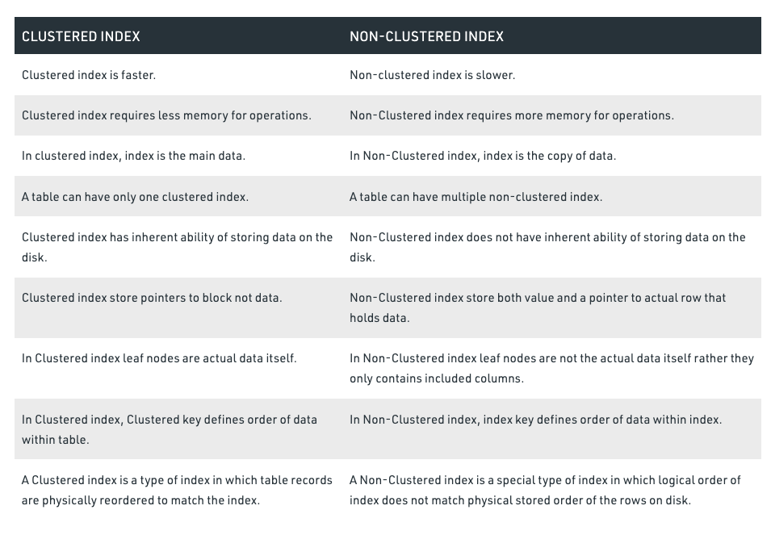

### Vertical Scaling vs Horizontal Scaling

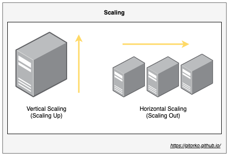

### Datacenter

### Loadbalancer Types

1. Software based
2. Hardware based

### Database Scaling

1. Read scaling - All writes goto one db node, which gets replicated to all read node db.
2. Write scaling - Sharding

### Caching

Caching though solves the problem of avoiding an expensive call, it does come with problems of its own like stale data, thundering herd etc.
In a distributed system a distributed cache (read-write) comes with problems of its own, dont look at cache as a silver bullet to all problems.

Different places to cache

1. Client side caching
2. Server side caching
3. Proxy/Gateway side caching

### Types of Cache

1. Spatial cache
2. Temporal cache
3. Distributed cache

### Cache Eviction Algorithms

1. LRU (Least Recently Used) - replaces element that has not been used for long time.
2. FIFO (First in First Out)
3. LFU (Least Frequently Used) - replaces least frequently used page.

### Caching Strategy

### Message Broadcast

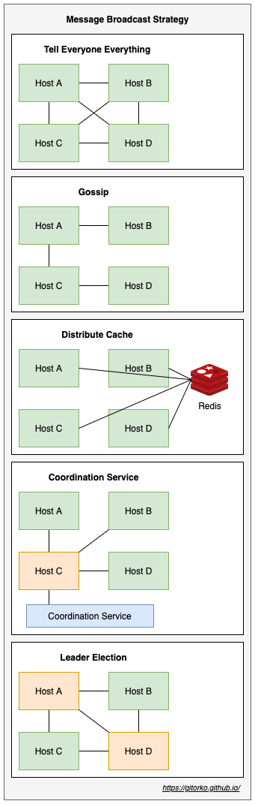

### Kafka

[https://youtu.be/Cie5v59mrTg](https://youtu.be/Cie5v59mrTg)

### Rabbit MQ

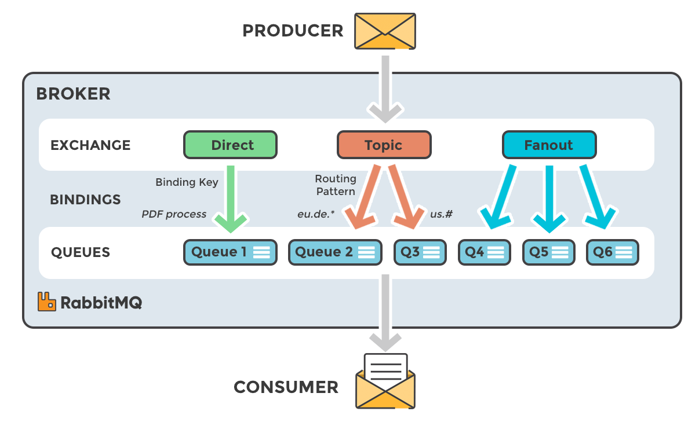

[https://youtu.be/O1PgqUqZKTA](https://youtu.be/O1PgqUqZKTA)

### Rabbit MQ vs Kafka

[https://www.upsolver.com/blog/kafka-versus-rabbitmq-architecture-performance-use-case](https://www.upsolver.com/blog/kafka-versus-rabbitmq-architecture-performance-use-case)

[https://tanzu.vmware.com/developer/blog/understanding-the-differences-between-rabbitmq-vs-kafka/](https://tanzu.vmware.com/developer/blog/understanding-the-differences-between-rabbitmq-vs-kafka/)

### Rabbit MQ Streams

[https://blog.rabbitmq.com/posts/2021/07/rabbitmq-streams-overview](https://blog.rabbitmq.com/posts/2021/07/rabbitmq-streams-overview)

### Long polling vs Short polling vs Websocket

[https://youtu.be/ZBM28ZPlin8](https://youtu.be/ZBM28ZPlin8)

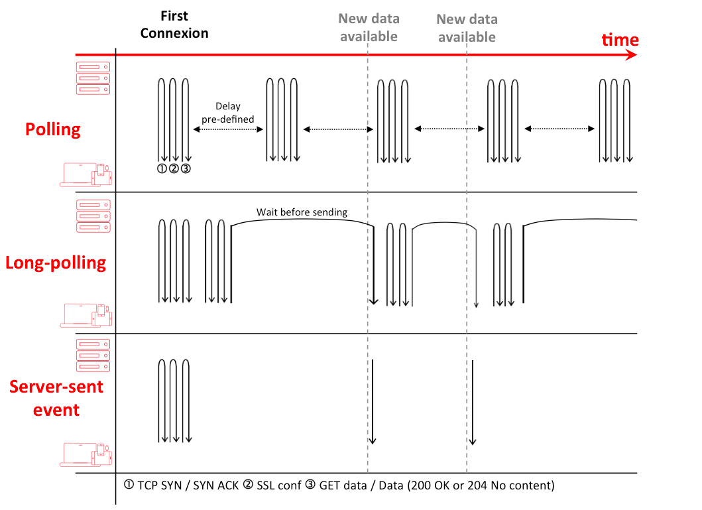

### JVM Memory & Garbage collectors

1. Minor GC
2. Major GC

### Proxy vs Reverse-Proxy

### Load Balancer

1. L3 - IP Based
2. L4 - DNS Based
3. L7 - Application Based

### NoSQL vs Relational DB

| NoSQL                                                          | RDBMS                                     |
|----------------------------------------------------------------|-------------------------------------------|
| Non-Relational DB                                              | Relational DB                             |
| No predefined schema, handles un-structured data               | Require a schema, handles structured data |
| Can scale across machines                                      | Cant scale across machines easily         |
| BASE Principle of eventual consistency                         | Honor ACID properties                     |
| Structure can be Key-Value pairs, Document, Graph, Wide column | Stricture is Table based                  |

### CQRS - Command and Query Responsibility Segregation

Pattern that separates read and update operations for a data store.
Implementing CQRS in your application can maximize its performance, scalability, and security

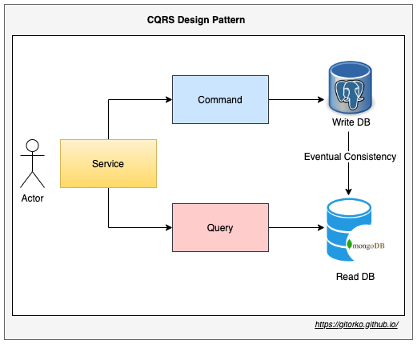

### HTTP1.1 & HTTP/2 Protocol

### HTTPS

Asymmetric encryption vs symmetric encryption

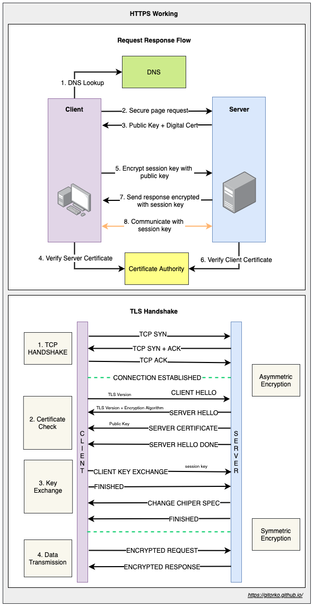

### Thundering Herd Problem

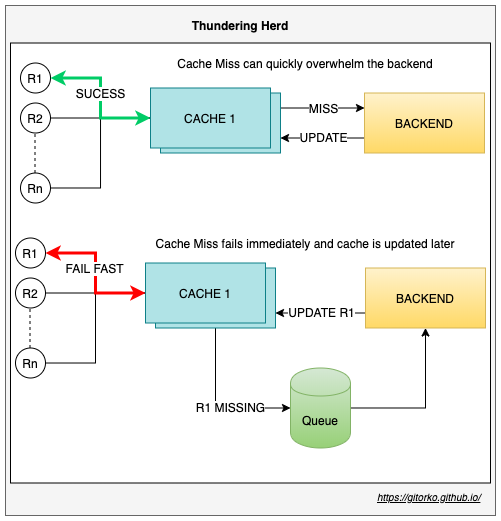

### Tsunami Traffic

1. Scaling up services takes time, Keep few services on standby if you anticipate heavy traffic.
2. Configure auto-scaling based on key parameters.
3. Scale on concurrent requests & not on CPU or memory usage.
4. Design for scale down models as well along with scale up.
5. Identify breaking point for each system.
6. Plan for service denial via circuit breakers for new customers instead system wide outage for all customers.

### Serverless / FAAS (Function As A Service)

1. Function is exposed as a service.
2. Cost optimal, pay for only what you use.

### Bloom filter

1. To determine 'Member of set'
2. No false negative but can give false positive
3. Less memory used
4. Probabilistic algorithm

### Comp_Min Sketch

1. Count frequency of events
2. Uses less memory
3. Probabilistic algorithm

### BitMap

1. Bit Array, Uses less memory
2. Each bit holds value
3. Using AND / OR operation can merge many bitmaps

### Contention

1. Avoid locks if you want to scale, as they cause contention around shared resources
2. Do pre-work instead of on-demand if it avoids contention. Eg: Issue 1 Billion tickets, instead of updating a row in DB with locks/syncronization, load a queue with all 1 Billion tickets and users can pick from queue.

### Paxos

1. Consensus over distribute system
2. Leader election

[https://youtu.be/WX4gjowx45E](https://youtu.be/WX4gjowx45E)

[https://youtu.be/s8JqcZtvnsM](https://youtu.be/s8JqcZtvnsM)

### CAP Theorem

[https://youtu.be/KmGy3sU6Xw8](https://youtu.be/KmGy3sU6Xw8)

### Distributed System

Things to consider while designing distributed system

1. Fault Tolerance & Retry - Always assume that things will fail and plan for it. Eg: Network failures, Disk failures
2. Circuit Breaker Pattern - Instead of throwing error page handle service down gracefully.
3. Service Discovery - All services register themselves.
4. Observability - System is actively monitored.
5. Fail-Over - Stand up server go live when primary servers dies.
6. Throughput - The number of requests the system can process.
7. Latency - Time taken to process the requests.
8. Rate Limit - Restrict overuse of services by single or many users.
9. Caching - Caching speeds up lookup however can bring in-consistency among caches.
10. Bulk head pattern - Failure in one system should not bring down the whole system.
11. Timeout - Ensure proper connection timeouts are set so that slow downstream service cant impact upstream service.
12. Fail-fast - Prefer to fail fast than deal with slow latency, as it can cascade the effect in upstream services.
13. Chaos Monkey - Randomly turn off systems to ensure system is fault tolerant.

### ACID

1. Atomicity - All changes to data are performed as if they are a single operation
2. Consistency - Data is in a consistent state when a transaction starts and when it ends.
3. Isolation - The intermediate state of a transaction is not visible to other transactions.
4. Durability - Data persisted survives even if system restarted.

### Partition vs Sharding

### Horizontal vs Vertical Partition

### Bulkhead pattern

[https://youtu.be/R2FT5edyKOg](https://youtu.be/R2FT5edyKOg)

### Consistent Hashing

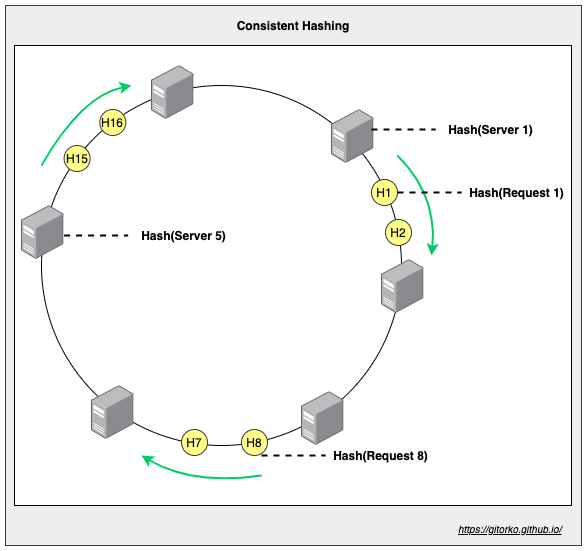

### Rate limit

1. Token Bucket - Burst - Fixed token are added to bucket, bucket is always kept in full state. Can lead to burst of traffic.
2. Token Bucket - Sustain - Constant token are added to bucket only if previous token are consumed. Smooth traffic.
3. Leaky Bucket - Bucket size if fixed, if bucket full request are rejected, a processor de-queue bucket at fixed rate.
4. Fixed Window - For the time period maintain a key,value pair. If counter is greater than rate limit reject. Leads to burst traffic around edges of time period.
5. Sliding Log - Go over all previous nodes upto the time interval, in the link list and check rate limit exceeded, if yes then reject.
6. Sliding Window Counter - Go over all previous nodes upto the time interval, in the link list and check if rate limit exceeded, if yes then reject. Instead of storing each request timestamp previous node stores the count.

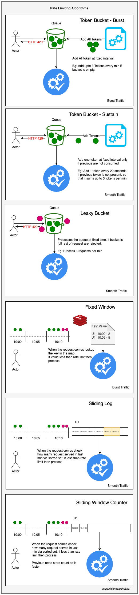

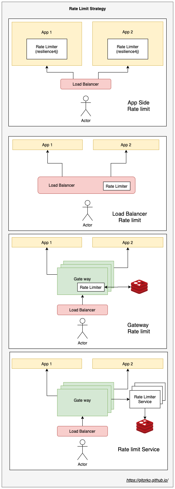

[https://youtu.be/9CIjoWPwAhU](https://youtu.be/9CIjoWPwAhU)

[https://youtu.be/FU4WlwfS3G0](https://youtu.be/FU4WlwfS3G0)

### Push vs Pull

1. RabbitMQ is push based, Kafka is pull based
2. Push is expensive & real-time
3. Pull is cheap but not real-time

### NIO

1. Non-Blocking IO helps systems scale with fewer resources.
2. The complete source to destination flow has to be non-blocking.

### Multi-Tenancy

1. Multiple customers share same resource but customer are not aware of each other and instances are isolated.
2. Kubernetes namespaces

### Authorization vs Authentication

1. Authentication - Is the user allowed to use the system?
2. Authorization - Does the user have the right role to execute that operation?

### Others

* Read vs write db, replication
* HDFS
* Zookeeper leader election quorum
* Chunking file
* CDN & Edge Servers
* Two phase (prepare & commit) & Three phase commit (prepare, pre-commit & commit)
* Kafka, consumer group
* NoSQL
* Gateway
* Proxy vs Reverse Proxy
* Distributed tracing - Zipkin
* Observability - wavefront, prometheus, nagios
* Leader follower
* Locking
* TTL
* HTTPS, TLS Internal
* Map Reduce
* CAS - compare and swap
* Client side load balancing
* Canary vs Rolling vs Blue Green deployment
* GitOps
* Telemetry
* Pub Sub vs Queue
* Dirty Read vs Non-Repeatable Read vs Phantom Read
* FAAS
* Service Mesh
* Block chain - distributed ledger
* Indexing - Btree, B+tree, BitMap
* Concurrent HashMap Internals
* DDOS attack
* Race conditions
* Sticky Session
* Disaster recovery
* Auto scaling
* Batch vs Stream data processing vs Micro Batch
* RabbitMQ - fanout, direct, topic, header, default
* Star vs Snow flake schema
* Inverted indexing
* Time Series Database
* Hyperlog

## Scenarios

### Design a shopping application where users can browse products and buy them.

* If the products are rendered on a web page for each request, then the system won't scale.
* Browsing products is more frequent than buying something.
* Generate a static website and upload to CDN, only the buy rest api calls hit the backend server.
* Home pages or landing pages which are frequently hit perform better if they are static sites and on the CDN.
* Even for user tailored home pages like Netflix, Hotstar etc, generate static sites per user and avoid actual backend calls as much as possible.

{}
If you can design a system where the calls never have to hit your backend service it improves the design. Eg: CDN, Edge Server, Cache etc.
Look at client side caching as well if it means avoiding that backend call.
{}

### Design a URL shortener service

* If you generate a short url with UUID there can be collision if the key is same. More **collisions** more time is spent in returning a response degrading your service. The system will not scale.
* If the pre-created short url are stored in a RDBMS database there is contention at the db when all the threads ask for the next free key.
* Ensure that pre-created short url are not sequential so that someone should not guess what the next key can be simply by incrementing one character.

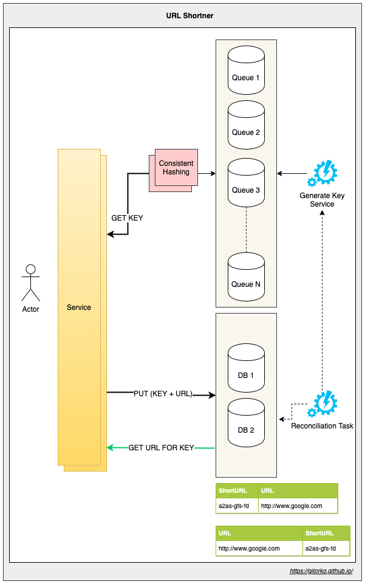

* Given a key find the URL - We will use and RDMBS database for this. RDBMS handles the fetch very well and scales well. We dont use a NO-SQL db as we want consistency (CAP).
* We will use 2 table, first one where primary key is the short url and value is the actual url. The second table where primary key is the actual url and the value is the short url.
* A Generate key service will populate the queue with the existing short-url generated. Generate key service will ensure that duplicate keys are not loaded by generating short urls in range eg: A-F, G-N ranges.
* A consistent hashing service will handle the situation where we add more queues to the group.
* The put operation first fetches a key from the queue, since there are multiple queues there is no contention to get a new key. It then writes the key & value to the RDBMS.
* If there is heavy writes at RDBMS then sharding can be done. The service needs to be aware of the shards to write to and read from.
* Nodes go down often, so if the queues die then there can be unused keys that are forever lost. We use a reconciliation task that runs nightly to recover any lost keys.

{}
Avoid collisions, on a new environment there will be less collisions but as your data grows collisions will increase. 
{}

{}
Avoid contention for resources, contentions grow exponentially as system scales. The simple act of asking the DB for the next free record among a set, incrementing a particular row value are examples where contention can occur.
{}

{}
Don't hesitate to recommend RDBMS for high scale systems. Given a key find the record, RDBMS does this job very well. Remember Youtube uses RDBMS.
{}

### Design a like button service

* A single counter that needs to be updated by many threads always creates contention.
* Addition to counter needs to be atomic making it difficult to scale.

### Design a Build Management service

## References

[https://github.com/resumejob/system-design-algorithms](https://github.com/resumejob/system-design-algorithms)

