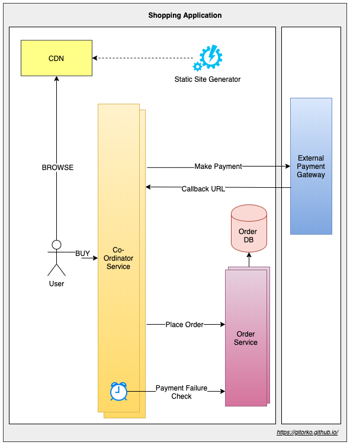
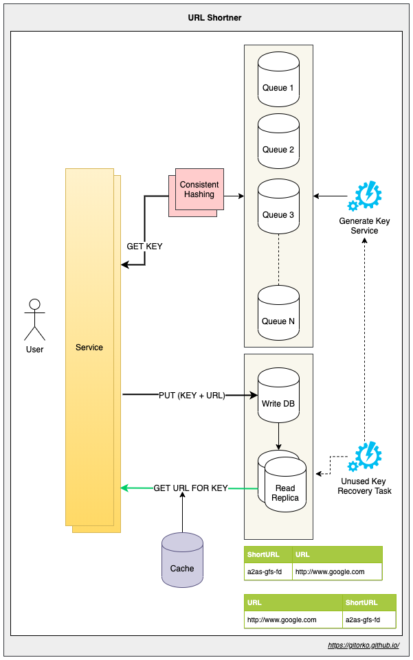

## System Design

We will understand the fundamentals of system design and look at real world implementations 

System design interview discussions are of two types

## Wide design (HLD - High Level Design)

Wide design/HLD often is very open ended and broad without any specifics.  

Eg: Design Food Delivery App, Design Uber, Design Twitter.

You often end up explaining various components, class diagrams, sequence diagrams etc. 
There is literally no end to the amount of components/class diagrams/use case you can create as long as you can keep pulling a :rabbit: (idea) out of your :tophat: (head).
If the candidate is asked to design `management system for a particle accelerator` there will be no :rabbit: in their :tophat:, hence these discussions dont add value for a technical system design. They are more suited if the position is that of a Product Manager.
What often happens is discussions start at a high level and then narrow down into a particular feature within the design.

## Deep design (LLD - Low Level Design)

Deep design/LLD often starts with a specific module with a clear outcome that is expected, and provides you more details about the problem statement and the expected output.

Eg: Design a build system that builds the artifact when code is submitted, design a tiny url service etc.

You start by understanding the problem statement

### 1. Functional requirements

* What is the start & end result/state?
* Is this is a **live** service or a **background** service?
* Does this need stream processing or batch processing?
* How **many users**?
* Does the data need to be **persisted**?
* Does the data need to be **consistent** or can it be eventually consistent?
* Does the service need external **API** 

### 2. Non-Functional requirements

* What is the **latency** expected?
* What is **load** the system needs to handle and **scale** requirements?
* What **observability** & **monitoring** is needed by the system?
* What is the uptime & **availability** SLA?
* What **security** aspects need to be addressed?
* Does it need auditing?

### 3. Capacity planning

* How many servers would you need?
* How much storage is required?
* What bandwidth is required?
* Do you need GPU specific processors or CPU specific processors?
* What time of the day do you need the servers?

## Fundamentals

### Short-Polling vs Long-Polling vs SSE (Server Sent Events) vs Websocket vs HTTP/2

| Websocket                 | Http/2                   | Server Send Event        | Long-Poll                  |
|---------------------------|--------------------------|--------------------------|----------------------------|
| Full-duplex               | Half-duplex              | Half-duplex              | Half-duplex                |
| Bidirectional             | Unidirectional           | Unidirectional           | Unidirectional             |
| Text + Binary             | Text + Binary            | Text                     | Text + Binary              |
| 1024 parallel connections | 6-8 parallel connections | 6-8 parallel connections | Based on threads available |

### Fork Join

1. Fork/Join framework uses work-stealing algorithm.
2. Work stealing is a scheduling strategy where worker threads that have finished their own tasks can steal pending tasks from other threads.

### Distributed Transaction & Saga

The best thing to do is completely avoid distributed transactions. As it makes the system complex to manage. However, if that is not possible.

1. Two phase (prepare & commit) 
2. Three phase commit (prepare, pre-commit & commit)

[https://youtu.be/jGJT1FRYGcY](https://youtu.be/jGJT1FRYGcY)

[https://youtu.be/S4FnmSeRpAY](https://youtu.be/S4FnmSeRpAY)

### Isolation Levels

| ISOLATION-LEVEL   | DIRTY-READ | NON-REPEATABLE-READ | PHANTOM-READ |
|-------------------|------------|---------------------|--------------|
| READ_UNCOMMITED   | YES        | YES                 | YES          |
| READ_COMMITED     | NO         | YES                 | YES          |
| READ_REPEATABLE   | NO         | NO                  | YES          |
| READ_SERIALIZABLE | NO         | NO                  | NO           |

### Indexing

[https://youtu.be/-qNSXK7s7_w](https://youtu.be/-qNSXK7s7_w)

### Vertical Scaling vs Horizontal Scaling

### Datacenter

### Loadbalancer Types

1. Software based
2. Hardware based

### Database Scaling

1. Read scaling - All writes goto one db node, which gets replicated to all read node db.
2. Write scaling - Sharding

### Caching

Caching improves performance your application, reduces latency, reduces load on the DB, reduces network cost, increases read throughput. 
However, it does come with cost/problems of its own like cache invalidation, stale data, high churn if TTL is set wrong, thundering herd etc.
In a distributed system a distributed cache (read-write) comes with problems of its own like consistency, node affinity etc. 
Hence don't look at cache as a silver bullet to solve all problems.

Different places to cache

1. Client side caching - When the client or browser can cache some data to avoid the external call.
2. Server side caching - Each server can cache some data locally.
3. Global/Distributed caching - A centralized server/service to cache data.
4. Proxy/Gateway side caching - Proxy or gateway servers cache some data so the request can be returned immediately without reachout to backend.

### Types of Cache

1. Spatial cache
2. Temporal cache
3. Distributed cache

### Cache Store

1. On-Heap Store - stores cache entries in Java heap memory
2. Off-Heap Store -  primary memory (RAM) to store cache entries, cache entries will be moved to the on-heap memory automatically before they can be used.
3. Disk Store - uses a hard disk to store cache entries. SSD type disk would perform better.
4. Clustered Store - stores cache entries on the remote server

### Cache Eviction Policies

1. FIFO (First In First Out) - replaces first element that was added to the cache.
2. LIFO (Last In First Out) - replaces the last element that was added to the cache.
3. LRU (Least Recently Used) - replaces element that has not been used for long time.
4. MRU (Most Recently Used)- replaces most recently used elements.
5. LFU (Least Frequently Used) - replaces least frequently used elements based on count.
6. RR (Random Replacement) - replaces elements randomly.

### Caching Strategy

1. Read-Cache-aside - Application queries the cache. If the data is found, it returns the data directly. If not it fetches the data from the SoR, stores it into the cache, and then returns.
2. Read-Through - Application queries the cache, cache service queries the SoR if not present and updates the cache and returns.
3. Write-Around - Application writes to db and to the cache.
4. Write-Behind / Write-Back - Application writes to cache. Cache is pushed to SoR after some delay periodically.
5. Write-through - Application writes to cache, cache service immediately writes to SoR.

### High Availability Deployment

1. Active-Active - Two nodes of the service running in parallel, loadbalancer will route traffic to both.
2. Active-Passive - The primary and secondary service running in parallel, with primary serving all the requests. If primary fails loadbalancer will route traffic to secondary and designate it as primary.

### CDN & Edge Servers

Content Delivery Network (CDN) reduce latency by keeping static content closer to the customer regions.
Always remember to version your static content like css, images etc to help CDN differentiate between versions.

1. Push CDN - Developer pushes the static content to CDN
2. Pull CDN - First request pulls the static content to the CDN

Edge Servers run compute operations closer to the customer region, eg: Streaming, Gaming etc. 

### Message Broadcast

### Kafka

[https://youtu.be/Cie5v59mrTg](https://youtu.be/Cie5v59mrTg)

### Rabbit MQ

[https://youtu.be/O1PgqUqZKTA](https://youtu.be/O1PgqUqZKTA)

### Rabbit MQ vs Kafka

[https://www.upsolver.com/blog/kafka-versus-rabbitmq-architecture-performance-use-case](https://www.upsolver.com/blog/kafka-versus-rabbitmq-architecture-performance-use-case)

[https://tanzu.vmware.com/developer/blog/understanding-the-differences-between-rabbitmq-vs-kafka/](https://tanzu.vmware.com/developer/blog/understanding-the-differences-between-rabbitmq-vs-kafka/)

### Rabbit MQ Streams

[https://blog.rabbitmq.com/posts/2021/07/rabbitmq-streams-overview](https://blog.rabbitmq.com/posts/2021/07/rabbitmq-streams-overview)

### Long polling vs Short polling vs Websocket

[https://youtu.be/ZBM28ZPlin8](https://youtu.be/ZBM28ZPlin8)

### JVM Memory & Garbage collectors

1. Minor GC
2. Major GC

### Proxy vs Reverse-Proxy

### Load Balancer

Load balancer distributes traffic across multiple nodes ensuring high availability. 
Always create health check url that can determine if node is healthy or not, based on this the load balancer decides if the node is up or down.

1. L3 - IP Based
2. L4 - DNS Based
3. L7 - Application Based

Sticky sessions - Will assign the same user request to the same node in order to maintain the session state on the node. 
Ideally sticky session should be avoided, if the node goes down few users will experience outage. However in some cases sticky session will be easy to configure and setup.

### Load Balancer Routing Algorithms

1. Round-robin - traffic distributed in round-robin fashion.
2. Weighted Round-robin - traffic distributed by weight, some servers may be able to process more load hence their weight is more compared to smaller configuration machines.
3. Least Connections - traffic is sent to server with the fewest current connections to clients.
4. Least Response Time - traffic is sent to server with the fastest response time.
5. Least Bandwidth -  traffic is sent to server with the least Mbps of traffic.
6. Hashing - traffic is sent to server based on a hash key. eg: client IP address hash, request URL hash.

### NoSQL vs Relational DB

| NoSQL                                                          | RDBMS                                     |
|----------------------------------------------------------------|-------------------------------------------|
| Non-Relational DB                                              | Relational DB                             |
| No predefined schema, handles un-structured data               | Require a schema, handles structured data |
| Can scale across machines                                      | Cant scale across machines easily         |
| BASE Principle of eventual consistency                         | Honor ACID properties                     |
| Structure can be Key-Value pairs, Document, Graph, Wide column | Stricture is Table based                  |

### CQRS - Command and Query Responsibility Segregation

Pattern that separates read and update operations for a data store.
Implementing CQRS in your application can maximize its performance, scalability, and security

### HTTP1 vs HTTP1.1 vs HTTP2 vs HTTP3 Protocol

1. HTTP1 - one tcp connection per request
2. HTTP1.1 - one tcp connection per request, keep alive connection so connection is not closed immediately.
3. HTTP2 - one tcp connection for all requests. Multiplex all requests on one TCP. Server Push where the server proactively pushes css,js all on one TCP when the server requests the html file.
4. HTTP3 - Uses QUIC protocol (based on UDP). Eg: Mobile that is changing cell towers, UDP continues to stream data without a new TCP handshake with the new tower.

[https://youtu.be/a-sBfyiXysI](https://youtu.be/a-sBfyiXysI)

### HTTPS

Asymmetric encryption vs symmetric encryption

### Thundering Herd Problem

### Tsunami Traffic

1. Scaling up services takes time, Keep few services on standby if you anticipate heavy traffic.
2. Configure auto-scaling based on key parameters.
3. Scale on concurrent requests & not on CPU or memory usage.
4. Design for scale down models as well along with scale up.
5. Identify breaking point for each system.
6. Plan for service denial via circuit breakers for new customers instead system wide outage for all customers.

### Serverless / FAAS (Function As A Service)

1. Function is exposed as a service.
2. Cost optimal, pay for only what you use.

### Bloom filter

1. To determine 'Member of set'
2. No false negative but can give false positive
3. Less memory used
4. Probabilistic algorithm

### Comp_Min Sketch

1. Count frequency of events
2. Uses less memory
3. Probabilistic algorithm

### BitMap

1. Bit Array, Uses less memory
2. Each bit holds value
3. Using AND / OR operation can merge many bitmaps

### Contention

1. Avoid locks if you want to scale, as they cause contention around shared resources
2. Do pre-work instead of on-demand if it avoids contention. Eg: Issue 1 Billion tickets, instead of updating a row in DB with locks/syncronization, load a queue with all 1 Billion tickets and users can pick from queue.

### Paxos

1. Consensus over distribute system
2. Leader election

[https://youtu.be/WX4gjowx45E](https://youtu.be/WX4gjowx45E)

[https://youtu.be/s8JqcZtvnsM](https://youtu.be/s8JqcZtvnsM)

### CAP Theorem

[https://youtu.be/KmGy3sU6Xw8](https://youtu.be/KmGy3sU6Xw8)

### Distributed System

Things to consider while designing distributed system

1. Fault Tolerance & Retry - Always assume that things will fail and plan for it. Eg: Network failures, Disk failures
2. Circuit Breaker Pattern - Instead of throwing error page handle service down gracefully.
3. Service Discovery - All services register themselves.
4. Observability - System is actively monitored.
5. Fail-Over - Stand up server go live when primary servers dies.
6. Throughput - The number of requests the system can process.
7. Latency - Time taken to process the requests.
8. Rate Limit - Restrict overuse of services by single or many users.
9. Caching - Caching speeds up lookup however can bring in-consistency among caches.
10. Bulk head pattern - Failure in one system should not bring down the whole system.
11. Timeout - Ensure proper connection timeouts are set so that slow downstream service cant impact upstream service.
12. Fail-fast - Prefer to fail fast than deal with slow latency, as it can cascade the effect in upstream services.
13. Chaos Monkey - Randomly turn off systems to ensure system is fault tolerant.

### ACID

1. Atomicity - All changes to data are performed as if they are a single operation
2. Consistency - Data is in a consistent state when a transaction starts and when it ends.
3. Isolation - The intermediate state of a transaction is not visible to other transactions.
4. Durability - Data persisted survives even if system restarted.

### Partition vs Sharding

### Horizontal vs Vertical Partition

### Bulkhead pattern

[https://youtu.be/R2FT5edyKOg](https://youtu.be/R2FT5edyKOg)

### Consistent Hashing

Nodes keep dying in a distributed system. To scale new nodes can be added as well. Consistent hashing lets you distribute traffic among the nodes uniformly.

Why not use round robin to distribute traffic?
Services often cache some data, so it makes for a better design if the same client request is sent to the server which has all the data already cached. If you send the same client request randomly to random servers each time then cache is not utilized.

Consistent hashing also prevents DOS attacks to some extent. If a spam client send random requests and round robin distributes it across all nodes then the outage is large scale. However with consitent hashing only certain node will be impacted.

Eg: if there are 60K user requests and there are 6 servers each server can distribute and handle 10K. Do note that if one node goes down then all the requests flood the next node causing it to go down thus causing a full outage. Hence always consider buffers or active-active standby servers.

### Rate limit

1. Token Bucket - Burst - Fixed token are added to bucket, bucket is always kept in full state. Can lead to burst of traffic.
2. Token Bucket - Sustain - Constant token are added to bucket only if previous token are consumed. Smooth traffic.
3. Leaky Bucket - Bucket size if fixed, if bucket full request are rejected, a processor de-queue bucket at fixed rate.
4. Fixed Window - For the time period maintain a key,value pair. If counter is greater than rate limit reject. Leads to burst traffic around edges of time period.
5. Sliding Log - Go over all previous nodes upto the time interval, in the link list and check rate limit exceeded, if yes then reject.
6. Sliding Window Counter - Go over all previous nodes upto the time interval, in the link list and check if rate limit exceeded, if yes then reject. Instead of storing each request timestamp previous node stores the count.

[https://youtu.be/9CIjoWPwAhU](https://youtu.be/9CIjoWPwAhU)

[https://youtu.be/FU4WlwfS3G0](https://youtu.be/FU4WlwfS3G0)

### Push vs Pull

1. RabbitMQ is push based, Kafka is pull based
2. Push is expensive & real-time
3. Pull is cheap but not real-time

### NIO

1. Non-Blocking IO helps systems scale with fewer resources.
2. The complete source to destination flow has to be non-blocking.

### Multi-Tenancy

1. Multiple customers share same resource but customer are not aware of each other and instances are isolated.
2. Kubernetes namespaces

### Authorization vs Authentication

1. Authentication - Is the user allowed to use the system?
2. Authorization - Does the user have the right role to execute that operation?

### Others

* Read vs write db, replication
* HDFS
* Zookeeper leader election quorum
* Chunking file
* Kafka, consumer group
* NoSQL
* Gateway
* Proxy vs Reverse Proxy
* Distributed tracing - Zipkin
* Observability - wavefront, prometheus, nagios
* Leader follower
* Locking
* TTL
* HTTPS, TLS Internal
* Map Reduce
* CAS - compare and swap
* Client side load balancing
* Canary vs Rolling vs Blue Green deployment
* GitOps
* Telemetry
* Pub Sub vs Queue
* Dirty Read vs Non-Repeatable Read vs Phantom Read
* FAAS
* Service Mesh
* Block chain - distributed ledger
* Indexing - Btree, B+tree, BitMap
* Concurrent HashMap Internals
* DDOS attack
* Race conditions
* Sticky Session
* Disaster recovery
* Auto scaling
* Batch vs Stream data processing vs Micro Batch
* RabbitMQ - fanout, direct, topic, header, default
* Star vs Snow flake schema
* Inverted indexing
* Time Series Database
* Hyperlog

## Scenarios

### 1. Design a shopping application where users can browse products and buy them.

* If the products are rendered on a web page for each request, then the system won't scale.
* Browsing products is more frequent than buying something.
* Generate a static website and upload to CDN, only the buy rest api calls hit the backend server.
* Home pages or landing pages which are frequently hit perform better if they are static sites and on the CDN.
* Even for user tailored home pages like Netflix, Hotstar etc, generate static sites per user and avoid actual backend calls as much as possible.

{}
If you can design a system where the calls never have to hit your backend service it improves the design. Eg: CDN, Edge Server, Cache etc.
Look at client side caching as well if it means avoiding that backend call.
{}

### 2. Design a URL shortener service (Tiny URL)

Users will provide a long url, your service needs to return a short url. If the users give you the same short url you need to return the actual url.

* If you generate a short url with UUID there can be collision if the key is same. More **collisions** more time is spent in returning a response degrading your service. The system will not scale.
* If the pre-created short url are stored in a RDBMS database there is contention at the db when all the threads ask for the next free key.
* Ensure that pre-created short url are not sequential so that someone should not guess what the next key can be simply by incrementing one character.

* Given a key find the URL - We will use and RDMBS database for this. RDBMS handles the fetch very well and scales well. We dont use a NO-SQL db as we want consistency (CAP).
* We will use 2 table, first one where primary key is the short url and value is the actual url. The second table where primary key is the actual url and the value is the short url.
* A Generate key service will populate the queue with the existing short-url generated. Generate key service will ensure that duplicate keys are not loaded by generating short urls in range eg: A-F, G-N ranges.
* A consistent hashing service will handle the situation where we add more queues to the group.
* The queue represented here is redis poll queue and not a listener based or a pub-sub queue.
* The put operation first fetches a key from the queue, since there are multiple queues there is no contention to get a new key. It then writes the key & value to the RDBMS.
* If there is heavy writes at RDBMS then sharding can be done. The service needs to be aware of the shards to write to and read from.
* Nodes go down often, so if the queues die then there can be unused keys that are forever lost. We use a reconciliation task that runs nightly to recover any lost keys.
* The service doesn't need to be aware of ranges hence we dont need any Zookeeper or consensus manager. If the short url has to be generated on fly then you can use DB to know the ranges each nodes is handling, overhead of zookeeper doesn't justify the benefits.
* You can use a LRU cache to improve the get responses. Use one of the Caching Strategy discussed above.

{}
Avoid collisions, on a new environment there will be less collisions but as your data grows collisions will increase. 
{}

{}
Avoid contention for resources, contentions grow exponentially as system scales. The simple act of asking the DB for the next free record among a set, incrementing a particular row value are examples where contention can occur.
{}

{}
Don't hesitate to recommend RDBMS for high scale systems. Given a key find the record, RDBMS does this job very well. Remember Youtube uses RDBMS.
{}

### 3. Design a Youtube / Facebook like counter service

Users can like a post/video and submit their likes, the service needs to count how many likes a post/video has.

* A single counter that needs to be updated by many threads always creates contention.
* Addition operation needs to be atomic making it difficult to scale.
* If you treat the counter as a row in the DB and use optimistic locking with retry logic to increment with exponential backoff you avoid locking the resource but there are multiple attempts to update the counter which causes scale issues. Hence DB is out of picture.
* You can read more about 'Dynamic Striping' & Long Adder & Long Accumulator to get an idea how java does addition operation on scale. However this is restricted to a single instance.
* If you consider each like counter as a new row you avoid contention of an update but more time is spent in summing up the total by counting all rows.

* Redis provides **atomic** operations of increment. We dont want to keep a single video like counter on one node as it can overload it if there are more likes for that video compared to others.
* By using **Round Robin** we can scale our service as by adding more redis nodes.
* We use a **Pub-Sub** event model to let the count aggregator service to sum the counts across all redis nodes and save that to a DB.
* The get count will always read the DB for latest count. There will be a slight delay from the time we submit the like till we see the count, however this is **eventual consistency**.
* The event queue payload can carry information about nodes that got updated, this way the aggregator service need not iterate over all redis nodes.

{}
Avoid updating DB rows in most cases, updates don't scale. Always prefer using inserts over updates.
{}

{}
To prevent race conditions optimistic or pessimistic locking need to be used and they dont scale. Use redis for atomic increment & decrement as they guarantee atomicity.
{}

### 4. Design an Advertisement Impression Service tied to a budget

For a give budget, ads of a particular type are served. Once the budget is exhausted the ads should not be served. 
For the type shoes, Nike has a budget of 1000$ and Adidas has a budget of 500$. When a website wants to display an ad it calls your service which randomly returns an ad, ensuring that the budget is not exceeded.
If each ad impression costs 1$ then you can do 1000 Ad impressions of Nike and 500 impression of Adidas.

* It looks similar to the like counter service, where we can (atomic) decrement the budget based on the number of Ads being served. An incoming request randomly picks an Ad and decrements the budget for that Ad till it reaches 0. However such a design will still run into contention when scaled.
* The contention occurs when we want to decrement the budget, since we cant distribute the budget value across multiple nodes, the decrement operation still needs to happen on one node and in atomic fashion.
* Assume there is only 1 Nike brand with a budget of 1M. Now when there is huge load since there is only 1 brand and the budget needs to be decremented as an atomic operation, even though redis can do atomic decrement operations, it will still slow down the system since all the threads are waiting to decrement the single budget entity.

* A token seeder pre-populates dedicated queues with a single token. Based on the budget, an equal number of tokens are populated. Nike Queue will have 1000 token, Adidas Queue will have 500 tokens.
* When the request comes in for a shoe type Ad. A random queue is picked and a token dequeued. Based on that token the associated ad is served. 
* Once the Queue is out of tokens no Ads are served for that brand.
* The Ad fetcher service needs to be aware of which queue to deque, it needs to be aware of how many queues are associated with the given brand.
* If a queue goes down the token seeder can identify and recreate a new queue based on the transactional log that is held by each service to identify how many tokens were already served.
* If there is a new brand that wants to join, just create the tokens and seed a queue and add it to the group. The next round-robin should pick it up.

{}
Instead of incrementing/decrementing a counter, check if it's possible to create tokens ahead of time. With a bunch of tokens in a queue/bucket it's easier to scale than trying to update a single counter in atomic fashion.
{}

### 4. Design a Build Management service

## Youtube Channels

[ByteByteGo](https://www.youtube.com/c/ByteByteGo)

[Hussein Nasser](https://www.youtube.com/c/HusseinNasser-software-engineering)

## References

[https://github.com/resumejob/system-design-algorithms](https://github.com/resumejob/system-design-algorithms)

