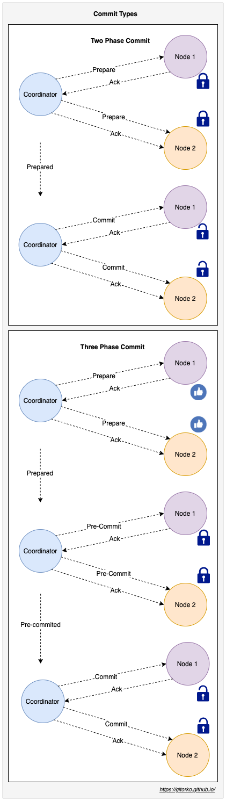
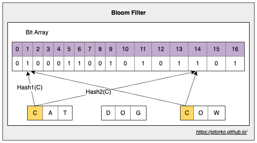
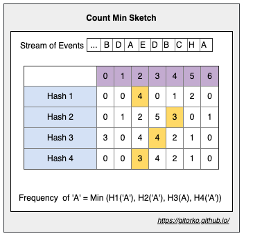
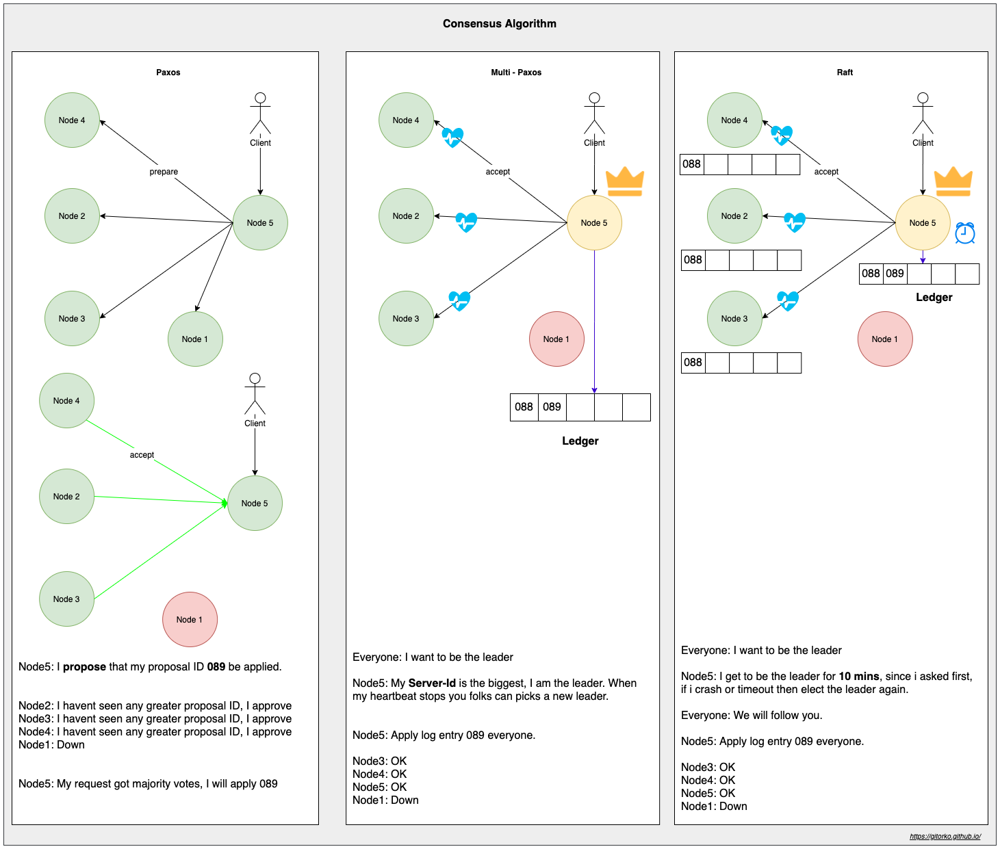
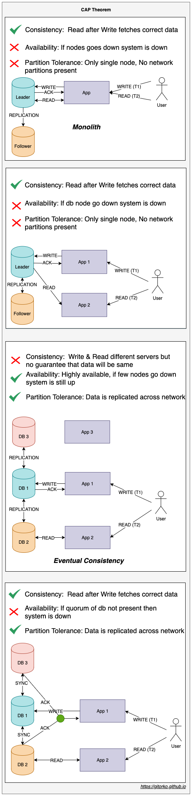
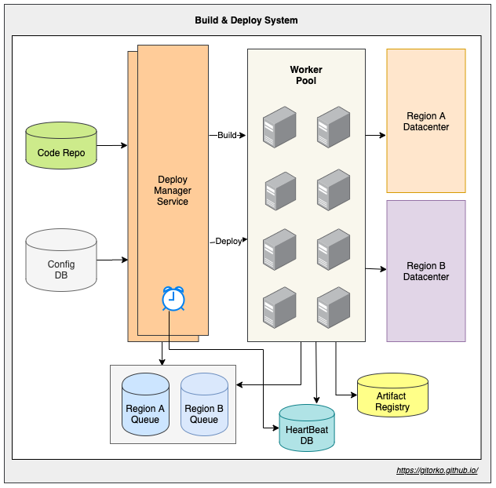

## System Design

We start with requirement gathering

### 1. Functional requirements

* What is the start & end result/state?
* Is this is a **live** service or a **background** service?
* Does this need stream processing or batch processing?
* How **many users**?
* Does the data need to be **persisted**?
* Does the data need to be **consistent**?
* Does the service need external **API**?
* Does the service need role based **authentication/authorization**?

### 2. Non-Functional requirements

* What is the **latency** expected?
* What is the **fault tolerance** criteria?
* What is **load** the system needs to handle and **scale** requirements?
* What **observability** & **monitoring** is needed by the system?
* What is the **uptime** & **availability** SLA?
* What **security** aspects need to be addressed?
* Does it need **auditing** & **reporting**?

### 3. Capacity planning

* How many servers would you need?
* How many users (load) are going to access the service?
* How much storage is required?
* What network bandwidth is required?
* What latency can be tolerated?
* Do you need GPU specific processors or CPU specific processors?
* What time of the day do you need the servers?
* What is the budget and expenses related to the servers?

Back Of Envelope estimation

**Load Estimation** 

How many requests per second need to be handled?

| Type                           | Count | Description         |
|:-------------------------------|:------|:--------------------|
| Average users per day          | 10^6  | 1 million           |
| Average requests per user      | 10    |                     |
| Average total requests per day | 10^7  | 10 million requests |
| Average total requests per sec | 100   |                     |

**Storage Estimation**

How much storage is needed for 5 year?

| Type                                   | Count   | Description         |
|:---------------------------------------|:--------|:--------------------|
| Average Total requests per day         | 10^7    | 10 million requests |
| Average size of request per user       | 2 MB    |                     |
| Average size of request per day        | 20^7 MB | 20 TB               |
| Average size of request for 5 year day | 36 PB   |                     |

**Bandwidth Estimation**

How much network bandwidth is needed?

| Type                             | Count      | Description |
|:---------------------------------|:-----------|:------------|
| Average size of request per day  | 20^7 MB    | 20 TB       |
| Average size of request per sec  | 230 MB/Sec |             |

**Latency Estimation**

What latency is acceptable?

| Type               | Count  | Description                   |
|:-------------------|:-------|:------------------------------|
| Sequential Latency | 100 ms | Sum of latency of all sources |
| Parallel Latency   | 75 ms  | Max of latency of all sources |

**Resource Estimation**

How many CPU core/servers are needed?

| Type                                    | Count       | Description |
|:----------------------------------------|:------------|:------------|
| Average total requests per sec          | 100 req/sec |             |
| Average cpu processing time per request | 100 ms/req  |             |
| Average cpu processing time per sec     | 10^6 ms/sec |             |
| Average 1 cpu core processing per sec   | 10^5 ms/sec |             |
| Average number of cpu core              | 10          |             |

## High Level Design (HLD)

High Level Design (HLD) often is very open-ended and broad. It's a 30,000 foot view of the system that covers what the
various components of the systems and how they interact with each other.
The objective here is to come up with various sub-systems and modules and identify how they will interact with each
other.
Eg: Design Food Delivery App, Design Uber, Design Twitter.

1. Component diagrams
2. Sequence diagrams
3. Use-cases
4. API Interaction

## Low Level Design (LLD)

Low Level Design (LLD) involves picking a specific module/sub-system from the HLD and doing a deep dive into its
implementations. The problem statement is more detailed and outcome is clear.
Eg: Design the order acceptance system for food delivery app that can cater to 7-10K requests per hour.

1. Entity Relationship diagrams
2. Decision tree/Flow chart
3. Class diagrams
4. Swim-lane diagrams

## Fundamentals

### 1. Short-Polling vs Long-Polling vs SSE (Server Sent Events) vs Websocket

1. Short-Polling - Client continuously asks the server for new data.
2. Long-Polling - Client continuously asks the server for new data, but server waits for a few seconds and if data
   becomes available by then it will return the data.
3. Websocket - HTTP connection is upgraded to bidirectional connection.
4. Server Sent Events - HTTP connection is kept open by the server and data is pushed to client continuously over it.


|                        | Websocket                        | Server Sent Event          | Long-Poll                  |
|:-----------------------|:---------------------------------|:---------------------------|:---------------------------|
| **Type Of Channel**    | Full-duplex,Bidirectional        | Half-duplex,Unidirectional | Half-duplex,Unidirectional |
| **Type of Client**     | Server Push & Client Send        | Server Push                | Client Pull                |
| **Type of Data**       | Text + Binary                    | Text                       | Text + Binary              |
| **Connection Limit**   | 65,536 (max number of TCP ports) | 6-8 parallel per domain    | Based on threads available |

[https://youtu.be/ZBM28ZPlin8](https://youtu.be/ZBM28ZPlin8)

### 2. Fork Join Pool

Fork Join is suited for tasks that create sub-tasks. Fork/Join framework uses work-stealing algorithm.
Work stealing is a scheduling strategy where worker threads that have finished their own tasks can steal pending tasks
from other threads.
Uses a deque (double ended queue), main thread picks task from the front of the queue, other threads steal tasks from
the back of the queue.


```java

@RequiredArgsConstructor
class FibForkJoin extends RecursiveTask<Integer> {
    final int n;

    @Override
    protected Integer compute() {
        System.out.println("Current Thread: " + Thread.currentThread().getName() + " n = " + n);
        if (n <= 1) {
            return n;
        }
        FibForkJoin f1 = new FibForkJoin(n - 1);
        f1.fork();
        FibForkJoin f2 = new FibForkJoin(n - 2);
        f2.fork();
        return f1.join() + f2.join();
    }
}
```

[https://youtu.be/5wgZYyvIVJk](https://youtu.be/5wgZYyvIVJk)

### 3. Distributed Transaction

The best thing to do is completely avoid distributed transactions. As it makes the system complex to manage. However, if
that is not possible.

1. Two phase (prepare & commit) - Blocking protocol as it waits for the prepare-ack for prepare phase.
2. Three phase commit (prepare, pre-commit & commit) - Non-Blocking protocol as first phase gathers votes and only the
   second phase blocks with timeout.
3. Saga - A sequence of transactions that updates each service and publishes a message or event to trigger the next transaction step.



[https://youtu.be/jGJT1FRYGcY](https://youtu.be/jGJT1FRYGcY)

[https://youtu.be/S4FnmSeRpAY](https://youtu.be/S4FnmSeRpAY)

### 4. Saga Pattern

A sequence of transactions that updates each service and publishes a message or event to trigger the next transaction step.
Each local transaction updates the database and publishes a message/event to trigger the next local transaction in another service.
If a local transaction fails then the saga executes a series of compensating transactions that undo the changes that were made by the preceding transactions.

The 2 approaches

1. Choreography - Each local transaction publishes domain events that trigger local transactions in other services.
2. Orchestration - An orchestrator tells the participants what local transactions to execute.

Problems with saga

1. Hard to debug & test.
2. Risk of cyclic dependency between saga participants.

### 5. Isolation Levels

Data Consistency 

1. Dirty reads: read UNCOMMITED data from another transaction.
2. Non-repeatable reads: read COMMITTED data from an UPDATE query from another transaction.
3. Phantom reads: read COMMITTED data from an INSERT or DELETE query from another transaction.

Dirty Read

| NAME | AGE |
|:-----|:----|
| Bob  | 35  |

| TRANSACTION T1                                 | TRANSACTION T2                                |
|:-----------------------------------------------|:----------------------------------------------|
| select age from table where name = 'Bob'; (35) |                                               |
|                                                | update table set age = 40 where name = 'Bob'; |
| select age from table where name = 'Bob'; (40) |                                               |
|                                                | commit;                                       |

Non-Repeatable Read

| NAME | AGE |
|:-----|:----|
| Bob  | 35  |

| TRANSACTION T1                                 | TRANSACTION T2                                |
|:-----------------------------------------------|:----------------------------------------------|
| select age from table where name = 'Bob'; (35) |                                               |
|                                                | update table set age = 40 where name = 'Bob'; |
|                                                | commit;                                       |
| select age from table where name = 'Bob'; (40) |                                               |

Phantom Read

| NAME | AGE |
|:-----|:----|
| Bob  | 35  |

| TRANSACTION T1                                 | TRANSACTION T2                         |
|:-----------------------------------------------|:---------------------------------------|
| select count(*) from table where age = 35; (1) |                                        |
|                                                | insert into table values ('jack', 35); |
|                                                | commit;                                |
| select count(*) from table where age = 35; (2) |                                        |

To prevent the following read issues, 4 isolation levels are provided

| ISOLATION-LEVEL         | DIRTY-READ | NON-REPEATABLE-READ | PHANTOM-READ |
|:------------------------|:-----------|:--------------------|:-------------|
| **READ_UNCOMMITED**     | YES        | YES                 | YES          |
| **READ_COMMITED**       | NO         | YES                 | YES          |
| **READ_REPEATABLE**     | NO         | NO                  | YES          |
| **READ_SERIALIZABLE**   | NO         | NO                  | NO           |


In Spring JPA you can use isolation level on transactions or the whole session.

```
@Transactional(isolation = Isolation.SERIALIZABLE)
```

### 6. Indexing

Database indexes help improve the speed and efficiency of querying data in a database

1. Clustered index - A special type of index that reorders the way records in the table are physically stored.
   Therefore, table can have only one clustered index. The leaf nodes of a clustered index contain the data pages. eg:
   primary key
2. Non-clustered index - A special type of index in which the logical order of the index does not match the physical
   stored order of the rows on disk. The leaf node of a non-clustered index does not consist of the data pages. Instead,
   the leaf nodes contain index rows. eg: unique constraints

Clustered vs Non-Clustered Index

| Clustered Index                         | Non-Clustered Index                         |
|:----------------------------------------|:--------------------------------------------|
| Faster                                  | Slower                                      |
| Requires less memory                    | Requires more memory                        |
| Index leaf node is the main data        | Index leaf node is pointer to  data         |
| Table can have only one clustered index | Table can have multiple non-clustered index |

1. Each new index will increase the time it takes to write new records.
2. The `where` clause should have columns which are indexed for the right index to be used.
3. The `like` clause doesn't use index column because it's a match query.
4. If you want to explicitly use certain index you can use hints.The db query executor can choose to use
   it but there are no guarantees.

To explain the plan

```
EXPLAIN SELECT * FROM table;
```

To execute and explain the plan

```
EXPLAIN ANALYZE * FROM table;
```

**Tradeoff**

1. Storage Space: Indexes consume additional storage space, as they create and maintain separate data structures alongside the original table data.
2. Write Performance: When data is inserted, updated, or deleted in a table, the associated indexes must also be updated, which can slow down write operations.

[https://youtu.be/-qNSXK7s7_w](https://youtu.be/-qNSXK7s7_w)

### 7. Vertical Scaling vs Horizontal Scaling

1. Vertical scaling you increase/add resources like more memory, cpu etc.
2. Horizontal scaling you add more servers.


### 8. Datacenter

Overview of a datacenter layout

1. Each Availability zone is plugged to a different power supply, cooling, networking.
2. Availability Set each set is on a separate server rack (fault domain). Failure affects only few racks.
3. Paired region allows replication across multiple region. eg: Zone1 of RegionA is paired with Zone1 of RegionB

Grouping of Availability Set:

* Fault domain - Grouping of servers based on rack (power, network input).
* Update domain - Grouping of servers based on which group can be powered on/off.

Outages:

* If there is a wire cut in the rack availability set is down.
* If there is a fire in one-floor/one-building of the datacenter then one zone is down, other floors/building in same region are isolated hence remain operational.
* If there is a hurricane in the region cutting all power then all zones in that region are down.


### 9. Distributed System & Microservices

**Distributed system**

Characteristics of distributed system

1. Failure - Always assume that things will fail and plan for it. Eg: Network failures, Disk failures
2. Circuit Breaker Pattern - Instead of throwing error page handle service down gracefully.
3. Service Discovery - All services register themselves making it easy to lookup services.
4. Observability - System is actively monitored.
5. Fail-Over - Stand by server go live when primary servers dies.
6. Throughput - The number of requests the system can process.
7. Latency - Time taken to process the requests.
8. Rate Limit - Restrict overuse of services by single or many users.
9. Caching - Caching speeds up lookup however can bring in-consistency among caches.
10. Bulk head pattern - Failure in one system should not bring down the whole system.
11. Timeout - Ensure proper connection timeouts are set so that slow downstream service cant impact upstream service.
12. Fail-fast - Prefer to fail fast than deal with slow latency, as it can cascade the effect in upstream services.
13. Fault Tolerance - Ability to deal with failure in system. eg: Chaos Monkey - Randomly turn off systems to ensure system is fault-tolerant.
14. Retry - Systems can come up or go down, have ability to retry once it recovers.
15. Data durability & Consistency - failure rates of storage, corruption rate in read-write process
16. Replication - backing up data, active replication vs passive replication.
17. High-Availability - If downtime are not acceptable then system should always be up.
18. Trade-Offs - Every choice comes with its shortcoming be aware of it.
19. Scaling - System should be able to cope with increased and decreased load.

**Microservices**

Microservices is an architectural style where applications are structured as a collection of small, loosely-coupled, and independently deployable services.
Each microservice is responsible for a specific piece of functionality within the application & communicates with other microservices through well-defined APIs

Characteristics of microservices

1. Single Responsibility: Specific functionality, Makes the services easier to understand, develop, and maintain.
2. Independence: Develop, deploy, and scale services independently of one another. Loose coupling. 
3. Decentralized: Each service owns its data and business logic. Each service has its own database.
4. Communication: Communicate with each other using lightweight protocols such as HTTP/REST, gRPC, or message queues.
5. Fault Tolerance: Failure in one service does not necessarily cause the entire system to fail. Improves resiliency.

### 10. Caching

Advantages of Caching

1. Improves performance of application
2. Reduces latency
3. Reduces load on the DB
4. Reduces network cost
5. Increases Read Throughput.

However, it does come with its own cost/problems like cache invalidation, stale data, high churn if TTL (time-to-live) is set wrong,
thundering herd etc.
A distributed cache (read-write) comes with problems of its own like consistency, node affinity etc.

Different places to cache

1. Client side caching - When the client or browser can cache some data to avoid the external call.
2. Server side caching - Each server can cache some data locally.
3. Global/Distributed caching - A centralized server/service to cache data.
4. Proxy/Gateway side caching - Proxy or gateway servers cache some data so the request can be returned immediately
   without reaching out to backend.

### 11. Types of Cache

1. Spatial cache - Locality based cache, bring all nearby associated data from disk to cache. Eg: If fetching user
   profile also load user rating to cache.
2. Temporal cache - Cache stores elements that are frequently used. Eg: LRU
3. Distributed cache - Cache spread across many nodes, keeping cache in sync with store is important.

[https://youtu.be/ccemOqDrc2I](https://youtu.be/ccemOqDrc2I)

### 12. Cache Store


1. On-Heap Store - stores cache entries in Java heap memory
2. Off-Heap Store - primary memory (RAM) to store cache entries, cache entries will be moved to the on-heap memory
   automatically before they can be used.
3. Disk Store - uses a hard disk to store cache entries. SSD type disk would perform better.
4. Clustered Store - stores cache entries on the remote server

### 13. Cache Eviction Policies

1. FIFO (First In First Out) - replaces first element that was added to the cache. eg: queue
2. LIFO (Last In First Out) - replaces the last element that was added to the cache. eg: stack
3. LRU (Least Recently Used) - replaces element that has not been used for the longest time. eg: frequently accessed item based on timestamp remain in cache
4. MRU (Most Recently Used) - replaces most recently used elements.
5. LFU (Least Frequently Used) - replaces least frequently used elements based on count. eg: frequently accessed item based on count remain in cache
6. RR (Random Replacement) - replaces elements randomly.

### 14. Caching Strategy

Read heavy caching strategies

1. Read-Cache-Aside - Application queries the cache. If the data is found, it returns the data directly. If not it
   fetches the data from the SoR (store-of-record), stores it into the cache, and then returns.
2. Read-Through - Application queries the cache, cache service queries the SoR if not present and updates the cache and
   returns.

Write heavy caching strategies

1. Write-Around - Application writes to db and to the cache.
2. Write-Behind / Write-Back - Application writes to cache. Cache is pushed to SoR after some delay periodically.
3. Write-Through - Application writes to cache, cache service immediately writes to SoR.


### 15. High Availability Deployment

1. Active-Active - Two nodes of the service running in parallel, loadbalancer will route traffic to both.
2. Active-Passive - The primary and secondary service running in parallel, with primary serving all the requests. If
   primary fails loadbalancer will route traffic to secondary and designate it as primary.

### 16. CDN & Edge Servers

Content Delivery Network (CDN) reduce latency by keeping static content closer to the customer regions.
Always remember to version your static content like css, images etc to help CDN differentiate between versions.

1. Push CDN - Developer pushes the static content to CDN
2. Pull CDN - First request pulls the static content to the CDN

Edge Servers run compute operations closer to the customer region, eg: Streaming, Gaming etc.


### 17. Message Broadcast Protocols

1. Tell Everyone Everything - Too much traffic noise.
2. Gossip - No guarantee that message has reached everyone.
3. Distributed Cache - External entity required.
4. Co-ordination service - Co-ordination appoints one person to inform everyone.
5. Leader Election - Service appoints leaders in the group whose job is to inform them of any changes.


### 18. Kafka

Kafka is a distributed & fault-tolerant, high throughput, scalable stream processing & messaging system.

1. Kafka as publisher-subscriber messaging system.
2. Kafka as queue (point-point) messaging system.
3. Kafka as stream processing system that reacts to event in realtime.
4. Kafka as a store for data.

**Terms**

* Broker: Kafka server
* Topic: Logical grouping of partition, data stream.
* Partition: Messages are stored in a partition. A topic can contain many partitions.
* Offset: Used to keep track of message.
* Consumer: Client application that processes message from a partition.
* Consumer Group: Group of consumers


* Order is guaranteed only withing a partition and not across partitions.
* Within a consumer group a partition can be read only by one consumer.
* Leader replicates partition to other replica servers based on replication count. If leader fails then follower will become leader.
* Zookeeper manages all brokers, keeps track of offset, consumer group, topic, paritions etc.
* Once a message acknowledgement fails kafka will retry and even after certain retries if it fails, the message will be moved to dead letter.

Kafka provides high throughput because of the following

1. Kafka scales because it works on append only mode, sequential disk write is faster than random access file write
2. Kafka copies data from disk to network by ready with zero copy. OS buffer directly copies to NIC buffer.

There is no set limit to the number of topics that can exist in a Kafka cluster, each partition has a limit of 4000 partitions per broker, maximum 200,000 partitions per Kafka cluster

[https://gitorko.github.io/post/spring-apache-kafka/](https://gitorko.github.io/post/spring-apache-kafka/)

[https://youtu.be/Cie5v59mrTg](https://youtu.be/Cie5v59mrTg)

[https://youtu.be/UNUz1-msbOM](https://youtu.be/UNUz1-msbOM)

**Kafka Use-Cases**

1. Activity tracking for high traffic website
2. Processing streaming big data
3. Monitoring financial data in real time
4. IoT sensor data processing

### 19. RabbitMQ

RabbitMQ is a distributed message-broker that support various message protocols.

* AMQP (Advanced Message Queuing Protocol)
* STOMP (Streaming Text Oriented Messaging Protocol)
* MQTT (MQ Telemetry Transport)

Models of communication

1. Queue - Message published once & consumed once.
2. Pub-Sub - Message published once consumed many times

Retry Mechanism

1. Auto-Ack - Broker will delete message after delivering it to consumer. Doesn't wait till consumer processes it.
2. Manual-Ack - Broker will delete message only after consumer acknowledges processing it.

After certain retry if it still fails then rejected messages will move to dead letter queue.

RabbitMQ Distributed Setup

1. Cluster - Exchanges replicate to all servers. , all nodes need same version. Support bi-direction. 
2. Federation - Exchange on one broker publishes to an exchange on another. Many brokers on different version. Supports both uni and bi direction.
3. Shovel plugin - similar to federation but works at low level.

Difference

| Cluster                   | Federation                              |
|:--------------------------|:----------------------------------------|
| Single logical broker     | Many brokers                            |
| All nodes on same version | All nodes on different version          |
| Bi-Direction topology     | Uni-Direction  or Bi-Direction topology |
| CP System (CAP)           | AP System (CAP)                         |


**RabbitMQ vs Kafka**

| RabbitMQ                                   | Kafka                                          |
|:-------------------------------------------|:-----------------------------------------------|
| Push model                                 | Pull model                                     |
| Consumed event deleted, Less storage       | All events stored, More storage required       |
| Queues are single threaded                 | Can scale based on consumer groups             |
| Smart broker (routing key) & Dumb Consumer | Dumb broker & Smart Consumer (partition aware) |
| No events replay                           | Events can be read from any point              |
| Ordering guaranteed                        | Ordering guaranteed only within partition      |

[https://www.upsolver.com/blog/kafka-versus-rabbitmq-architecture-performance-use-case](https://www.upsolver.com/blog/kafka-versus-rabbitmq-architecture-performance-use-case)

[https://tanzu.vmware.com/developer/blog/understanding-the-differences-between-rabbitmq-vs-kafka/](https://tanzu.vmware.com/developer/blog/understanding-the-differences-between-rabbitmq-vs-kafka/)

[https://youtu.be/O1PgqUqZKTA](https://youtu.be/O1PgqUqZKTA)

### 20. Redis

Redis is an in-memory data store. Reading/writing to RAM is always faster than disk, hence it has high throughput and low latency.
Redis employs a **single-threaded** architecture. Redis supports Non-blocking IO. 
Redis can deliver up to 1 million requests per second when run on an average Linux system.

Limitation is that dataset cant be larger than memory (RAM)

Since redis is single threaded there is no need for lock, no need for thread synchronization, no context switching, no time spent to create or destroy threads. 
It doesn't need multi thread because it uses **I/O multiplexing** where a single thread can wait on many socket connections for read/write.
Redis cluster can be scaled even more with **sharding**.

Datastructures supported

1. String - (SDS, simple dynamic string)
2. BitMap
3. BitField
4. Hash - (Hash Table, Zip List)
5. List - (Link List, Zip List)
6. Set - (Hash Table, IntSet)
7. Sorted Set - (Skip List)
8. Geospatial
9. Hyperlog
10. Stream


**Redis Use-Cases**

1. Caching
2. Session store
3. Gaming leaderboards (SortedSet)
4. Rate limiting (INCR - Counter & Setting TTL)
5. Distributed Lock (SETNX - SET if Not exists)

[https://youtu.be/5TRFpFBccQM](https://youtu.be/5TRFpFBccQM)

### 21. Stream processing vs Message processing

| Message Processing                               | Stream Processing                                                            |
|:-------------------------------------------------|:-----------------------------------------------------------------------------|
| Messages are removed from queue after processing | Append only log which can be processed from any point again                  |
| No concept of windowing                          | Data within a window matters, window can be 1 day, 1 year etc                |
| Push based                                       | Pull based                                                                   |
| Waits for ACK on delivery after push             | No need to wait for ACK as its pull based                                    |
| Slow consumer can lead to build up of queue      | Data is written to logs and read from logs                                   |
| Order not guaranteed                             | Order guaranteed (within log partition)                                      |
| No downstream adapters                           | Adapters provide options to route to other downstream endpoints eg: database |

[https://blog.rabbitmq.com/posts/2021/07/rabbitmq-streams-overview](https://blog.rabbitmq.com/posts/2021/07/rabbitmq-streams-overview)

### 22. JVM Memory & Garbage collectors

In java memory allocated to program is cleaned up and recovered by the garbage collector. If this doesn't happen then your program will run out of memory space to execute. 
Garbage collection provides automation memory management in java.
Objects are created on the heap in java.


Java Memory Model:

1. Heap: 

   * Java heap memory is partitioned to young generation & old generation. 
   * New objects reside in young generation. Objects that reside long are moved to old generation.
   * Once young generation is full the objects are moved to old generation. (Generational garbage collection)
   * Once old generation is also full (threshold reached) major GC is triggered.

2. Non-Heap (Perm-gen)
   * Metadata of classes and methods are stored in perm-gen.
   * Since java 8 perm-gen is replaced by metaspace. Metaspace is automatically resized hence applications won't run out of memory if the classes are big.

Garbage collection runs in 2 phases:

1. Minor GC - Happens on Young generation.
2. Major GC - Happens on Old generation. Stop of the world event, program pauses till memory is cleaned. Least pause time is always preferred.

Algorithms:

* Mark-Copy - Happens in Young generation. 
   1. Marks all live objects 
   2. Then copies from eden space to survivor space (S1/S2), At any given point either S1 or S2 is always empty.
   3. Then entire eden space is treated as empty.
* Mark-Sweep-Compact - Happens in Old generation. 
   1. Marks all live objects.
   2. Sweep/Reclaim all dead object. Releases memory.
   3. Compaction - Move all live objects to left so that are next to each other in continuous block.

Types of Garbage Collector:

1. Serial collector - Single thread for both minor & major gc.
2. Parallel collector - Multiple thread for both minor & single/multiple thread for major gc. Doesn't run concurrently with application. The pause time is longest.
3. CMS collector - Multiple thread for both minor & major gc. Concurrent Mark & Sweep. Runs concurrently with application to mark live objects. The pause time is minimal. CPU intensive.
4. G1 collector - Garbage first collector. Entire heap is divided to multiple regions that can be resized. A region can be young or old. The pause time is predictable as regions are small.
5. Epsilon collector - Do nothing collector. JVM shutsdown once heap is full. Used for zero pause time application provided memory is planned.
6. Shenandoah collector - Similar to G1, but runs concurrently with application. CPU intensive.
7. ZGC collector - Applications run while GC is performed. Lowest pause time.

[https://www.youtube.com/watch?v=2AZ0KKeXJSo](https://www.youtube.com/watch?v=2AZ0KKeXJSo)

[https://www.youtube.com/watch?v=XXOaCV5xm9s](https://www.youtube.com/watch?v=XXOaCV5xm9s)

### 23. Proxy vs Reverse-Proxy

1. Proxy or forward proxy - Takes the connection out. Client is hidden.
2. Reverse proxy - Brings the connection in. Server is hidden.


### 24. Load Balancer

1. Software based eg: Nginx
2. Hardware based eg: F5

Load balancer distributes traffic across multiple nodes ensuring high availability.
Always create health check url that can determine if node is healthy or not, based on this the load balancer decides if
the node is up or down.

1. L3 - IP Based
2. L4 - DNS Based
3. L7 - Application Based

Sticky sessions - Will assign the same user request to the same node in order to maintain the session state on the node.
Ideally sticky session should be avoided, if the node goes down few users will experience outage. However in some cases
sticky session will be easy to configure and setup.

### 25. Load Balancer Routing Algorithms

1. Round-robin - traffic distributed in round-robin fashion.
2. Weighted Round-robin - traffic distributed by weight, some servers may be able to process more load hence their
   weight is more compared to smaller configuration machines.
3. Least Connections - traffic is sent to server with the fewest current connections to clients.
4. Least Response Time - traffic is sent to server with the fastest response time.
5. Least Bandwidth - traffic is sent to server with the least Mbps of traffic.
6. Hashing - traffic is sent to server based on a hash key. eg: client IP address hash, request URL hash.

### 26. NoSQL vs Relational DB

| NoSQL                                                          | RDBMS                                     |
|:---------------------------------------------------------------|:------------------------------------------|
| Non-Relational DB                                              | Relational DB                             |
| No predefined schema, handles un-structured data               | Require a schema, handles structured data |
| Can scale across machines                                      | Cant scale across machines easily         |
| BASE Principle of eventual consistency                         | ACID properties                           |
| Structure can be Key-Value pairs, Document, Graph, Wide column | Structure is Table based                  |

### 27. CQRS - Command and Query Responsibility Segregation

Pattern that separates read and update operations for a data store.
Implementing CQRS in your application can maximize its performance, scalability, and security


### 28. HTTP1 vs HTTP1.1 vs HTTP2 vs HTTP3 Protocol

1. HTTP1 - one tcp connection per request
2. HTTP1.1 - one tcp connection per request, keep alive connection so connection is not closed immediately.
3. HTTP2 - one tcp connection for all requests. Multiplex all requests on one TCP. Server Push where the server
   proactively pushes css,js all on one TCP when the server requests the html file.
4. HTTP3 - Uses QUIC protocol (based on UDP). Eg: Mobile that is changing cell towers, UDP continues to stream data
   without a new TCP handshake with the new tower.


[https://youtu.be/a-sBfyiXysI](https://youtu.be/a-sBfyiXysI)

### 29. HTTPS & TLS Handshake

Asymmetric encryption vs symmetric encryption


### 30. Thundering Herd Problem

When large number of request hit a server and cache doesn't contain the required data, lot time is spent going back and forth to update the cache, this can overwhelm the backend causing an outage which is called the thundering herd problem.
To address this issue fail fast and update the cache after some random delay.


### 31. Tsunami Traffic

A streaming service is hosting a sports event. Millions of users suddenly login to watch the game as the game reaches the end causes a sudden surge in traffic. 

1. Scaling up services takes time, Keep few services on standby if you anticipate heavy traffic.
2. Configure auto-scaling based on key parameters.
3. Scale on concurrent requests & not on CPU or memory usage.
4. Design for scale down models as well along with scale up.
5. Identify breaking point for each system.
6. Plan for service denial via circuit breakers for new customers instead of system wide outage for all customers.

### 32. Serverless / FAAS (Function As A Service)

1. Function is exposed as a service.
2. Cost optimal, pay for only what you use.

### 33. Bloom filter

Bloom filter is a probabilistic algorithm.
Determines if given element is present in a set or not (**member of set**). In some cases it can give false positive, but will never give a false negative.
More hash functions you use lesser the collisions, wider the bit array lesser the collisions.
It is space efficient as it uses less memory.

1. To determine 'Member of set'
2. No false negative but can give false positive
3. Less memory used, entire bloom filter result can be sent over wire.
4. Probabilistic algorithm



**Bloom Filter Use-Cases**

1. Malicious url detection in browser via bloom filter.
2. CDN cache url, cache page only if 2nd request (member of set).
3. Weak password detection.
4. Username already taken.
5. Cache only on 2nd request

[https://youtu.be/Bay3X9PAX5k](https://youtu.be/Bay3X9PAX5k)

[https://youtu.be/V3pzxngeLqw](https://youtu.be/V3pzxngeLqw)

### 34. Count-Min Sketch

Count-Min Sketch is a probabilistic algorithm.
**Count frequency of event in streaming data**, uses multiple hash to map frequency on to a matrix. Uses less space.
In some cases it can over count due to hash collision but never under-count the events.

1. Count frequency of events, range query, total, percentile.
2. Uses less memory.
3. Probabilistic algorithm.

Every event is passed via multiple hash functions and respective matrix row/column updated. The frequency is determined
by the minimum of all these counts. For more accuracy you can add more hash functions and wider column.
In the example below hash generates numbers 0-6. Lesser hash functions will result in more collisions.



[https://youtu.be/ibxXO-b14j4](https://youtu.be/ibxXO-b14j4)

### 35. BitMap

1. Bit Array, Uses less memory
2. Each bit holds value
3. Using AND / OR operation can merge many bitmaps

Eg: Daily site visitor count.


[https://youtu.be/8ZgRW0DNus4](https://youtu.be/8ZgRW0DNus4)

### 36. Locks & Contention

1. Avoid locks if you want to scale, as they cause contention around shared resources
2. Do pre-work instead of on-demand if it avoids contention. Eg: Issue 1 Billion tickets, instead of updating a row in
   DB with locks/syncronization, load a queue with all 1 Billion tickets and users can pick from queue.

### 37. Paxos & Raft

To achieve Consensus over distribute system we use either paxos or raft algorithms.

Paxos - Allows system to reach consensus based on majority votes.
There are 2 ways to configure paxos

1. Non-Leader - Client can send proposal, based on votes the consensus is reached. Since there is a lot of concurrency it can lead to conflicts/live-locks which is inefficient.
2. Leader (Multi-Paxos) - Only one leader can send proposal, hence no live-locks present. Uses a ledger book to store requests in-case leader goes down. Highest server id will be the leader.

Raft - Allows system to reach consensus based on what the leader says. After certain timeout the election for leader is held again. 
Each node stores a log (state information) that is replicated from the leader.
Each node holds number of terms it has served as leader. If 2 systems get same votes during election, they will again carry out an election.



eg: Consul, etcd, Zookeeper

[https://youtu.be/fcFqFfsAlSQ](https://youtu.be/fcFqFfsAlSQ)

### 38. CAP Theorem

* C - Consistency
* A - Availability
* P - Partition Tolerance



1. CA System - Single Node MySql, Oracle
2. CP System - Zookeeper
3. AP System - Apache Couchbase, Cassandra

[https://youtu.be/KmGy3sU6Xw8](https://youtu.be/KmGy3sU6Xw8)

### 39. ACID vs BASE transactions

**ACID**

1. Atomicity - All changes to data are performed as if they are a single operation, either all succeed or all fail.
2. Consistency - Data is in a consistent state when a transaction starts and when it ends.
3. Isolation - The intermediate state of a transaction is not visible to other transactions.
4. Durability - Data persisted survives even if system restarted.

**BASE**

1. Basically Available - System guarantees availability.
2. Soft State - The state of the system may change over time, even without input. Replication can take time so till then state is in soft-state.
3. Eventual Consistency - The system will become consistent over a period of time

### 40. Database Scaling

1. Read scaling - Replication, All writes goto one db node, which gets replicated to all read node db. (eventual
   consistency)
2. Write scaling - Sharding


### 41. Partition vs Sharding

1. **Partitioning** - Breaks up data into many smaller blocks within the same database server. Client need not be aware of
   partitions.
   * Horizontal partition - Based on key the data is split. eg: All records for 2021 get written to partition_2021, all
   2022 records get written to partition_2022
   * Vertical partition - Based on some column the data is split. eg: All the image blob of a profile are stored in a
   different table.
2. **Sharding** - Breaks up data into many smaller blocks in different database servers. Client must be aware of shards.
   Cant do transactions or joins across shards. If data distribution is not uniform then will have to re-balance shards.
   eg: All customer records A-H go to database server1, all records I-Z go to database server2.

**When to Partition?**

1. When the table is too big for even indexes to search. Partition bring in improvement in query performance.
2. When you need to purge old records as part of data management. Easier to drop partition than delete rows.
3. Bulk loads and data deletion can be done much faster, as these operations can be performed on individual partitions.

**When to Shard?**

1. To scale out horizontally.
2. When there are too many writes.
3. When data is transaction isolated, and you don't need to join across shards.
4. If data is uniformly distributed among shards then query load is also equally distributed.

Sharding on postgres using postgres_fdw extension.

```sql
CREATE TABLE customer
(
    id         BIGSERIAL    NOT NULL,
    name       VARCHAR(255) NOT NULL,
    city_id    INT          NOT NULL,
    created_on TIMESTAMP    NOT NULL,
);

CREATE
EXTENSION postgres_fdw;
GRANT USAGE ON FOREIGN
DATA WRAPPER postgres_fdw to app_user;
CREATE
SERVER shard02 FOREIGN DATA WRAPPER postgres_fdw
    OPTIONS (dbname 'postgres', host 'shard02', port '5432');
CREATE
USER MAPPING for app_user SERVER shard02 OPTIONS (user 'app_username', password 'app_password');
    
CREATE
FOREIGN TABLE customer_2021 PARTITION OF customer
    FOR VALUES FROM ('2021-01-01') TO ('2021-12-31')
    SERVER remoteserver01;
```

### 42. Partition Criteria

1. Hash Based
2. List Based
3. Range Based
4. Composite - multiple partitions under a partition

Hash Partition

```sql
CREATE TABLE customer
(
    id         BIGSERIAL    NOT NULL,
    name       VARCHAR(255) NOT NULL,
    city_id    INT          NOT NULL,
    created_on TIMESTAMP    NOT NULL,
) PARTITION BY HASH (id);
CREATE TABLE customer_even PARTITION OF customer FOR VALUES WITH (MODULUS 2,REMAINDER 0);
CREATE TABLE customer_odd PARTITION OF customer FOR VALUES WITH (MODULUS 2,REMAINDER 0);
```

Range Partition

```sql
CREATE TABLE customer
(
    id         BIGSERIAL    NOT NULL,
    name       VARCHAR(255) NOT NULL,
    city_id    INT          NOT NULL,
    created_on TIMESTAMP    NOT NULL,
) PARTITION BY RANGE (created_on);
CREATE TABLE customer_2021 PARTITION OF customer FOR VALUES FROM
(
    '2021-01-01'
) TO
(
    '2021-12-31'
);
CREATE TABLE customer_2022 PARTITION OF customer FOR VALUES FROM
(
    '2022-01-01'
) TO
(
    '2022-12-31'
);
```

List Partition

```sql
CREATE TABLE customer
(
    id         BIGSERIAL    NOT NULL,
    name       VARCHAR(255) NOT NULL,
    city_id    INT          NOT NULL,
    created_on TIMESTAMP    NOT NULL,
) PARTITION BY LIST (EXTRACT(YEAR FROM created_on));
CREATE TABLE customer_2021 PARTITION OF customer FOR VALUES IN
(
    '2021'
);
CREATE TABLE customer_2022 PARTITION OF customer FOR VALUES IN
(
    '2022'
);
```

### 43. Bulkhead pattern

If one microservice is slow it can end up blocking threads and there by affecting all other microservices. Solution is
to have dedicated thread pool for each client.
It isolates dependencies, so that problem in one dependency doesn't affect others. A counter can also be used with max
limits instead of creating different thread pool.
Fail-Fast is preferred over slow service.

If the cart service is not-responding the threads will be blocked and waiting, since the thread pool is different the problem is isolated.


[https://youtu.be/R2FT5edyKOg](https://youtu.be/R2FT5edyKOg)

### 44. Circuit Breaker

If a service is down, we want to avoid continuously making calls to the service, till it gets time to recover.
If the number of request failures are above a threshold then we decide to return a default response.
After a certain period we will allow few requests to hit the service and if the response is good, we will allow all the
traffic.

States

1. Open - No traffic is sent.
2. Closed - All traffic is sent.
3. Half-Open - After timeout only few calls are allowed.


[https://youtu.be/ADHcBxEXvFA](https://youtu.be/ADHcBxEXvFA)

### 45. Consistent Hashing

Nodes keep dying in a distributed system. To scale new nodes can be added as well. Consistent hashing lets you
distribute traffic among the nodes uniformly.

Why not use round-robin to distribute traffic?
Services often cache some data or store local data, so it makes for a better design if the same client request is sent to the server which
has all the data already cached/locally stored. If you send the same client request randomly to random servers each time then cache/local data is
not utilized.

Consistent hashing also prevents **DOS attacks** to some extent. If a spam client send random requests and round robin
distributes it across all nodes then the outage is large scale. However with consitent hashing only certain node will be
impacted.

If you just hash the request and map it to a server then if the node count changes all the requests will be impacted and
will move to different servers. Hence in consistent hashing we hash both the request and the servers to a hash space and
link them in a hash ring.
With consistent hashing adding a new servers affects only few requests.

The distribution of servers in a hash ring may not be uniform hence you can use **virtual servers**. With more virtual
servers the distribution is more balanced.
Eg: if there are 60K user requests and there are 6 servers each server can distribute and handle 10K. Do note that if
one node goes down then all the requests flood the next node causing it to go down thus causing a full outage. Virtual
servers will avoid this to some extent.


[https://youtu.be/UF9Iqmg94tk](https://youtu.be/UF9Iqmg94tk)

### 46. Rate limit

1. Token Bucket - Burst - Fixed token are added to bucket, bucket is always kept in full state. Can lead to burst of
   traffic.
2. Token Bucket - Sustain - Constant token are added to bucket only if previous token are consumed. Smooth traffic.
3. Leaky Bucket - Bucket size if fixed, if bucket full request are rejected, a processor de-queue bucket at fixed rate.
4. Fixed Window - For the time period maintain a key,value pair (key=time, value=counter). If counter is greater than rate limit reject. Leads to
   burst traffic around edges of time period. eg: If rate limit is 10 per min, then 8 request come in the last 30 sec of min window and  8 more requests come in the first 30 second of next min window, within the window the rate limit is honored but we still processed 16 requests within a 1 min window.
5. Sliding Log - Go over all previous nodes upto the time interval, in the link list and check rate limit exceeded, if
   yes then reject. Since the 1 min window keeps changing traffic is smooth unlike fixed window.
6. Sliding Window Counter - Go over all previous nodes upto the time interval, in the link list and check if rate limit
   exceeded, if yes then reject. Instead of storing each request timestamp like sliding log, previous node stores the count.


Places where rate limit can be applied


[https://youtu.be/9CIjoWPwAhU](https://youtu.be/9CIjoWPwAhU)

[https://youtu.be/FU4WlwfS3G0](https://youtu.be/FU4WlwfS3G0)

### 47. Push vs Pull strategy

1. RabbitMQ is push based, Kafka is pull based
2. Push is expensive & real-time
3. Pull is cheap but not real-time

### 48. NIO

Majority of threads spend time waiting, NIO (non-blocking IO) take the approach of not blocking the threads. Eg: Spring Reactor

1. Non-Blocking IO helps systems scale with fewer resources.
2. The complete source to destination flow has to be non-blocking.

### 49. Multi-Tenancy

Multiple customers share same resource/server but customers are not aware of each other and instances are isolated.
eg: Kubernetes namespaces

### 50. Authorization vs Authentication

1. Authentication - Is the user allowed to use the system?
2. Authorization - Does the user have the right role/permission to execute that operation?

### 51. Service Mesh & API Gateway

API gateway is a component sits between clients and services and  provides centralized handling of API communication between them.
API Gateway authenticates all traffic before routing it to the called service

Service-to-service communication is essential in a distributed application but routing this communication, both within
and across application clusters, becomes increasingly complex as the number of services grows. Service mesh enables
managed, observable, and secure communication between individual services. It works with a service discovery protocol to
detect services. Istio and envoy are some of the most commonly used service mesh frameworks.

* user-to-service connectivity is called **north-south** connectivity, API gateway controls this communication.
* service-to-service connectivity is called **east-west** connectivity, service mesh controls this communication.

Functions of API gateway

1. Service Discovery
2. Load Balancing
3. Circuit Breaker
4. Distributed Tracing & Logging
5. Telemetry
6. Security - Authentication & Authorization
7. Routing - Routing, circuit breaker, blue-green and canary deployments, load balancing, health checks, and custom error handling
8. Observability
9. Rate limiting
10. Caching
11. Request and Response Transformation

API gateways can be augmented with web application firewall (WAF) and denial of service (DoS) protection. 
Depending on the system architecture and app delivery requirements, an API gateway can be deployed in front of the Kubernetes cluster as a load balancer (multi-cluster level), at its edge as an Ingress controller (cluster-level), or within it as a service mesh (service-level).


### 52. Deployment Strategy

**Guidelines for deployment**

1. Ensure that database schema works with both new version and old version of the service.
2. Provide health check url to determine if node is healthy.
3. Ensure rollback works.

**Types of deployment**

1. Rolling - Services are upgraded one after the other.
2. Blue Green - Few services are upgraded and test teams validate and signoff before all services are upgraded.
3. Canary - Few services are upgraded and part of the traffic hits these new instances.


### 53. GeoHashing & Quadtree

**GeoHashing**

Geohashing is a geocoding method used to encode geographic coordinates such as latitude and longitude into short
alphanumeric strings.
Coordinates lat 40.730610, long -73.935242. can be represented in geohash as `af3bdmcef`.
By comparing strings we can tell if the 2 locations are closer to each other, depending on how many chars in string
match.

eg: Geohashes `af3bdmcef` and `af3bdmcfg` are spatially closer as they share the prefix `af3bdm`.

1. Easier to store in DB.
2. Easier to share in URL.
3. Easier to find nearest neighbour based on string match.


**QuadTree**

A quadtree is an in-memory tree data structure that is commonly used to partition a two-dimensional space by recursively
subdividing it into four quadrants (grids) until the contents of the grids meet certain criteria.
Internal node has exactly four children, only the leaf nodes store the actual value. Quadtrees enable us to search
points within a two-dimensional range.

Eg: Identify all restaurants/cabs in the 1.5 miles/km range from given point. If there are no restaurants/cabs in the
grid/node then add neighbouring grids/nodes.


### 54. Optimistic vs Pessimistic Locking

Locking is required to prevent the row from being updated by 2 threads concurrently there by corrupting the data.

1. Pessimistic Locking - The lock is now applied by the database at row level or table level. If the lock is a WRITE
   lock it prevents other threads from modifying the data. eg: SELECT * from TABLE where id = 1 for update;
2. Optimistic Locking - A version field is introduced to the database table, The JPA ensures that version check is done
   before saving data, if the version has changed the update will throw Error. Scalability is high with this approach.

[https://gitorko.github.io/post/optimistic-pessimistic-locking/](https://gitorko.github.io/post/optimistic-pessimistic-locking/)

### 55. Event sourcing

Instead of storing the update to an object/record, change the db to append only. Every change to the object/record is
stored as a new entry in append fashion.

Eg: A customer record, each time address of customer changes instead of updating existing column, just insert new row
with the new address.
A materialized view can be generated from this data to get the latest customer record. Combining all the records gives
latest customer record.


1. Updates can come from multiple sources, there is no contention to update.
2. Consistency for transactional data based on the time the event was processed.
3. Maintain full audit trails and history.
4. Slower to generate the materialized view.

### 56. Attack surfaces

To avoid security breaches, the objective of all systems must be to reduce the number of attack surfaces. More the
components in your system, more the attack surfaces that need to be hardened.

**Security Hardening**

1. Network packet spoofing / eavesdropping - Someone on the same network can look at http packets using tools like
   wireshark, http packets are un-encrypted. Use https to prevent this attack
2. Man-in-the-middle attack - Someone pretending to be the actual client, Use SSL authentication with symmetric
   encryption.
3. Denial-Of-Service - Someone can overload your server and keep it busy so valid requests won't be processed. use rate
   limiting, IP blacklisting.
4. Bot attack - Millions of bots can be made to looks like real traffic is hitting your service. Use re-captcha to
   identify real users.
5. Storing CVV, passwords in DB - Avoid storing plain text passwords in DB. Always use salt (piece of random data added
   to a password before it is hashed and stored)
6. Reading Passwords - Avoid assigning passwords to Strings, instead assign them to char array. String use string pool
   in java so the password are not garbage collected immediately and may show up in heap dumps.
7. Firewall & ports - Enable firewall and open only the ports that are required. eg: close ftp port is not needed.
8. Token expiry - Always set short expiry (TTL) for tokens, if compromised then the token will expire soon.
9. Roles - Always provide only needed roles to users, so that even if password is compromised permissions restrict them
   from doing more damage.
10. DMZ - Demilitarized zone, restrict backend servers from having direct access to internet. If backend servers need
    internet configure a forward proxy.
11. SSH Tunneling - SSH to a primary server and then open a tunnel to the actual server.
12. Auditing - Always ensure proper auditing and logging is available to trace any breaches.
13. Backup & Checkpoint - Always ensure proper backups are available in case data needs reconciliation. Checkpoint run
    at short interval capturing the snapshot of the current system.

### 57. Kubernetes

Kubernetes is a platform for managing containerized workloads.

1. Service discovery
2. Load balancing
3. Storage orchestration
4. Automated rollout & rollback
5. Resource usage enforcement
6. Self-healing
7. Secret & Configuration management

[https://gitorko.github.io/post/kubernetes-basics/](https://gitorko.github.io/post/kubernetes-basics/)

### 58. Indexing - Btree, B+tree, BitMap

Indexes help find the required data in large data set. Full table scan are costly hence reducing the search space is always preferred.

1. BitMap index - A binary array to represent value, Uses less memory.
2. Btree - Creates a balanced tree on insert.
3. B+tree - Similar to btree but values are present only in the node. Improves range queries.

Btree (Max Degree 3)


B+tree (Max Degree 3)


[https://youtu.be/UzHl2VzyZS4](https://youtu.be/UzHl2VzyZS4)
[https://youtu.be/5-JYVeM3IQg](https://youtu.be/5-JYVeM3IQg)

[https://www.cs.usfca.edu/~galles/visualization/BTree.html](https://www.cs.usfca.edu/~galles/visualization/BTree.html)
[https://www.cs.usfca.edu/~galles/visualization/BPlusTree.html](https://www.cs.usfca.edu/~galles/visualization/BPlusTree.html)

### 59. Data Race & Race conditions

**Data Race** - Multiple threads access shared variable at same time without synchronization & at least one thread is
writing, can cause corruption. Eg: Addition to long/double which are 64 bits.

**Race conditions** - Multiple threads access shared variable, value of variable depends on execution order of threads.
Atomic looking operations are not done atomically.

Race conditions can be of 2 types

1. **Check & Update** - When two threads check if value present in map and put if absent.To prevent use locks or putIfAbsent
   atomic operations.
2. **Read & Update** - When two threads read a value and increment it. Use locks or atomic variables.

[https://youtu.be/KGnXr62bgHM](https://youtu.be/KGnXr62bgHM)

### 60. Merkel Tree

Merkle tree also known as **hash tree** is a data structure used for data verification and synchronization.
It's a tree data structure where each non-leaf node is a hash of its child nodes.

If the file is 100 GB then its chunked into 4 parts, A hash is calculated for each chunk and the merkle tree created.
If any chunk of the file is corrupted then it's easy to detect it and fix it by comparing new merkle tree to the
original merkle tree as the hash on corrupted side doesn't match.

1. This structure of the tree allows efficient mapping of huge data and small changes made to the data can be easily
   identified.
2. If we want to know where data change has occurred then we will not have to traverse the whole structure but only a
   small part of the structure.
3. The root hash is used as the fingerprint for the entire data. If root hash doesn't match then some data below has
   changed.


### 61. Pub-Sub vs Point-To-Point

Message brokers allows systems to communicate with each other asynchronously. This ensures **loose coupling** between
systems.
Different messaging protocols AMQP, STOMP, MQTT can be used.

1. Point-to-Point messaging: Message sent to queue is sent to only one consumer.
2. Publish-subscribe messaging: Message sent to the topic is sent to all subscribers.


Guarantee that every message will only be delivered once.

### 62. Availability Metrics

Availability is the percentage of time that a system is operational (uptime). Measured in number of 9s.
A service with 99.99% availability is described as having four 9s.

| Availability (Percent) | Downtime (Year) | Downtime (Month) | Downtime (Day) |
|:-----------------------|:----------------|:-----------------|:---------------|
| 99.9% (three nine)     | 8h 45m          | 43m 49s          | 1m 26s         |
| 99.99% (four nine)     | 52m 35s         | 4m 22s           | 8s             |

[https://uptime.is/](https://uptime.is/)

**Sequence vs Parallel Availability**


### 63. Testing

**Functional testing**

1. Unit tests - Developers write tests that test only the specific function, interaction with DB or other services are
   mocked.
2. Integration tests - Writing tests that interact with other components like DB or external services, validates
   system interactions.
3. Functional tests - Similar to integration testing, but validates functionality, real use cases.
4. Regression tests - Run by QE team, automation scripts that executes tests and validate against recurrence of known
   issues.
5. User Acceptance tests (UAT) - Testing done by user/customer before accepting the system.
6. Smoke test / Sanity test - Testing done in production after deployment.

**Non-Functional Testing**

1. Performance & Scale test - Testing done by perf team to identify performance and scale issues.
2. Security test - Testing done to ensure no security vulnerabilities exist.
3. Usability test - Tests if the colors and button placement are good. Tracks user behaviour when using the system.
4. Soak test - Runs suite of tests that run for longer period of time. eg: 2 days, 1 week etc.

### 64. REST

1. POST is always for creating a resource (does not matter if it was duplicated)
2. PUT is for checking if resource exists then update, else create new resource.
3. PATCH is always for updating a resource.

PUT is idempotent method means that the result of a successful performed request is independent of the number of times
it is executed.

| Method  | Description                                                        | Idempotent |
|:--------|:-------------------------------------------------------------------|:-----------|
| GET     | Get a resource object                                              | Yes        |
| PUT     | Create a resource object or replace it                             | Yes        |
| DELETE  | Delete a resource object                                           | Yes        |
| POST    | Create a new resource object                                       | No         |
| HEAD    | Return meta data of resource object                                | Yes        |
| PATCH   | Apply partial update on resource object                            | False      |
| OPTIONS | Determine what HTTP methods are supported by a particular resource | Yes        |

### 65. Types of database

1. Relational Database - Each row is a record and column is a field in the record. eg: PostgresSQL, MySQL
2. Columnar Database - Stores data by columns, handle write-heavy workloads. Eg: Apache Cassandra, HBase
3. Document Database - Data is semi-structured, encoded in json, xml, bson eg: MongoDB, Couchbase
4. Graph Database - Entities are represented as nodes and relations as edges, easier to perform complex relationship-based queries. eg: Neo4j, Amazon Neptune
5. Key-Value Database - Data is stored in key value pairs, can be easily partitioned and scaled horizontally. eg: Redis, Amazon DynamoDB
6. Time-Series Database - Optimized for timestamp data, comes with time based functions. eg: TimescaleDB

### 66. Domain Name System (DNS)

Domain Name System (DNS) translates human-friendly domain names into their corresponding IP addresses

1. Lookup starts with the root server that points to the right TLD.
2. Top-Level Domain (TLD) server points to the authoritative name server. Eg: TLD .com belongs to verisign
3. The authoritative name server points to the zone or zone file that holds the DNS record. 


### 67. Distributed File Systems

Distributed file systems are storage solutions designed to manage and provide access to files and directories across multiple servers, nodes, or machines, often distributed over a network.
eg: HDFS

### 68. Full-text Search (Inverted Index)

Full-text search enables users to search for specific words or phrases. Full-text search relies on an inverted index, which is a data structure that maps words or phrases to the documents in which they appear.
An inverted index is an index data structure storing a mapping from content, such as words/numbers, to its locations in a document or a set of documents
eg: Elasticsearch

Two types of inverted indexes

1. Record-Level: Contains a list of references to documents for each word.
2. Word-Level: Contains the positions of each word within a document.

### 69. Backend for FrontEnd pattern (BFF)

BFF is a variant of the API Gateway pattern, Instead of a single point of entry, it introduces multiple gateways. 
You can have a tailored API that targets the needs of each client (mobile, web, desktop, voice assistant, etc.)
Decoupling of Backend and Frontend gives us faster time to market as frontend teams can have dedicated backend teams serving their unique needs.
The release of new features of one frontend does not affect the other.


### Other Topics

* Normalization vs De-Normalization
* Federation
* First Level vs Second Level Cache
* Distributed tracing - Zipkin
* Observability - wavefront, prometheus, nagios
* Hadoop - Map Reduce
* CAS - compare and swap
* Client side load balancing
* GitOps & CI/CD
* Telemetry
* Block chain - distributed ledger
* Concurrent HashMap Internals (HashMap vs syncronizedMap vs ConcurrentHashMap)
* Disaster recovery
* Auto scaling
* Batch vs Stream data processing vs Micro Batch
* Star vs Snow flake schema
* Time Series Database
* Hyperlog
* Elasticsearch
* OAuth 2.0
* Java Fibers - Project Loom
* RPC, gRPC
* Rest vs SOAP vs GraphQL
* Scatter Gather Pattern
* CORS (Cross-origin resource sharing)
* P2P Network
* Tor network & VPN
* SOLID Design principles
* SSL vs TLS vs mTLS
* Storage types
* Hierarchy timing wheel
* RSync
* LSM tree
* Salt / Ansible
* JIT (Just in Time) compiler
* Operational transformation - Shared document edit
* Strangler pattern
* API versioning
* Backend for frontend (BFF) pattern
* Transaction propagation & rollback policy 
* Adaptive Bitrate Streaming for video

## Scenarios

Each of the usecases below highlights a good system design practice:

1. Avoid making backend calls if possible.
2. Avoid using contention for shared resources.
3. Avoid updating row, consider inserts over updates.
4. If possible create objects of representative resources instead of using counter
5. Split the big task to smaller task, consider failure and retry
6. Use a queue in cases where producer can produce more than consumer can consume
7. Minimize the request-response time window.

### 1. Design a shopping cart application.

Users should be able to browse the various products and add them to cart and buy them.

* If the products are rendered on a web page for each request, then the system won't scale.
* Browsing products is more frequent than buying something.
* Generate a static website and upload to CDN, only the buy rest api calls hit the backend server.
* Home pages or landing pages which are frequently hit perform better if they are static sites and on the CDN.
* Even for user tailored home pages like Netflix, Hotstar etc, generate static sites per user and avoid actual backend
  calls as much as possible.
* Each service in a micro-service architecture needs to have its own database.


* The external payment gateway can fail to respond hence there must be job to periodically check if the payment failed and no response came.
* Once the order is placed the customer is redirected to the external payment gateway url with a callback url the gateway will call on success of payment.

{}
If you can design a system where the calls never have to hit your backend service it improves the design. Eg: CDN, Edge
Server, Cache etc.
Look at client side caching as well if it means avoiding that backend call.
{}

### 2. Design a URL shortener service (Tiny URL)

Users will provide a long url, your service needs to return a short url. If the users lookup the short url service
needs to return the actual url.

* If you generate a short url with UUID there can be collision if the key is same. More **collisions** more time is
  spent in returning a response degrading your service. The system will not scale.
* If the pre-created hash/short url code are stored in a RDBMS database there is contention at the db when all the threads ask for
  the next free key.
* Ensure that pre-created short url code are not sequential so that someone should not guess what the next key can be simply
  by incrementing one character.
* The ratio of read to write (**READ:WRITE**) are not same. For every 1 write the reads can be 1000. 1:1000. Someone creates a tiny url and shares it with is 1000 followers. There will be more reads compared to writes.


* Since we have more reads than writes we will use CQRS (Command and Query Responsibility Segregation) pattern here.
* The Generate key service will populate the queue with the short-url codes. Generate key service will ensure
  that duplicate keys are not loaded by generating short urls in range eg: A-F, G-N ranges.
* A consistent hashing service will handle the situation where we add more queues to the group or cases when queues die.
* The put operation first fetches a key from the queue, since there are multiple queues there is no contention to get a
  new key. It then writes the key & value to the database.
* If we need to scaling even more, we can use region specific sharding. The service will then need to be aware of the shards to write to
  and read from. eg: Asia vs North America shard.
* Nodes go down often, so if the queues die then there can be unused keys that are forever lost. We use a recovery
  task that runs nightly to recover any lost keys.
* Few other design approach suggest zookeeper to maintain range of keys, In the above design the service doesn't need to be aware of ranges hence we dont need Zookeeper or consensus manager. If the short url
  has to be generated on fly then you can use DB to know the ranges each node is handling, overhead of zookeeper doesn't justify the benefits.
* A tiny url fetches will have more probability of being queried again in short span hence cache will avoid the database call.

{}
Be aware of collisions in hashing (when hash is same), on a new environment there will be fewer collisions but as your data grows collisions will increase.
{}

{}
Avoid contention for resources, contentions grow exponentially as system scales. The simple act of asking the DB for the
next free record among a set, incrementing a particular row value are examples where contention can occur.
{}

### 3. Design a Youtube / Facebook like counter service

Users can like a post/video and submit their likes, the service needs to count how many likes a post/video has.

* A single counter that needs to be updated by many threads always creates contention.
* Addition operation needs to be atomic making it difficult to scale.
* If you treat the counter as a row in the DB and use optimistic locking with retry logic to increment with exponential
  backoff you avoid locking the resource but there are multiple attempts to update the counter which causes scale
  issues. So relational database is out of picture.
* You can read more about 'Dynamic Striping' & Long Adder & Long Accumulator to get an idea how java does addition
  operation on scale. However this is restricted to a single instance.
* If you consider each like counter as a new row you avoid contention of an update but more time is spent in summing up
  the total by counting all rows.
* If the counter can be approx values, then you can use Count-Min Sketch approach.


* Redis provides **atomic** operations of increment. We dont want to keep a single video like counter on one node as it
  can overload it if there are more likes for that video compared to others.
* By using **Round Robin** we can scale our service by adding more redis nodes.
* We use a Queue event model to let the count aggregator service to sum the counts across all redis nodes and save
  that to a DB.
* The get count will always read the DB for latest count. There will be a slight delay from the time we submit the like
  till we see the count which is **eventual consistency**.
* The event queue payload can carry information about nodes that got updated, this way the aggregator service need not
  iterate over all redis nodes.

{}
Avoid updating DB rows in most cases, updates don't scale. Always prefer using inserts/append over updates.
{}

{}
To prevent race conditions optimistic or pessimistic locking need to be used and they dont scale. Use redis for atomic
increment & decrement as they guarantee atomicity.
{}

### 4. Design an Advertisement Impression Service tied to a budget

For a give budget, ads of a particular type are served. Once the budget is exhausted the ads should not be served.
For the type shoes, Nike has a budget of 1000$ and Adidas has a budget of 500$. When a website wants to display an ad it
calls your service which randomly returns an ad, ensuring that the budget is not exceeded.
If each ad impression costs 1$ then you can do 1000 Ad impressions of Nike and 500 impression of Adidas.

* It looks similar to the like counter service, where we can (atomic) decrement the budget based on the number of Ads
  being served. An incoming request randomly picks an Ad and decrements the budget for that Ad till it reaches 0.
  However such a design will still run into contention when scaled because of the decrement operation.
* The contention occurs when we want to decrement the budget, since we cant distribute the budget value across multiple
  nodes, the decrement operation still needs to happen on one node and in atomic fashion.
* Assume there is only 1 Nike brand with a budget of 1M. Now when there is huge load since there is only 1 brand and the
  budget needs to be decremented as an atomic operation, even though redis can do atomic decrement operations, it will
  still slow down the system since all the threads are waiting to decrement the single budget entity.


* A token seeder pre-populates dedicated queues with a single token. Based on the budget, an equal number of tokens are
  populated. Nike Queue will have 1000 token, Adidas Queue will have 500 tokens.
* When the request comes in for a shoe type Ad. A random queue is picked and a token dequeued. Based on that token the
  associated ad is served.
* Once the Queue is out of tokens no Ads are served for that brand.
* The Ad fetcher service needs to be aware of which queue to deque, it needs to be aware of how many queues are
  associated with the given brand. If a queue goes down the token seeder can identify and recreate a new queue based on the transactional log that is
  held by each service to identify how many tokens were already served.
* If there is a new brand that wants to join, just create the tokens and seed a queue and add it to the group. The next
  round-robin should pick it up.

{}
Instead of incrementing/decrementing a counter, check if it's possible to create tokens ahead of time. With a bunch of
tokens in a queue/bucket it's easier to scale than trying to update a single counter in atomic fashion.
{}

### 4. Design a Code Build & Deploy System

Build the code when someone commits code to a branch and deploy it to a machine.

* Builds can take long time to complete hence split the task into 2, if deploy fails we don't want to build again.
* Writing the records to DB would take more time compared to pushing to queue and polling the DB would need retry
  mechanism without wasting cpu cycles, hence using RabbitMQ is a better fit.
* Builds can take time, so we dont want the manager service constantly polling workers. Once the worker completes it
  will push an event that will be consumed by manager service to continue the deployment flow.
* If workers die during the build then heartbeat will not be updated and a scheduler can restart the job. If the build
  nodes make a direct connection for heart beat this can overwhelm the manager service as there will be many worker
  nodes.



* We maintain dedicated queues for each region. If one region is under heavy load we can add more consumers/workers to address that region.
* A periodic job checks for worker node heartbeat, if the TTL has expired then will restart the job.
* After the build is done the queue is updated, the next stage of deploy is started.

{}
Split the tasks into smaller sub-tasks so that they can be restarted in case of failure.
{}

### 5. Design a large scale file de-duplication service

You will receive a number of files (customer records) in a folder once a day, the file sizes range from 10GB-50GB that
need to be de-duplicated based on few columns eg: Name & phone number column.

* Processing a large file takes time. So chunking the file into manageable sizes helps distribute the task, and restart
  if some tasks fail.
* Avoid in-memory processing like Sets/Maps which can easily run out of memory.
* You can use a database with unique constraints, but this is write intensive task hence won't scale.
* Since the files arrive once a day, this is more batch oriented and not streaming task.
* Use a Bloom Filter a probabilistic data structure. This is used to test whether an element is a member of a set. There
  can be False-positive matches but no false negatives. Pick a big bit array & many hash functions to avoid collision this will avoid false positives as much as possible.
* Bloom filter bit array resides in memory hence ensure that the file is processed by the same service. If the bit array
  needs to be shared, use redis in-memory BITFIELD
* If false positive can not be avoided despite the large hash range, we can rely upon db unique constraints check as the
  2nd level check to verify only records that are identified as duplicate.


{}
Smaller tasks take less time, can be restarted/retried, can be distributed. Always check if the input data can be chunked & tasks made to smaller units instead of one big task.
{}

{}
When there are more producers than consumers it will quickly overwhelm the system, use a queue to store and process the tasks asynchronously.
{}

### 6. Design a flash sale system

You have limited items that are up for sale. You can expect a large number of users trying to buy the product by adding it to the shopping cart. You cant oversell or undersell.


* The main objective is to keep the request-response window small. If the request waits (synchronous) till the operation of adding to cart is complete it will bring down the system.
* We will use a rabbitmq to queue the incoming burst of requests, **hot-potato** handling. As soon as the request to add to cart is received we will add it to the queue.
* Each user after placing the request to add to cart will be in wait state and query the status of his request.

If the add to cart operation has to be completed within same request-response then use the same design as used in use case 4 `Design an Advertisement Impression Service tied to a budget` where you pre-allocate token on the queue.

**Real Implementation**

[https://gitorko.github.io/flash-sale-system/](https://gitorko.github.io/post/flash-sale-system/)

{}
Always minimize the request-response time window. The longer the request is kept open it will negatively impact the system.
{}

### 7. Design a chat server

The chat server needs to support 1-1 and group text based chat. The client can be offline and will receive all the message when they are back online.


* Publish-Subscribe pattern, asynchronous in nature.
* We need to store the data to be read later when consumer is offline, hence Kafka seems a good fit, however Kafka topic and partition management introduces latency hence we use redis queue instead.
* We will split the command channel and data channel. Command channel only send the next call-back url and action to invoke. The client will fetch the data via HTTP call. Data traffic is heavy and hence will not overload the command bidirectional channel.
* We will partition the users based on region.
* Which region maps to which active service is maintained by config database. Each user will have a dedicated queue to which messages will written. The same messages will be written to the DB as well in append only mode. This can be done either by service writing to both or from queue-queue transfer (i.e persist-queue transfer to delivery-queue).
* In case the queue failure/user migration the message in DB which are not acknowledged will be reloaded to the queue. 
* If the communication is uni-directional we can use SSE, since we want to send heartbeats we will use websocket which is bidirectional.
* The metadata can be stored in Relation database, which the message itself can be stored in Document Database.

**Real Implementation**

[https://gitorko.github.io/chat-server/](https://gitorko.github.io/post/chat-server/)

{}
Split the communication channel to command and data channel.
{}

### 8. Design a Voting service

[https://gitorko.github.io/voting-system/](https://gitorko.github.io/post/voting-system/)

### 9. Design a Stock Exchange (Price Time Priority Algorithm)

[https://gitorko.github.io/stock-exchange/](https://gitorko.github.io/post/stock-exchange/)

### 10. Design a ticket booking system

[https://gitorko.github.io/ticket-booking-system/](https://gitorko.github.io/post/ticket-booking-system/)

## Behavioural Questions

Use STAR approach to answer a question


Behavioural questions try to understand if the candidate is fit for certain role

1. Org fit - Will hiring the candidate create issues for the organization?
2. Team fit - Will hiring the candidate create conflict within teams?
3. Role fit - Will candidate meet the role requirements?

**Questions**

1. Why are you leaving your organization?
2. What was the toughest problem you solved?
3. How do you deal with an ill-tempered colleague?
4. What do you do when your proposed design is shot-down by other peers?
5. What do you do when a junior causes a production outage?

**Questions you can ask**

1. How is the work culture?
2. How often is the on-call & release cycles?
3. What is the career growth path/levels at the org?
4. Are the projects greenfield (new) or brownfield (existing)?
5. How big are the teams and how many levels are there in the reporting structure?
6. What is the cash:stock options in salary component?

**Tips**

1. Avoid blaming others.
2. Take ownership for success & failure.
3. Learn to delegate responsibilities & trust people to complete it.
4. Accept feedback both positive & negative.
5. Use the organization tools & procedures to handle conflicts that are beyond your control.
6. Seek Peer or Mentor review/feedback when in doubt.
7. Team accomplishment prioritizes over individual accomplishment.
8. Treat others how you would like to be treated.

## Youtube Channels

[ByteByteGo](https://www.youtube.com/c/ByteByteGo)

[Hussein Nasser](https://www.youtube.com/c/HusseinNasser-software-engineering)

[DefogTech](https://www.youtube.com/c/DefogTech)

[TechDummiesNarendraL](https://www.youtube.com/c/TechDummiesNarendraL)

## References

[https://github.com/checkcheckzz/system-design-interview](https://github.com/checkcheckzz/system-design-interview)

[https://github.com/mmcgrana/services-engineering](https://github.com/mmcgrana/services-engineering)

[https://github.com/resumejob/system-design-algorithms](https://github.com/resumejob/system-design-algorithms)

[https://github.com/donnemartin/system-design-primer](https://github.com/donnemartin/system-design-primer)

[https://github.com/relogX/system-design-questions](https://github.com/relogX/system-design-questions)

[https://github.com/madd86/awesome-system-design](https://github.com/madd86/awesome-system-design)

[https://github.com/karanpratapsingh/system-design](https://github.com/karanpratapsingh/system-design)

[https://tianpan.co/notes/2016-02-13-crack-the-system-design-interview](https://tianpan.co/notes/2016-02-13-crack-the-system-design-interview)
