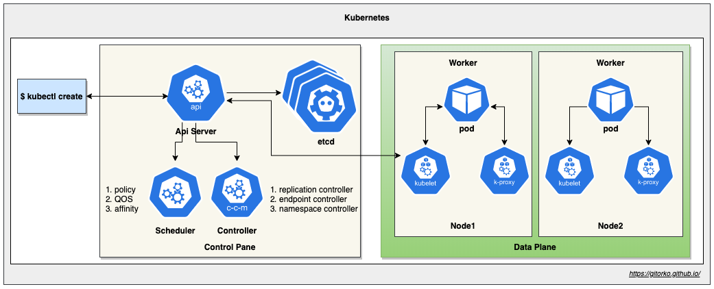

Spring Boot development with docker & kubernetes. 

Github: [https://github.com/gitorko/project61](https://github.com/gitorko/project61)

## Kubernetes



## Rancher Desktop

Rancher Desktop allows you to run Kubernetes on your local machine. Its free and open-source.

Disable Traefik, select dockerd as container in the settings.


If you get the below error when you run kubectl, its mostly due to .kubeconfig file already present from docker desktop installation.

```bash
I0804 20:09:34.857149   37711 versioner.go:58] Get "https://kubernetes.docker.internal:6443/version?timeout=5s": x509: certificate signed by unknown authority
Unable to connect to the server: x509: certificate signed by unknown authority
```

Delete the .kube folder and restart Rancher Desktop.

```bash
rm -rf ~/.kube
```

## Docker Desktop

Docker Desktop allows you to run Kubernetes on your local machine. Do refer the latest licensing terms as they have changed.


Once kubernetes is running, check kubectl.

```bash
export KUBECONFIG=~/.kube/config
kubectl version
```

## Kubernetes Dashboard

If you want to visualize the kubernetes infra, you can install the dashboard UI.

[https://kubernetes.io/docs/tasks/access-application-cluster/web-ui-dashboard/](https://kubernetes.io/docs/tasks/access-application-cluster/web-ui-dashboard/)

```bash
kubectl apply -f https://raw.githubusercontent.com/kubernetes/dashboard/master/aio/deploy/recommended.yaml
kubectl proxy
```

Open the dashboard url in a browser

[http://localhost:8001/api/v1/namespaces/kubernetes-dashboard/services/https:kubernetes-dashboard:/proxy/](http://localhost:8001/api/v1/namespaces/kubernetes-dashboard/services/https:kubernetes-dashboard:/proxy/)


To get the token to login run the below command

```bash
kubectl -n kube-system describe secret default|grep -i 'token:'|awk '{print $2}'
kubectl config set-credentials docker-for-desktop --token="${TOKEN}"
```

Now provide the token and login.


Clean up

```bash
kubectl --namespace kube-system get all
kubectl delete -f https://raw.githubusercontent.com/kubernetes/dashboard/master/aio/deploy/recommended.yaml
```

## Build & Deployment

Build the project

```bash
git clone https://github.com/gitorko/project61.git
cd project61
./gradlew clean build
```

### Docker

There are 2 ways you can build the docker image, either run the docker build command or use the google jib library.

To build via docker build command

```bash
docker build -f k8s/Dockerfile --force-rm -t project61:1.0.0 .
docker images | grep project61
```

To build via jib plugin run the below command. This way building the docker image can be part of the build process

```bash
./gradlew jibDockerBuild
```

Test if the docker image is working

```bash
docker rm project61
docker run -p 9090:9090 --name project61 project61:1.0.0
```

[http://localhost:9090/api/time](http://localhost:9090/api/time)

Daemon mode

```bash
docker run -d -p 9090:9090 --name project61 project61:1.0.0
docker image prune 
```

### Kubernetes Basics

Now let's deploy the project on a kubernetes cluster. Check if kubernetes commands work

```bash
kubectl version
kubectl config get-contexts
kubectl config use-context docker-desktop
kubectl config set-context --current --namespace=default
kubectl get nodes
kubectl get ns
kubectl get all
kubectl cluster-info
```

We will now deploy just the docker image in kubernetes without needing any yaml files and using port forwarding access the api. Very rarely you will need to do this as most k8s deployment is done via yaml.

```bash
kubectl run project61-k8s --image project61:1.0.0 --image-pull-policy=Never --port=9090
kubectl port-forward project61-k8s 9090:9090
```

[http://localhost:9090/api/time](http://localhost:9090/api/time)

You can also create a service and access the pod. Get the port from the NodePort. Again this is to understand the fundamentals, a yaml file will be used later.

```bash
kubectl expose pod project61-k8s --type=NodePort
kubectl get -o jsonpath="{.spec.ports[0].nodePort}" services project61-k8s
```

Change the port that you got in the last command and test this api: http://localhost:<port>/api/time

Check the pods,services & deployments.

```bash
kubectl get all
```

You can access the bash terminal of the pod

```bash
kubectl get pods
kubectl exec -it project61-k8s -- /bin/bash
ls
```

Clean up.

```bash
kubectl delete pod project61-k8s
kubectl delete service project61-k8s
kubectl get all
```

### Kubernetes Yaml

Now we will deploy via the kubernetes yaml file.

```bash
kubectl apply -f k8s/Deployment.yaml --dry-run=client --validate=true
kubectl apply -f k8s/Deployment.yaml
```

[http://localhost:9090/api/time](http://localhost:9090/api/time)

Scale the deployment

```bash
kubectl scale deployment project61-k8s --replicas=3
```

Look at the logs

```bash
kubectl logs -f deployment/project61-k8s --all-containers=true --since=10m
```

Clean up

```bash
kubectl delete -f k8s/Deployment.yaml
```

### Helm

Now lets deploy the same project via helm charts

```bash
brew install helm
```

```bash
helm version
helm install project61 mychart
helm list
kubectl get pod,svc,deployment
```

Get the url and invoke the api

```bash
curl http://$(kubectl get svc/project61-k8s -o jsonpath='{.status.loadBalancer.ingress[0].hostname}'):9090/api/time
```

```
http://localhost:9090/api/time
```

Clean up

```bash
helm uninstall project61
```

## Debugging

To attach a debugger to the application follow the below steps

### Docker Debug

To debug the docker image start the pod with the debug port on 5005 enabled.

```bash
docker stop project61
docker rm project61
docker run -p 9090:9090 -p 5005:5005 --name project61 project61:1.0.0
```

Enable remote JVM debug in intellij

```bash
-agentlib:jdwp=transport=dt_socket,server=y,suspend=n,address=*:5005
```


[http://localhost:9090/api/time](http://localhost:9090/api/time)

Now when you request the api, the debug breakpoint in intellij is hit.


### Kubernetes Debug

To debug the kubernetes pod start port forwarding to the port 5005

```bash
kubectl get pod
kubectl port-forward pod/<POD_NAME> 5005:5005
```

Now when you request the api, the debug breakpoint in intellij is hit.


### Telepresence

To debug the kubernetes pod you can use telepresence. It will swap the prod running on kubernetes with a proxy pod that redirects traffic to your local setup.

Install telepresence

```bash
sudo curl -fL https://app.getambassador.io/download/tel2/darwin/amd64/latest/telepresence -o /usr/local/bin/telepresence
sudo chmod a+x /usr/local/bin/telepresence
```

Start the project61 application in debug mode in intellij, change the port to 9095 in application yaml, as we will be testing debugging locally.

Run the telepresence command, that will swap the kubernetes pod with a proxy pod and redirect all requests on 9090 to 9095.

```bash
telepresence --namespace=default --swap-deployment project61-k8s --expose 9095:9090 --run-shell
kubectl get pods
```

Note that port here is 9090 that is the kubernetes port for incoming requests. Telepresence will redirect these to 9095 port where your local instance is running.

[http://localhost:9090/api/time](http://localhost:9090/api/time)

Now when you request the api, the debug breakpoint in intellij is hit.

## JVM Monitoring

To hook jConsole or VisualVM 

### Docker

To connect to JMX port, start docker image with port 9095 exposed. The docker image already has the settings to enable JMX.

```bash
docker stop project61
docker rm project61
docker run -p 9090:9090 -p 9095:9095 --name project61 project61:1.0.0
```

### Kubernetes

To connect to JMX port, start port forwarding, The docker image already has the settings to enable JMX.

```bash
kubectl get pod
kubectl port-forward pod/<POD_NAME> 9095:9095
```

### VisualVM

Connect to the port

```
http://localhost:9095
```


### JConsole

```bash
jconsole 127.0.0.1:9095
```


## Jenkins CI/CD

Fork the github project61 repo so you have your own github project to push the code & clone it.

[https://github.com/gitorko/project61](https://github.com/gitorko/project61)

Download the jenkins war file and run the below command. 

[https://www.jenkins.io/](https://www.jenkins.io/)

```bash
java -jar jenkins.war --httpPort='8088'
```

[http://localhost:8088/](http://localhost:8088/)

Follow the default steps to install plugin and configure jenkins. The default password is printed in the console log.

Goto Global Tool Configuration and add Java 17, Maven


Add the kubernetes config as a credential

```bash
/Users/$USER/.kube/config
```


Install the kubernetes CLI plugin

[https://plugins.jenkins.io/kubernetes-cli/](https://plugins.jenkins.io/kubernetes-cli/)


Then create a pipeline item and copy the content of Jenkinsfile, Enter the GitHub url of your forked project. Save and run the job.




Each jenkins job run creates a docker image version by build number, kubectl terminates the old pod and starts the new pod.

```bash
docker images |grep project61
kubectl get pods -w
```

Clean up the docker images as they consume space.

```bash
docker rmi project61:1
kubectl delete -f k8s/Deployment.yaml
```

You can configure a 'GitHub hook trigger for GITScm polling' to deploy when a commit is pushed to github.

## References

[https://github.com/GoogleContainerTools/jib](https://github.com/GoogleContainerTools/jib)

[https://www.docker.com/products/docker-desktop/](https://www.docker.com/products/docker-desktop/)

[https://rancherdesktop.io/](https://rancherdesktop.io/)

[https://birthday.play-with-docker.com/kubernetes-docker-desktop/](https://birthday.play-with-docker.com/kubernetes-docker-desktop/)

[https://helm.sh/](https://helm.sh/)

[https://www.getambassador.io/docs/telepresence/latest/quick-start/qs-java/](https://www.getambassador.io/docs/telepresence/latest/quick-start/qs-java/)

[https://visualvm.github.io/](https://visualvm.github.io/)

[https://www.eclipse.org/mat/](https://www.eclipse.org/mat/)

[https://www.jenkins.io/](https://www.jenkins.io/)

[https://plugins.jenkins.io/kubernetes/](https://plugins.jenkins.io/kubernetes/)
