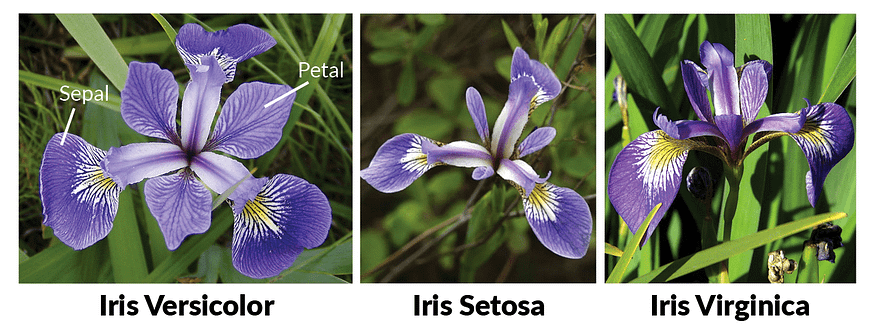

Create a neural network with deeplearning4j library.

## Machine Learning

Given a labelled data set, a machine learning algorithm will determine mathematical function based on the relationship between label and data, this can later be used to predict the label for any new input data.
Neural networks are computational models that consist of interconnected layers of nodes.
A neural network can derive information from new data, even if it has not seen these particular data items before.

Iris Flower classification problem states that given measurements of a flower, we should be able to predict which type of flower it is.

Flower classification

| Class Number (Type) | Class            |
|:--------------------|:-----------------|
| 0                   | Iris Setosa      |
| 1                   | Iris Versicolour |
| 2                   | Iris Virginica   |

Input Data

| Sepal Length | Sepal Width | Petal Length | Petal Width | Class (Type)    |
|:-------------|:------------|:-------------|:------------|:----------------|
| 5.1          | 3.5         | 1.4          | 0.2         | 0 (Iris Setosa) |

Training Step - First we train our model by using an existing data set of flower measurements.

1. Load data
2. Normalize data
3. Split data set to training and test data
4. Configure model - Creates neural network
5. Train model
6. Evaluate Model
7. Export Model

Prediction Step - Using the model we created above we predict which flower type an input belongs to.

1. Load Model
2. Format Data
3. Normal Data
4. Feed Data
5. Get Label

## Code



## References

[https://deeplearning4j.konduit.ai/](https://deeplearning4j.konduit.ai/)