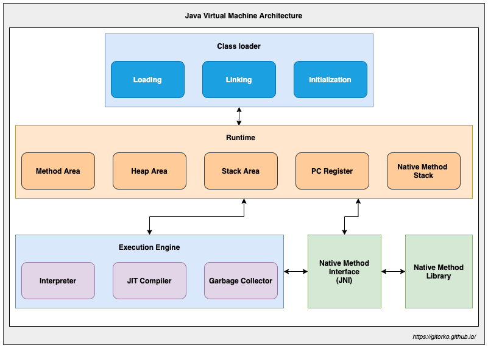
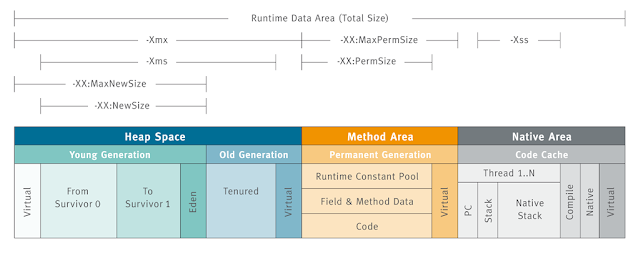
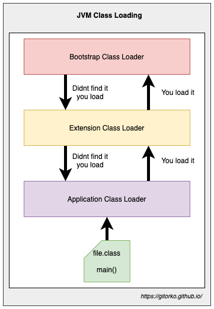
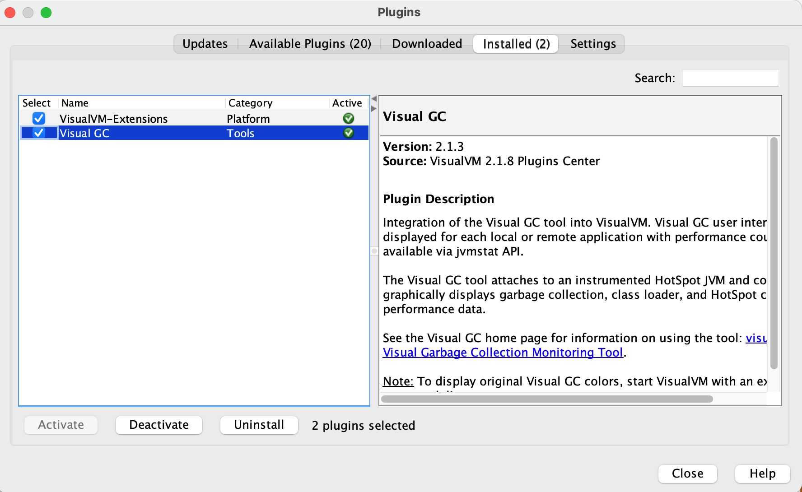
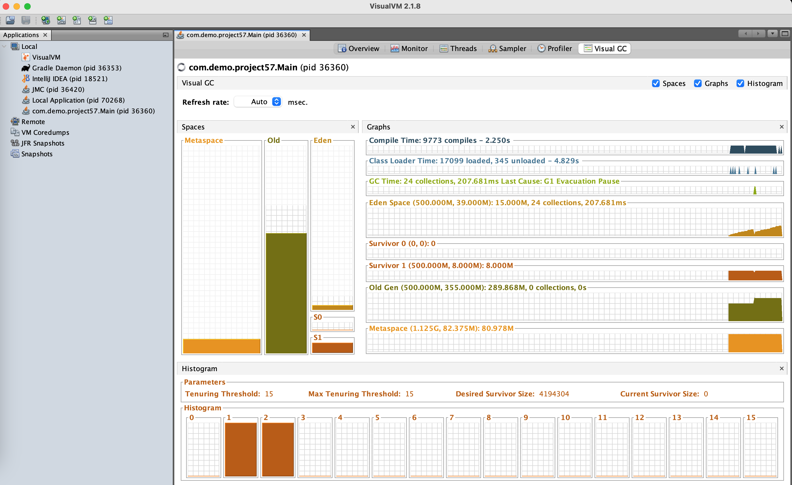
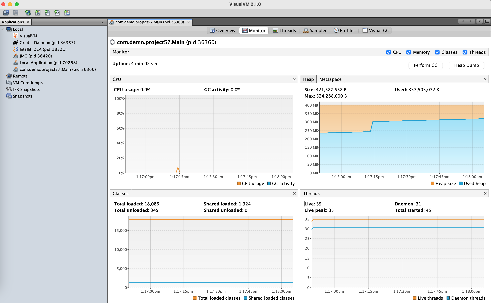
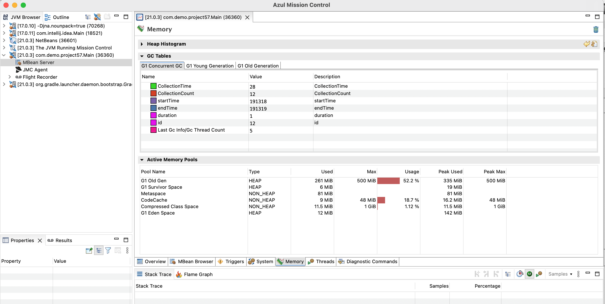

You write code in Java once, compile it to bytecode, then it can be run on any machine by the JVM where bytecode is interpreted for the underlying platforms/OS code.
("write once, run anywhere")
JVM can support other languages like Scala, Kotlin and Groovy

## Java Virtual Machine (JVM) Architecture

Components of JVM

1. Class Loader
2. Runtime Memory/Data Area
3. Execution Engine





### Class Loader

Three phases

1. Loading
2. Linking
3. Initialization

**Loading**

Three built-in class loaders:

1. **Bootstrap** - Root class loader. Loads libraries which are present in the rt.jar & $JAVA_HOME/jre/lib. eg: java.lang, java.net, java.util, java.io
2. **Extension** - Loads libraries which are present in the $JAVA_HOME/jre/lib/ext
3. **Application** - Loads classes present on the classpath.

The JVM uses the `ClassLoader.loadClass()` or `Class.forName()` method for loading the class into memory. 
It tries to load the class based on a fully qualified name. The first class to be loaded into memory is usually the class that contains the main() method.

Hierarchical class loading



**Linking**

1. **Verification** - Checks the structural correctness of the .class file. eg: Running java11 on java8 we get `VerifyException`
2. **Preparation** - Allocates memory for the static fields & initializes them with `default` values.
3. **Resolution** - Symbolic references are replaced with direct references.

**Initialization**

Executes the initialization method of the class eg: constructor, executing the static block, assigning values to all the static variables etc.

### Runtime Data Area

Five components:

1. **Method Area** - Class level data such as the run-time constant pool, field, and method data, and the code for methods and constructors, are stored here
2. **Heap Area** - Objects and their corresponding instance variables are stored here
3. **Stack Area** - When a new thread is created, a separate runtime stack is also created at the same time. All local variables, method calls, and partial results are stored in the stack area.
4. **Program Counter (PC) Registers** - Each thread has its own PC Register to hold the address of the currently executing JVM instruction.
5. **Native Method Stacks** - JVM contains stacks that support native methods

### Execution Engine

JVM can use an interpreter or a JIT compiler for the execution engine

1. Interpreter - Reads and executes the bytecode instructions line by line, slower
2. JIT Compiler - Compiles the entire bytecode and changes it to native machine code, Uses the interpreter to execute the byte code, but when it finds some repeated code, it uses the JIT compiler

### Garbage Collector

Garbage collection is the process of automatically reclaiming unused memory by destroying unused object.
Garbage collection provides automation memory management in java.

Objects get created on the heap.

1. Live - Objects are being used and referenced from somewhere else
2. Dead - Objects are no longer used or referenced from anywhere

To make a live object dead

Make the reference null.

```java
Customer customer = new Customer();
customer = null;
```

Assign reference to another object.

```java
Customer customer = new Customer();
customer = new Customer();
```

Use anonymous object.

```java
myFunction(new Customer());
```

All objects are linked to a Garbage Root Object via graph.
Garbage collector traverses the whole object graph in memory, starting from root and following references from the roots to other objects.

Phases of Garbage Collection:

1. **Mark** - GC identifies the unused objects in memory
2. **Sweep** - GC removes the objects identified during the previous phase
3. **Compact** - Compacts fragmented space so that objects are in contiguous block

Garbage Collections is done automatically by the JVM at regular intervals. 
It can also be triggered by calling System.gc(), but the execution is not guaranteed.

Generational garbage collection strategy that categorizes objects by age and moves them to different region.

JVM is divided into three sections

1. Young Generation
2. Old Generation
3. Permanent Generation

**Young Generation**

Newly created objects start in the Young Generation.
When objects are garbage collected from the Young Generation, it is a **minor garbage collection** event.
When surviving objects reach a certain threshold of moving around the survivor spaces, they are moved to the Old Generation.
Use the `-Xmn` flag to set the size of the Young Generation

The Young Generation is further subdivided

1. Eden space - All new objects start here, and initial memory is allocated to them
2. Survivor spaces - Objects are moved here from Eden after surviving one garbage collection cycle.

**Old Generation**

Objects that are long-lived are eventually moved from the Young Generation to the Old Generation
When objects are garbage collected from the Old Generation, it is a **major garbage collection** event.

Use the `-Xms` and `-Xmx` flags to set the size of the initial and maximum size of the Heap memory.

**Permanent Generation**

Deprecated since java 8
Metadata of classes and methods are stored in perm-gen.

**MetaSpace**

Starting with Java 8, the MetaSpace memory space replaces the PermGen space. 
Metaspace is automatically resized hence applications won't run out of memory if the classes are big.

**Phases of GC**

1. **Minor GC** - Happens on Young generation.
2. **Major GC** - Happens on Old generation. **Stop of the world** event, program pauses till memory is cleaned. Least pause time is always preferred.

**Algorithms**

1. **Mark-Copy** - Happens in Young generation
    * Marks all live objects
    * Then copies from eden space to survivor space (S1/S2), At any given point either S1 or S2 is always empty.
    * Then entire eden space is treated as empty.
2. **Mark-Sweep-Compact** - Happens in Old generation.
    * Marks all live objects.
    * Sweep/Reclaim all dead object. Releases memory
    * Compaction - Move all live objects to left so that are next to each other in continuous block.

Types of garbage collector:

1. `-XX:+UseSerialGC` - Serial garbage collector. Single thread for both minor & major gc.
2. `XX:+UseParallelGC` - Parallel garbage collector. Multiple thread for both minor gc & single/multiple thread for major gc. Doesn't run concurrently with application. The pause time is longest. eg: Batch jobs
3. `XX:+UseConcMarkSweepGC` - CMS (Concurrent Mark & Sweep) Deprecated since java 9. Multiple thread for both minor & major gc. Concurrent Mark & Sweep. Runs concurrently with application to mark live objects. The pause time is minimal. eg: CPU intensive.
4. `-XX:+UseG1GC` - G1 (Garbage first) garbage collector. Entire heap is divided to multiple regions that can be resized. A region can be either young or old. Identifies the regions with the most garbage and performs garbage collection on that region first, it is called Garbage First The pause time is predictable as regions are small.
5. `-XX:+UseEpsilonGC` - Epsilon collector - Do nothing collector. JVM shutsdown once heap is full. Used for zero pause time application provided memory is planned.
6. `-XX:+UseShenandoahGC` - Shenandoah collector - Similar to G1, but runs concurrently with application. CPU intensive.
7. `-XX:+UseZGC` - ZGC collector - Suitable for low pause time (2 ms pauses) and large heap. GC performed while application running. Treats the entire heap as a single generation, performing garbage collection uniformly across all objects. Cant specify pause time.
8. `-XX:+UseZGC -XX:+ZGenerational` Generation ZGC - ZGC splits the heap into two logical generations young and old. The GC can focus on collecting younger and more promising objects more often without increasing pause time, keeping them under 1 millisecond

| Garbage Collectors | When to use                                                                                                                       |
|:-------------------|:----------------------------------------------------------------------------------------------------------------------------------|
| Serial             | Small data sets (~100 MB max)<br/>Limited resources (e.g., single core)<br/>Low pause times                                       |
| Parallel           | Peak performance on multi-core systems<br/>Well suited for high computational loads<br/> more than 1-second pauses are acceptable |
| G1 /CMS            | Response time > throughput<br/>Large heap<br/>Pauses < 1 sec                                                                      |
| Shenandoah         | Minimize pause times<br/>Predicatable latencies                                                                                   |
| ZGC                | Response time is high-priority, and/or<br/>Very large heap                                                                        |
| Epsilon GC         | Performance testing and troubleshooting                                                                                           |

### Java Native Interface (JNI)

Java supports the execution of native code via the Java Native Interface (JNI).
Use the `native` keyword to indicate that the method implementation will be provided by a native library. 
Invoke `System.loadLibrary()` to load the shared native library into memory.

### Native Method Libraries

Libraries that are written in other programming languages, such as C, C++, and assembly. 
These libraries are usually present in the form of .dll or .so files. 
These native libraries can be loaded through JNI.

### JVM errors

1. **ClassNotFoundExcecption** - Class Loader is trying to load classes using Class.forName(), ClassLoader.loadClass() or ClassLoader.findSystemClass() but no definition for the class with the specified name is found.
2. **NoClassDefFoundError** - Compiler has successfully compiled the class, but the Class Loader is not able to locate the class file at the runtime.
3. **OutOfMemoryError** - Cannot allocate an object because it is out of memory, and no more memory could be made available by the garbage collector.
4. **StackOverflowError** - Ran out of space while creating new stack frames while processing a thread.

### JVM Flags

1. Throughput  - Throughput refers to the amount of time spent on actual application work versus the total time spent on garbage collection activities. High Throughput indicates that the application spends more time executing its tasks rather than performing GC
2. Latency - Latency in GC refers to the pause times experienced by the application during garbage collection activities. Low Latency indicates that GC pauses are short and predictable, allowing the application to quickly resume its tasks

| Flags                                                     | Purpose                                                                                                                                                                            |
|:----------------------------------------------------------|:-----------------------------------------------------------------------------------------------------------------------------------------------------------------------------------|
| `-XX:+UseStringDeduplication`                             | All string in java are stored in string pool but if you used the new operator then string are created on heap. To remove duplicate string in heap during GC you can use this flag. |
| `-XX:+SoftMaxHeapSize`                                    | Set in Gen ZGC it allows GC to operate within this limit and will goto max only to prevent application from stalling.                                                              |
| `-XX:+AlwaysPreTouch`                                     | Heap preparation is done at startup.                                                                                                                                               |
| `-Xmx=<size>` `-Xms=<size>`                               | The max heap size & min heap size can be set to same size to avoid latency caused when returning unused memory to RAM by the JVM                                                   |
| `-XX:-ZUncommit`                                          | Prevents unused memory from being returned to the RAM by the JVM                                                                                                                   |
| `-XX:ZUncommitDelay=<time>`                               | Delay before unused memory returned to the RAM by the JVM                                                                                                                          |
| `-XX:+UseTransparentHugePages`                            | If you have large objects then dedicated section of the heap is used to store them. OS should support Transparent Huge Pages (THP)                                                 |
| `-XX:MaxGCPauseMillis`                                    | Provides max tolerable pause time for GC in G1                                                                                                                                     |
| `-XX:+UseAOT`                                             | Enables AOT compilation                                                                                                                                                            |
| `-XX:ParallelGCThreads`                                   | Parallel GC Threads                                                                                                                                                                |
| `-XX:ConcGCThreads`                                       | Concurrent GC Threads                                                                                                                                                              |
| `-Xss`                                                    | Thread stack size                                                                                                                                                                  |
| `-XX:+DisableExplicitGC`                                  | Disable GC                                                                                                                                                                         |
| `-XX:+HeapDumpOnOutOfMemoryError -XX:HeapDumpPath=<file>` | Heap Dump on OutOfMemoryError                                                                                                                                                      |
| `-XX:MetaspaceSize=<size>` `-XX:MaxMetaspaceSize=<size>`  | Metaspace size                                                                                                                                                                     |
| `-XX:G1HeapRegionSize=<size>`                             | G1 region size                                                                                                                                                                     | 
| `-XX:ZAllocationSpikeTolerance=<value>`                   | How much ZGC should over-provision memory to handle allocation spikes                                                                                                              |
| `-Xlog:gc*`                                               | GC logging                                                                                                                                                                         |
| `-XX:ZGenYoungSize=<size>`                                | Gen-ZGC Young Generation Size                                                                                                                                                      |
| `-XX:ZGenYoungSize=<size>`                                | Gen-ZGC Old Generation Size                                                                                                                                                        |
| `-XX:ZGenMaxYoungGCCollectionTimeMillis=<time>`           | Max Young GC Pause Time                                                                                                                                                            |


### JIT (Just in Time Compilation) vs AOT (Ahead of Time Compilation)

JIT happens at runtime, jvm determines hotspot in code that are frequently executed and compiles to native code. eg: HotSpot JVM
AOT happens before runtime, bytecode is compiled to native code based on static analysis before program is executed. eg: GraalVM

## Distributions

1. Azul Platform Core [https://www.azul.com/downloads/](https://www.azul.com/downloads/)
2. Amazon Corretto [https://aws.amazon.com/corretto/](https://aws.amazon.com/corretto/)
3. Red Hat OpenJDK [https://developers.redhat.com/products/openjdk/download](https://developers.redhat.com/products/openjdk/download)
4. Eclipse Temurin [https://adoptium.net/en-GB/temurin/releases/](https://adoptium.net/en-GB/temurin/releases/)

## Versions

To deal with different versions of java you can use jenv

```bash
brew install jenv
```

Set the jdk version either globally or locally

```bash
jenv versions
jenv version
jenv global 11.0
jenv local 17.0
```

To add existing jdk

```bash
jenv add /Users/username/Library/Java/JavaVirtualMachines/azul-17.0.11/Contents/Home
```

## Tools

You can also download the various tools needed to work with java

1. VisualVM - [https://visualvm.github.io/](https://visualvm.github.io/)
2. Memory Analyzer - [https://www.eclipse.org/mat/](https://www.eclipse.org/mat/)
3. Mission Control - [https://www.azul.com/products/components/azul-mission-control/](https://www.azul.com/products/components/azul-mission-control/)






## References

[https://www.youtube.com/watch?v=XXOaCV5xm9s&ab_channel=Geekific](https://www.youtube.com/watch?v=XXOaCV5xm9s&ab_channel=Geekific)
[https://www.youtube.com/watch?v=2PIBF92iOvQ&ab_channel=Java](https://www.youtube.com/watch?v=2PIBF92iOvQ&ab_channel=Java)
[https://www.youtube.com/watch?v=wpkbJGRCwRo&ab_channel=Java](https://www.youtube.com/watch?v=wpkbJGRCwRo&ab_channel=Java)

[https://docs.oracle.com/en/java/javase/21/gctuning/z-garbage-collector.html#GUID-8637B158-4F35-4E2D-8E7B-9DAEF15BB3CD](https://docs.oracle.com/en/java/javase/21/gctuning/z-garbage-collector.html#GUID-8637B158-4F35-4E2D-8E7B-9DAEF15BB3CD)
[https://wiki.openjdk.org/display/zgc/Main](https://wiki.openjdk.org/display/zgc/Main)
[https://inside.java/2023/11/28/gen-zgc-explainer/](https://inside.java/2023/11/28/gen-zgc-explainer/)