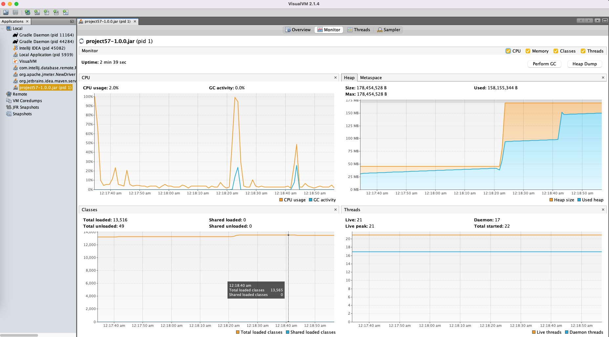
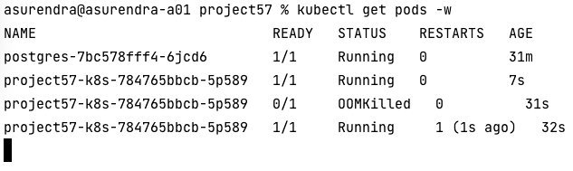
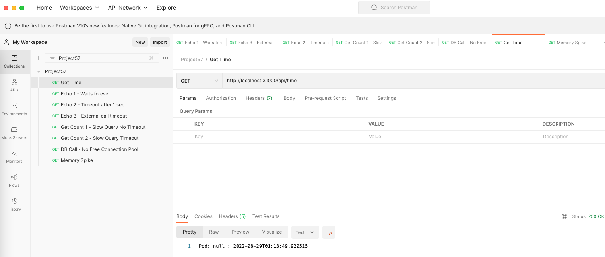
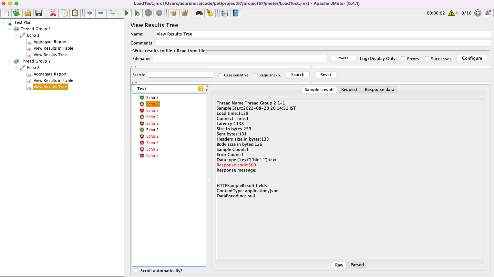
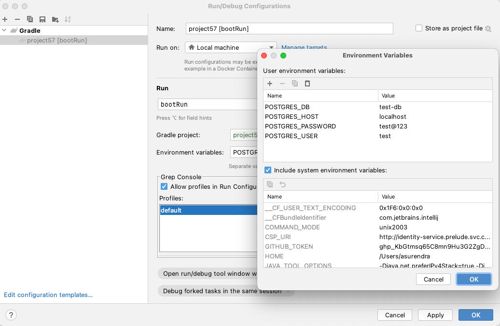

We will look at the different points at which an application can fail in a distributed system and how to address failures.
We will deliberately fail the application at these points to determine what the error looks like and how to handle it. To know how to build a good distributed system you need to understand where it can fail.

## HTTP Connections

{}
A hacker is establishing tcp connections that dont do anything, valid users are getting Denial-of-Service. What do you do?
{}

Your server is receiving a lot of bad TCP connections. To test this make the thread count to 1 and change the connection timeout to 10 milli seconds.
Now issue a telnet command to connect to the running port, It will connect but since no data is sent the TCP connection is closed in 10 milli seconds.

```bash
server.tomcat.threads.max=1
server.tomcat.connection-timeout=10

telnet localhost 31000
```
 
The connection timeout means - If the client is not sending data after establishing the TCP handshake for 'N' seconds then close the connection.

```bash
server.tomcat.connection-timeout=5000
```

{}
Most will assume that this connection timeout actually closes the connection when a long running task takes more than 'N' seconds. This is not true.
It only closes connection if the client doesnt send anything for 'N' seconds.
{}

## TimeLimiter

{}
A new team member has updated a function and introduced a bug and the function is very slow or never returns a response. What do you do?
{}

If a function takes too long to complete it will block the tomcat thread which will further degrade the system performance. Use Resilience4j to explicitly timeout long running jobs, this way runaway functions cant impact your entire system.

Spring also provides `spring.mvc.async.request-timeout` that you can explore to accomplish the same.

{}
Always assume the functions within your service will take forever and may never complete, design accordingly.
{}

## Request Thread Pool & Connections

{}
Users are reporting slow connection / timeout when connecting to your server? How many concurrent requests can your server handle?
{}

There 2 types of protocol a tomcat server can be configured for

1. BIO - Blocking IO, In the case of BIO the threads are not free till the response is sent back.
2. NIO - Non-Blocking IO, In the case of NIO the threads are free to serve other requests the incoming request is waiting for IO to complete.

The number of threads determine how many thread can handle the incoming requests. This means default of 200 threads are ready to serve the requests

```bash
# Applies for NIO & BIO
server.tomcat.threads.max=200
```

Max number of connections the server can accept and process, for BIO (Blocking IO) tomcat the server.tomcat.threads.max = server.tomcat.max-connections
You cant have more connections than the threads.

For NIO tomcat, the number of threads can be less and the max-connections can be more. Since the threads not blocked while waiting for IO to complete then can open up more connections and server other requests.

```bash
# Applies only for NIO
server.tomcat.max-connections: 500
```

{}
The number of tomcat threads and the server hardware determine how many requests can be served in a given time interval.
If you have 200 threads (BIO) and all request response on average take 1 second to complete then your server can handle 200 requests per second.
{}

## Keep-Alive

{}
Network admin calls you to tell that many TCP connections are being created to the same clients. What do you do?
{}

TCP connections take time to be established, keep-alive keeps the connection alive for some more time incase the client want to send more data again in the new future. 

max-keep-alive-requests - Max number of HTTP requests that can be pipelined before connection is closed.
keep-alive-timeout - Keeps the TCP connection for sometime to avoid doing a handshake again if request from same client is sent.

```bash
server.tomcat.max-keep-alive-requests = 100
server.tomcat.keep-alive-timeout =  10
```

## Rest Client Connection Timeout

{}
You are invoking rest calls to an external service which has degraded and has become very slow there by causing your service to slow down. What do you do?
{}

If the server makes external calls ensure to set the read and connection timeout on the restTemplate.
If you dont set this then your server which is a client will wait forever to get the response.

```
# If unable to connect the external server then give up after 5 seconds.
setConnectTimeout(5_000);

# If unable to read data from external api call then give up after 5 seconds.
setReadTimeout(5_000);
```

{}
Always assume that all external API calls never return and design accordingly.
{}

## Database Connection Pool

{}
Users are reporting slowness in api that fetch relatively small data. What do you do?
{}

Spring boot provides Hikari connection pool by default. If there are run away SQL connections then service can quickly run out of connection in the pool and slow down the entire system.

To test this we restrict the pool size to 1 to make the error simulation easy.

```
spring.hikari.maximumPoolSize: 1
```

By setting the connectionTimeout we ensure that when the connection pool is full then we timeout after 1 second instead of waiting forever to get a new connection.

```
spring.hikari.connectionTimeout=1000
```

Now when you trigger the api, You will see an error, only the first query succeeds and rest will fail. Fail-Fast is always preferred than slowing down the entire service.

```
Caused by: java.sql.SQLTransientConnectionException: HikariPool-1 - Connection is not available, request timed out after 253ms.
```

{}
Always assume that you will run out of database connections due to a run away or storm of requests and design accordingly.
{}

## Slow Query

{}
Users are reporting slowness in a db fetch api that fetches data from multiple tables via join. Your DBA also confirms that query is too slow. What do you do?
{}

Slow queries often slow down the entire system. 
To test this we explicitly slow down a query with pg_sleep function.

We set timeout on the transaction to ensure that slow query doesn't impact the entire system, after 5 seconds if the query doesnt return result an exception is thrown.

```
@Transactional(timeout = 5)
```

{}
Always assume that all DB calls never return or are very slow and design accordingly.
{}

You can further look at optimizing the query with help of indexes however here we design the backend system such that the service doesnt fail as a whole due to slow queries.

## Memory Leak & CPU Spike

{}
You have developed your service on your laptop, you tested with a big heap memory setting. 
However your kubernetes admin calls you to inform that kubernetes is a shared resource and you can't consume so much memory. What do you do?
{}

Memory leaks are always hard to debug, a badly written method can cause spike in memory usage causing other services to struggle with heap memory and in turn causing lot of GC (garbage collection) which are stop of the world events. 

With kubernetes you can define resource limits that kill the pod if tries to use more resources than allocated.

```yaml
resources:
    requests:
      cpu: "250m"
      memory: "250Mi"
    limits:
      cpu: "2"
      memory: "380Mi"
```

Now when you invoke the api that causes a memory spike, the pod will be killed (OOMKilled) and a new pod brought up.





{}
An OutOfMemoryError side the pod doesnt necessarily kill the pod unless some health check is configured. Pod will still remain in running state despite the OOM error.
Only the resource limits defined determine when the pod gets killed.
{}

```
Exception in thread "http-nio-31000-exec-1" java.lang.OutOfMemoryError: Java heap space
```

## Other Failures

Once you expand the distributed system there can be various other points of failure

1. Primary DB failure
2. Secondary DB replication failure
3. Queue failures
4. Network failures
5. External System can go down
6. Service nodes can go down
7. Cache invalidation/eviction failure
8. Load Balancer failures
9. Datacenter failure for one region

## Code











## Postman Collection



[https://raw.githubusercontent.com/gitorko/project57/main/postman/Project57.postman_collection.json](https://raw.githubusercontent.com/gitorko/project57/main/postman/Project57.postman_collection.json)

## JMeter



[https://raw.githubusercontent.com/gitorko/project57/main/jmeter/LoadTest.jmx](https://raw.githubusercontent.com/gitorko/project57/main/jmeter/LoadTest.jmx)

## Setup





## References

[https://resilience4j.readme.io/docs](https://resilience4j.readme.io/docs)
