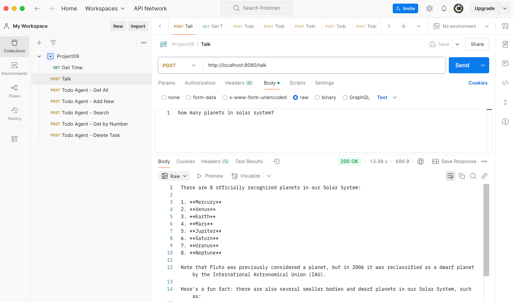
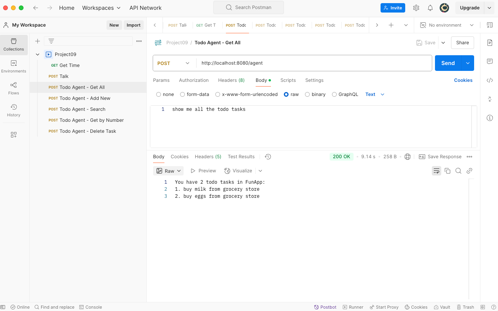
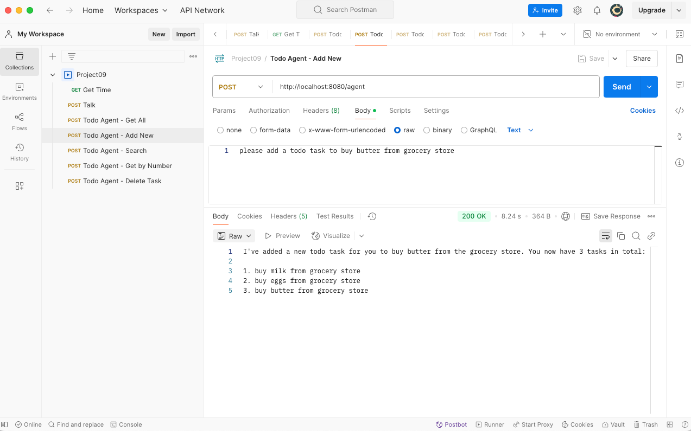
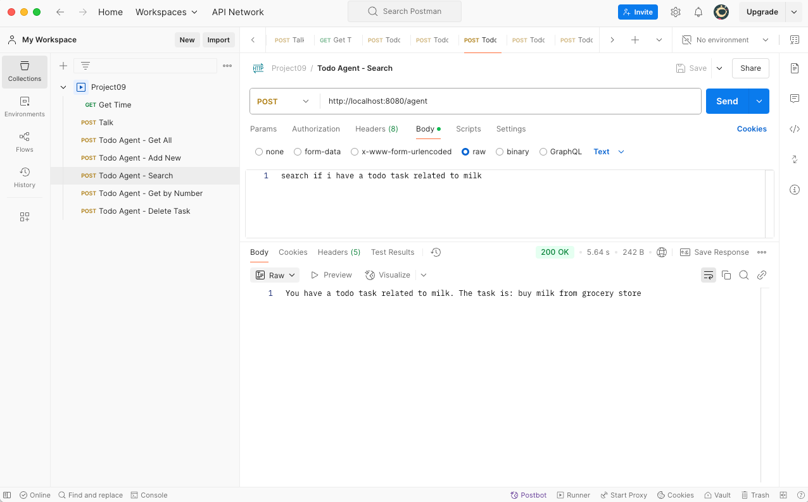
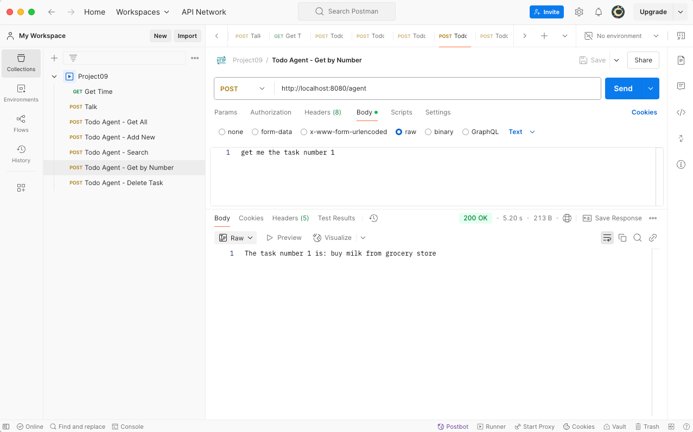
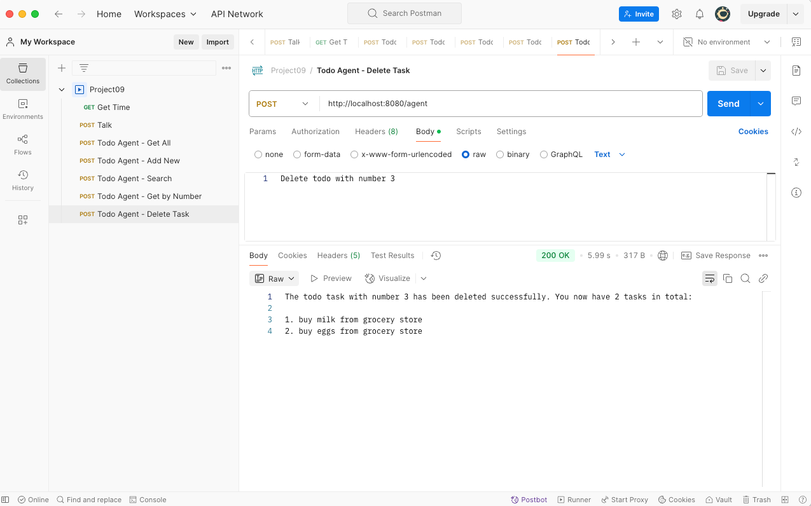
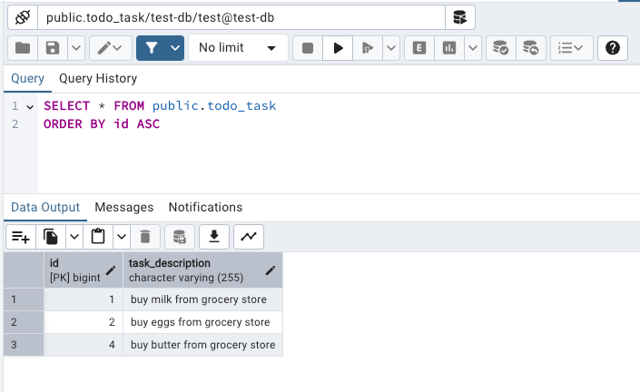

Spring AI - Ollama (Chat Model)

Github: [https://github.com/gitorko/project09](https://github.com/gitorko/project09)

## Spring AI

Ollama is a platform designed to allow developers to run large language models (LLMs) locally.

In this example we will run the **llama3.1** LLM model which will run locally and write an AI agent that can interact with the postgres database to create a TODO task application.

### Code









### Postman

Import the postman collection to postman

[Postman Collection](https://raw.githubusercontent.com/gitorko/project09/main/postman/Project09.postman_collection.json)

### Setup



## References

[https://spring.io/projects/spring-ai/](https://spring.io/projects/spring-ai/)

[https://docs.spring.io/spring-ai/reference/api/chat/ollama-chat.html](https://docs.spring.io/spring-ai/reference/api/chat/ollama-chat.html)

[https://hub.docker.com/r/ollama/ollama](https://hub.docker.com/r/ollama/ollama)

[https://ollama.com/](https://ollama.com/)