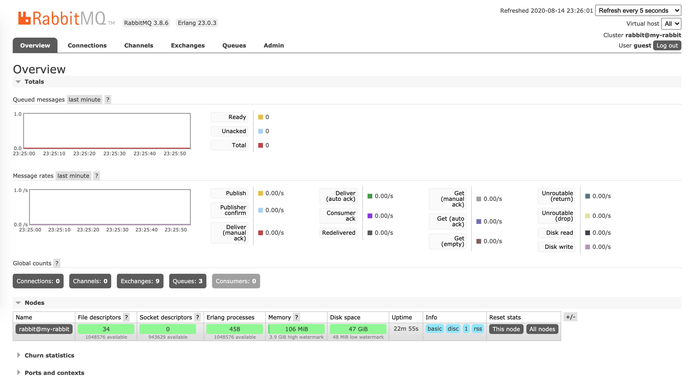

Spring with RabbitMQ message broker that implements Advanced Message Queuing Protocol(AMQP)

Github: [https://github.com/gitorko/project78](https://github.com/gitorko/project78)

## RabbitMQ

Exchanges are like post offices or mailboxes and clients publish a message to an AMQP exchange. 
There are four built-in exchange types

1. Direct Exchange – Routes messages to a queue by matching a complete routing key
2. Fanout Exchange – Routes messages to all the queues bound to it
3. Topic Exchange – Routes messages to multiple queues by matching a routing key to a pattern
4. Headers Exchange – Routes messages based on message headers

Queues are bound to an exchange using a routing key. Messages are sent to an exchange with a routing key.
AMQP (Advanced Message Queuing Protocol) is an open standard wire specification for asynchronous message communication, AMQP provides platform-neutral binary protocol standard, hence it can run on different environments & programming languages unlike JMS.

Remote procedure call (RPC) is a way to invoking a function on another computer and waiting for the result. The call is synchronous and blocking in nature, so the client will wait for the response.

## Code

Queue to send and receive messages







Direct exchange with routing key







Fanout exchange







Topic exchange







Error handling & Exchange creation



RPC







## Setup



## References

[https://spring.io/projects/spring-amqp](https://spring.io/projects/spring-amqp)

[https://www.rabbitmq.com/tutorials/tutorial-six-spring-amqp.html](https://www.rabbitmq.com/tutorials/tutorial-six-spring-amqp.html)
