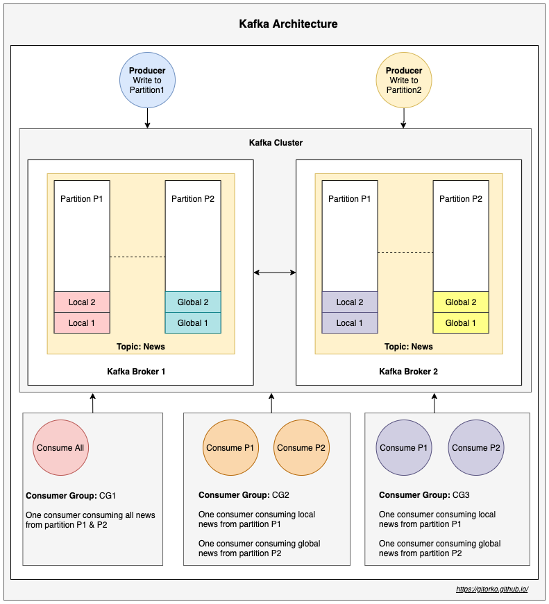
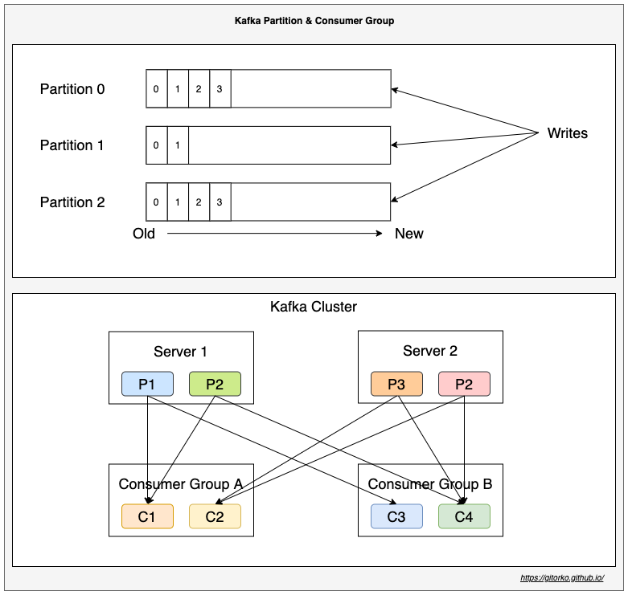

Kafka is a distributed & fault-tolerant, high throughput, scalable stream processing & messaging system.

1. Kafka as publisher-subscriber messaging system.
2. Kafka as queue (point-point) messaging system.
3. Kafka as stream processing system that reacts to event in realtime.
4. Kafka as a store for data.

**Terms**

* Broker: Kafka server.
* Cluster: A group of kafka brokers.
* Topic: Logical grouping of messages.
* Partition: A topic can contain many partitions. Messages are stored in a partition.
* Offset: Used to keep track of message.
* Consumer Group: Reads the messages from a topic.
* Consumer: A consumer group can have N consumers, each will read a partition. Consumers cant be more than number of 
  partitions.
* Zookeeper: Used to track the offset, consumers, topics etc.

* Order is guaranteed only withing a partition and not across partitions.
* Within a consumer group a partition can be read only by one consumer.
* Leader replicates partition to other replica servers based on replication count. If leader fails then follower will become leader.
* Zookeeper manages all brokers, keeps track of offset, consumer group, topic, partitions etc.
* Once a message acknowledgement fails kafka will retry and even after certain retries if it fails, the message will be moved to dead letter.

Kafka provides high throughput because of the following

1. Kafka scales because it works on append only mode, sequential disk write is faster than random access file write
2. Kafka copies data from disk to network by ready with zero copy. OS buffer directly copies to NIC buffer.

There is no set limit to the number of topics that can exist in a Kafka cluster, each partition has a limit of 4000 partitions per broker, maximum 200,000 partitions per Kafka cluster

**Kafka Use-Cases**

1. Activity tracking for high traffic website
2. Processing streaming big data
3. Monitoring financial data in real time
4. IoT sensor data processing