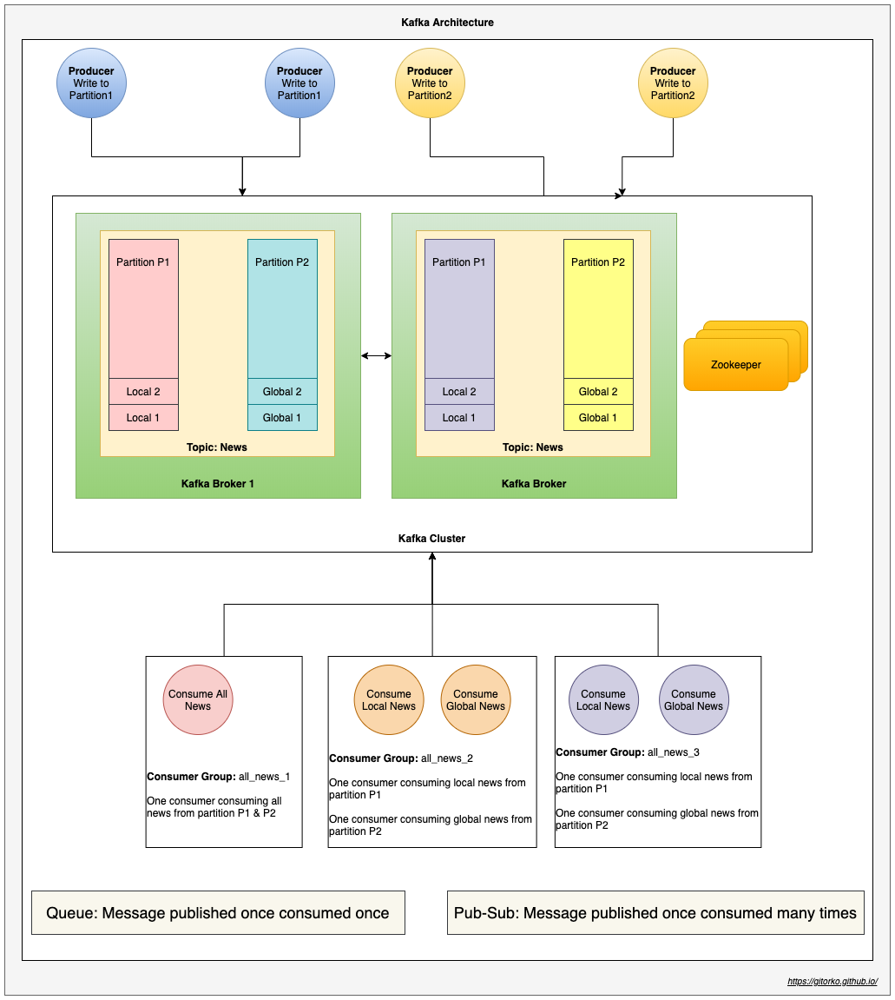
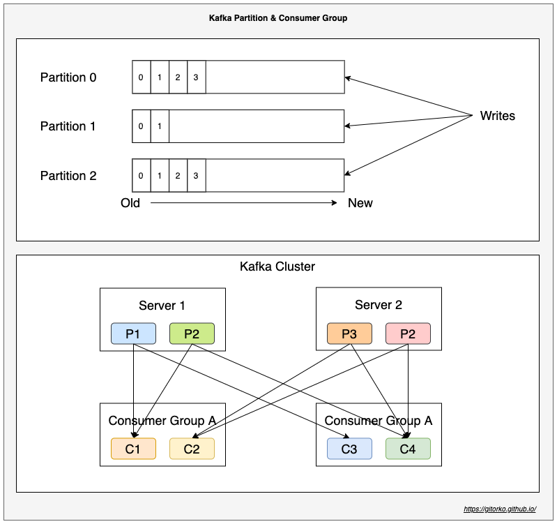
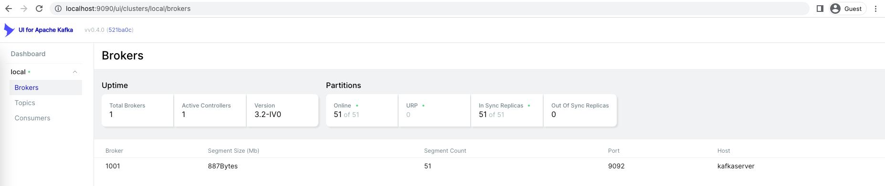
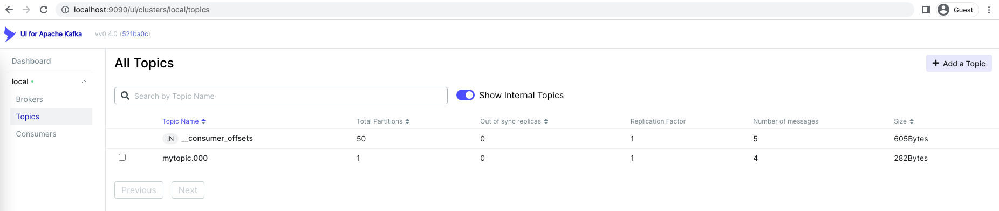
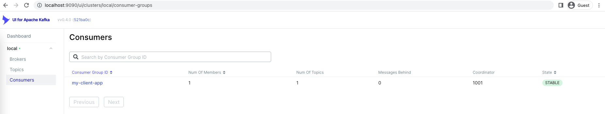

Spring Boot integration with kafka & kafka streams

Github: [https://github.com/gitorko/project80](https://github.com/gitorko/project80)

## Kafka

Kafka is a distributed & fault-tolerant,high throughput, scalable stream processing & messaging system.

1. Kafka as publisher-subscriber messaging system.
2. Kafka as queue (point-point) messaging system.
3. Kafka as stream processing system that reacts to event in realtime.
4. Kafka as a store for data.



Kafka stores streams of records (messages) in topics. Topics are partitioned and replicated across multiple nodes thus kafka can scale and be a distributed system.
Producers publish data to the topics. Consumer groups can subscribe to topics.

1. Data Store - Kafka is append only commit log. Which means it can also act as a data store.
2. Queue (point-point) - If only one consumer group subscribes to a topic it behaves like a Queue (point-point) messaging system.
3. Pub-Sub - If more than one consumer group subscribe to a topic it behaves like Pub-Sub messaging system.
4. Consumer Group - Number of consumers in a group must be less than or equal to number of partitions. Cant have more consumers in a group than there are partitions.
5. Partition - Producer needs to be aware of the partition its publishing to.
6. Partition - When you add a new kafka broker the partition is replicated so loss of one node doesnt crash the system.
7. Ordering - Ordering of messages is guaranteed only in a partition and not across partitions.
8. Offset - Consumer can choose to read records from latest or from beginning.
9. Long polling - Uses poll model compared to RabbitMQ which uses push model
10. Adapters - Provides adapters that can be used to write data to db and other endpoints
11. Stream - Provides stream processing capabilities 



Similar to spring rest template or jdbc template which abstracts the rest/jdbc calls spring provides kafka template which provides high level abstraction to interact with kafka. 
There is an even higher level of abstraction provided by spring cloud stream which lets we integrate with kafka or rabbitmq and other messaging systems. So when the messaging systems changes you dont need to make code changes in producer or consumer.





## Kafka Producer & Consumer






Run the main method of producer and then the consumer.

The group id of your client which uses group management to assign topic partitions to consumers, auto-offset-reset=earliest ensures the new consumer group will get the oldest available message. 

we can have multiple kafka listener for a topic with different group id
A consumer can listen to more than one topic. We have created the topic 'mytopic' with only one partition. 
For a topic with multiple partitions, @KafkaListener can explicitly subscribe to a particular partition of a topic with an initial offset.

```java
@KafkaListener(topics = "topic1", group = "group1")
@KafkaListener(topics = "topic1,topic2", group = "group1")
@KafkaListener(topicPartitions = @TopicPartition(topic = "topic1",
  partitionOffsets = {
    @PartitionOffset(partition = "0", initialOffset = "0"), 
    @PartitionOffset(partition = "2", initialOffset = "0")
}))
```

## Kafka Streams

Kafka Streams has stream-table duality. Tables are a set of evolving facts. Each new event overwrites the old one, whereas streams are a collection of immutable facts. Kafka Streams provides two abstractions for Streams and Tables. KStream handles the stream of records. KTable manages the changelog stream with the latest state of a given key
For not partitioned tables we can use GlobalKTables to broadcast information to all tasks.

When we use other projects like apache spark, storm,flink we write code and copy the jar to the nodes where the actual work happens. With the introduction of kafka stream we can now write your processing logic for streams and then it can run anywhere the jar can run. 
KafkaStreams enables us to consume from Kafka topics, analyze or transform data, and potentially, send it to another Kafka topic.

We will now count the users by age group.



Run the main method of KafkaStream.

## Setup



## References

[https://www.baeldung.com/java-kafka-streams](https://www.baeldung.com/java-kafka-streams)

[https://kafka.apache.org/quickstart](https://kafka.apache.org/quickstart)

[https://baeldung-cn.com/java-kafka-streams-vs-kafka-consumer](https://baeldung-cn.com/java-kafka-streams-vs-kafka-consumer)

[https://tanzu.vmware.com/developer/guides/kafka-gs/](https://tanzu.vmware.com/developer/guides/kafka-gs/)

[https://kafka.apache.org/](https://kafka.apache.org/)
