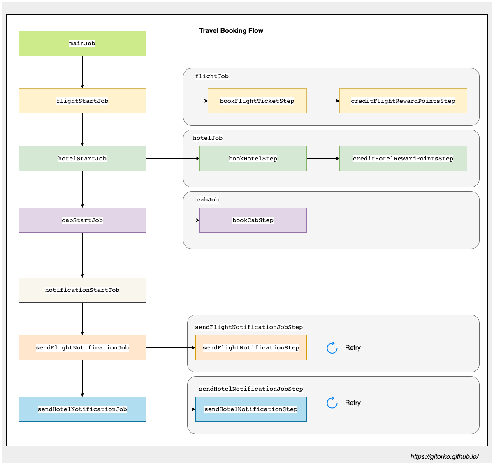
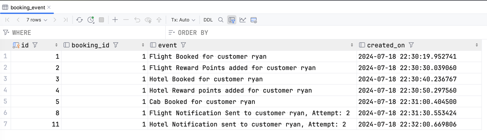
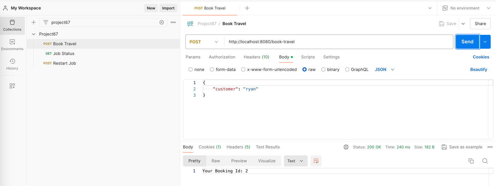

Spring boot implementation of multi level job workflow using spring batch

Github: [https://github.com/gitorko/project67](https://github.com/gitorko/project67)

## Spring Batch

Spring batch is typically used to process data (read-process-write) in the background. 
Here we will use it as a workflow orchestration engine to execute jobs that take long time to complete for non-batch oriented flow.

As an example we take a travel booking flow, where a customer books flight, hotel, cab in a single click but the actual bookings are done in the background flow.
We can use an event based model but the challenges with event model is that it's difficult to track a specific job & restart a specific job.
It's difficult to view the event queues and see which jobs are stuck. 
We might even have to use priority queue to move some event ahead of the queue if the queue has a huge backlog.
If there are various steps involved we might have different queues for each, this will allow restart of steps if they fail.

1. JobBuilder - Create a `Job`.
2. StepBuilder -  Creates a `Step` which is part of a job. A step can perform a chunk-oriented task, tasklet, or any other processing logic.
3. JobStepBuilder - Creates a `Step` that encapsulates a job within a step. This allows you to run an entire job as a single step within another job **Nested Job**.
4. FlowBuilder - Defines a `Flow` of steps that can be executed within a job. A `Flow` can contain multiple steps, decision points, and other nested flows. A `Flow` can be part of multiple jobs or nested within other flows.
5. FlowJobBuilder - Defines a `FlowJob` that executes a flow. Wraps a Flow into a Job, allowing the Flow to be executed as part of a job **Nested Flow**.

The `RunIdIncrementer` provides a mechanism to generate a unique job parameter (run.id) for each execution of a job.
This is needed for re-running jobs with the same configuration and parameters multiple times without conflicts.

So we will use spring batch which provides Job & Step flow to orchestrate our booking flow.



Features:

1. Retry will be attempted in case of failure with transactional rollback.
2. Jobs can be restarted
3. You can write if-else flows in the logic

After you run the code you see the jobs complete.

```bash
curl --location 'http://localhost:8080/book-travel' \
--header 'Content-Type: application/json' \
--data '{
    "customer": "ryan"
}'
```



You can also run a batch job that reads a csv and writes it to a csv file and db.

```bash
curl --location --request POST 'http://localhost:8080/employee-batch-job' \
--data ''
```

### Code









### Postman

Import the postman collection to postman

[Postman Collection](https://raw.githubusercontent.com/gitorko/project67/main/postman/Project67.postman_collection.json)



### Setup



## References

[https://spring.io/projects/spring-batch](https://spring.io/projects/spring-batch)
