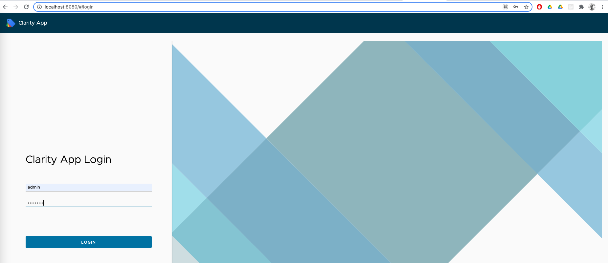
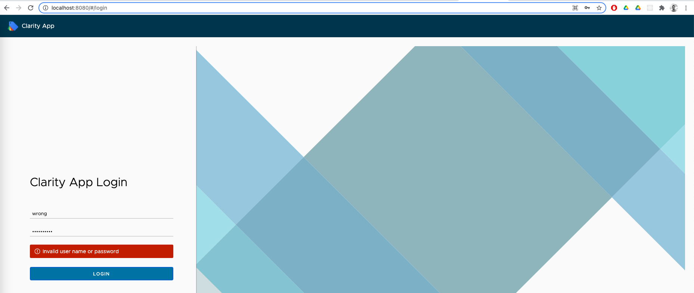
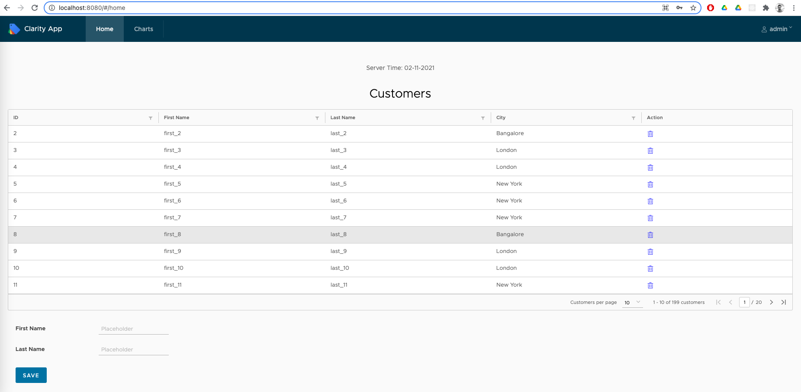
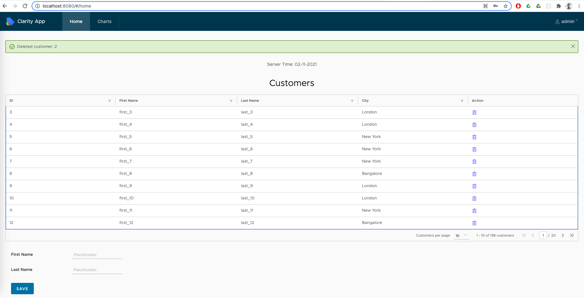
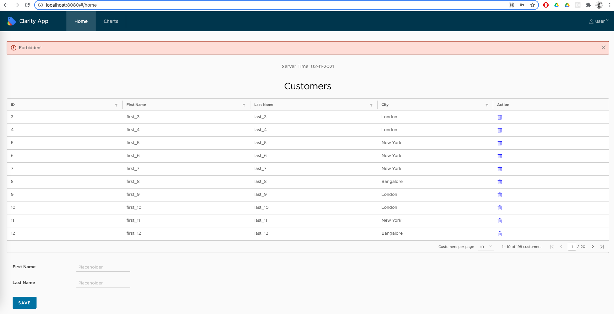
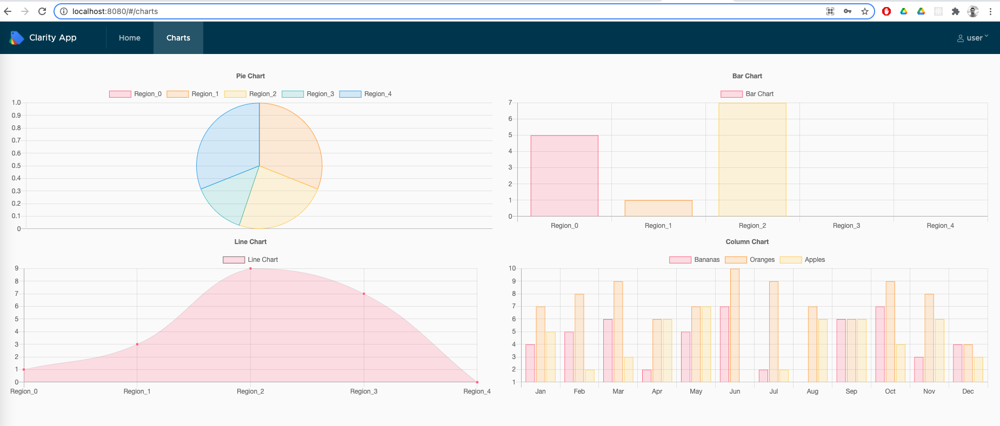
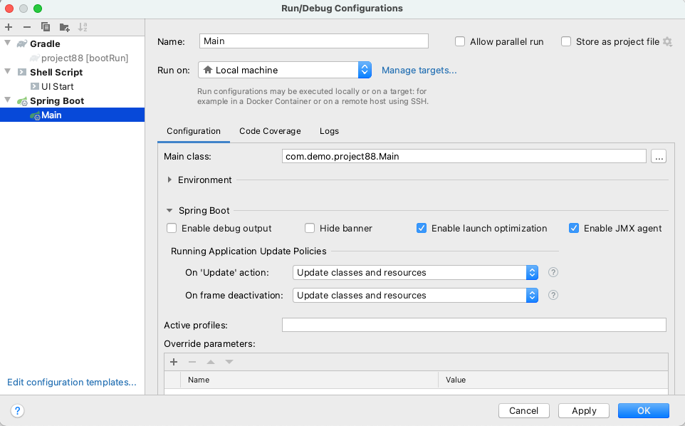
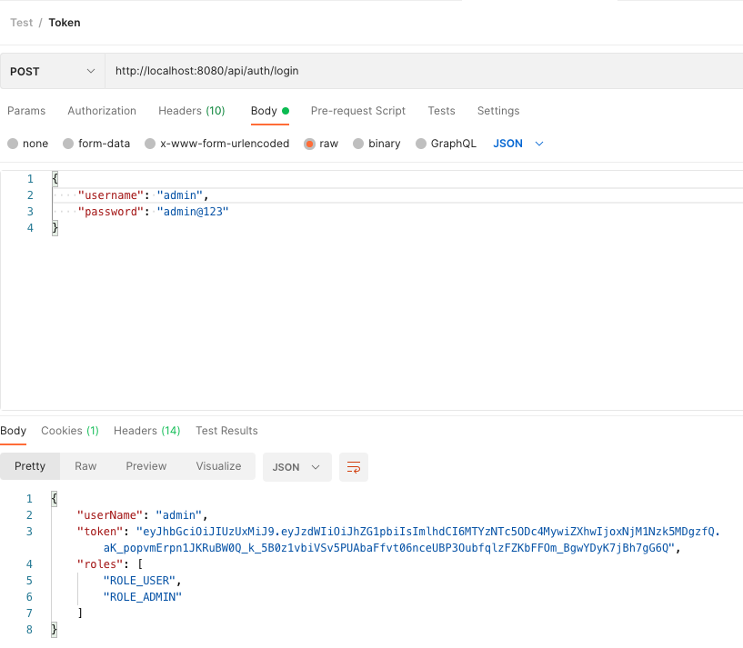

Spring boot web application with angular and JWT authentication support, uses clarity for UI components and chart.js for rendering charts.
Creates uber jar to deploy.

Github: [https://github.com/gitorko/project88](https://github.com/gitorko/project88)

## Quick Overview

To deploy the application in a single command, clone the project, make sure no conflicting docker containers or ports are running and then run

```bash
git clone https://github.com/gitorko/project88
cd project88
docker-compose -f docker/docker-compose.yml up 
```

Open [http://localhost:8080/](http://localhost:8080/)

## Features

A Spring Boot application with angular 11. Supports basic integration with spring security & JWT and provides login & logout support.
Spring dev tools allow seamless reload on any changes for java files.

1. Angular 11 app supports basic login via JWT
2. Clarity
3. JWT token based Login
4. CRUD UI for adding and removing customer
5. Postgres db
6. Spring JPA
7. Chart.js charts for bar,pie,stack charts with data from rest api

## Design



Wrong credentials







User role cant delete the record, only admin role can delete the record





## Code 

On Intellij to allow spring dev tools to reload on change you need to enable 'Update classes and resources' as shown below



Rest API return data that is rendered in angular frontend.



JWT authentication configured.



chart.js is a library that provides various charts, the project renders charts and the data is fetched from Rest API.











For older versions of spring boot that dont redirect to index.html add this mapping to the controller.

```java
import javax.servlet.http.HttpServletRequest;

import org.springframework.stereotype.Controller;
import org.springframework.web.bind.annotation.RequestMapping;

@Controller
public class IndexController {

    @RequestMapping(value = {"/", "/{x:[\\w\\-]+}", "/{x:^(?!api$).*$}/**/{y:[\\w\\-]+}"})
    public String getIndex(HttpServletRequest request) {
        return "/index.html";
    }
}
```

## Setup



## Testing



```bash
curl --location --request POST 'http://localhost:8080/api/auth/login' \
--header 'Content-Type: application/json' \
--data-raw '{
    "username": "admin",
    "password": "admin@123"
}'
```

```bash
curl --location --request GET 'http://localhost:8080/api/time'
```

```bash
curl --location --request GET 'http://localhost:8080/api/customer' \
--header 'Authorization: Bearer <TOKEN>'
```

## References

[https://clarity.design/](https://clarity.design/)

[https://www.chartjs.org/](https://www.chartjs.org/)
