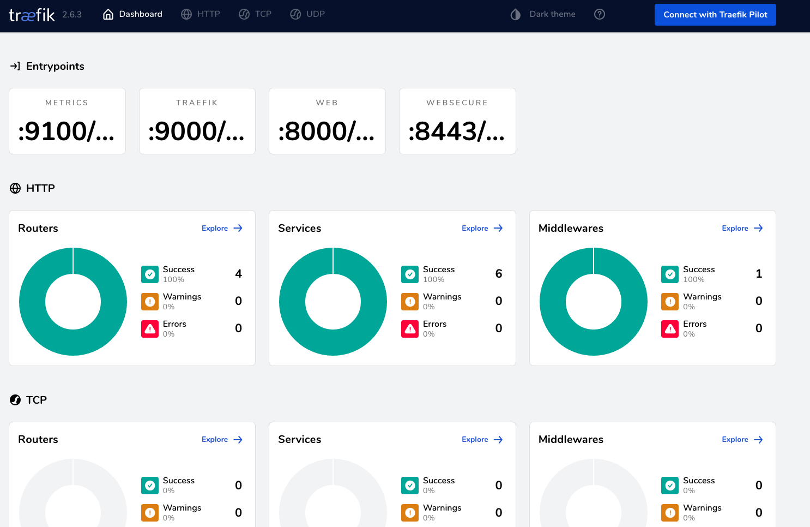

Application deployed on kubernetes, configured with Traefik ingress controller to rate limit.

Github: [https://github.com/gitorko/project95](https://github.com/gitorko/project95)

## Traefik

Traefik is a reverse proxy and load balancer that makes deploying microservices easy.

We will deploy the spring rest application along with postgres db on kubernetes instance. Then we will configure Traefik as ingress controller and apply rate limit on it using Traefik Proxy Middleware.
We will use docker desktop kubernetes instance.

Rate limiting is a technique for controlling the rate of requests to your application. It can save you from  Denial-of-Service (DoS) or resource starvation problems. Without rate limits, a burst of traffic could bring down the whole service making it unavailable for everybody.


## Code







## Setup



## Testing

Deploy the image to kubernetes


The dashboard will show the HTTP Routers & the middleware rate limit config


You can also look at success rate



To test the rate limit functionality open the RateLimit.jmx file in JMeter and run the test


Create a user, the data is persisted in the postgres db.

```bash
curl --request POST 'http://localhost.com/rest/customer' \
--header 'Content-Type: application/json' \
--data-raw '{
    "firstName" : "John",
    "lastName" : "Doe",
    "city": "NY"
}'
```

Get the user

```bash
curl --request GET 'http://localhost.com/rest/customer'
```

## References

[https://traefik.io/](https://traefik.io/)
