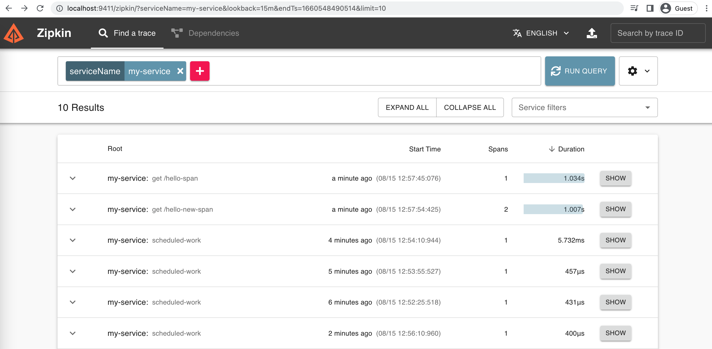
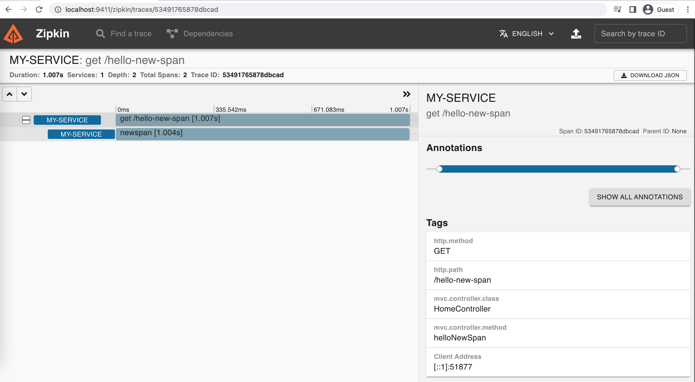

Spring cloud sleuth helps you trace a request and zipkin server help you trace in a distributed environment.

Github: [https://github.com/gitorko/project72](https://github.com/gitorko/project72)

## Spring Cloud Sleuth & Zipkin

How do you trace & debug a request in a single server? Now when it is deployed in pods and scaled how do you trace a request in a distributed environment?
Spring Cloud Sleuth help you trace a request by appending unique trace id in the log statements. You can the publish such traces to the zipkin server which lets you visualize a request across distributed environment.
You can then see the latency of each request in a distributed transaction.

Internally it has 4 modules –

1. Collector – Once any component sends the trace data arrives to Zipkin collector daemon, it is validated, stored, and indexed for lookups by the Zipkin collector.
2. Storage – This module store and index the lookup data in backend. Cassandra, ElasticSearch and MySQL are supported.
3. Search – This module provides a simple JSON API for finding and retrieving traces stored in backend. The primary consumer of this API is the Web UI.
4. Web UI – A very nice UI interface for viewing traces.

## Code







## Setup



## Testing

Invoke the rest api and notice the trace

[http://localhost:8080/hello-span](http://localhost:8080/hello-span)

[http://localhost:8080/hello-new-span](http://localhost:8080/hello-new-span)

[http://localhost:8080/hello-async](http://localhost:8080/hello-async)

You can now view the trace in zipkin UI

## References

[https://cloud.spring.io/spring-cloud-sleuth/](https://cloud.spring.io/spring-cloud-sleuth/)

[https://zipkin.io/](https://zipkin.io/)
