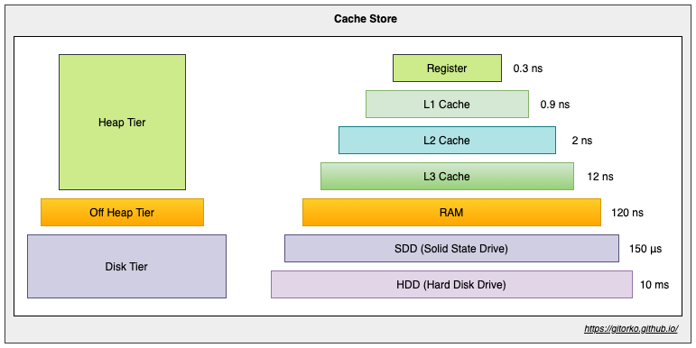
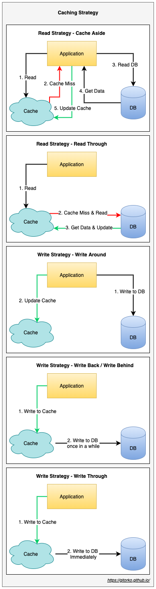

**HashMap vs Cache**

Disadvantage of using hashmap over cache is that hashmap can cause memory overflow without eviction & doesn't support write to disk.

Ehcache will only evict elements when putting elements and your cache is above threshold. Otherwise, accessing those expired elements will result in them being expired (and removed from the Cache). There is no thread that collects and removes expired elements from the Cache in the background.

**Types of store**

1. On-Heap Store - stores cache entries in Java heap memory
2. Off-Heap Store -  primary memory (RAM) to store cache entries, cache entries will be moved to the on-heap memory automatically before they can be used.
3. Disk Store - uses a hard disk to store cache entries. SSD type disk would perform better.
4. Clustered Store - stores cache entries on the remote server

**Memory areas supported by Ehcache**

1. On-Heap Store: Uses the Java heap memory to store cache entries and shares the memory with the application. The cache is also scanned by the garbage collection. This memory is very fast, but also very limited.
2. Off-Heap Store: Uses the RAM to store cache entries. This memory is not subject to garbage collection. Still quite fast memory, but slower than the on-heap memory, because the cache entries have to be moved to the on-heap memory before they can be used.
3. Disk Store: Uses the hard disk to store cache entries. Much slower than RAM. It is recommended to use a dedicated SSD that is only used for caching.

**Caching Strategies**

**Read heavy caching strategies**

1. Read-Cache-aside - Application queries the cache. If the data is found, it returns the data directly. If not it fetches the data from the SoR, stores it into the cache, and then returns.
2. Read-Through - Application queries the cache, cache service queries the SoR if not present and updates the cache and returns.

**Write heavy caching strategies**

1. Write-Around - Application writes to db and to the cache.
2. Write-Behind / Write-Back - Application writes to cache. Cache is pushed to SoR after some delay periodically.
3. Write-through - Application writes to cache, cache service immediately writes to SoR.

