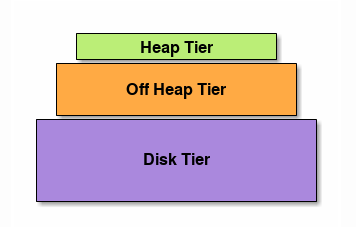

Spring Boot integration with EhCache 3

Github: [https://github.com/gitorko/project98](https://github.com/gitorko/project98)

## EhCache

EhCache is an open-source cache library. It supports cache in memory and disk, It supports eviction policies such as LRU, LFU, FIFO. Ehcache uses Last Recently Used (LRU) eviction strategy for memory & Last Frequently Used (LFU) as the eviction strategy for disk store.

Ehcache Caching Tiers - Caching layer can consist of more than one memory area. When using more than one memory area, the areas are arranged as hierarchical tiers. 
The lowest tier is called the Authority Tier and the other tiers are called the Near Cache. Most frequently used data is stored in the fastest caching tier (top layer)

### Types of store

1. On-Heap Store - stores cache entries in Java heap memory
2. Off-Heap Store -  primary memory (RAM) to store cache entries, cache entries will be moved to the on-heap memory automatically before they can be used.
3. Disk Store - uses a hard disk to store cache entries. SSD type disk would perform better.
4. Clustered Store - stores cache entries on the remote server

### Types of caching

1. Cache-aside - application consults with the cache. If the data is found, it returns the data directly. In the opposite scenario, it fetches the data from the SoR, stores it into the cache, and then returns
2. Cache-as-SoR (system-of-record) - cache-as-SoR pattern represents SoR reading and writing operations to the cache. It reduces the responsibility of the application. It uses the combination of read and write pattern that includes read-through, write-through, and write-behind. It reduces the difficulty of the application. It allows the cache to solve the thundering-herd problem
3. Read-through - read-through pattern also copies the cache-aside pattern while reading data from the cache
4. Write-through - write-through pattern also copies the cache-aside pattern while writing data in the cache
5. Write-behind / Write-Back - write-back pattern is different form the other three patterns. It modifies the cache entries after a configurable delay. The delay may in seconds, minutes, a day, a week, or for a long time

## Code






Notice the SQL is printed each time a db call happens, if the data is cached no DB call is made.

## Setup



## References

[https://www.ehcache.org/documentation/3.0](https://www.ehcache.org/documentation/3.0)

[https://docs.spring.io/spring-boot/docs/2.7.2/reference/htmlsingle/#io.caching](https://docs.spring.io/spring-boot/docs/2.7.2/reference/htmlsingle/#io.caching)
