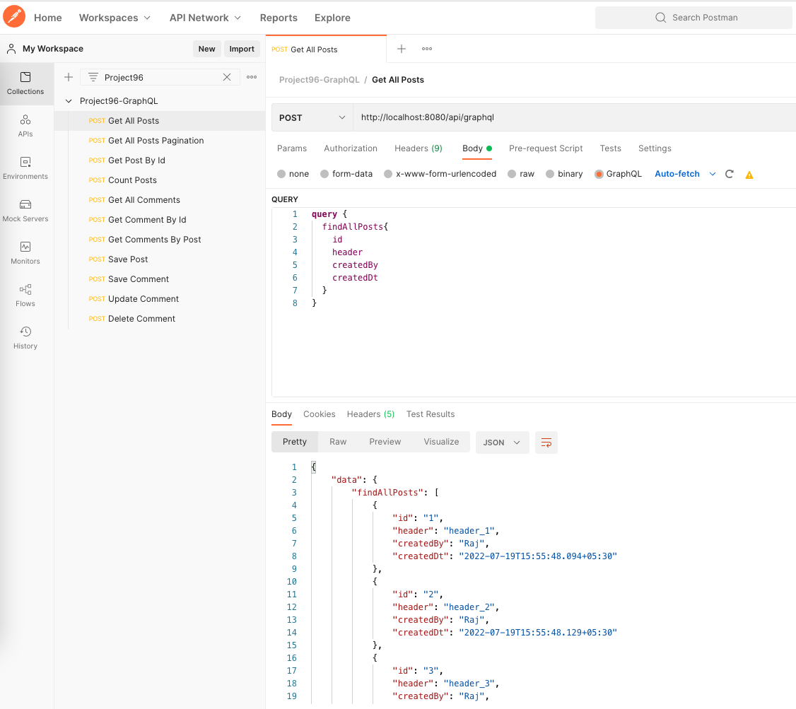
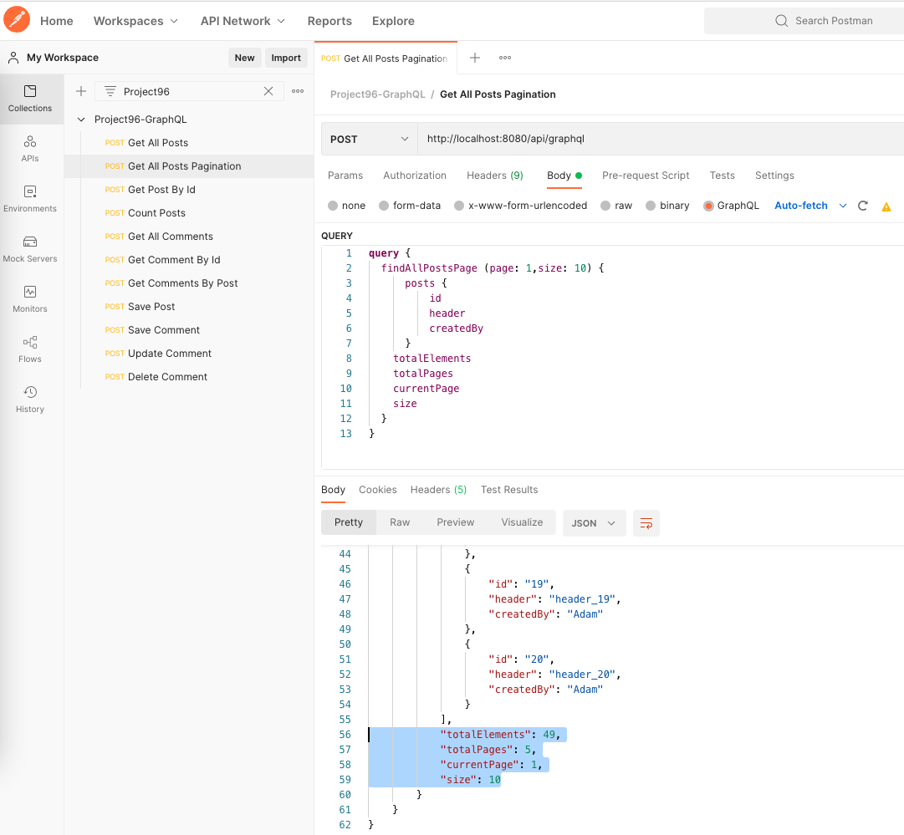
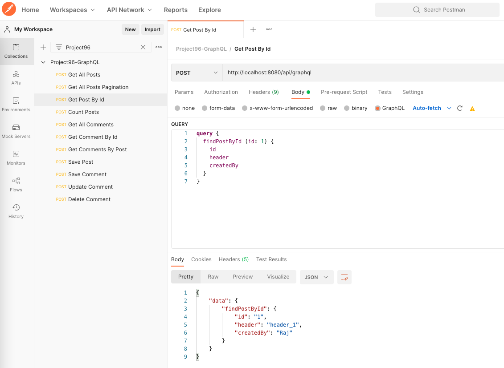
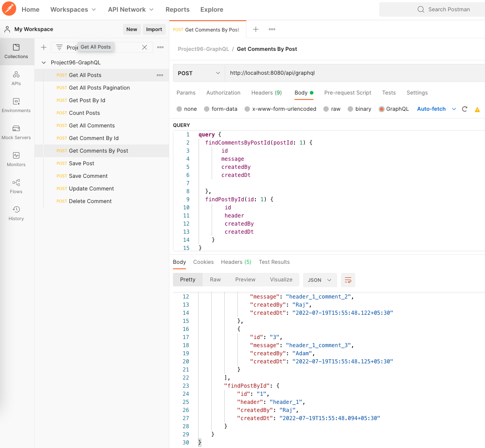
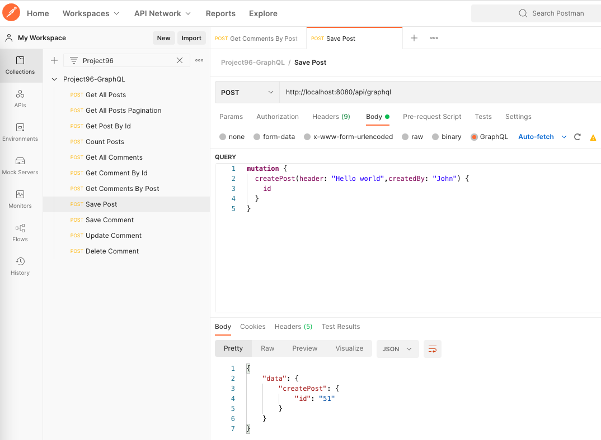
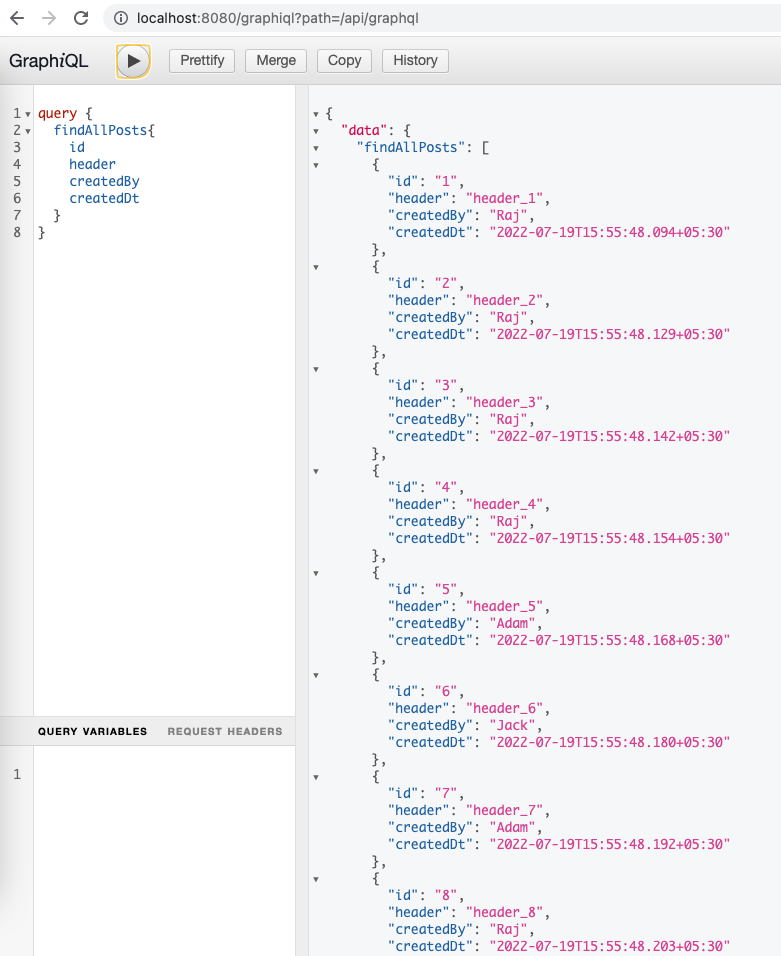

GraphQL is a query language that offers an alternative model to developing APIs instead of REST, SOAP or gRPC. It allows partial fetch of data, you can use a single endpoint to fetch different formats of data.  

Github: [https://github.com/gitorko/project96](https://github.com/gitorko/project96)

## Spring Boot GraphQL

Lets say you have a rest api that returns customer profile, the customer profile has 200+ fields, so a mobile device may not need all the fields, it may need may be 5 fields like name, address etc. Requesting a big payload over wire is costly.
So now you end up writing a rest endpoint that returns just the 5 fields. This can become overwhelming when the requirements increase and you end up creating different endpoint for such requirement.
In GraphQL you define a schema and let the user/consumer decide which fields they want to fetch. 

Before GraphQL 1.0 was Released spring had to extend the classes GraphQLMutationResolver, GraphQLQueryResolver. Its no longer required.

GraphQLMutationResolver -> @MutationMapping

GraphQLQueryResolver -> @QueryMapping

The code uses Extended Scalars for graphql-java to support Date and other type objects in GraphQL
The code shows how pagination can be done in GraphQL 

## Code





The schema for GraphQL. The ! simply tells us that you can always expect a value back and will never need to check for null.



GraphQL accepts only one root Query and one root Mutation types, To keep the logic in different files we extend the Query and Mutation types.



The key terminologies in GraphQL are

* Query: Used to read data
* Mutation: Used to create, update and delete data
* Subscription: Similar to a query allowing you to fetch data from the server. Subscriptions offer a long-lasting operation that can change their result over time.

## Setup



## Testing

## References

[https://spring.io/projects/spring-graphql](https://spring.io/projects/spring-graphql)

[https://github.com/graphql-java/graphql-java-extended-scalars](https://github.com/graphql-java/graphql-java-extended-scalars)

[https://www.graphql-java.com/tutorials/getting-started-with-spring-boot/](https://www.graphql-java.com/tutorials/getting-started-with-spring-boot/)

[https://spring.io/blog/2022/05/19/spring-for-graphql-1-0-release](https://spring.io/blog/2022/05/19/spring-for-graphql-1-0-release)
