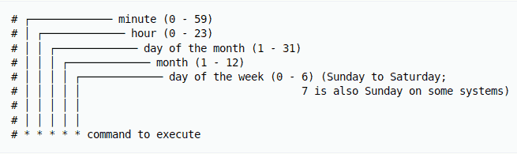
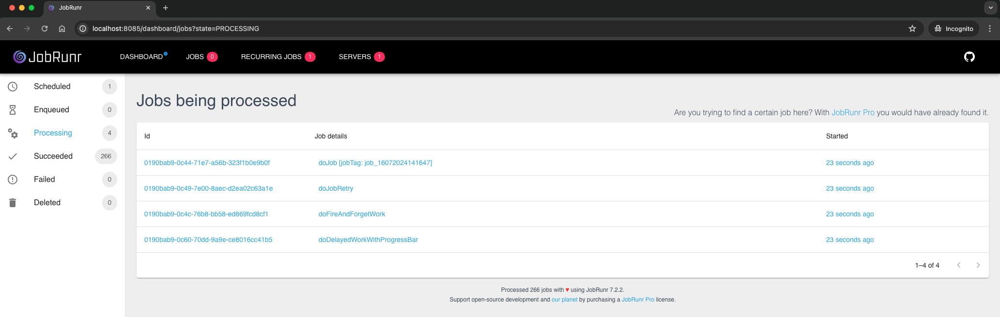
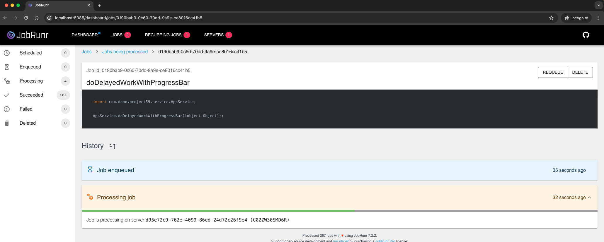
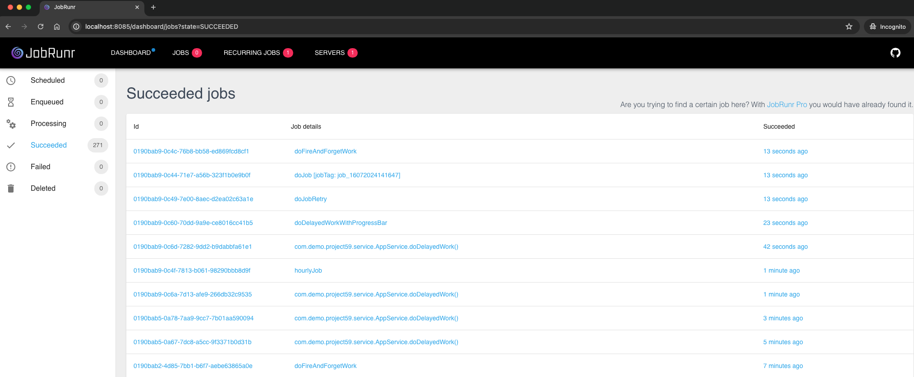
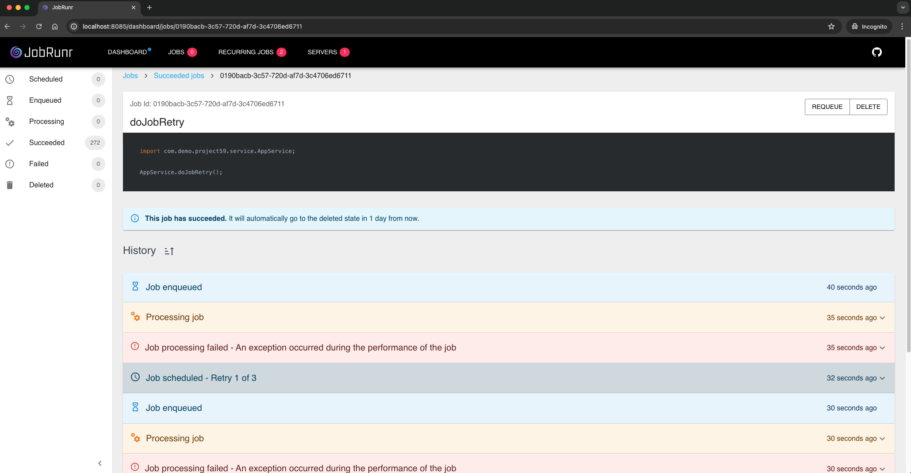
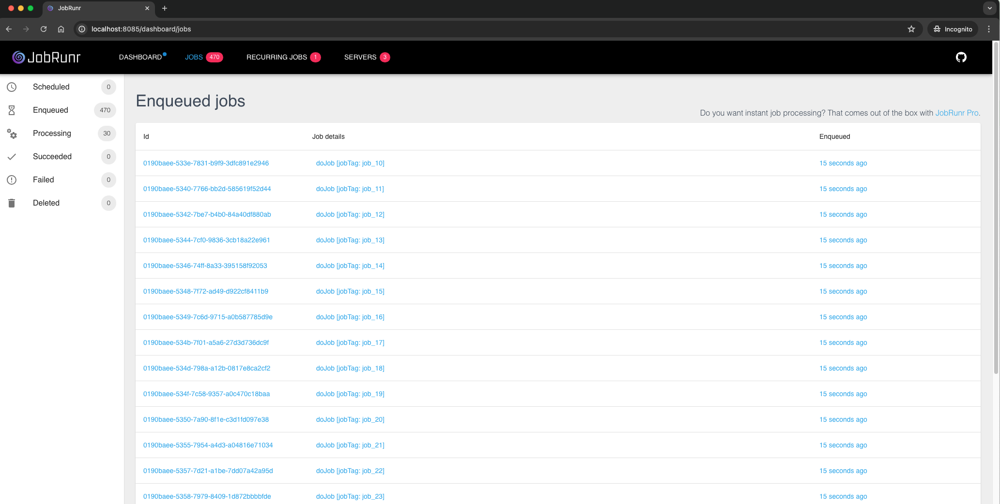
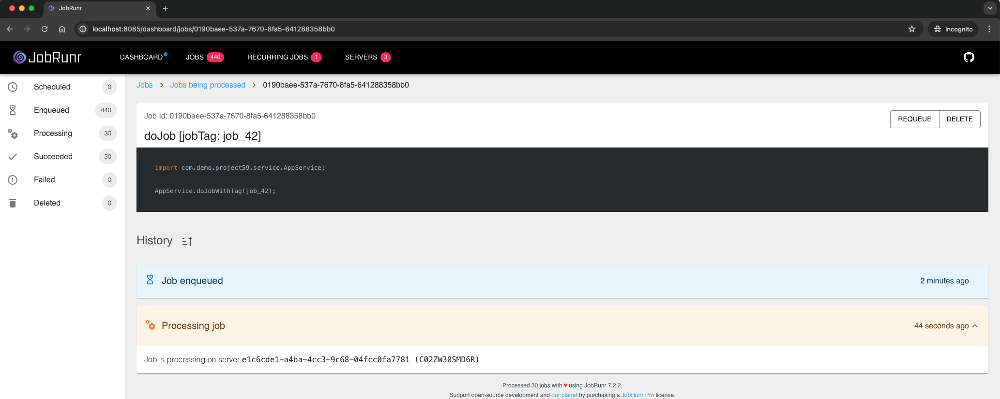
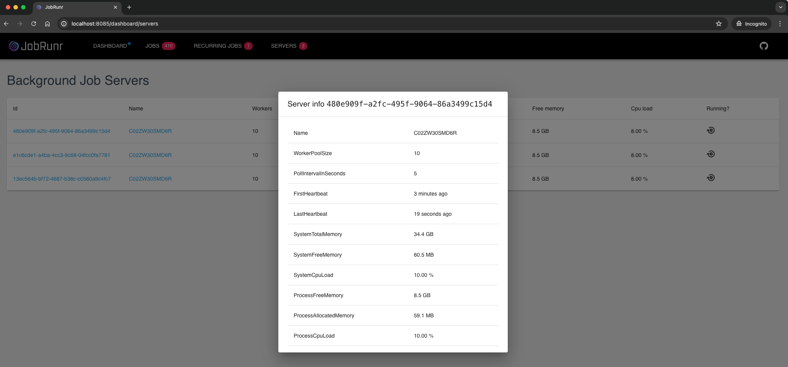
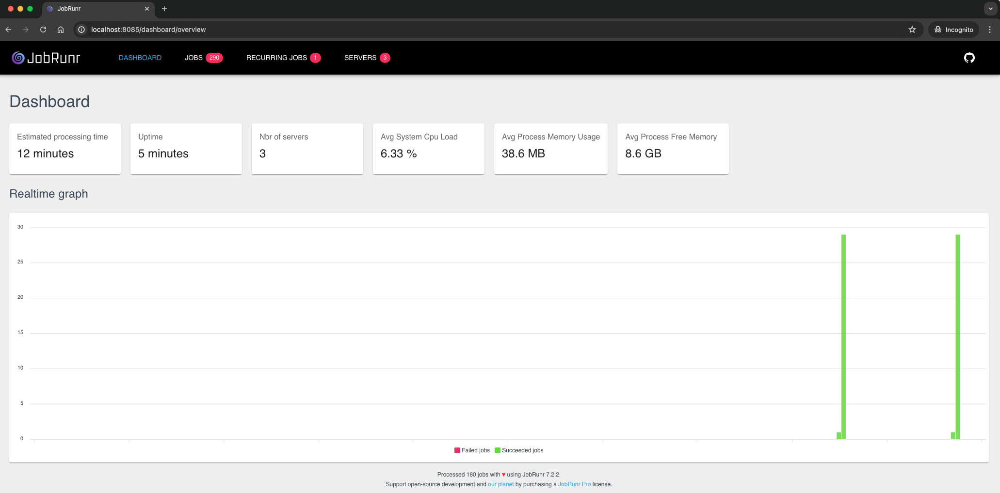

Spring Boot 3 integration with JobRunr

Github: [https://github.com/gitorko/project59](https://github.com/gitorko/project59)

## JobRunr

JobRunr is a distributed job scheduler. If a service runs on many nodes the JobRunr ensure that a scheduled job is run only on a single instance. 
If you run a spring `@Scheduled` annotation then all instances will start the same job, you can use shedlock library to prevent this but this requires extra code.

**Types of Job**

1. Fire-Forget
2. Delayed
3. Recurring Job

**Advantages**

1. It lets you schedule background jobs using lambda.
2. The jobs can run on a distributed nodes, more node that join, the work gets distributed.
3. It serializes the lambda as JSON and stores it in db. 
4. It also contains an automatic retry feature with an exponential back-off policy for failed jobs. 
5. There is also a built-in dashboard that allows you to monitor all jobs.
6. It is self-maintaining, Successful jobs are automatically deleted after a configurable amount of time, so there is no need to perform manual storage cleanup.
7. The job details are stored in db.

### Code







Open dashboard: [http://localhost:8000/dashboard/](http://localhost:8000/dashboard/)

### Setup



## References

[https://www.jobrunr.io/en/](https://www.jobrunr.io/en/)
[https://www.jobrunr.io/en/documentation/configuration/spring/](https://www.jobrunr.io/en/documentation/configuration/spring/)
