Spring Boot with Micrometer & Integration with Prometheus & Grafana.

Github: [https://github.com/gitorko/project68](https://github.com/gitorko/project68)

## Micrometer

Micrometer provides vendor neutral application metrics facade that can integrate with various monitoring systems like Prometheus, Wavefront, Atlas, Datadog, Graphite, Ganglia, Influx, JMX etc.

Traditional systems which monitored JMX attributes could only do so at a particular instance of time. With the arrival of time series database we can now use that data and visualize it over a period in time. Writing the integration to various monitoring systems is time consuming, hence micrometer simplifies it. 
Underlying metrics are exposed by Spring Boot Actuator and then Micrometer provides a facade that can be used to either push or pull metrics to monitoring systems.

Every meter has a name (hierarchical) and tag. There are 4 main types of meters.

1. Timers  - Time taken to run something.
2. Counter - Number of time something was run.
3. Guages - Report data when observed. Gauges can be useful when monitoring stats of cache, collections
4. Distribution summary - Distribution of events.

MeterRegistryCustomizer, you can customize the whole set of registries at once or individual implementation.

## Code





## Setup



## Dashboard - Prometheus & Grafana

Invoke the rest api couple of times.

```bash
curl http://localhost:8080/api/hello
```

Check if the metrics are returned by actuator

[http://localhost:8080/actuator/prometheus](http://localhost:8080/actuator/prometheus)

You should see metrics similar to

```json
hello_api_count_total{application="myapp",type="order",} 27.0
hello_api_time_seconds_count{application="myapp",exception="None",method="GET",outcome="SUCCESS",status="200",uri="/api/hello",} 27.0
hello_api_time_seconds_sum{application="myapp",exception="None",method="GET",outcome="SUCCESS",status="200",uri="/api/hello",} 102.162818601
hello_api_time_seconds_max{application="myapp",exception="None",method="GET",outcome="SUCCESS",status="200",uri="/api/hello",} 0.0
```

Open Prometheus url: [http://localhost:9090](http://localhost:9090)

Prometheus should now start pulling data from the spring application. Click on status -> targets on prometheus dashboard to confirm that endpoint is up.

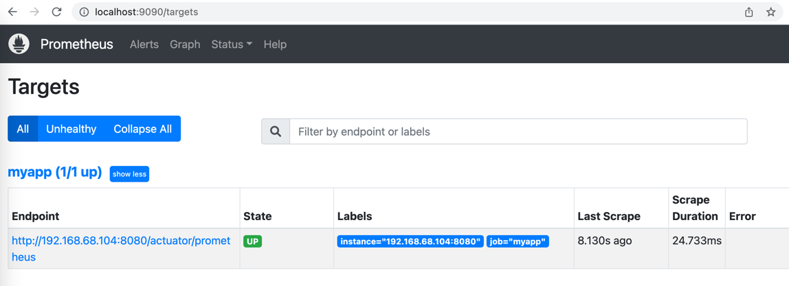

Query the metric hello_api_count_total and view as graph

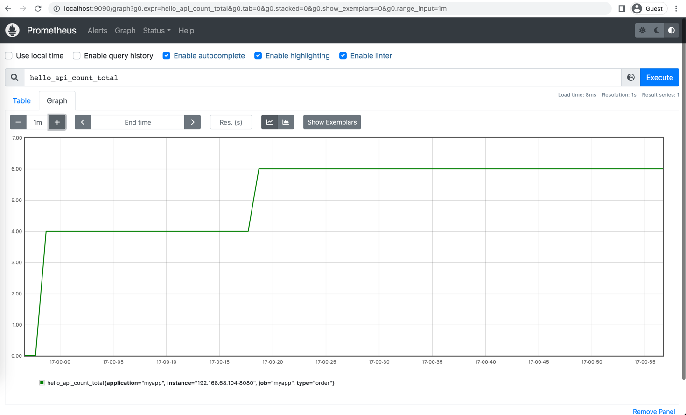

The dashboard in Prometheus is minimal, to add more complex dashboard and visualization you can look at Grafana.

Open Grafana url: [http://localhost:3000/](http://localhost:3000/)

Login, you will need to change the password on first login

```
user: admin
password: admin
```

Add the prometheus data source, make sure its the ip address of your system, dont add localhost

http://IP-ADDRESS:9090

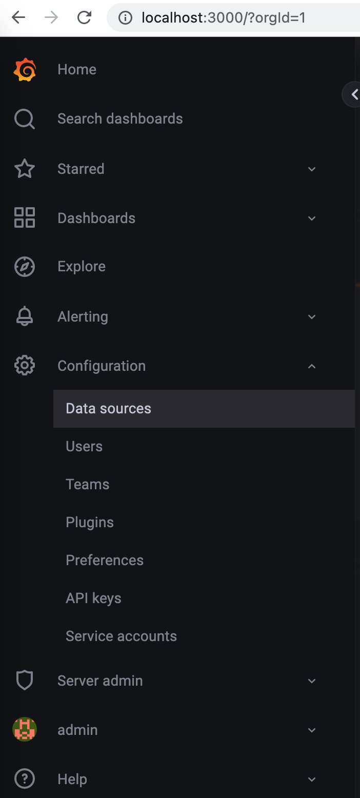
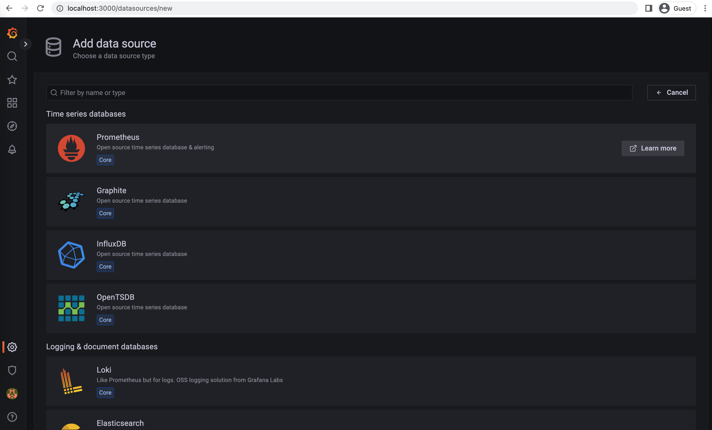
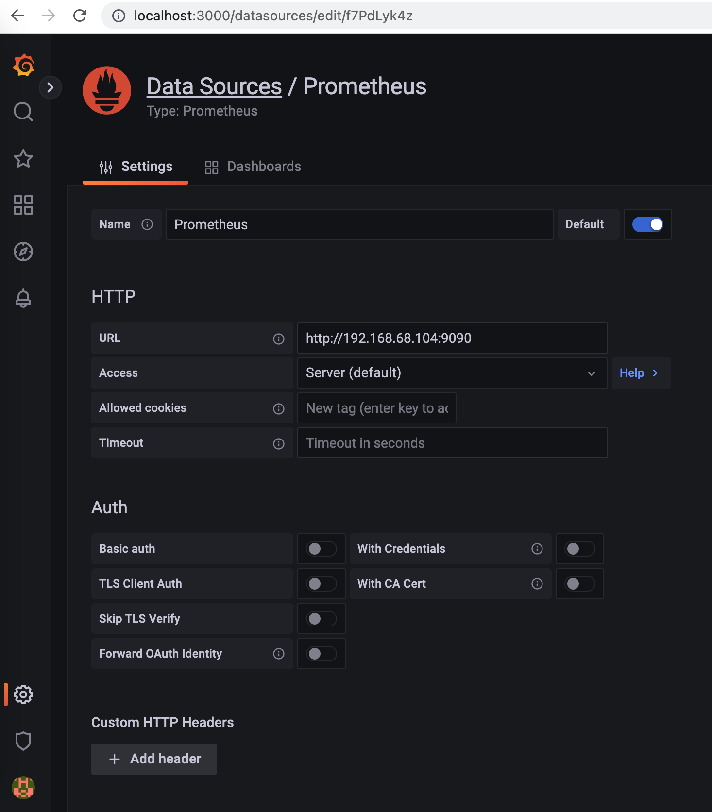

There are existing grafana dashboards that can be imported.
Import a dashboard, Download the json file or copy the ID of the dashboard for micrometer dashboard.

[https://grafana.com/dashboards/4701](https://grafana.com/dashboards/4701)

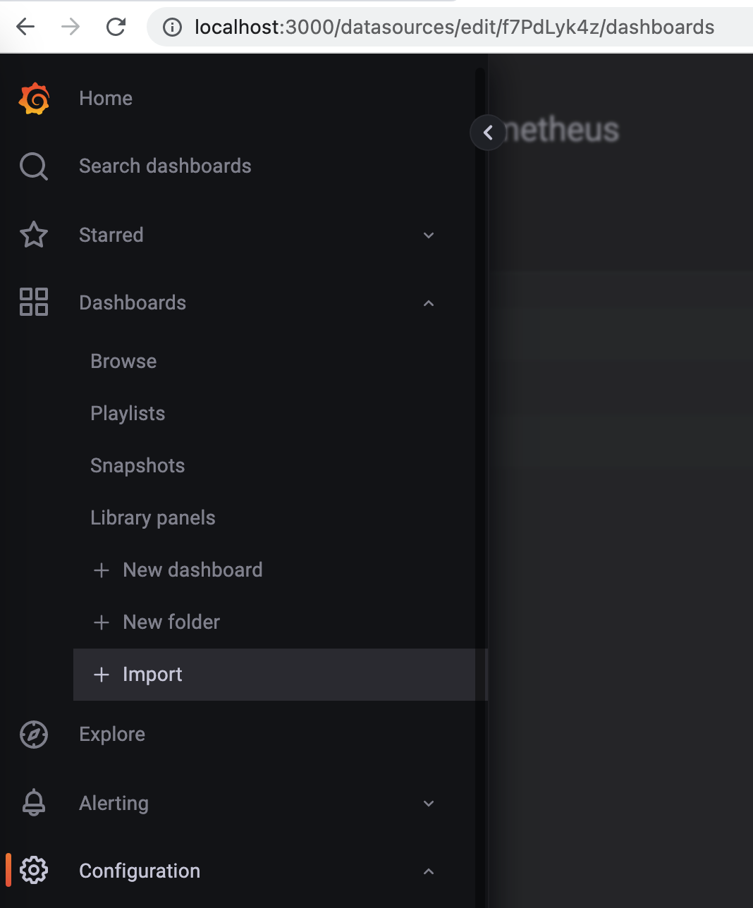
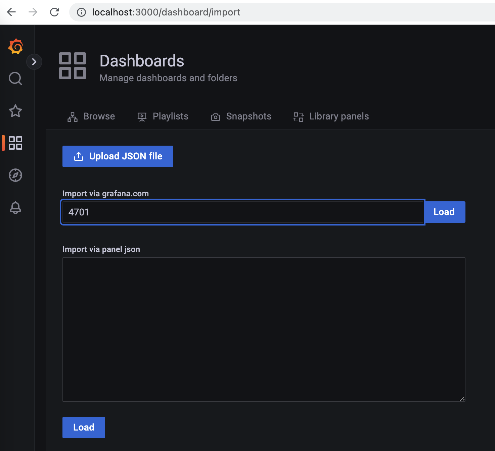
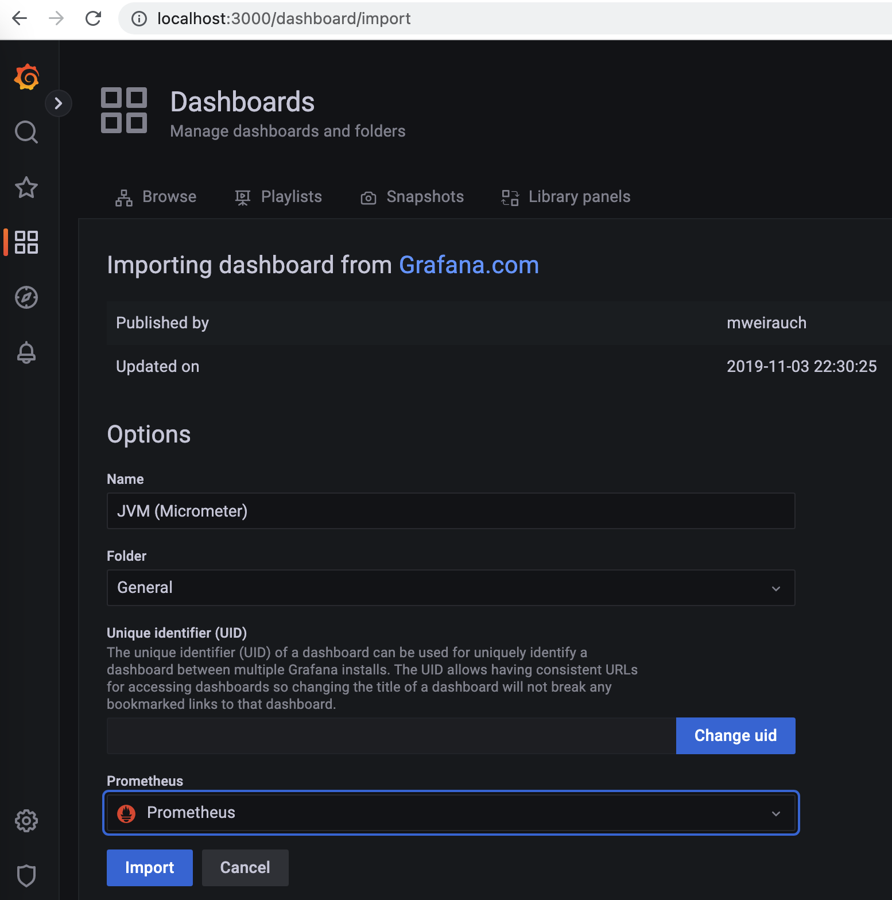
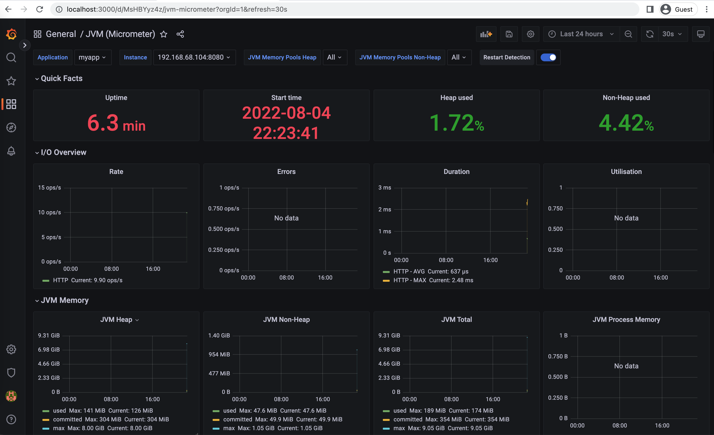

Create a custom dashboard, Add a new panel, add 'hello_api_count_total' metric in the query, save the dashboard.

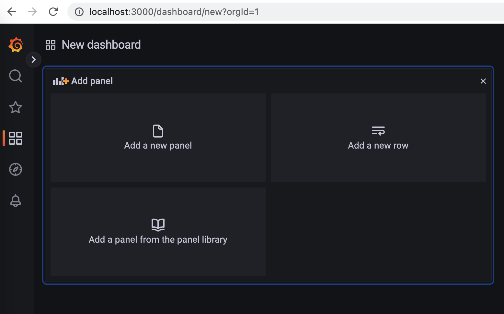
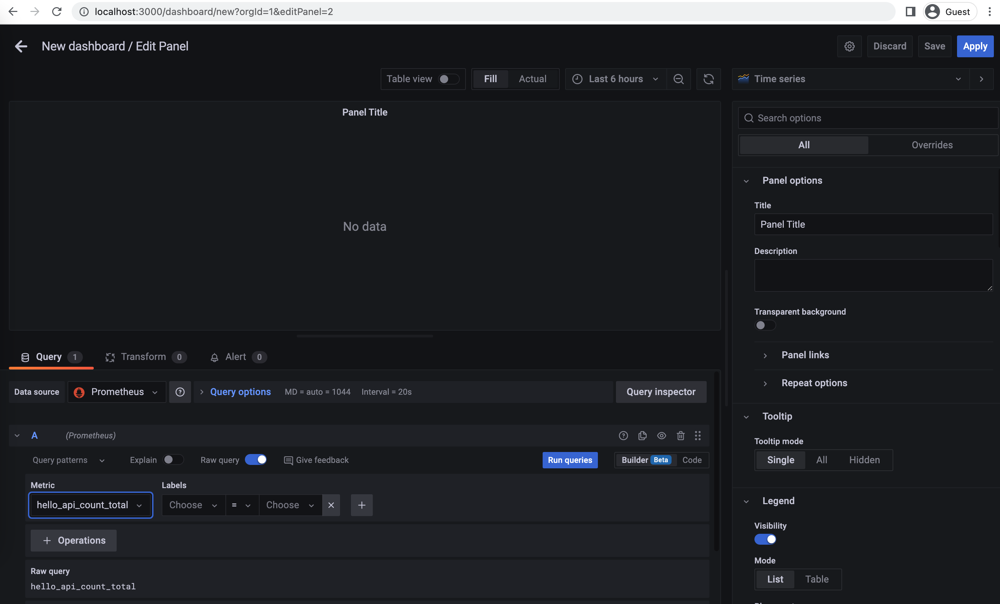
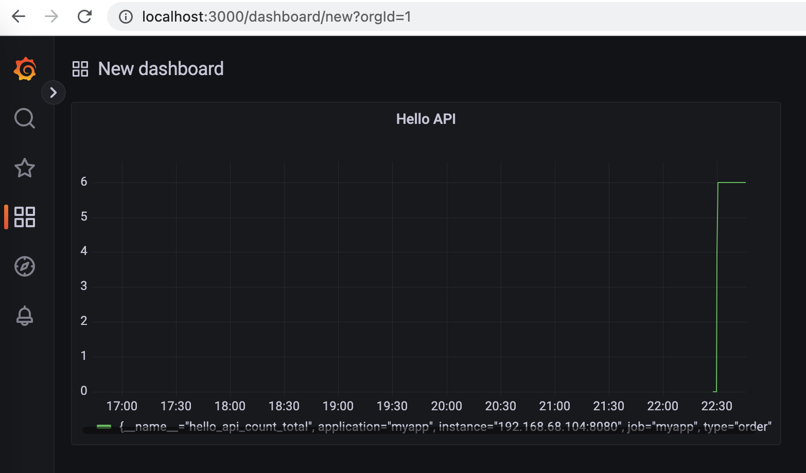
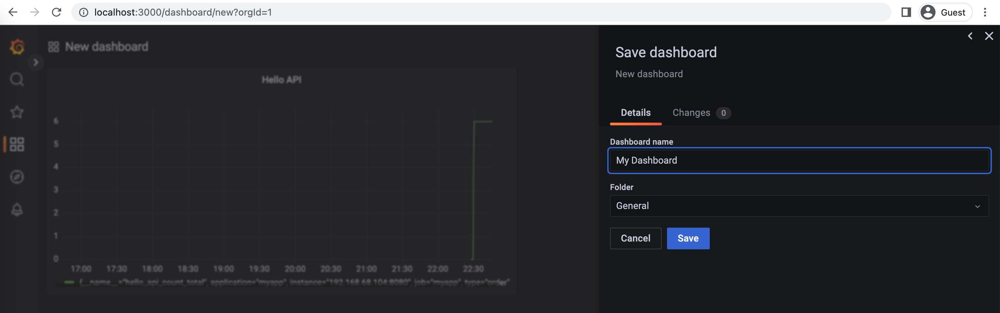

## References

[https://micrometer.io/docs](https://micrometer.io/docs)

[https://prometheus.io/](https://prometheus.io/)

[https://grafana.com/](https://grafana.com/)

[https://grafana.com/grafana/dashboards/4701](https://grafana.com/grafana/dashboards/4701)

[https://grafana.com/grafana/dashboards/](https://grafana.com/grafana/dashboards/)
