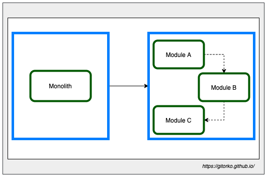
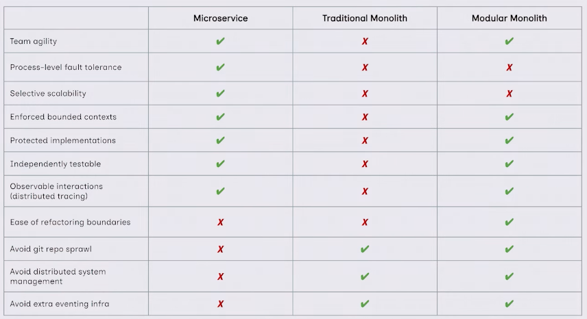

Spring boot modulith implementation with spring events & persistence with postgres.

Github: [https://github.com/gitorko/project73](https://github.com/gitorko/project73)

## Spring Monolith

Modular Monolith is an architectural style where our source code is structured on the concept of modules



Spring Modulith is a module of Spring that helps in organizing large applications into well-structured, manageable, and self-contained modules. It provides various features like module isolation, events, and monitoring to support a modular architecture.

Building a Modern Monolith application, with Spring Modulith lets you avoid the network jumps, serialization & de-serialization. Each service is isolated via package boundary. 
Eg: OrderService, NotificationService bean won't be injected in all the classes, instead they rely on spring events.

You can structure your code based on domain, Order package deals only with processing the order, notification package deals only with sending notifications etc. We can split the core of the monolith into modules by identifying the domains of our application and defining bounded contexts.
We can consider the domain or business modules of our application as direct sub-packages of the application’s main package.

Spring events ensures loose coupling in an application, it allows inter-module interaction.
Instead of injecting different beans and invoking them in the directly you now publish an event and all other places that need to process it will implement a listener.

Tightly coupled with single commit transaction boundary

```java
@Transactional
public void complete(Order order) {
    orderService.save(order);
    inventoryService.update(order);
    auditService.add(order);
    rewardService.update(order);
    notificationService.update(order);
}
```

Loosely coupled but still single commit transaction boundary 

```java
@Transactional
public void complete(Order order) {
    applicationEventPublisher.publishEvent(order);
}
```

Service can be developed without all the implementations. 
Eg: Audit logging service is being developed and not ready, hence instead of being blocked on developing the core customer service class, just publish an event and when the service is ready add a listener to process that event. 

Spring events are in-memory so if the server restarts all events published will be lost. 
With Spring Modulith library you can now persist such event and process them after a restart.

1. A module can access the content of any other module but can't access sub-packages of other modules.
2. A module also cant access content that is not public

By default `@EventListener` run on the same thread as the caller, to run it asynchronously use `@Async`

`@ApplicationModuleListener` by default comes with `@Transactional`, `@Async` & `@TransactionalEventListener` annotation enabled.

`@Externalized` will publish the events to queues like RabbitMQ/Kafka.

To process the events on restart enable this flag.

```yaml
spring:
  modulith:
    republish-outstanding-events-on-restart: true
```



### Code









### Setup



## References

[https://spring.io/blog/2015/02/11/better-application-events-in-spring-framework-4-2](https://spring.io/blog/2015/02/11/better-application-events-in-spring-framework-4-2)

[https://spring.io/projects/spring-modulith](https://spring.io/projects/spring-modulith)

[https://github.com/xmolecules/jmolecules](https://github.com/xmolecules/jmolecules)