Spring Boot Observability

Github: [https://github.com/gitorko/project71](https://github.com/gitorko/project71)

Application monitoring can be classified into

1. Observability - Creates metrics, traces, logs that get stored in time-series db and charts are created. eg: Prometheus, Grafana, OpenTelemetry, Jaeger, Zipkin
2. APM (Application Performance Management) - Runs an agents in the jvm that instruments the bytecode and sends metrics to a remote server, focuses on performance and user experience in the application layer. eg: New Relic, Datadog APM, AppDynamics, Dynatrace, Elastic APM
3. Monitoring - Checks endpoint uri to monitor health (cpu, memory) infrastructure-centric for alerting. eg: Nagios, Prometheus

## Observability

Observability is the ability to observe the internal state of a running system from the outside. Observability has 3 pillars

1. **Metrics**: Quantitative data about system performance (e.g., CPU usage, request count, error rates) eg: `spring-boot-starter-actuator`.
2. **Logs**: Event-based data for tracking specific actions and events with correlation/span id (e.g., application logs) eg: `micrometer-tracing-bridge-brave`.
3. **Traces**: Distributed tracing for tracking the path of a request across services (e.g., tracing API calls) eg: `zipkin-reporter-brave`.

Various tools that help in observability

1. **Prometheus** - An open-source systems monitoring and alerting tool. Prometheus scrapes/collects metrics from an endpoint at regular intervals. Stores the data in a time series database.
2. **Grafana** - A visualization tool, can pull data from multiple sources (Prometheus) and shows them in graphs.
3. **Zipkin** - A distributed tracing system. It helps gather timing data needed to troubleshoot latency problems in service architectures.

Micrometer is a vendor-neutral instrumentation library that allows you to collect metrics and traces for observability.

1. Metrics Collection - Supports Prometheus, Graphite, Datadog, New Relic, etc.
2. Tracing Support - Used with Brave (Zipkin), OpenTelemetry, Wavefront, etc.
3. Logging Context Propagation - Adds tracing IDs in logs for better debugging
4. Spring Integration - Works out of the box with Spring Boot’s Actuator

Spring Observability internally uses Micrometer, so in Spring Boot 3+, you should use Spring Observability APIs for new projects

### Logging

Tracing adds spans/traces to all logs.

### Metrics

A `Meter` consists of a name and tags, There are 4 main types of meters.

1. Timers - Time taken to run something.
2. Counter - Number of time something was run.
3. Gauge - Report data when observed. Gauges can be useful when monitoring stats of cache, collections
4. Distribution summary - Distribution of events.
5. Binders - Built-in binders to monitor the JVM, caches, ExecutorService, and logging services

### Distributed Tracing

Spring Boot samples only 10% of requests to prevent overwhelming the trace backend. 
Change probability to 1.0 so that every request is sent to the trace backend.

```yaml
management:
  tracing:
    sampling:
      probability: 1.0
```

### Code







### Postman

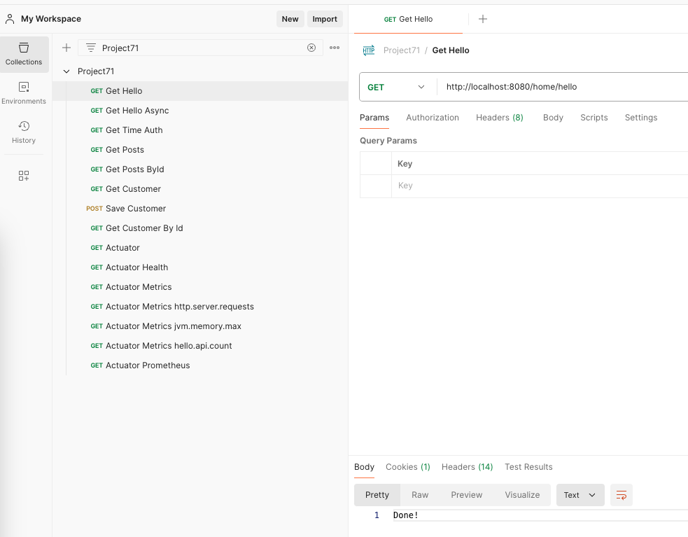

Import the postman collection to postman

[Postman Collection](https://raw.githubusercontent.com/gitorko/project71/main/postman/Project71.postman_collection.json)

### Setup



Open zipkin dashboard

[http://localhost:9411/zipkin/](http://localhost:9411/zipkin/)

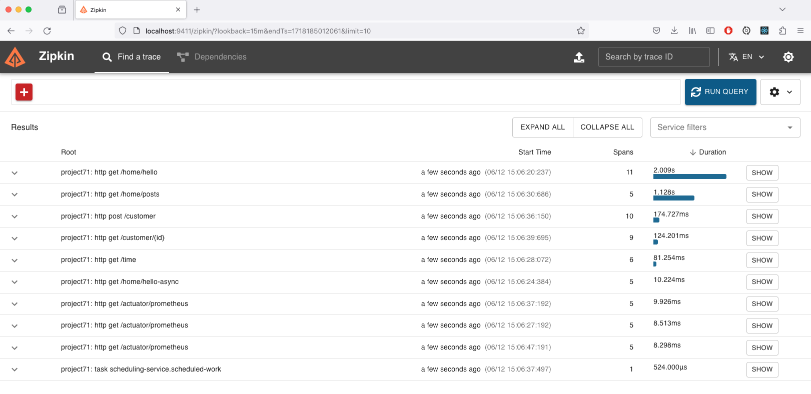

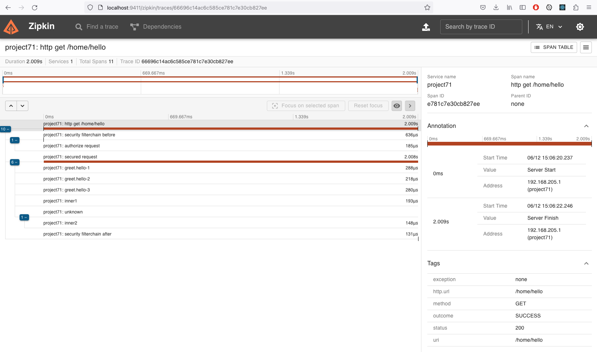

Open prometheus dashboard

[http://localhost:9090](http://localhost:9090)

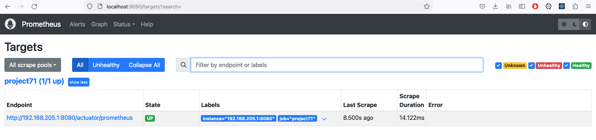

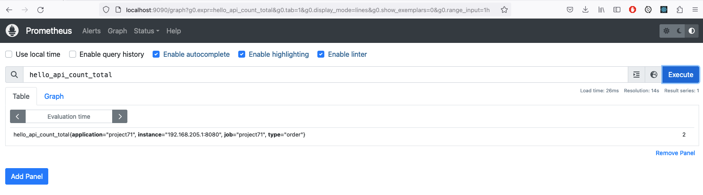

Open grafana dashboard

[http://localhost:3000](http://localhost:3000)

```
user: admin
password: admin
```

Add the prometheus data source, make sure it's the ip address of your system, don't add localhost

http://IP-ADDRESS:9090

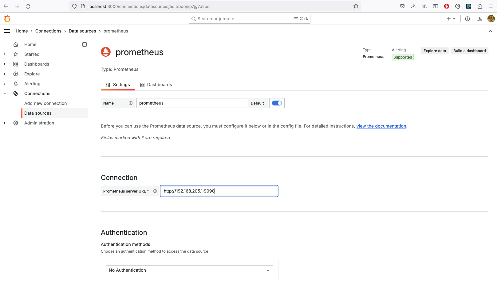

There are existing grafana dashboards that can be imported. Import a dashboard, Download the json file or copy the ID of the dashboard for micrometer dashboard.

https://grafana.com/dashboards/4701

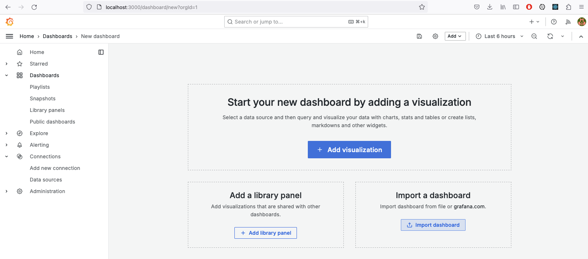

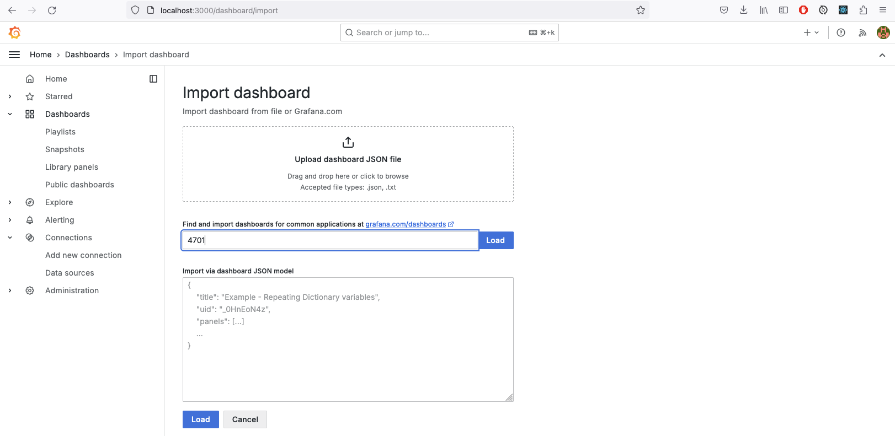

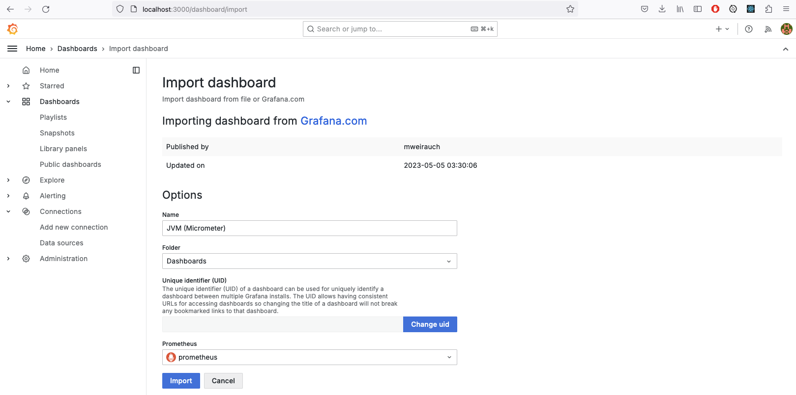

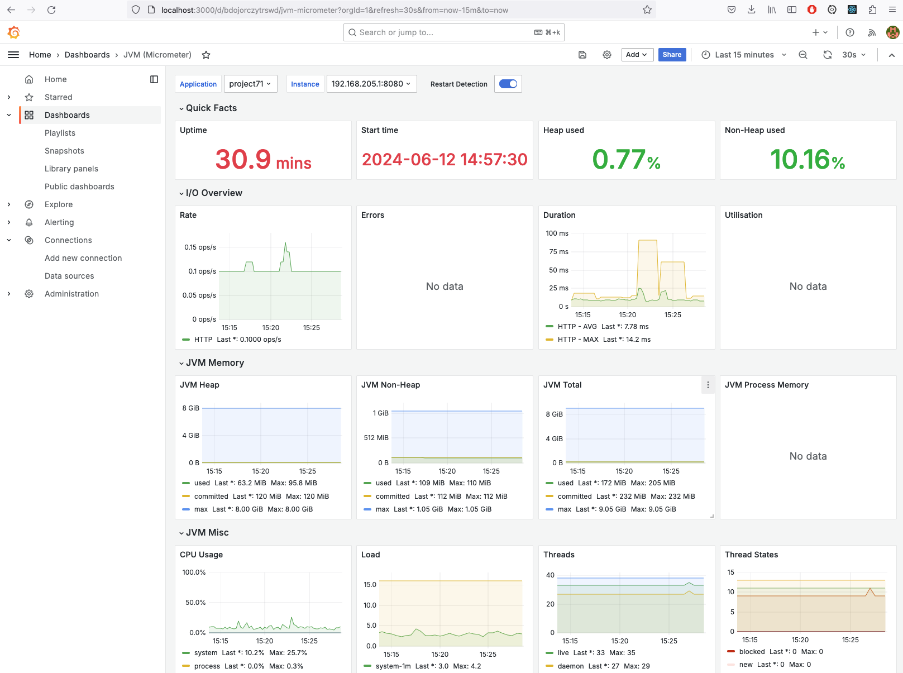

Create a custom dashboard, Add a new panel, add 'hello_api_count_total' metric in the query, save the dashboard.

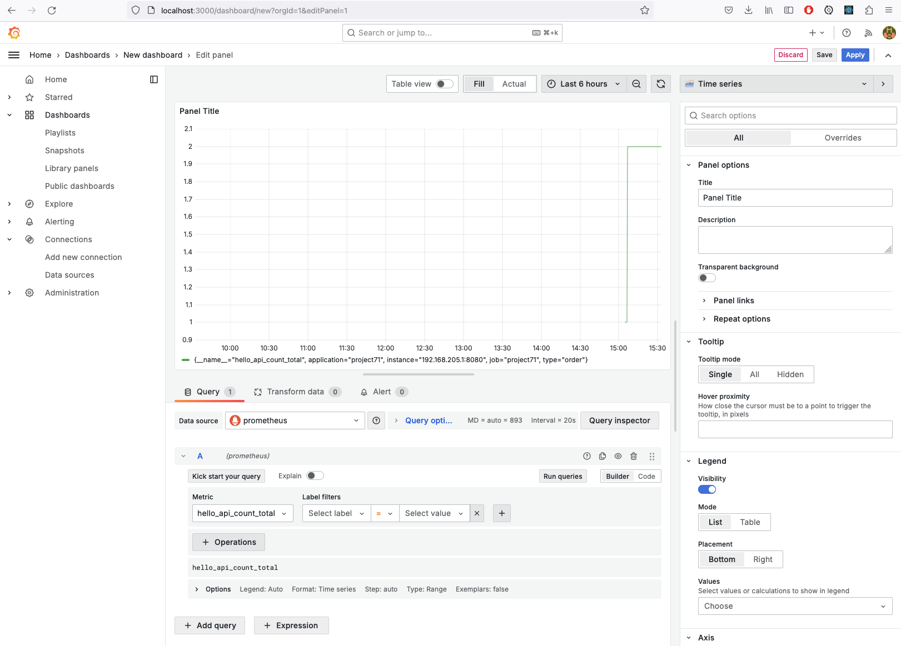

## References

[https://micrometer.io/docs](https://micrometer.io/docs)

[https://prometheus.io/](https://prometheus.io/)

[https://grafana.com/](https://grafana.com/)

[https://grafana.com/grafana/dashboards/4701](https://grafana.com/grafana/dashboards/4701)

[https://grafana.com/grafana/dashboards/](https://grafana.com/grafana/dashboards/)
