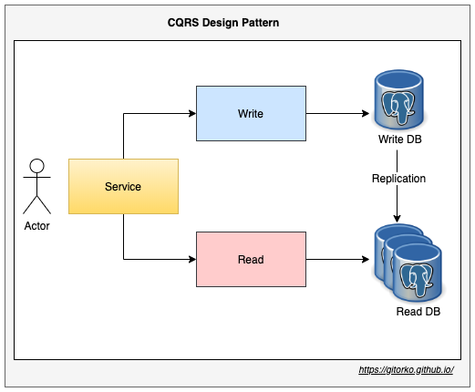

Spring boot implementation of CQRS pattern

Github: [https://github.com/gitorko/project99](https://github.com/gitorko/project99)

## Main Topic

CQRS (Command and Query Responsibility Segregation) a pattern that separates read and update operations for different data store. This maximizes application performance, scalability, and security.
We will start 2 database servers where writes goto the primary database and reads are done on the secondary database. Replication happens from primary db to secondary db.
This is an AP model (CAP Theorem) as replication will result in eventual consistency.

### Code







### Postman

Import the postman collection to postman

[Postman Collection](https://raw.githubusercontent.com/gitorko/project99/main/postman/Project99.postman_collection.json)

### Setup



## References

[https://spring.io](https://spring.io/)
