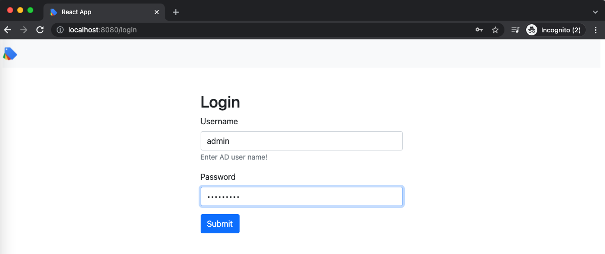
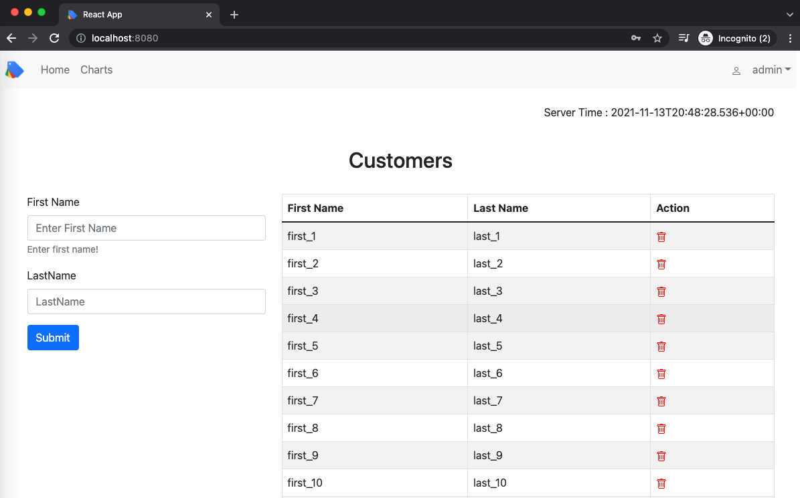
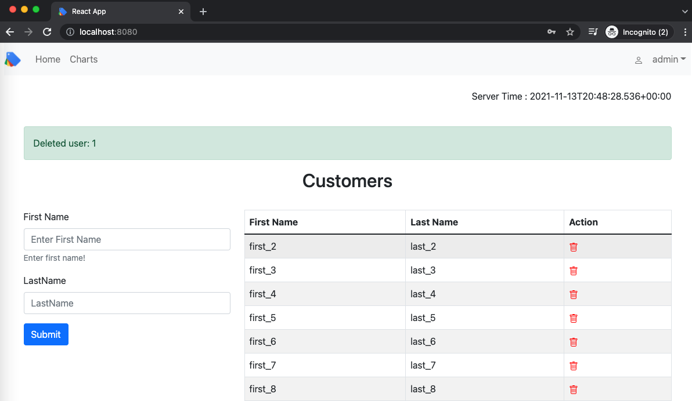
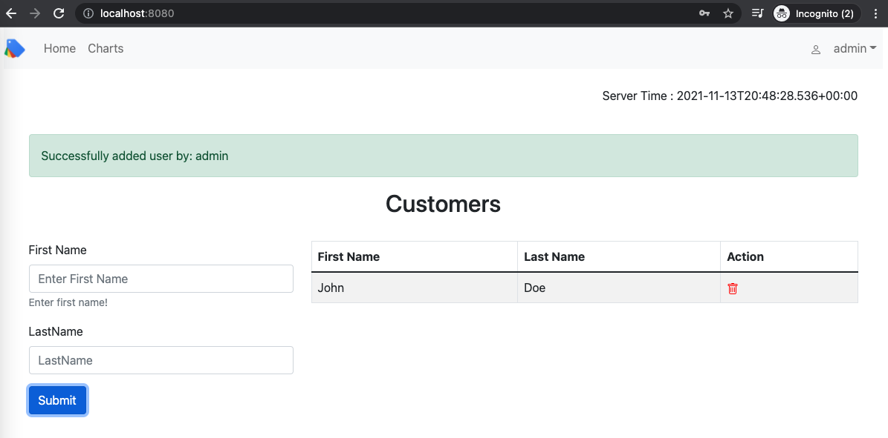
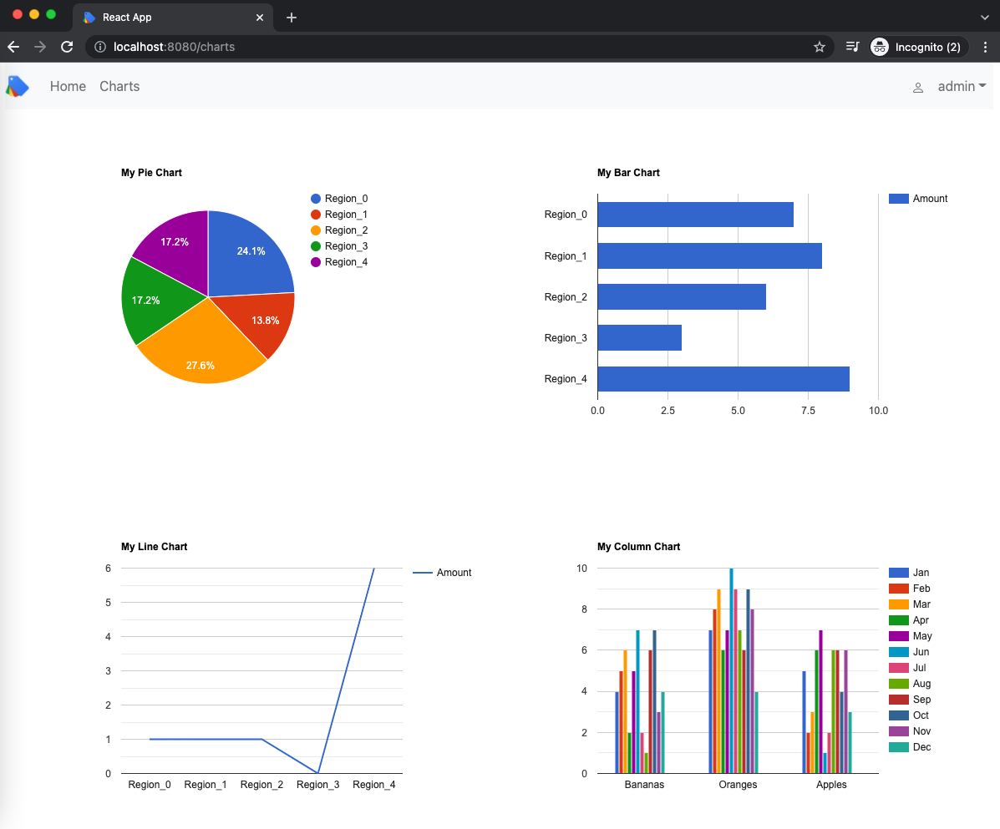
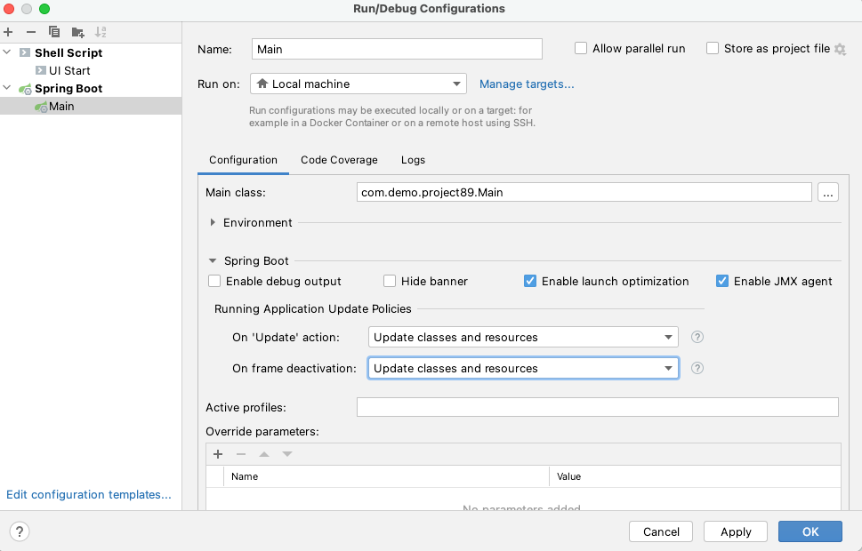
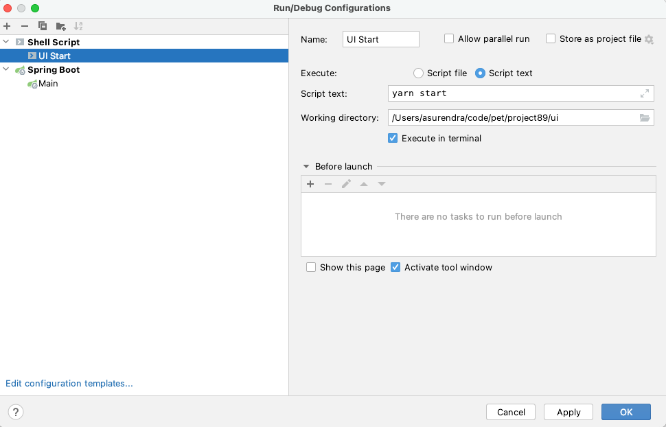

Spring Boot web application with reactjs and JWT authentication support, uses bootstrap and google chart. 
Creates uber jar to deploy.

Github: [https://github.com/gitorko/project89](https://github.com/gitorko/project89)

## Quick Overview

To deploy the application in a single command, clone the project, make sure no conflicting docker containers or ports are running and then run

```bash
git clone https://github.com/gitorko/project89
cd project89
docker-compose -f docker/docker-compose.yml up 
```

Open [http://localhost:8080/](http://localhost:8080/)

## Features

A Spring Web application with reactjs. Supports JWT authentication and provides login & logout features.
Uses Spring Data to persist data into the postgres db. Spring dev tools allow seamless reload on any changes for java files.

1. ReactJS app supports basic JWT authentication
2. Bootstrap 5
3. CRUD UI for adding and removing customer to db.
4. Charts for bar,pie,stack charts with data from rest api

## Design







## Code

To allow spring dev tools to reload on change you need to enable 'Update classes and resources' in Intellij as shown below







Spring security is configured for JWT authentication.







We will use the bootstrap 5 library and use the many components it provides.



## Setup



## Testing

```bash
curl --location --request POST 'http://localhost:8080/api/login' \
--header 'Content-Type: application/json' \
--data-raw '{
    "username": "admin",
    "password": "admin@123"
}'
```

```bash
curl --location --request GET 'http://localhost:8080/api/time' \
--header 'Authorization: Bearer <TOKEN>'
```

## References

[https://react-bootstrap.github.io/](https://react-bootstrap.github.io/)

[https://react-google-charts.com/](https://react-google-charts.com/)
