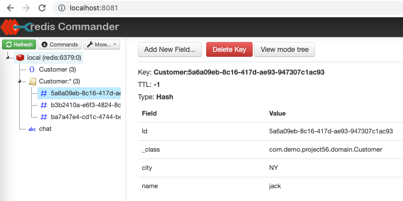
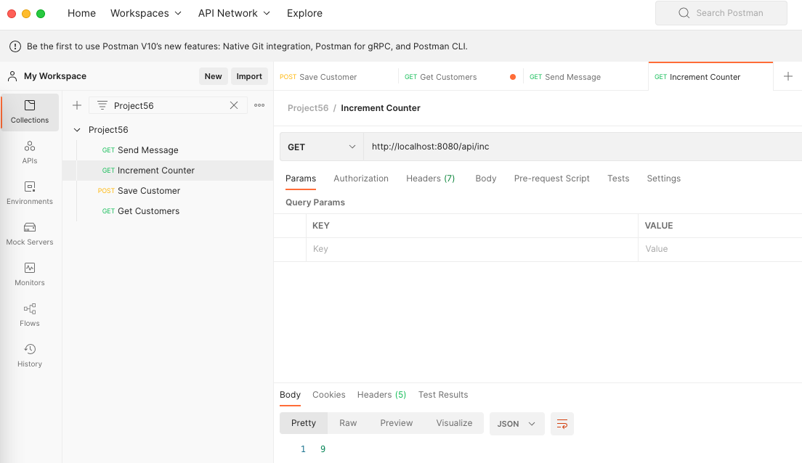

Spring boot application integration with redis for messaging & data persistence.

Github: [https://github.com/gitorko/project56](https://github.com/gitorko/project56)

## Redis

Redis can be used as an in-memory data store, database, cache, streaming engine, and message broker.

## Code





## Postman

Import the postman collection to postman

[Postman Collection](https://raw.githubusercontent.com/gitorko/project56/main/postman/Project56.postman_collection.json)

## Setup



## References

[https://spring.io/projects/spring-data-redis/](https://spring.io/projects/spring-data-redis/)
