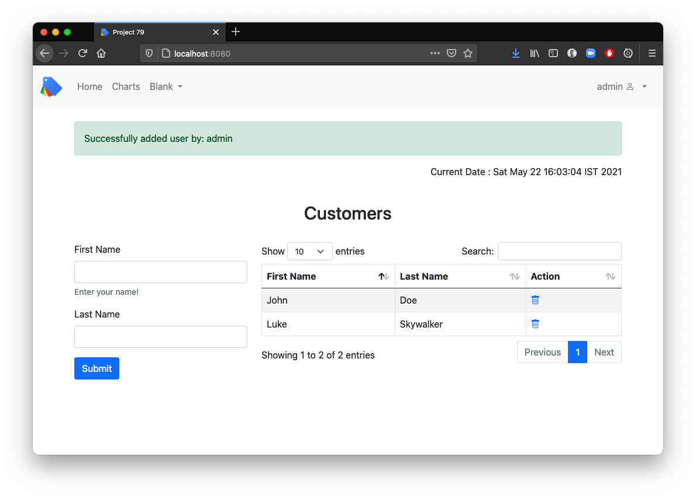
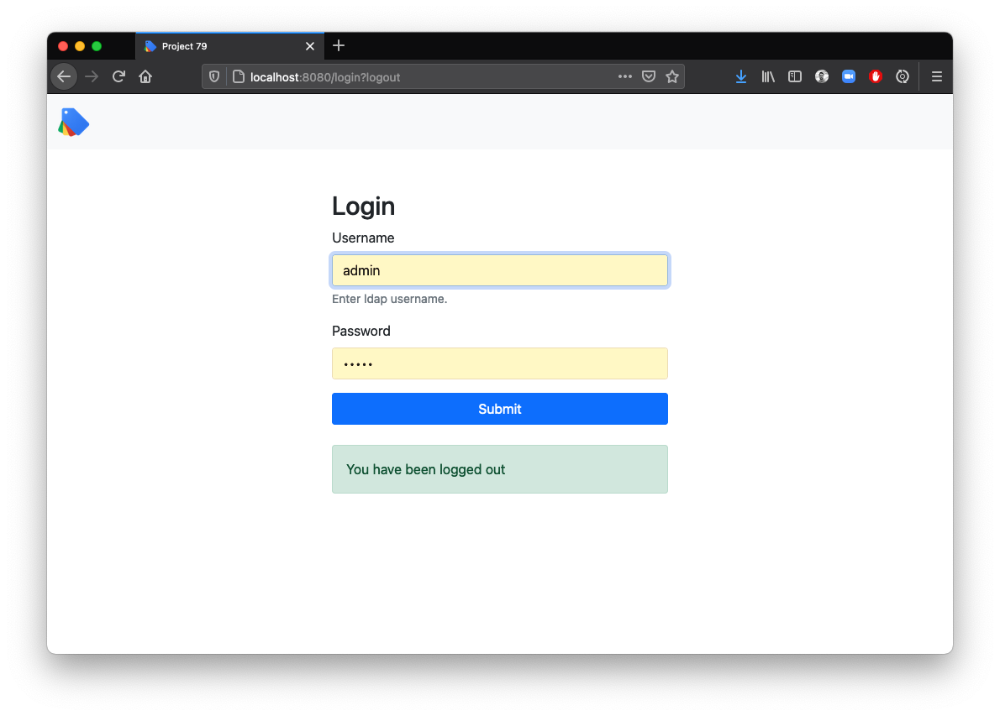
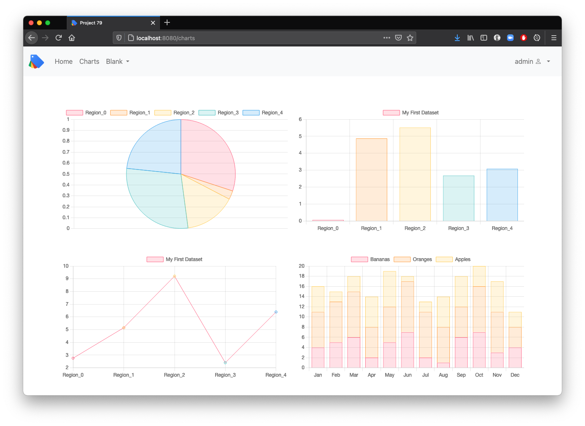
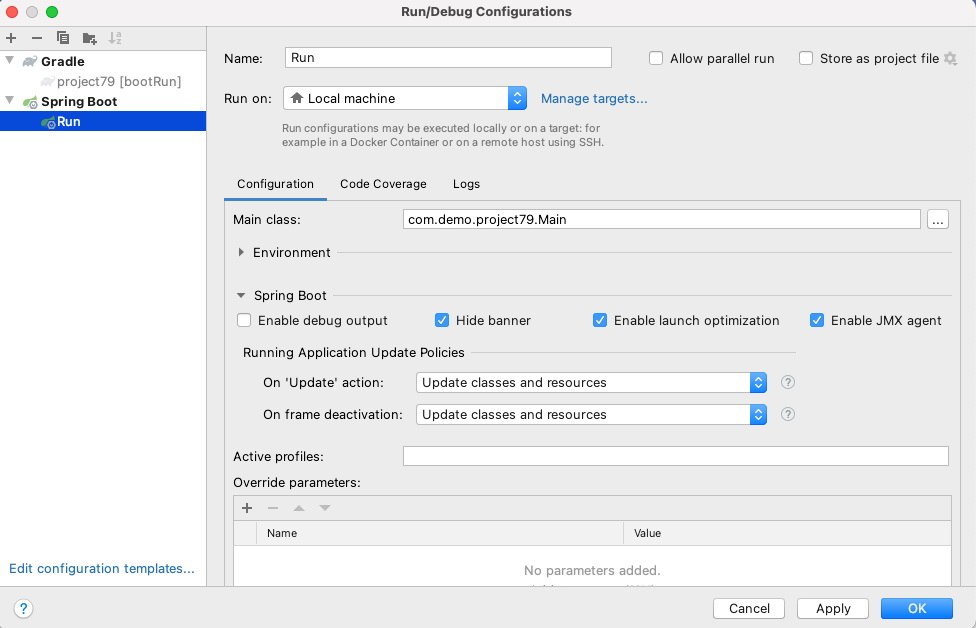

Spring Boot MVC application with Thymeleaf template & basic spring security support, uses bootstrap for CSS and chart.js for rendering charts. 
Creates uber jar to deploy.

Github: [https://github.com/gitorko/project79](https://github.com/gitorko/project79)

## Quick Overview

To deploy the application in a single command, clone the project, make sure no conflicting docker containers or ports are running and then run

```bash
git clone https://github.com/gitorko/project79
cd project79
docker-compose -f docker/docker-compose.yml up 
```

Open [http://localhost:8080/](http://localhost:8080/)

## Features

A Spring Web MVC application that renders thymeleaf templates as HTML. Supports basic integration with spring security and provides login logout support.
Uses Spring Data to persist data into the HSQL db. A file based HSQL server db is used so that data persists across restarts. This can easily be changed to in-memory HSQL db.
Spring dev tools allow seamless reload on any changes for html and java files so you can view the changes in the browser as soon as you edit them.

1. Supports basic login via spring security
2. Bootstrap 5
3. Login screen
4. CRUD UI for adding and removing customer
5. HSQL db
6. Spring JPA
7. Thymeleaf template
8. Chart.js charts for bar,pie,stack charts with data from rest api

## Design





## Code

On Intellij to allow spring dev tools to reload on change you need to enable 'Update classes and resources' as shown below



Spring MVC controller renders the HTML.



Spring Security is configured for BASIC authentication



chart.js is a library that provides various charts, the project renders charts and the data is fetched from Rest API.









## Setup



## References

[https://getbootstrap.com/](https://getbootstrap.com/)

[https://www.chartjs.org/](https://www.chartjs.org/)
