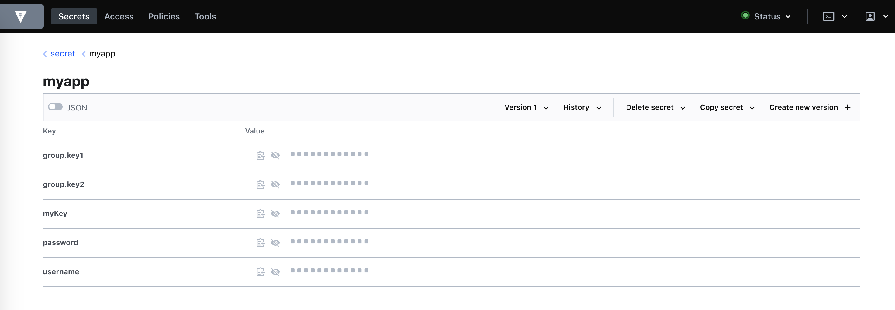

HashiCorp's vault is a tool to store and secure secrets along with tight access control. You can store tokens, passwords, certificates, API keys and other secrets.
Spring Vault provides spring abstractions to vault.
Sometimes you need your running application to detect the changed property value in order to provide a toggle on/off feature.

Github: [https://github.com/gitorko/project76](https://github.com/gitorko/project76)



## Code

Based on the spring profile the respective properties get loaded from vault.

After the feature flag is changed, the new property value is detected by the application without needing a restart.







To provide a feature toggle feature you can use the @RefreshScope annotation and trigger a refresh using spring actuator.

## Setup



## Testing 

You should now see the values being fetched from vault.

You can now invoke greet api to see a 'Good Morning' response.

```bash
curl --location --request GET 'localhost:8080/greet'
```

Now lets change the feature flag to false in vault

```bash
vault kv patch secret/myapp/dev featureFlag=false
```

In order for the values to be refreshed by spring context you need to make a call to actuator api

```bash
curl --location --request POST 'http://localhost:8080/actuator/refresh'
```

Now the values will be refreshed and invoking greet api will show 'Good Bye' response.

```bash
curl --location --request GET 'localhost:8080/greet'
```

Few more vault commands to try out

```bash
vault kv get -field=username secret/myapp/dev
vault kv delete secret/myapp/dev
vault kv delete secret/myapp/prod
```

## References

[https://cloud.spring.io/spring-cloud-vault/reference/html/](https://cloud.spring.io/spring-cloud-vault/reference/html/)

[https://www.vaultproject.io/](https://www.vaultproject.io/)

[https://spring.io/guides/gs/accessing-vault/](https://spring.io/guides/gs/accessing-vault/)
