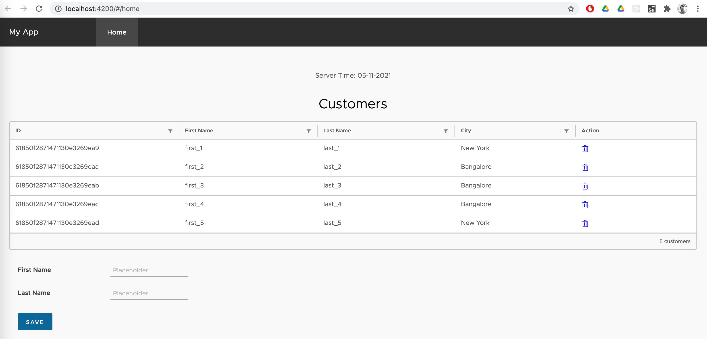

Spring Reactive web application with angular clarity and & reactive mongo db. 
Creates uber jar to deploy.

Github: [https://github.com/gitorko/project60](https://github.com/gitorko/project60)

## Quick Overview

To deploy the application in a single command, clone the project, make sure no conflicting docker containers or ports are running and then run

```bash
git clone https://github.com/gitorko/project60
cd project60
docker-compose -f docker/docker-compose.yml up 
```

Open [http://localhost:8080/](http://localhost:8080/)

## Features

Clarity is an open source library that provides various Angular components.



## Code













## Setup



## References

[Angular](https://angular.io/tutorial/)
[Clartiy](https://clarity.design/)
[Spring Boot](https://spring.io/projects/spring-boot)
[Spring Webflux](https://docs.spring.io/spring-framework/docs/current/reference/html/web-reactive.html)
