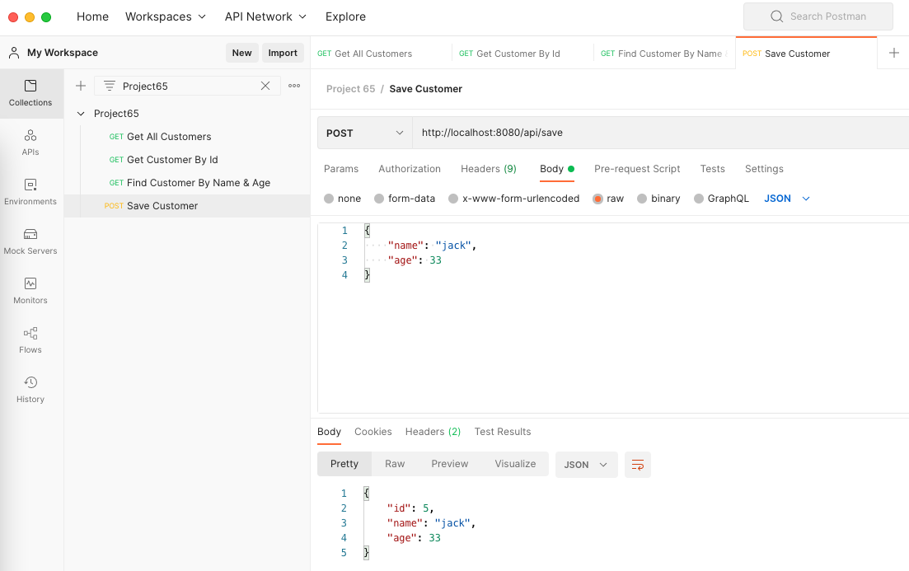

Webflux integration with reactive R2DBC. 
R2DBC stands for Reactive Relational Database Connectivity, It provides a reactive driver to connect to relational database.

Github: [https://github.com/gitorko/project65](https://github.com/gitorko/project65)

## Spring Data R2DBC

Spring Data R2DBC aims at being conceptually easy. In order to achieve this it does NOT offer caching, lazy loading, write behind or many other features of ORM frameworks. This makes Spring Data R2DBC a simple, limited, opinionated object mapper. Currently, its use in production is not recommended. 

The following databases are supported via r2dbc libraries

1. H2 (io.r2dbc:r2dbc-h2)
2. MariaDB (org.mariadb:r2dbc-mariadb)
3. Microsoft SQL Server (io.r2dbc:r2dbc-mssql)
4. MySQL (dev.miku:r2dbc-mysql)
4. jasync-sql MySQL (com.github.jasync-sql:jasync-r2dbc-mysql)
5. Postgres (io.r2dbc:r2dbc-postgresql)
6. Oracle (com.oracle.database.r2dbc:oracle-r2dbc)

## Code







## Setup



## Testing

Postman collection [https://raw.githubusercontent.com/gitorko/project65/main/postman/Project65.postman_collection.json](https://raw.githubusercontent.com/gitorko/project65/main/postman/Project65.postman_collection.json)



## Errors

If you encounter any of the error mentioned below it could probably be because the data type in postgres cant be mapped by r2dbc.
Eg: CHAR is not supported, changing to VARCHAR will fix the issue.

```
org.springframework.data.mapping.MappingException: Could not read property public java.lang.String com.demo.project65.Customer.name from result set!
org.springframework.data.r2dbc.function.convert.EntityRowMapper.readFrom(EntityRowMapper.java:103) ~[spring-data-r2dbc-1.0.0.M1.jar:1.0.0.M1]
Caused by: java.lang.IllegalArgumentException: Cannot decode value of type java.lang.Object
org.springframework.data.r2dbc.function.convert.EntityRowMapper.readFrom(EntityRowMapper.java:99) ~[spring-data-r2dbc-1.0.0.M1.jar:1.0.0.M1]
```

## References

[https://spring.io/projects/spring-data-r2dbc](https://spring.io/projects/spring-data-r2dbc)
