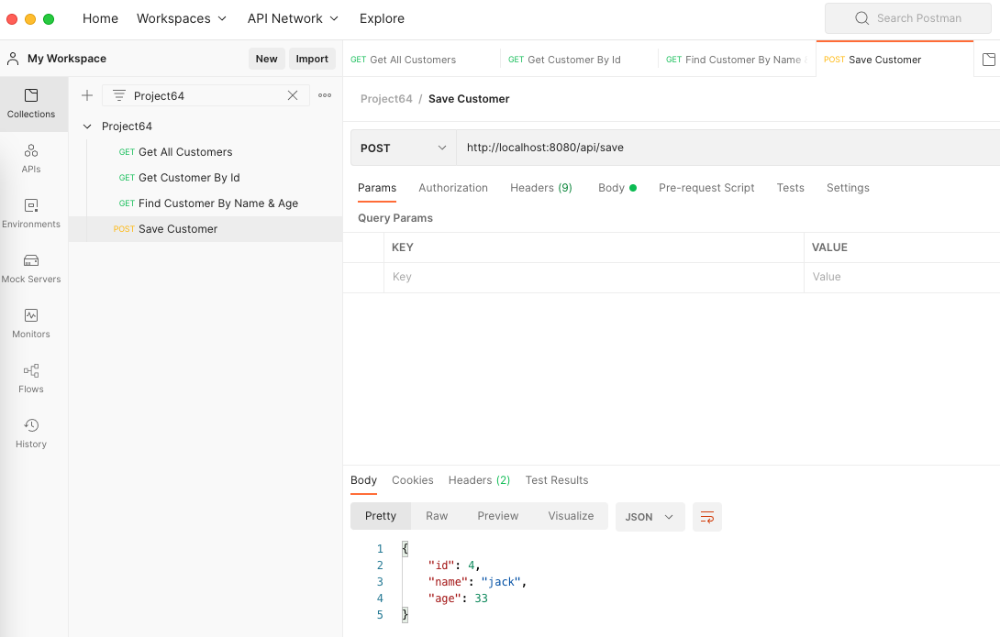

Webflux integration with reactive JDBC, to allow non-blocking calls to database.
R2DBC is still not recommended for production, hence this approach should help you integrate existing relational database with webflux.

Github: [https://github.com/gitorko/project64](https://github.com/gitorko/project64)

## Code















## Setup



## Postman

Import the postman collection to postman

[Postman Collection](https://raw.githubusercontent.com/gitorko/project64/main/postman/Project64.postman_collection.json)

## References

[https://spring.io/blog/2018/12/07/reactive-programming-and-relational-databases](https://spring.io/blog/2018/12/07/reactive-programming-and-relational-databases)
