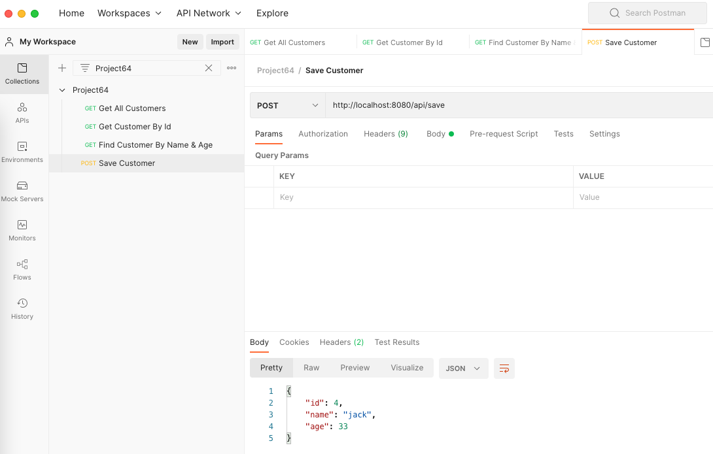

Webflux integration with reactive JDBC, to allow non-blocking calls to database.

Github: [https://github.com/gitorko/project64](https://github.com/gitorko/project64)

## Webflux JDBC

This approach provides alternate way to integrate existing relational database with webflux if the project is not ready to use R2DBC.

### Code















### Postman

Import the postman collection to postman

[Postman Collection](https://raw.githubusercontent.com/gitorko/project64/main/postman/Project64.postman_collection.json)

### Setup



## References

[https://spring.io/blog/2018/12/07/reactive-programming-and-relational-databases](https://spring.io/blog/2018/12/07/reactive-programming-and-relational-databases)
