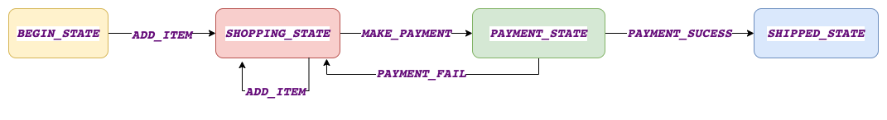

Java based implementation of a state machine & spring library based implementation of state machine.
State machine lets you move to different states based on the events, you can also have listeners registered that get notified on state change events and carry out certain actions.

Github: [https://github.com/gitorko/project77](https://github.com/gitorko/project77)

## State Machine

We will use the shopping cart state machine diagram as a reference to implement our code. If any invalid events are sent then an exception is thrown.

## Code

Here we use state design pattern and observer pattern to design a state machine.



We can also use the spring state machine libraries



## References

[https://spring.io/projects/spring-statemachine](https://spring.io/projects/spring-statemachine)
