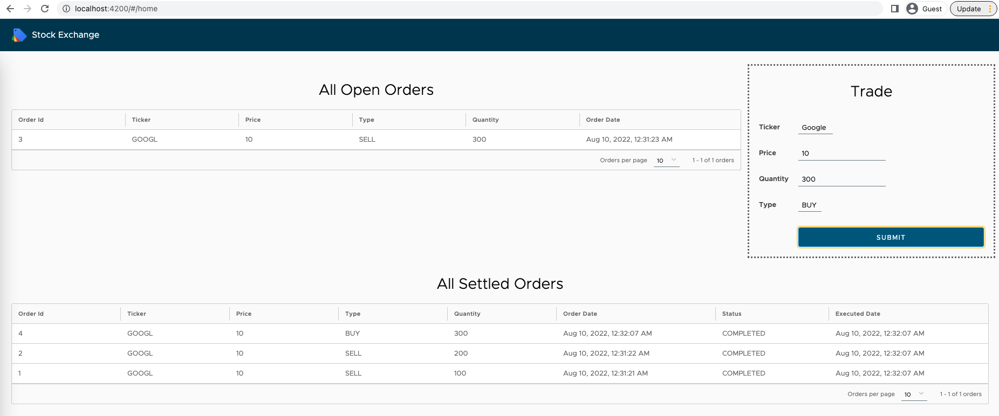
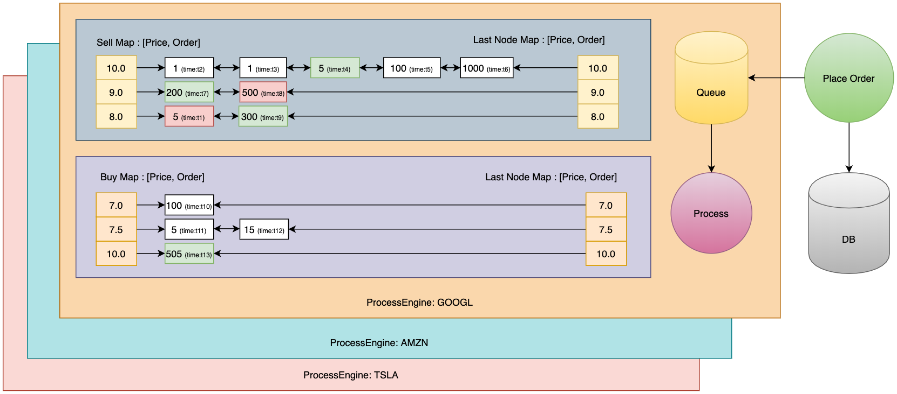
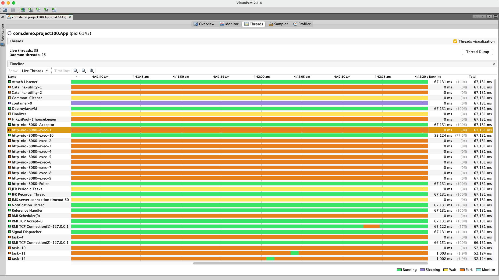
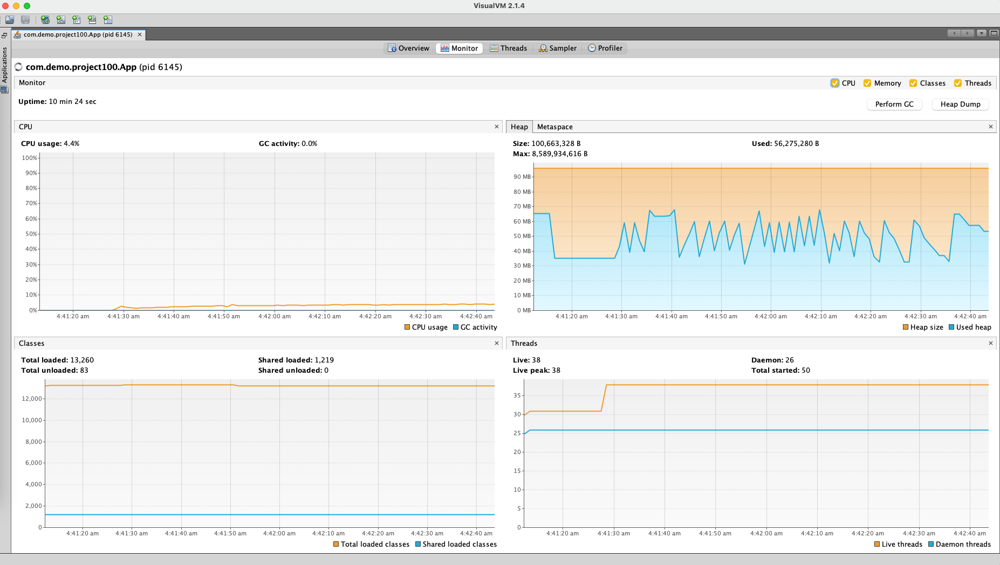
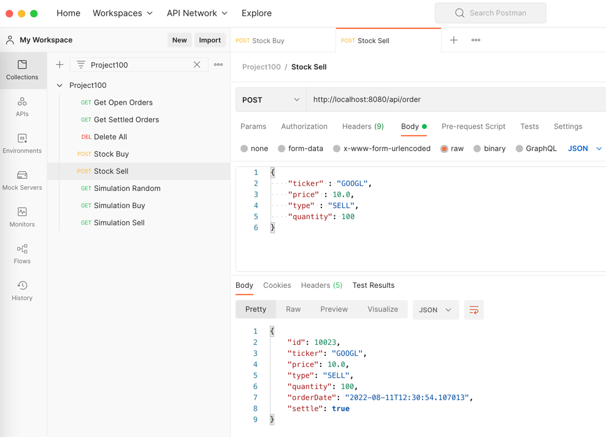

A Stock Exchange system developed with Spring Boot, Spring JPA and Angular (Clarity) frontend. Implements the price-time-priority algorithm

Github: [https://github.com/gitorko/project100](https://github.com/gitorko/project100)

## Quick Overview

To deploy the application in a single command, clone the project, make sure no conflicting docker containers or ports are running and then run

```bash
git clone https://github.com/gitorko/project100
cd project100
docker-compose -f docker/docker-compose.yml up 
```

Open [http://localhost:8080/](http://localhost:8080/)

## Requirements

Design a stock exchange system for various tickers, user can place buy and sell orders.

### Functional Requirements

1. Buy & Sell orders must be processed based on priority of time when they were placed.
2. Priority must be given to clear order placed first. FIFO (First-In-First-Out)
3. Order buy/sell will be whole quantity. Order can be split but buy/sell has to be complete. Can't have partial buy/sell in a single order.

#### Case 1 : Order match in sequential time order (FIFO)

| Event                                  | Time     | Type  | Price | Qty    | Status                                   |
| ---------------------------------------| -------- | ----- | ----- | ------ | ---------------------------------------  |
|                                        | 10:00 AM | SELL  | 10.0  | 100    |<span style="color:green">COMPLETED</span>|
|                                        | 10:01 AM | SELL  | 10.0  | 200    |<span style="color:green">COMPLETED</span>| 
|                                        | 10:02 AM | SELL  | 10.0  | 300    |                                          |
|<span style="color:orange">SUBMIT</span>| 10:03 AM | BUY   | 10.0  | 300    |<span style="color:green">COMPLETED</span>|

#### Case 2 : Order match in sequential time order but preference to order fulfillment

| Event                                  | Time     | Type  | Price | Qty    | Status                                   |
| ---------------------------------------| -------- | ----- | ----- | ------ | ---------------------------------------  |
|                                        | 10:00 AM | SELL  | 10.0  | 100    |<span style="color:green">COMPLETED</span>|
|                                        | 10:01 AM | SELL  | 10.0  | 200    |                                          | 
|                                        | 10:02 AM | SELL  | 10.0  | 300    |<span style="color:green">COMPLETED</span>|
|<span style="color:orange">SUBMIT</span>| 10:03 AM | BUY   | 10.0  | 400    |<span style="color:green">COMPLETED</span>|

#### Case 3 : First sell order too small, will never fulfill blocking others, so will be skipped

| Event                                  | Time     | Type  | Price | Qty    | Status                                   |
| ---------------------------------------| -------- | ----- | ----- | ------ | ---------------------------------------  |
|                                        | 10:00 AM | SELL  | 10.0  | 100    |                                          |
|                                        | 10:01 AM | SELL  | 10.0  | 200    |<span style="color:green">COMPLETED</span>| 
|                                        | 10:02 AM | SELL  | 10.0  | 300    |<span style="color:green">COMPLETED</span>|
|<span style="color:orange">SUBMIT</span>| 10:03 AM | BUY   | 10.0  | 500    |                                          |

#### Case 4 : First sell order too big, will never fulfill blocking others, so will be skipped

| Event                                  | Time     | Type  | Price | Qty     | Status                                   |
| ---------------------------------------| -------- | ----- | ----- | ------- | ---------------------------------------  |
|                                        | 10:00 AM | SELL  | 10.0  | 1000    |                                          |
|                                        | 10:01 AM | SELL  | 10.0  | 200     |<span style="color:green">COMPLETED</span>| 
|                                        | 10:02 AM | SELL  | 10.0  | 300     |<span style="color:green">COMPLETED</span>|
|<span style="color:orange">SUBMIT</span>| 10:03 AM | BUY   | 10.0  | 500     |<span style="color:green">COMPLETED</span>|

#### Case 5 : Middle sell order too big, will never fulfill blocking others, so will be skipped

| Event                                  | Time     | Type  | Price | Qty     | Status                                   |
| ---------------------------------------| -------- | ----- | ----- | ------- | ---------------------------------------  |
|                                        | 10:00 AM | SELL  | 10.0  | 100     |<span style="color:green">COMPLETED</span>|
|                                        | 10:01 AM | SELL  | 10.0  | 2000    |                                          | 
|                                        | 10:02 AM | SELL  | 10.0  | 300     |<span style="color:green">COMPLETED</span>|
|<span style="color:orange">SUBMIT</span>| 10:03 AM | BUY   | 10.0  | 400     |<span style="color:green">COMPLETED</span>|

#### Case 6 : Order match when price is different

One seller wanted to sell at 9$ but we can fulfill order at 10$ as there is a buyer. So all sellers gets 10$ It's ok for seller to get above asking price but not go below the asking price.

| Event                                  | Time     | Type  | Price | Qty    | Status                                   |
| ---------------------------------------| -------- | ----- | ----- | ------ | ---------------------------------------  |
|                                        | 10:00 AM | SELL  | 10.0  | 100    |<span style="color:green">COMPLETED</span>|
|                                        | 10:01 AM | SELL  | 10.0  | 200    |                                          | 
|                                        | 10:02 AM | SELL  | 9.0   | 300    |<span style="color:green">COMPLETED</span>|
|<span style="color:orange">SUBMIT</span>| 10:03 AM | BUY   | 10.0  | 400    |<span style="color:green">COMPLETED</span>|

#### Case 7 : Order match when price is different

Two sellers wanted to sell at 9$ & 8$ but we can fulfill order at 10$ as there is a buyer. So all sellers gets 10$ It's ok for seller to get above asking price but not go below the asking price.

| Event                                  | Time     | Type  | Price | Qty    | Status                                   |
| ---------------------------------------| -------- | ----- | ----- | ------ | ---------------------------------------  |
|                                        | 10:00 AM | SELL  | 10.0  | 100    |<span style="color:green">COMPLETED</span>|
|                                        | 10:01 AM | SELL  | 9.0   | 200    |                                          | 
|                                        | 10:02 AM | SELL  | 8.0   | 300    |<span style="color:green">COMPLETED</span>|
|<span style="color:orange">SUBMIT</span>| 10:03 AM | BUY   | 10.0  | 400    |<span style="color:green">COMPLETED</span>|

#### Case 8 : Order match when price is different

There is a cheaper sell order of 8$ however due to time preference (FIFO) we complete the order with the 10$ & 9$

| Event                                  | Time     | Type  | Price | Qty    | Status                                   |
| ---------------------------------------| -------- | ----- | ----- | ------ | ---------------------------------------  |
|                                        | 10:00 AM | SELL  | 10.0  | 100    |<span style="color:green">COMPLETED</span>|
|                                        | 10:01 AM | SELL  | 9.0   | 200    |<span style="color:green">COMPLETED</span>| 
|                                        | 10:02 AM | SELL  | 8.0   | 300    |                                          |
|<span style="color:orange">SUBMIT</span>| 10:03 AM | BUY   | 10.0  | 300    |<span style="color:green">COMPLETED</span>|

#### Case 9 : Order can't be fulfilled

| Event                                  | Time     | Type  | Price | Qty    | Status                                   |
| ---------------------------------------| -------- | ----- | ----- | ------ | ---------------------------------------  |
|                                        | 10:00 AM | SELL  | 10.0  | 100    |                                          |
|                                        | 10:01 AM | SELL  | 10.0  | 200    |                                          | 
|                                        | 10:02 AM | SELL  | 10.0  | 300    |                                          |
|<span style="color:orange">SUBMIT</span>| 10:03 AM | BUY   | 10.0  | 50     |                                          |

#### Case 10 : Sell orders at the same time & same price

| Event                                  | Time     | Type  | Price | Qty    | Status                                   |
| ---------------------------------------| -------- | ----- | ----- | ------ | ---------------------------------------  |
|                                        | 10:00 AM | SELL  | 10.0  | 200    |<span style="color:green">COMPLETED</span>|
|                                        | 10:00 AM | SELL  | 10.0  | 100    |                                          | 
|                                        | 10:00 AM | SELL  | 10.0  | 200    |<span style="color:green">COMPLETED</span>|
|<span style="color:orange">SUBMIT</span>| 10:01 AM | BUY   | 10.0  | 400    |<span style="color:green">COMPLETED</span>|

#### Case 11 : Sell orders at the same time & different price

| Event                                  | Time     | Type  | Price | Qty    | Status                                   |
| ---------------------------------------| -------- | ----- | ----- | ------ | ---------------------------------------  |
|                                        | 10:00 AM | SELL  | 10.0  | 200    |<span style="color:green">COMPLETED</span>|
|                                        | 10:00 AM | SELL  | 9.0   | 100    |                                          | 
|                                        | 10:00 AM | SELL  | 8.0   | 200    |<span style="color:green">COMPLETED</span>|
|<span style="color:orange">SUBMIT</span>| 10:01 AM | BUY   | 10.0  | 400    |<span style="color:green">COMPLETED</span>|

Cases for Buy order is similar/inverse of the above cases.


#### Case 12 : No fractional order fulfillment

| Event                                  | Time     | Type | Price | Qty    | Status                                   |
| ---------------------------------------| -------- |------|-------| ------ | ---------------------------------------  |
|                                        | 10:00 AM | SELL | 10.0  | 200    |                                          |
|<span style="color:orange">SUBMIT</span>| 10:00 AM | BUY  | 10.0  | 100    |                                          | 

If fractional order could be fulfilled then you could look at implementing the algorithm with a Priority Queue (Min Heap & Max Heap). 
Where heap is sorted by price and then by time. In such a case the algorithm becomes simple and just insertion and deletion to heap can be done in constant time.
If heaps are implemented then in the above case, if there are only 2 transactions in the entire day. Then the seller will only be able to sell 100 items out of 200. Since there cant be fractional buy/sell we will not use Priority Queue (Heaps).

### Non-Functional Requirements

1. Latency should be low.
2. System should be highly available & survive restarts
3. System should scale well when number of orders increases.
4. Should be able to distribute the service with sticky affinity for one type of ticker.

## Design

Real world trading algorithms are more complex, involve more memory & cpu optimized data structures, and can handle huge volumes. Most trading systems are written in C/C++.

The order matching algorithm uses backtracking which is limited by the recursive stack depth. If the CombinationSum backtracking job can be further split and scheduled across different worker nodes the throughput will increase further.

It uses single thread per ticker and is limited by the thread pool size to support more tickers. No synchronization is required as its a single thread model per ticker

System is able to match & process 5,000 unique orders per ticker in 2 mins that roughly 40+ matching transactions per second per ticker on a Mac Laptop






## Code







## Rest API

Postman collection is provided

[https://github.com/gitorko/project100/blob/main/postman/Project100.postman_collection.json](https://github.com/gitorko/project100/blob/main/postman/Project100.postman_collection.json)



## Setup



## References

[https://clarity.design/](https://clarity.design/)

[https://en.wikipedia.org/wiki/Order_matching_system](https://en.wikipedia.org/wiki/Order_matching_system)
