A Ticket Booking system developed with Spring Boot, Spring JPA, Redis and Angular (Clarity) frontend.

Github: [https://github.com/gitorko/project87](https://github.com/gitorko/project87)

## Quick Overview

To deploy the application in a single command, clone the project, make sure no conflicting docker containers or ports are running and then run

```bash
git clone https://github.com/gitorko/project87
cd project87
docker-compose -f docker/docker-compose.yml up 
```

Open [http://localhost:8080/](http://localhost:8080/)

## Features

A ticket booking application that support concurrent ticket booking for multiple users along with automatic unlock of blocked tickets.
Provide QR code ticket and completes the ticketing flow on admit.

### Functional Requirements

1. A ticket booking system where users can book tickets.
2. Two users cant book the same ticket.
3. Authentication can be simulated to randomly assign a user to each browser instance. Each browser session considered as a unique user.
4. Logout should assign a new user to the session.
5. User should be able to block a ticket before making payment. Other user should not be able to block the same ticket.
6. If the user doesnt complete the payment in 30 seconds the ticket which is blocked should be released back to the free pool.
7. After blocking a ticket user can cancel the ticket, this should release the ticket back to the free pool.
8. If the user tries to confirm the ticket after blocking wait for 30 seconds the booking should fail.
9. Same user should be able to book the same ticket twice from two different browser sessions.
10. Only user who has blocked the ticket can confirm the ticket.
11. If user is looking at stale data, the ticket is already booked by other user then the transaction should fail.
12. Should generate QR code as ticket
13. Scanning the QR code should indicate that user is admitted into the venue.
14. A single booking can book N tickets.

### Non-Functional Requirements

1. Latency should be low.
2. System should be highly available.
3. System should scale well when number of users increases.
4. We will use a fixed rate scheduler to release any tickets held for more than 30 seconds.

## Design

1. We will postgres DB to persist the booking data.
2. We will use optimistic locking as it scales well without locking the db rows.

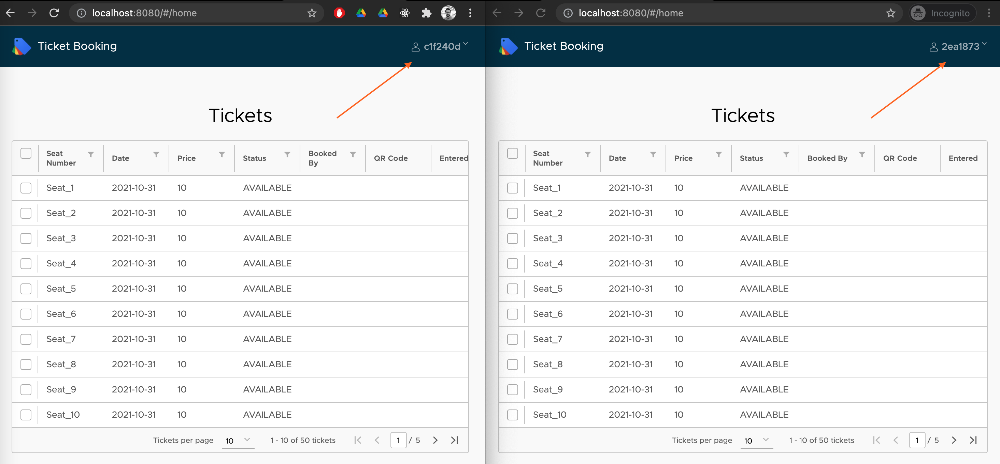

Two users can try to book the same ticket at the same time. It uses optimistic locking to RESERVE a ticket for one user and throws ObjectOptimisticLockingFailureException for the other user.

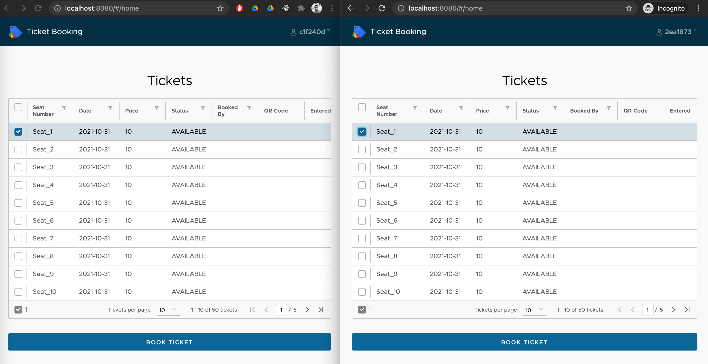

While the first user is waiting to confirm, if the second user tries to book the same ticket it fails.

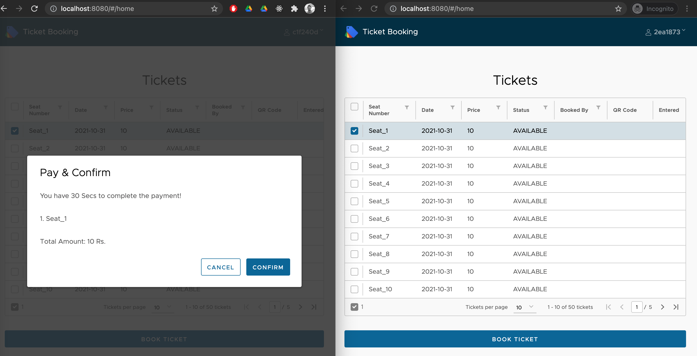

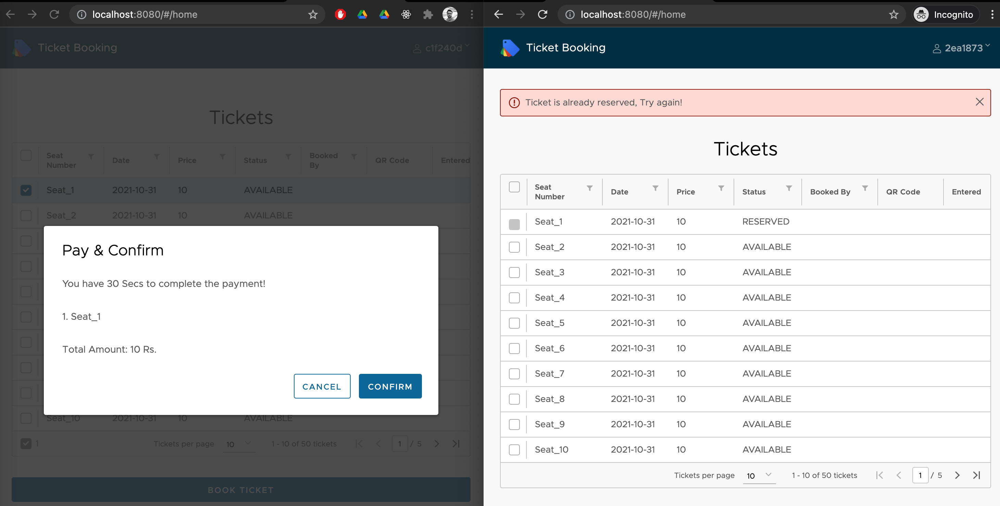

If the first user doesn't complete the payment confirmation within 30 seconds the lock on the ticket is released.
If the first user presses cancel button then also the lock on the RESERVED ticket is released.

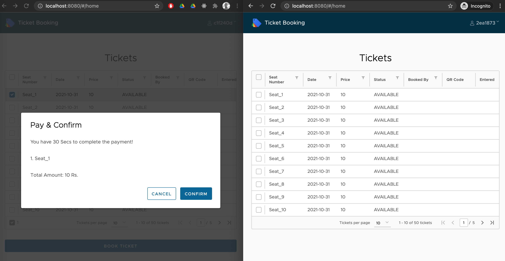

If the first user tries to confirm the ticket after 30 seconds then the booking fails as ticket is held in RESERVED state for a user only for 30 seconds.

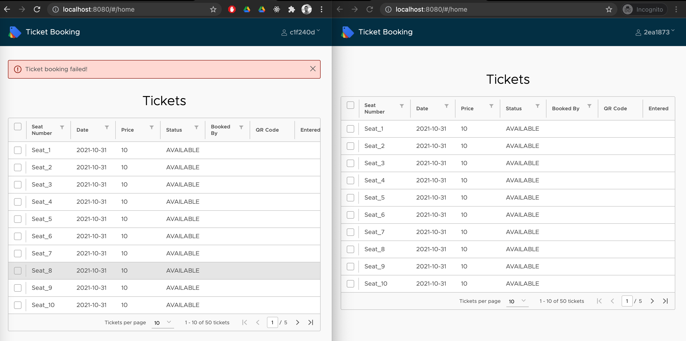

If the same user tries to book the same seat from 2 different windows, one will succeed while other will throw error

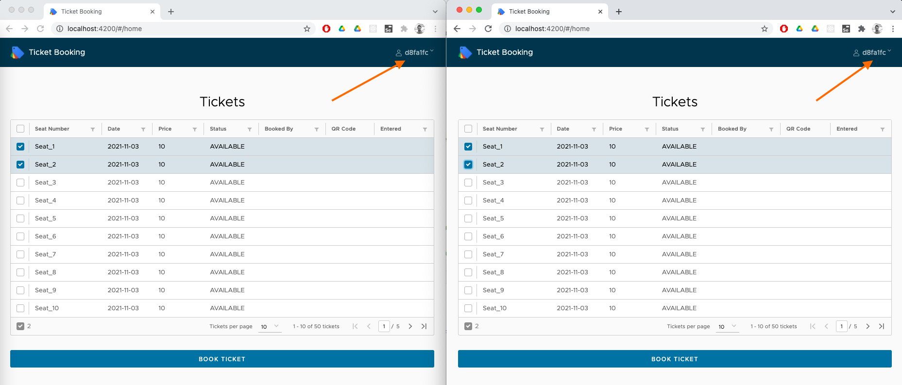

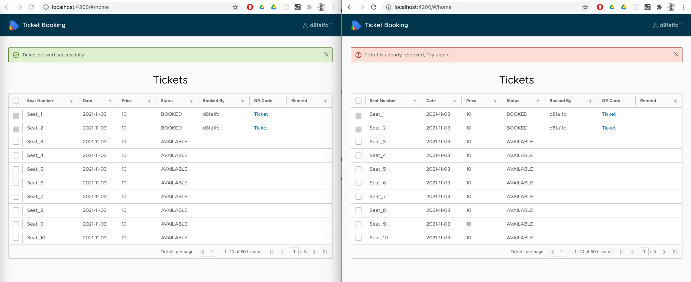

Backend api ensure that only user who RESERVED the ticket can book the ticket. So a ticket RESERVED by first user cant be booked by second user.

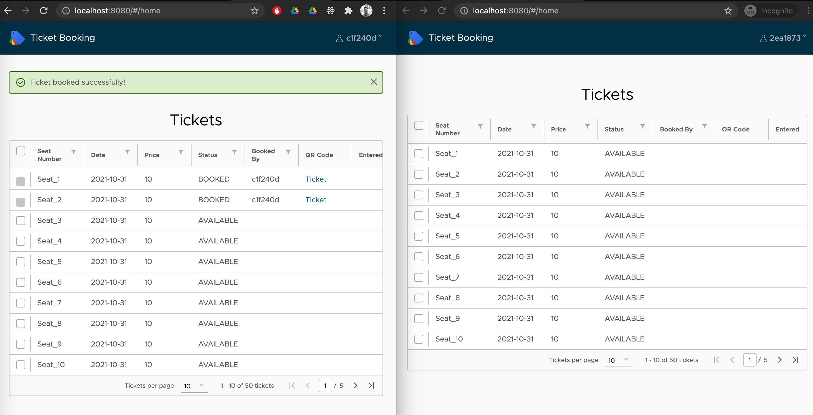

If the second user hasn't refreshed his screen and tries to book already BOOKED tickets it will fail

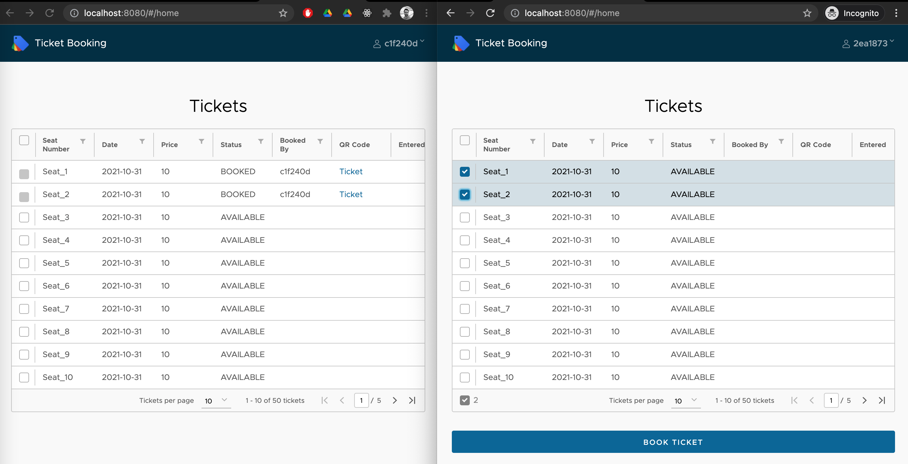

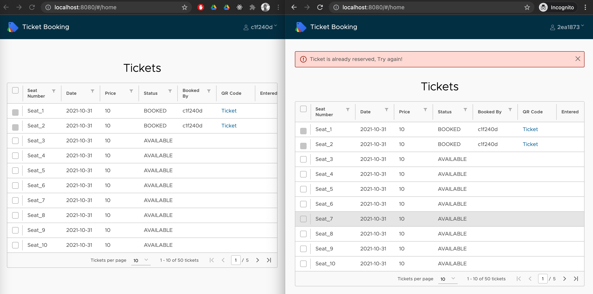


QR code is generated for each ticket, clicking on the ticket takes you to the QR code.

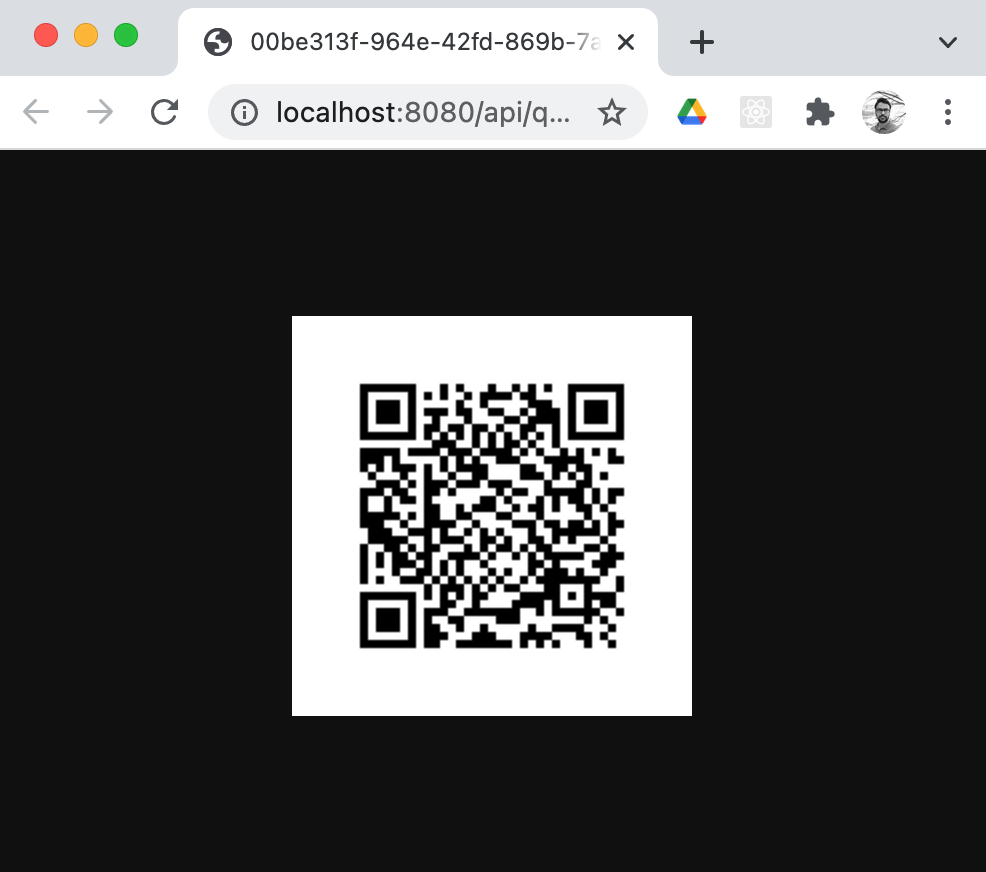

Can also be fetched via postman

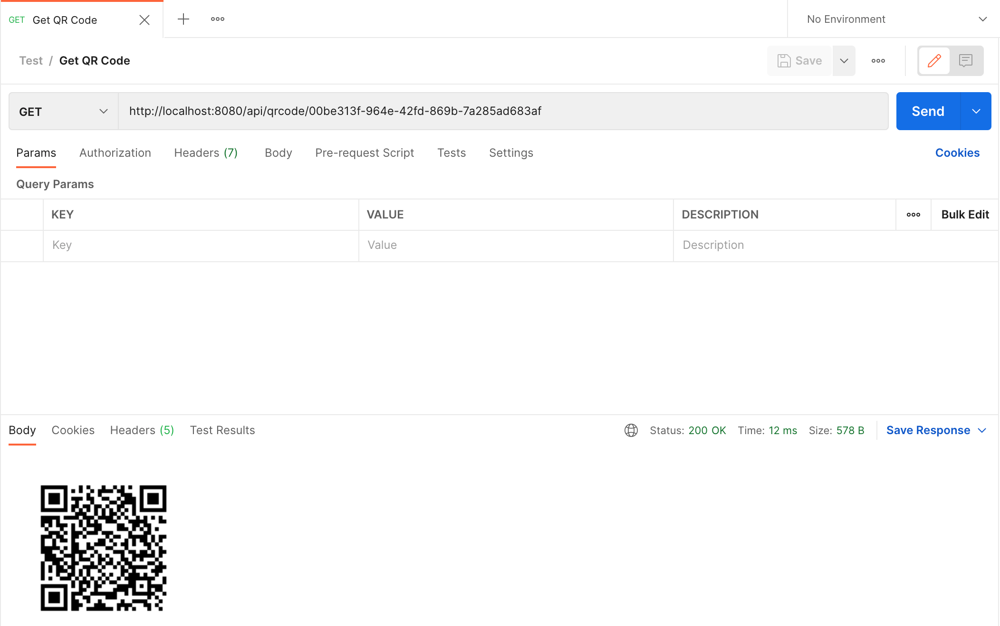

On scanning the QR code in your mobile and visiting the uri provided the state is marked as entered completing the ticketing flow.

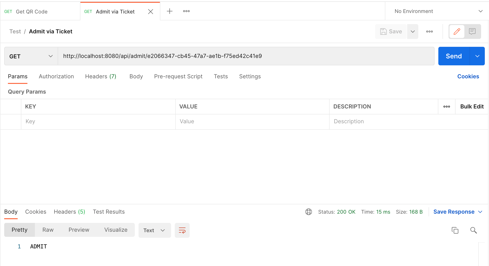

Entered indicates that user has been admitted to the event on showing the QR code ticket. You can now track who booked the ticket and if they visited the event using the QR code ticket.

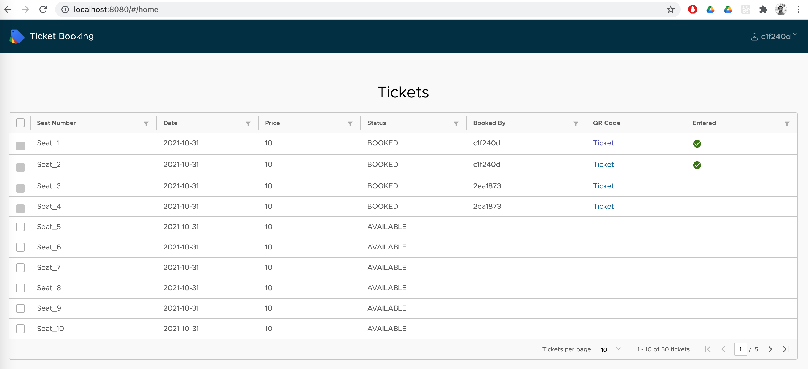

## Code









## Setup



## References

[https://clarity.design/](https://clarity.design/)

[https://spring.io/projects/spring-boot](https://spring.io/projects/spring-boot)

