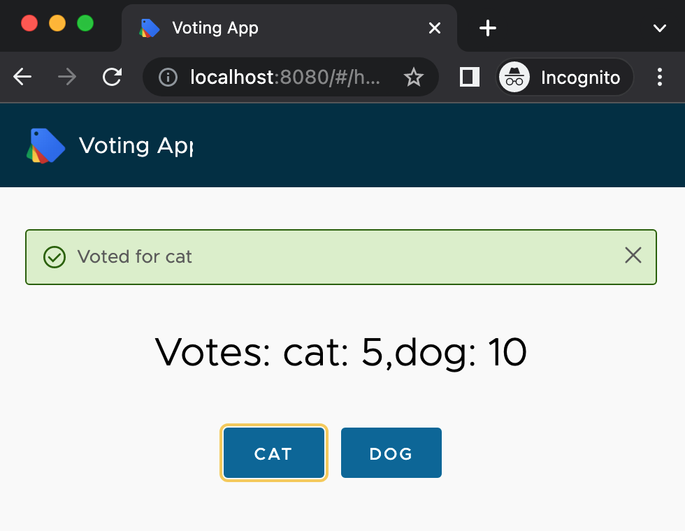
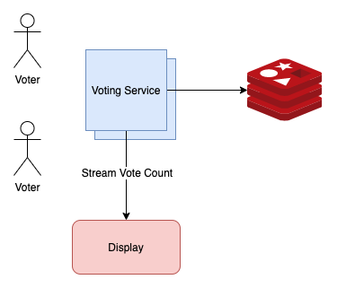
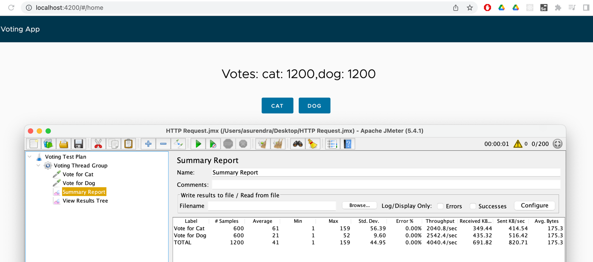

Voting system developed with Spring Boot, Redis and Angular (Clarity) frontend.

Github: [https://github.com/gitorko/project94](https://github.com/gitorko/project94)

## Quick Overview

To deploy the application in a single command, clone the project, make sure no conflicting docker containers or ports are running and then run

```bash
git clone https://github.com/gitorko/project94
cd project94
docker-compose -f docker/docker-compose.yml up 
```

Open [http://localhost:8080/](http://localhost:8080/)

## Features

Users should be able to vote for candidates.

The same solution can be extended to the following systems

1. metering - subscription usage, consumption capping & pricing etc
2. rate limiting - Counter with TTL, Token Bucket, Leaky Bucket, Sliding window counter
3. Prevent denial of service (DoS)
4. Traffic shaping
5. Live visitor/user count
6. Like and dislike count

### Functional Requirements

1. An active/live voting system shows the live count of the votes as they are cast.
2. The running count should be accurate with no race conditions.
3. Storing of votes is not required, objective is just to track live counts. Who voted to which candidate information need not be stored.
4. Only 2 candidates in the voting system, cats vs dogs.
5. The display should show the live count of votes as they are cast without having the user refresh each time.
6. Display must provide UI to vote for candidates, as well as support api based voting.

### Non-Functional Requirements

1. Latency should be low.
2. System should be highly available.
3. System should scale well when number of users increases
4. Handle concurrent request and counter value consistent.

### Future

1. The design can further be modified to use write-back cache to write the running counter to the database. This way we avoid loosing the votes in case redis server goes down. Redis supports AOF (append-only file), which copies write commands to disk as they happen, and snapshotting, which takes the data as it exists at one moment in time and writes it to disk
2. The votes can be persisted to the db by using a queuing mechanism. This will persist the who voted for whom information. We use a queue to keep the latency low. As soon as the vote counter is increased the vote object is queued and a consumer service will dequeue the request and persist to the db.
3. Authentication and user tracking can be added.
4. The project can be changed to spring reactor to make use of non blocking framework.
5. Unsubscribe flow needs to be handled when browser is closed

## Design

1. We will use Redis to count the votes, this will help us scale well. The counter increment needs to be atomic in nature. Redis provides this feature out of the box, where there is less contention among threads when updating atomic long.
2. We will not persist the votes to a database as the objective is to keep an active running counter. Adding a database in the synchronous call introduces latency which prevent scaling the application.
3. The backend and frontend bundle into a single uber jar that can be deployed on many servers there by providing ability to horizontally scale.
4. We will use SSE (server sent events) to stream the voting results to the app. This way the live counter will always be displayed.
5. We will use angular clarity for the UI

Redis is an open-source (BSD licensed), in-memory data structure store, used as a database, cache, and message broker. Redis provides data structures such as strings, hashes, lists, sets, sorted sets with range queries, bitmaps, hyperloglogs, geospatial indexes, and streams. 
Redis has built-in data structures, atomic commands, and time-to-live (TTL) capabilities that can be used to power metering use cases. Redis runs on a single thread. Therefore, all of the database updates are serialized, enabling Redis to perform as a lock-free data store. This simplifies the application design as developers don’t need to spend any effort on synchronizing the threads or implementing locking mechanisms for data consistency.
Redis stores integers as a base-10 64-bit signed integer. Therefore the maximum limit for an integer is a very large number: 263 – 1 = 9,223,372,036,854,775,807.
To understand the problem with a counter on multi-thread environment refer [AtomicLong vs LongAdder](https://gitorko.github.io/Java-Puzzles/#puzzle-9-atomiclong-vs-longadder)





## Code





## Setup



## Testing

To reset the votes

```bash
curl --request DELETE 'http://localhost:8080/api/vote/dog'
curl --request DELETE 'http://localhost:8080/api/vote/cat'
```

To vote

```bash
curl --request POST 'http://localhost:8080/api/vote/cat'
curl --request POST 'http://localhost:8080/api/vote/cat'
```

## JMeter

Open the jmx file with Jmeter. Run the test that simulate a 10K concurrent votes and check the throughput.

[Voting System JMX](https://raw.githubusercontent.com/gitorko/project94/main/jmeter/VotingSystem.jmx)



## References

[https://jmeter.apache.org/](https://jmeter.apache.org/)

[https://www.infoworld.com/article/3230455/how-to-use-redis-for-real-time-metering-applications.html](https://www.infoworld.com/article/3230455/how-to-use-redis-for-real-time-metering-applications.html)

[https://www.infoworld.com/article/3230455/how-to-use-redis-for-real-time-metering-applications.html?page=2](https://www.infoworld.com/article/3230455/how-to-use-redis-for-real-time-metering-applications.html?page=2)

[https://redis.io/](https://redis.io/)
