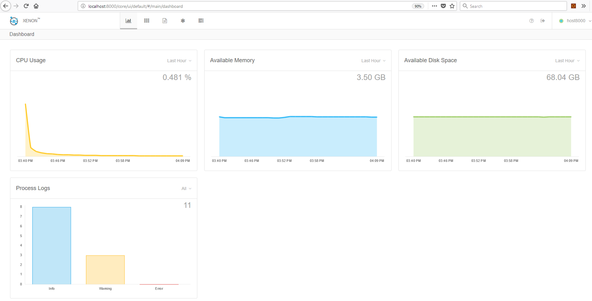

Simple rest service using VMWare Xenon Framework. We will deploy multi-node instance of the rest service and explore the xenon UI.


## Xenon

[Xenon](https://vmware.github.io/xenon/) is a framework for writing small REST-based services. When you write a rest service in other frameworks like spring you have to pick a data store like mongo db to persist your data, you have to maintain separate instances of mongo db to ensure replication works. You have to then deploy your rest service on distributed environment using docker swarm and ensure high availability of your service. Xenon framework does all this for you with just a single library. Here we will see how to create a simple rest service using xenon and then see how we can achieve asynchronous call,distributed node deployment, replication, synchronization, ordering, and consistency of data across those nodes. We will see how we can scale the application etc.

Create a simple maven project. If you are using vscode ctrl+shift+p 'Maven: Generate from maven Archetype' and select a folder, click on 'maven-archetype-quickstart' and enter the project details. You can also run the command and enter 'groupId': com.demo.xenon & 'artifactId': myxenon

```bash
$ mvn archetype:generate -DarchetypeArtifactId="maven-archetype-quickstart" -DarchetypeGroupId="org.apache.maven.archetypes"
```

Add the xenon dependency to your pom.xml & update the plugins. The 'xenon-common' is the only core library you need, but to visualize things we have added 'xenon-ui'

```xml
<dependencies>
  <dependency>
    <groupId>com.vmware.xenon</groupId>
    <artifactId>xenon-common</artifactId>
    <version>1.4.0</version>
  </dependency>
  <dependency>
    <groupId>com.vmware.xenon</groupId>
    <artifactId>xenon-ui</artifactId>
    <version>1.4.0</version>
  </dependency>
</dependencies>

<build>
  <plugins>
    <plugin>
      <groupId>org.apache.maven.plugins</groupId>
      <artifactId>maven-compiler-plugin</artifactId>
      <version>3.7.0</version>
      <configuration>
        <source>1.8</source>
        <target>1.8</target>
      </configuration>
    </plugin>
    <plugin>
      <groupId>org.apache.maven.plugins</groupId>
      <artifactId>maven-assembly-plugin</artifactId>
      <version>2.4.1</version>
      <configuration>
        <descriptorRefs>
          <descriptorRef>jar-with-dependencies</descriptorRef>
        </descriptorRefs>
        <archive>
          <manifest>
            <mainClass>com.demo.xenon.App</mainClass>
          </manifest>
        </archive>
      </configuration>
      <executions>
        <execution>
          <id>make-assembly</id>
          <phase>package</phase>
          <goals>
            <goal>single</goal>
          </goals>
        </execution>
      </executions>
    </plugin>
    <plugin>
      <groupId>org.codehaus.mojo</groupId>
      <artifactId>exec-maven-plugin</artifactId>
      <version>1.6.0</version>
      <configuration>
        <mainClass>com.demo.xenon.App</mainClass>
      </configuration>
    </plugin>
  </plugins>
</build>
```

Modify your App.java, Your App class extends the ServiceHost class.  If you want you nodes to have specific name modify 'defaultArgs.id'. Note the 'defaultArgs.sandbox' path, this is where the data files of the data store will reside. On windows it will be 'C:/tmp/xenondb'.

```java
package com.demo.xenon;

import java.nio.file.Paths;
import java.util.UUID;

import com.vmware.xenon.common.ServiceHost;
import com.vmware.xenon.services.common.RootNamespaceService;
import com.vmware.xenon.ui.UiService;

public class App extends ServiceHost {
  public static void main(String[] args) throws Throwable {
    App appHost = new App();
    Arguments defaultArgs = new Arguments();
    defaultArgs.id = "host:" + UUID.randomUUID();
    defaultArgs.sandbox = Paths.get("/tmp/xenondb");
    appHost.initialize(args, defaultArgs);
    appHost.start();
    Runtime.getRuntime().addShutdownHook(new Thread(appHost::stop));
  }

  @Override
  public ServiceHost start() throws Throwable {
    super.start();
    startDefaultCoreServicesSynchronously();
    super.startService(new RootNamespaceService());
    super.startService(new UiService());
    return this;
  }
}
```

Build the project and execute the code. Note: Do not try the approach mvn exec:exec as this will detach the java process on ctrl+c and you will have to kill the java process manually. 

```bash
$ mvn clean install
$ mvn exec:java
```
Your xenon server should now be up. You should view [http://localhost:8000/core/ui/default](http://localhost:8000/core/ui/default)




You just hosted the xenon server. You have not yet written a rest service. At this point you already get 13 core services which are transactions,resource-groups,roles,local-query-tasks,credentials,sync-tasks,graph-queries,users,user-groups,node-groups,tenants,processes,query-tasks. The custom services card at the bottom shows a count of 0. Now lets write our first xenon rest service.

Create a new class BookStoreService.java

```java
package com.demo.xenon;

import com.vmware.xenon.common.Operation;
import com.vmware.xenon.common.ServiceDocument;
import com.vmware.xenon.common.ServiceDocumentDescription.PropertyUsageOption;
import com.vmware.xenon.common.StatefulService;
import com.vmware.xenon.common.Utils;

public class BookStoreService extends StatefulService {

  public static final String FACTORY_LINK = "/myservice/books";

  public static class Book extends ServiceDocument {

    @UsageOption(option = PropertyUsageOption.AUTO_MERGE_IF_NOT_NULL)
    @UsageOption(option = PropertyUsageOption.REQUIRED)
    public String bookName;

    @UsageOption(option = PropertyUsageOption.AUTO_MERGE_IF_NOT_NULL)
    @UsageOption(option = PropertyUsageOption.REQUIRED)
    public Double bookPrice;

  }

  public BookStoreService() {
    super(Book.class);
    toggleOption(ServiceOption.PERSISTENCE, true);
    toggleOption(ServiceOption.REPLICATION, true);
    toggleOption(ServiceOption.INSTRUMENTATION, true);
    toggleOption(ServiceOption.OWNER_SELECTION, true);
  }

  @Override
  public void handleCreate(Operation startPost) {
    Book book = getBody(startPost);
    Utils.validateState(getStateDescription(), book);
    startPost.complete();
  }

  @Override
  public void handlePut(Operation put) {
    Book book = getBody(put);
    Utils.validateState(getStateDescription(), book);
    setState(put, book);
    put.complete();
  }

  @Override
  public void handlePatch(Operation patch) {
    Book bookState = getState(patch);
    Book book = getBody(patch);
    Utils.mergeWithState(getStateDescription(), bookState, book);
    patch.setBody(bookState);
    patch.complete();
  }
}
```

Add this line to the App.java start method & Run the program

```
super.startFactory(new BookStoreService());
```

```bash
$ mvn exec:java
```


You can now create a book.

```bash
curl -X POST -H 'Content-Type: application/json' -i http://localhost:8000/myservice/books --data '{
bookName: "book1",
bookPrice: 2.0
}'

curl -X GET -H 'Content-Type: application/json' -i http://localhost:8000/myservice/books

curl -X GET -H 'Content-Type: application/json' -i http://localhost:8000/myservice/books/b5533c1dd2d595c557181891d2dc0

```

Response:

```json
{
  "documentLinks": [
    "/myservice/books/b5533c1dd2d595c557181891d2dc0"
  ],
  "documentCount": 1,
  "queryTimeMicros": 17999,
  "documentVersion": 0,
  "documentUpdateTimeMicros": 0,
  "documentExpirationTimeMicros": 0,
  "documentOwner": "host:e413831a-3247-4dfb-aecf-24d319591a84"
}
```

```json
{
  "bookName": "book1",
  "bookPrice": 2.0,
  "documentVersion": 0,
  "documentEpoch": 0,
  "documentKind": "com:demo:xenon:BookStoreService:Book",
  "documentSelfLink": "/myservice/books/b5533c1dd2d595c557181891d2dc0",
  "documentUpdateTimeMicros": 1532181069064001,
  "documentUpdateAction": "POST",
  "documentExpirationTimeMicros": 0,
  "documentOwner": "host:e413831a-3247-4dfb-aecf-24d319591a84"
}
```

### Owner Selection
Now lets assume you have 1 million book entries, will the data be replicated across all nodes? The data replication will be shared among the nodes that have ServiceOption.OWNER_SELECTION enabled. By enabling this you are telling the service that this node will take ownership of storing the data. So if there are 3 nodes in the poll then each node will store 1/3 of the 1 million records in the data store, if one of the node goes down then rebalancing happens and now the 2 nodes each have 1/2 of the 1 million records. When you request hits a server which doesnt have that data stored locally the request then gets forwarded to the node which is the owner of that data. You can have few nodes within the pool with ServiceOption.OWNER_SELECTION disabled they will internally forward the requests to the OWNER nodes.

### Mutlinode
Multi node capability in xenon provides high availability & scalability in terms of storage & request processing.

### Stateful Service vs Stateless Service
What we wrote above is a stateful rest service. A stateful service invovles data that needs persistence. An example of a stateless rest service would be a proxy service. 

### Replication factor & Quorum
The replication factor tells xenon how many nodes the stateful service needs to be replicated over. Default is all. Quroum tells xenon on how many nodes the persist operation should be successful before considering something as persisted. If you have defined quorum of 3 nodes and 1 node fails then all future write requests to will fail as there arent enough members to validate the quorum. Default is majority quorum [n/2+1] where n is replication factor. On a 3 node with replication factor all, quorum is [3/2+1] = 2 which means 2 nodes have to agree for a write to be committed.


| ServiceOption                    | Description                                                                            |
|:---------------------------------|:---------------------------------------------------------------------------------------|
| PERSISTENCE                      | persists data                                                                          |
| REPLICATION                      | replicates data across nodes                                                           |
| INSTRUMENTATION                  | provides stats about service                                                           |
| OWNER_SELECTION                  | takes ownership of storing data                                                        |

| PropertyUsageOption Annotation   | Description                                                                            |
|:---------------------------------|:---------------------------------------------------------------------------------------|
| ID                               | id field                                                                               |
| AUTO_MERGE_IF_NOT_NULL           | helper method will merge current state with state supplied in body in case of updates  |
| OPTIONAL                         | not optional                                                                           |
| REQUIRED                         | mandatory field                                                                        |
| SERVICE_USE                      | used internally                                                                        |


Now let us deploy our service in a distributed environment. Delete the test folder as we wont be covering it here. Run the command


```bash
$ mvn clean install

$ cd target;

$ java -jar myxenon-1.0-SNAPSHOT-jar-with-dependencies.jar
```

This should start the single node instance of your book store rest service.

Now lets add 2 more nodes to the quorum. All the 3 nodes ("Service Host") will form what is called a node group. Replication happens within this node group.

```bash
$ java -jar myxenon-1.0-SNAPSHOT-jar-with-dependencies.jar --port=8001 --peerNodes=http://localhost:8000
$ java -jar myxenon-1.0-SNAPSHOT-jar-with-dependencies.jar --port=8002 --peerNodes=http://localhost:8000
```
It will take a few seconds for the nodes to synchronize/converge, the nodes use gossip to detect changes and identify new members in group.. Note: The node name should be unique in the quorum. There must be minimum 3 nodes. You should be able to see all 3 nodes in the UI. You can try shutting down the primary node and see if data is still accessible. A node group identifies which node is the owner of the data and forwards request to the owner to retrieve that.

You can also add a node to a group after its started, you can do this by invoking a rest call (JoinPeerRequest). For now we will use the option of adding node to node group at startup time by providing --peerNodes. Such an ability to join a node group will be very useful in IOT based devices.

```bash
curl -X GET -H 'Content-Type: application/json' -i http://localhost:8001/myservice/books/e948dec6a69bdd3f57182b45a6740
```


Clicking on the [http://localhost:8000/core/ui/default/#/main/service/id__myservice_books](http://localhost:8000/core/ui/default/#/main/service/id__myservice_books) should show up more details on the record. You can edit/delete records from the UI as well.


You can also query for your data in the query tab.


## References

[Xenon](https://vmware.github.io/xenon/)

[Xenon Github](https://github.com/vmware/xenon)
